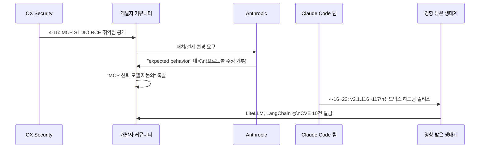
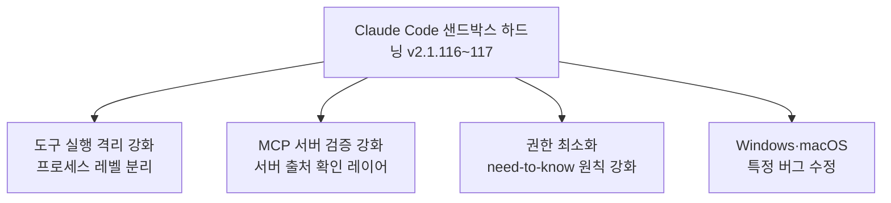

# Claude Code와 MCP 첫 번째 보안 위기 (2026년 4월)

## 사건 개요

2026년 4월 중순, AI 개발 생태계 역사상 처음으로 MCP(Model Context Protocol) 인프라 전체를 위협하는 심각한 보안 취약점이 공개됐다. OX Security가 2026년 4월 15일 공개한 이 취약점은 Anthropic MCP 공식 SDK의 STDIO 전송 인터페이스 기본값 결함으로 인해 **원격 코드 실행(RCE, Remote Code Execution)** 이 가능하다는 내용이었다. 특히 공개 서버 20만 개 이상, 누적 다운로드 1억 5천만 건이 영향을 받는다는 분석이 충격을 더했다.

위 시퀀스는 취약점 공개에서 Anthropic의 대응, 생태계 파급까지의 흐름을 보여준다.

---

## 취약점 기술 상세

### STDIO 전송 인터페이스 결함

MCP SDK의 표준 입출력(STDIO, Standard Input/Output) 전송 방식에서 기본값이 안전하지 않은 설정으로 제공됐다:

- **문제**: STDIO 트랜스포트가 기본적으로 신뢰할 수 없는 입력을 적절히 검증하지 않고 OS 명령에 전달
- **결과**: 악의적으로 구성된 MCP 서버 또는 프롬프트를 통해 클라이언트 시스템에서 임의 명령 실행 가능
- **영향 언어**: Python, TypeScript, Java, Rust 모든 공식 지원 언어 SDK 포함

### 영향 범위

| 지표 | 수치 |
|------|------|
| 영향받는 공개 MCP 서버 | 200,000개 이상 |
| 누적 SDK 다운로드 수 | 1억 5천만 건 이상 |
| CVE 발급 건수 | 10건 (LiteLLM, LangChain, LangFlow, Flowise 등) |
| 영향받는 주요 프로젝트 | LiteLLM, LangChain, LangFlow, Flowise 등 |

### "expected behavior" 대응의 의미

Anthropic이 이 취약점을 "예상된 동작(expected behavior)"으로 분류하고 프로토콜 아키텍처 수정을 거부한 결정은 커뮤니티에 큰 논란을 일으켰다. 이 결정의 근거로 추정되는 입장:

- MCP는 **신뢰할 수 있는 환경**에서 신뢰할 수 있는 서버와 통신하도록 설계됐다
- STDIO 트랜스포트가 로컬 프로세스 간 통신에 적합하게 설계됐으며, 원격 신뢰 불가 서버와의 연결에는 HTTP/SSE 등 다른 트랜스포트를 써야 한다는 입장
- 프로토콜 레벨 수정보다 사용자/클라이언트 레벨 보안 강화를 권고

이 대응은 보안 연구자들 사이에서 "책임 전가"라는 비판을 받았다.

---

## Claude Code 에코시스템에의 파급

### 주간 연속성: 취약점 공개와 하드닝 릴리스

같은 주(4월 15-22일)에 주목할 만한 동시 발생이 있었다:

- **4월 15일**: OX Security MCP RCE 취약점 공개
- **4월 16일~22일**: Claude Code v2.1.116~v2.1.117 릴리스 — 샌드박스 하드닝 포함

공식적으로 Anthropic은 하드닝 릴리스가 취약점 대응이라고 명시하지 않았으나, 커뮤니티는 타이밍을 두고 인과관계를 추정했다.

### Claude Code 샌드박스 하드닝

v2.1.116~117에서 적용된 주요 보안 강화 내용:

샌드박스 하드닝은 MCP를 통한 임의 코드 실행이 호스트 시스템까지 영향을 미치는 경로를 차단하는 데 초점을 맞췄다.

---

## "MCP 첫 번째 보안 충돌"의 역사적 의미

커뮤니티에서 이 사건을 "MCP 첫 번째 보안 충돌(MCP's first security reckoning)"로 규정한 데는 이유가 있다.

### MCP 신뢰 모델의 근본 문제

[[mcp]] 는 AI 에이전트가 외부 도구와 상호작용하는 표준 프로토콜로 빠르게 확산됐다. 그러나 확산 속도에 비해 보안 모델이 충분히 성숙하지 못했다는 비판이 이 사건을 계기로 수면 위로 올라왔다:

1. **신뢰 경계 모호성**: 어디까지가 신뢰할 수 있는 MCP 서버인가?
2. **공급망 공격 표면**: 200,000개 공개 서버 중 악성 서버가 있다면?
3. **사용자 인식 격차**: 대부분의 MCP 사용자는 STDIO 트랜스포트의 보안 함의를 이해하지 못함
4. **생태계 파편화**: 각 클라이언트(Claude Code, Cursor, Cline 등)가 자체 보안 정책을 따로 구현해야 하는 상황

### 프로토콜 확산과 보안의 시간차 문제

기술 보안 역사에서 반복되는 패턴이 MCP에서도 나타났다:

- SMTP(이메일)가 빠르게 확산된 후 스팸/피싱이 문제화된 것과 유사
- HTTP가 확산된 후 HTTPS로 진화한 것처럼, MCP도 보안 강화된 버전이 필요할 수 있음
- 빠른 채택 → 보안 문제 노출 → 표준 강화 사이클

---

## [[ai-agent-security]] 관점

이 사건은 AI 에이전트 보안의 핵심 쟁점을 실전에서 드러냈다:

### 프롬프트 인젝션과 도구 남용의 교차점

MCP RCE 취약점은 단순한 소프트웨어 버그를 넘어 **AI 에이전트가 도구를 사용할 때 발생하는 고유한 보안 위협**을 보여준다:

- AI 에이전트는 사용자의 지시뿐 아니라 MCP 서버에서 반환된 데이터도 신뢰하는 경향이 있음
- 악성 MCP 서버가 반환하는 데이터에 포함된 명령이 에이전트를 통해 실행되는 시나리오 가능
- 이는 [[indirect-prompt-injection]] 의 현실적 구현과 직결

### 공급망 취약점의 AI 에이전트 버전

기존 소프트웨어 공급망 공격(npm 악성 패키지 등)의 AI 버전이 등장한 것으로 볼 수 있다:

- 악성 MCP 서버를 공개 레지스트리에 등록
- 개발자가 Claude Code나 다른 MCP 클라이언트에서 연결
- 에이전트가 작업 중 해당 서버를 호출하면서 악성 코드 실행

---

## 후속 변화

### Anthropic의 후속 조치

- Claude Code에 `/less-permission-prompts` 스킬 추가: MCP 도구 권한 최소화를 사용자가 직접 설정하도록 지원
- MCP 결과 최대 길이 500,000자로 제한 설정 (버퍼 오버플로우 벡터 감소)
- MCP 서버 카드 표준화 논의 시작([[mcp-server-cards]])

### 커뮤니티 반응

- Cursor, Cline 등 주요 MCP 클라이언트들이 자체 보안 리뷰 발표
- MCP 서버 등록 시 서명 또는 검증 절차 요구하는 RFC 제안 등장
- "MCP를 사용하기 전 반드시 신뢰할 수 있는 서버인지 확인하라"는 보안 가이드 확산

---

## 시사점: 에이전틱 AI의 보안 성숙 과정

이 사건은 에이전틱 AI(agentic AI) 생태계가 맞닥뜨릴 첫 번째 진지한 보안 위기였다. [[claude-code]] 처럼 실제 파일 시스템, 코드 실행, 외부 API에 접근하는 에이전트가 대중화될수록:

1. **신뢰 모델 명확화 필요**: 에이전트가 신뢰할 수 있는 것과 없는 것을 어떻게 구분할 것인가?
2. **최소 권한 원칙**: 에이전트가 작업에 필요한 최소한의 권한만 갖도록 강제하는 메커니즘
3. **감사 로그**: 에이전트가 수행한 모든 도구 호출을 추적하고 검토할 수 있는 관찰 가능성
4. **취소/롤백 메커니즘**: 에이전트가 실수를 했을 때 원상복구할 수 있는 안전장치

---

## 관련 문서

- [[claude-code]] - Claude Code 에이전틱 코딩 도구
- [[mcp]] - Model Context Protocol 개요
- [[ai-agent-security]] - AI 에이전트 보안 일반 개념
- [[indirect-prompt-injection]] - 간접 프롬프트 인젝션 공격
- [[mcp-server-cards]] - MCP 서버 카드 표준화
- [[ai-supply-chain-security]] - AI 공급망 보안
