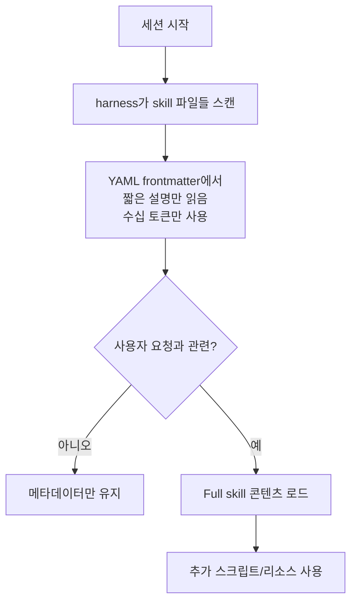

# Claude Skills vs MCP — Simon Willison's Take (2025-10)

Simon Willison이 Anthropic의 [[agent-skills|Claude Skills]] 발표 직후 작성한 분석 글. 핵심 평가:

> "I think Claude Skills will trigger a Cambrian explosion in Skills which will make this year's MCP rush look pedestrian by comparison."

## Skills 정의 (Simon의 요약)

> "A skill is a Markdown file telling the model how to do something, optionally accompanied by extra documents and pre-written scripts."

Skills는 **폴더** 단위로 instructions, scripts, resources를 묶는 시스템이다.

## 작동 메커니즘 (토큰 효율적 시스템)

- 세션 시작 시 Claude의 harness가 skill 파일들을 스캔
- YAML frontmatter에서 **짧은 설명만 읽음**
- 각 skill은 **수십 개 토큰**만 차지
- Full details는 사용자 요청과 관련 있을 때만 로드됨

## SKILL.md 예시

`slack-gif-creator` 스킬 메타데이터:
> "Toolkit for creating animated GIFs optimized for Slack, with validators for size constraints and composable animation primitives."

- 공유 리소스 경로: `/mnt/skills/examples/slack-gif-creator`
- 출력 경로: `/mnt/user-data/outputs/`

Simon이 직접 테스트: PIL 라이브러리 사용, skill의 core 디렉토리에서 `GIFBuilder` 클래스 임포트, Slack 특화 검증으로 **2MB 최대** 제약 확인.

## Skills vs MCP 비교

| 측면 | MCP | Skills |
|---|---|---|
| 토큰 오버헤드 | 시작 시 모든 도구 메타데이터 로드 ("tens of thousands of tokens") | 메타데이터만 (수십 토큰), full은 lazy |
| 구현 | 프로토콜 사양 필요 | 실행 가능 스크립트 + 문서만 |
| 표준 | Anthropic 공개, 클라이언트 구현 필요 | prompt + filesystem 패턴 (모델 무관) |
| 유연성 | RPC식 도구 호출 | CLI 도구 + `--help`로 설명 토큰 추가 절감 가능 |

> "Almost everything I might achieve with an MCP can be handled by a CLI tool instead."

## Skills가 더 큰 deal인 이유

- "**nothing preventing them from being used with other models**"
- Anthropic 외 다른 모델에서도 동일 패턴 채택 가능
- MCP는 클라이언트 구현 필요, Skills는 prompt + filesystem 패턴

## 미래 응용 시나리오

데이터 저널리즘 워크플로우 예:
- 인구 조사 데이터 접근 절차
- SQLite/DuckDB 로딩 절차
- S3 publication 방법
- 스토리텔링 프레임워크
- D3 visualization 패턴

→ "data journalism agent that can discover and help publish stories"

## 메모

- Anthropic의 동시 발표: "Equipping agents for the real world with Agent Skills" (Barry Zhang, Keith Lazuka, Mahesh Murag)
- Simon이 GitHub에 `/mnt/skills` 내용을 통째로 공개: `simonw/claude-skills`
- 후속 글: "Code execution with MCP" (2025-11-04) — Anthropic이 MCP를 코드 실행으로 재정의 → [[mcp-code-execution]]

## 관련 문서

- [[agent-skills]] — Agent Skills 표준 (entity-level)
- [[agent-skills-specification]] — 공식 스펙
- [[mcp-protocol]] — Model Context Protocol
- [[mcp-code-execution]] — MCP를 코드 실행으로 (후속 패턴)
- [[tool-design-for-agents]] — Anthropic의 도구 설계 가이드
