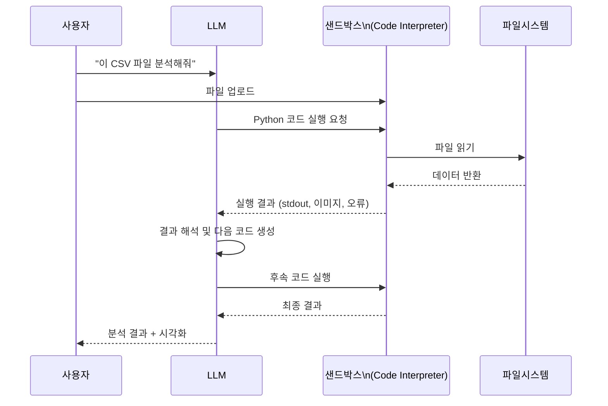
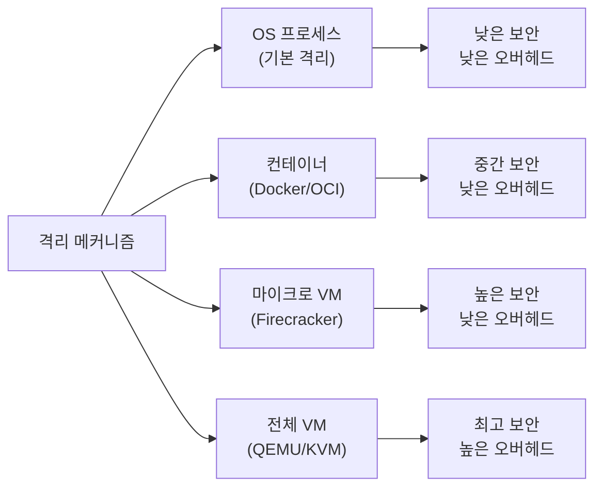
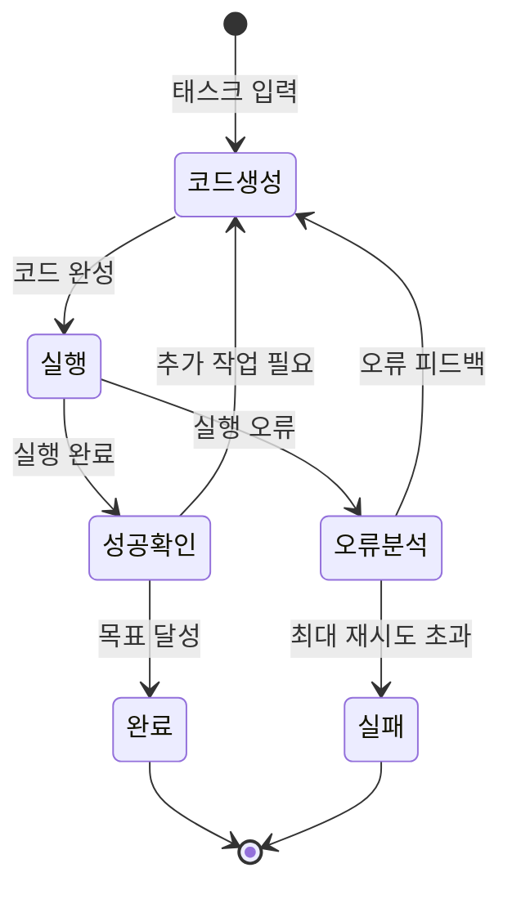

# Code Interpreter (코드 인터프리터)

Code Interpreter(코드 인터프리터)는 LLM이 생성한 코드를 격리된 실행 환경(샌드박스)에서 직접 실행하고, 그 결과를 LLM에게 피드백하는 기능이다. LLM이 계산, 데이터 분석, 파일 처리, 시각화를 코드 생성과 실행을 통해 수행할 수 있게 해주는 "실행 가능한 두뇌"를 부여한다. [[e2b-ai-sandbox]], [[firecracker-microvm]], [[claude-code]] 등 다양한 인프라 위에서 구현된다.

## 왜 중요한가

- **정확성 향상**: "7327 × 9413은?" 같은 계산 문제에서 LLM 추론보다 코드 실행이 압도적으로 정확
- **데이터 분석**: 수천 행의 CSV를 코드로 분석하는 것이 텍스트 추론보다 빠르고 안정적
- **반복 검증**: 코드를 실행해서 틀리면 수정 → 재실행하는 자기 수정 루프
- **파일 처리**: PDF 파싱, 이미지 리사이즈, 데이터 변환 등 도구가 필요한 작업 수행
- **에이전트 기반**: 코드 실행 없이 복잡한 멀티스텝 에이전트 태스크 구현이 어려움

## 코드 인터프리터 실행 흐름



위 다이어그램은 LLM이 코드를 생성하고, 샌드박스에서 실행하며, 결과를 받아 반복적으로 개선하는 전체 사이클이다.

## 주요 서비스 구현

### OpenAI Code Interpreter (Advanced Data Analysis)

OpenAI가 2023년에 출시한 ChatGPT 내장 코드 실행 기능. GPT-4와 직접 통합.

**핵심 특징:**
- Python 환경 (주요 데이터 과학 라이브러리 사전 설치: pandas, numpy, matplotlib, seaborn, scikit-learn 등)
- 파일 업로드/다운로드 지원 (CSV, Excel, PDF, 이미지, ZIP 등)
- 세션 내 상태 유지: 이전 실행에서 정의한 변수/함수 재사용 가능
- 자동 시각화: matplotlib/seaborn 그래프 자동 인라인 표시
- 인터넷 접근 차단: 보안을 위한 네트워크 격리

**제한사항:**
- 세션 비활성 후 환경 초기화 (지속 상태 없음)
- 실행 시간 제한 (~120초)
- 파일 크기 제한 (~512MB)
- 인터넷 미접속으로 외부 데이터 실시간 수집 불가

### Claude Code Execution

[[claude-code]] 는 Anthropic의 터미널 기반 코딩 에이전트로, 로컬 환경에서 코드를 직접 실행한다.

- **로컬 실행**: 사용자 머신에서 직접 실행 (격리 없음, 권한 확인 필요)
- **장점**: 인터넷 접근, 로컬 파일시스템 전체 접근, 긴 실행 시간
- **도구 통합**: Bash 명령, Python 실행, 파일 읽기/쓰기를 도구로 체계화
- **적합 용도**: 실제 개발 워크플로우, 코드베이스 분석, 리팩토링

```python
# Claude API에서 코드 실행 도구 정의 예
tools = [
    {
        "name": "bash",
        "description": "Bash 명령어 실행",
        "input_schema": {
            "type": "object",
            "properties": {
                "command": {"type": "string", "description": "실행할 bash 명령"},
                "restart": {"type": "boolean", "description": "셸 재시작 여부"},
            },
            "required": ["command"],
        },
    }
]
```

### Gemini Code Execution

Google Gemini API의 코드 실행 도구. Gemini 1.5 Pro 이후 지원.

- Python 실행 환경 내장
- Vertex AI와 통합된 엔터프라이즈 배포
- Google Colab과의 긴밀한 연동

## 샌드박스 인프라

코드 인터프리터의 보안과 성능은 샌드박스 인프라에 달려 있다.

### 격리 수준 비교



### Firecracker MicroVM

[[firecracker-microvm]] 은 AWS가 개발한 가벼운 마이크로 VM으로, 코드 인터프리터 샌드박스에 이상적이다.

- VM 수준 격리: KVM 하이퍼바이저 기반, 컨테이너 탈출 공격 방어
- **125ms 이하 부팅**: 컨테이너와 유사한 빠른 시작
- 최소 메모리 오버헤드: VM당 ~5MB 메모리 (전통 VM 대비 수백 MB 절약)
- AWS Lambda, Fargate에서 실제 사용

```
Firecracker 아키텍처:
┌─────────────────────────────────┐
│  호스트 Linux 커널              │
│  ┌──────────┐  ┌──────────┐    │
│  │ microVM 1│  │ microVM 2│    │  (격리된 코드 실행 환경)
│  │ Python   │  │ Python   │    │
│  └──────────┘  └──────────┘    │
│  KVM 하이퍼바이저               │
└─────────────────────────────────┘
```

### E2B AI Sandbox

[[e2b-ai-sandbox]] 는 AI 에이전트를 위한 클라우드 기반 코드 실행 샌드박스 서비스.

```python
from e2b_code_interpreter import Sandbox


def run_code_in_sandbox(code: str, timeout: int = 30) -> dict:
    """
    E2B 샌드박스에서 Python 코드 실행.

    Args:
        code: 실행할 Python 코드 문자열
        timeout: 최대 실행 시간 (초)

    Returns:
        실행 결과 딕셔너리
    """
    sandbox = Sandbox()
    try:
        execution = sandbox.run_code(code, timeout=timeout)
        return {
            "stdout": execution.logs.stdout,
            "stderr": execution.logs.stderr,
            "results": [r.text for r in execution.results],
            "error": execution.error,
        }
    finally:
        sandbox.kill()


# 사용 예
result = run_code_in_sandbox("""
import pandas as pd
import numpy as np

data = pd.DataFrame({'x': np.random.randn(100), 'y': np.random.randn(100)})
print(data.describe())
print(f"상관계수: {data.corr()['x']['y']:.4f}")
""")
```

**E2B 특징:**
- 세션 유지: 동일 샌드박스에서 여러 코드 블록 순차 실행
- 파일 시스템: 파일 업로드/다운로드, 환경 내 파일 조작
- 인터넷 접근 가능 (선택적 차단)
- LangChain, LlamaIndex와의 통합 지원

## 자기 수정 루프 (Self-Correction Loop)

코드 인터프리터의 핵심 가치 중 하나는 오류 발생 시 자동으로 수정하는 루프다.

```python
from anthropic import Anthropic


def code_interpreter_loop(
    client: Anthropic,
    task: str,
    max_iterations: int = 5,
) -> str:
    """
    코드 생성 → 실행 → 오류 수정 루프.

    Args:
        task: 수행할 작업 설명
        max_iterations: 최대 수정 시도 횟수
    """
    messages = [{"role": "user", "content": task}]
    execution_context = {}

    for iteration in range(max_iterations):
        response = client.messages.create(
            model="claude-opus-4-5",
            max_tokens=4096,
            system="Python 코드로 작업을 수행하세요. 코드 블록만 출력하세요.",
            messages=messages,
        )

        code = _extract_code(response.content[0].text)
        if not code:
            break

        # 코드 실행 (실제로는 E2B나 다른 샌드박스 사용)
        success, output, error = _execute_code(code, execution_context)

        if success:
            messages.append({"role": "assistant", "content": response.content[0].text})
            messages.append({"role": "user", "content": f"실행 결과:\n{output}"})
            # 목표 달성 여부 확인
            if _is_task_complete(output, task):
                return output
        else:
            # 오류 피드백으로 재시도
            messages.append({"role": "assistant", "content": response.content[0].text})
            messages.append({"role": "user", "content": f"오류 발생:\n{error}\n수정해주세요."})

    return "최대 반복 횟수 초과"
```

### 자기 수정 흐름 다이어그램



이 상태 다이어그램은 코드 인터프리터의 자기 수정 루프를 보여준다. 오류 발생 시 분석 후 재생성을 반복하며, 최대 횟수 초과 시 실패로 종료한다.

## 보안 고려사항

코드 실행은 본질적으로 위험하다. 적절한 격리 없이는 심각한 보안 문제가 발생한다.

### 위협 모델

| 위협 | 설명 | 대응책 |
|------|------|--------|
| 탈출 공격 | 샌드박스 경계 돌파 | VM 수준 격리 (Firecracker) |
| 자원 고갈 | CPU/메모리/디스크 무제한 사용 | cgroups, ulimit, 쿼터 |
| 네트워크 공격 | 내부망 스캔, 외부 연결 | 네트워크 격리, 화이트리스트 |
| 데이터 유출 | 다른 사용자 데이터 접근 | 세션별 완전 격리 |
| 프롬프트 인젝션 | 코드로 시스템 조작 시도 | 최소 권한 원칙 |

### 안전한 샌드박스 요구사항

```python
SANDBOX_CONSTRAINTS = {
    "cpu_limit": "1 core",
    "memory_limit": "512MB",
    "disk_limit": "1GB",
    "network": "disabled",          # 기본 차단
    "execution_timeout": 30,        # 초
    "process_limit": 50,            # 최대 프로세스 수
    "syscall_whitelist": ["read", "write", "mmap", "..."],
    "filesystem": "isolated_tmpfs",  # 임시 파일시스템
}
```

## 활용 사례

### 1. 데이터 분석 자동화

```python
# 사용자: "이 매출 데이터에서 계절성 패턴을 찾아줘"
# LLM이 생성하는 코드:
import pandas as pd
import matplotlib.pyplot as plt
from statsmodels.tsa.seasonal import seasonal_decompose

df = pd.read_csv("sales.csv", parse_dates=["date"])
df.set_index("date", inplace=True)

decomposition = seasonal_decompose(df["revenue"], model="multiplicative", period=12)
fig, axes = plt.subplots(4, 1, figsize=(12, 8))
decomposition.observed.plot(ax=axes[0], title="원본")
decomposition.trend.plot(ax=axes[1], title="추세")
decomposition.seasonal.plot(ax=axes[2], title="계절성")
decomposition.resid.plot(ax=axes[3], title="잔차")
plt.tight_layout()
plt.savefig("seasonal_analysis.png", dpi=150)
```

### 2. 수학 문제 풀이

```python
# 사용자: "이차방정식 2x^2 + 5x - 3 = 0을 풀어줘"
import sympy as sp

x = sp.Symbol("x")
equation = 2*x**2 + 5*x - 3

solutions = sp.solve(equation, x)
print(f"해: {solutions}")
print(f"검증: {[equation.subs(x, s) for s in solutions]}")
# 해: [1/2, -3]
```

### 3. 파일 형식 변환

```python
# PDF → 텍스트 추출, CSV 변환, 이미지 처리 등
# 인터넷 없이도 로컬 처리 가능
from PIL import Image
import io

# 이미지 일괄 리사이즈 예
for img_path in image_paths:
    with Image.open(img_path) as img:
        resized = img.resize((800, 600), Image.LANCZOS)
        resized.save(f"resized_{img_path}", quality=85, optimize=True)
```

## 주요 라이브러리 생태계

코드 인터프리터 환경에서 기본 제공되는 주요 라이브러리:

| 카테고리 | 라이브러리 | 용도 |
|--------|---------|------|
| 데이터 처리 | pandas, numpy, polars | 표형 데이터 분석 |
| 시각화 | matplotlib, seaborn, plotly | 그래프/차트 생성 |
| 머신러닝 | scikit-learn, xgboost | 모델 학습/예측 |
| 통계 | scipy, statsmodels | 통계 분석 |
| 이미지 | Pillow, opencv-python | 이미지 처리 |
| 텍스트 | nltk, spacy | 자연어 처리 |
| 수식 | sympy | 기호 계산 |
| 웹 | requests, beautifulsoup4 | 웹 스크래핑 (인터넷 허용 시) |

## 관련 개념 링크

- [[e2b-ai-sandbox]]: AI 에이전트용 클라우드 코드 실행 샌드박스 서비스
- [[firecracker-microvm]]: AWS 개발 마이크로 VM 기반 샌드박스 인프라
- [[claude-code]]: Anthropic의 CLI 코딩 에이전트 (로컬 코드 실행)

## 관련 문서

- [[e2b-ai-sandbox]]: E2B 샌드박스 API와 에이전트 통합 상세
- [[firecracker-microvm]]: Firecracker VM 아키텍처와 보안 모델
- [[claude-code]]: Claude Code의 Bash/Python 실행 도구 구조
- [[agentic-engineering]]: 코드 실행을 포함한 에이전트 설계 원칙
