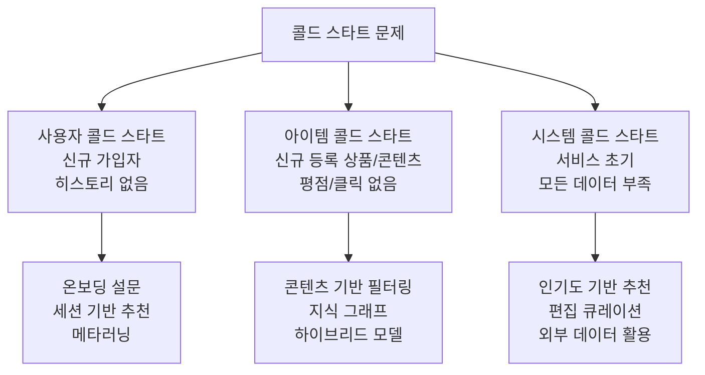
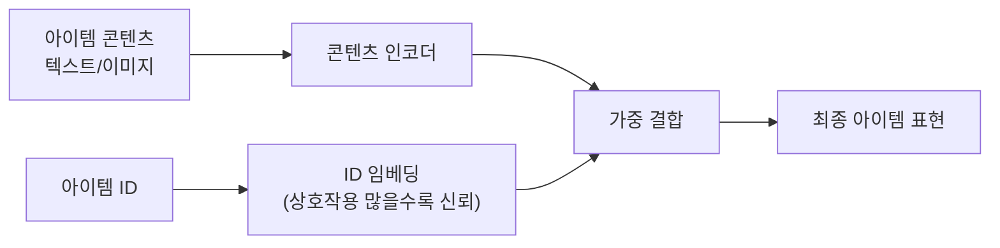

# 콜드 스타트 문제 (Cold Start Problem)

콜드 스타트(Cold Start)는 **과거 상호작용 데이터가 없는 신규 사용자 또는 신규 아이템**에 대해 추천을 제공하기 어려운 문제를 가리킨다. 협업 필터링(Collaborative Filtering) 계열의 모델들은 행렬 분해나 임베딩 기반으로 상호작용을 학습하기 때문에, 데이터가 없는 대상에 대해서는 의미 있는 표현을 만들 수 없다.

## 세 가지 콜드 스타트 유형

## 사용자 콜드 스타트 해결 전략

### 1. 온보딩 인터랙션 (Explicit Elicitation)

서비스 가입 초기에 사용자 선호를 명시적으로 수집한다:
- 관심 카테고리 선택 (5~10개)
- 초기 평점 유도 (Netflix: 시작 시 영화 몇 편 평가)
- 인구통계학적 정보 수집 (연령, 지역)

**단점**: 사용자 이탈 위험 증가, 응답이 부정확할 수 있음.

### 2. 세션 기반 추천

로그인 없이 현재 세션의 행동만으로 추천:
- 현재 본 페이지, 클릭한 아이템을 기반으로 즉시 추천
- [[sequential-recommendation]]의 세션 기반 모델(SR-GNN, STAMP) 활용
- 사용자 ID가 필요 없으므로 콜드 스타트 회피

### 3. 메타러닝 (Meta-Learning)

소수의 상호작용(few-shot)만으로 사용자 표현을 빠르게 적응시키는 접근. [[meta-learning-maml]]의 MAML 알고리즘을 추천에 적용한 MeLU(2019) 등이 대표 사례다:

$$\theta^* = \arg\min_\theta \sum_{\text{user}_i} \mathcal{L}_i(\theta - \alpha \nabla_\theta \mathcal{L}_i(\theta))$$

몇 번의 gradient step만으로 신규 사용자에 적응하는 파라미터 $\theta$를 사전학습한다.

### 4. 전이 학습 기반

도메인 A(데이터가 풍부)에서 학습한 사용자 표현을 도메인 B(신규 서비스)로 전이:
- Cross-Domain Recommendation
- 예: 음악 청취 이력 → 팟캐스트 추천

## 아이템 콜드 스타트 해결 전략

### 1. 콘텐츠 기반 필터링 (Content-Based Filtering)

아이템 자체의 메타데이터(제목, 설명, 카테고리, 태그)를 활용하여 유사 아이템을 찾는다:

$$\text{sim}(i_{new}, i_{old}) = \cos(\mathbf{c}_{i_{new}}, \mathbf{c}_{i_{old}})$$

LLM 텍스트 임베딩을 아이템 콘텐츠에 적용하면 강력한 초기 표현을 얻을 수 있다.

### 2. 하이브리드 임베딩

ID 임베딩과 콘텐츠 임베딩을 결합하여, 상호작용이 쌓이면 ID 임베딩 비중을 높이고 초기에는 콘텐츠 임베딩에 의존한다:

### 3. 탐색-활용 균형 (Exploration-Exploitation)

신규 아이템을 의도적으로 노출시켜 빠르게 데이터를 수집:
- **Thompson Sampling**: 불확실성이 큰 아이템 우선 노출
- **Upper Confidence Bound (UCB)**: 예상 보상 + 탐색 보너스
- **A/B 테스트**: 신규 아이템 트래픽 일부 할당

## 시스템 콜드 스타트

서비스 초기 전체 데이터가 부족한 경우:

| 단계 | 전략 |
|------|------|
| 론칭 초기 | 인기도 기반 추천, 편집 큐레이션 |
| 데이터 축적 | 규칙 기반 → 콘텐츠 기반 전환 |
| 충분한 데이터 | 협업 필터링, NCF, DeepFM 도입 |

## 정량 기준: 언제 "충분한" 데이터인가

실무에서 통용되는 기준:

- **사용자**: 최소 5~10개의 긍정 상호작용 이상이면 협업 필터링 적용 고려
- **아이템**: 최소 10~20회 이상 노출/클릭이면 ID 임베딩 신뢰 가능
- 그 이하는 콘텐츠 기반 또는 하이브리드 전략 유지

## 최신 접근: LLM 활용

대규모 언어 모델을 활용한 제로샷/퓨샷 추천이 연구되고 있다:

- **LLMRank**: GPT-4에게 아이템 리스트와 사용자 컨텍스트를 주고 직접 순위 부여
- **아이템 설명 임베딩**: LLM으로 생성한 아이템 설명을 임베딩하여 콘텐츠 표현으로 활용

상호작용 없이도 아이템 콘텐츠와 사용자 의도를 텍스트로 매칭할 수 있어 콜드 스타트에 강력하다.

## 관련 문서

- [[recommendation-systems-dl]] - 딥러닝 기반 추천 시스템 전반
- [[meta-learning-maml]] - 소수 샘플에서의 빠른 적응 알고리즘 MAML
- [[sequential-recommendation]] - 세션 기반 추천으로 콜드 스타트 우회
- [[ncf-neural-collaborative]] - ID 기반 협업 필터링과 콜드 스타트 한계
- [[two-tower-retrieval]] - 콘텐츠 임베딩 기반 초기 후보 검색
