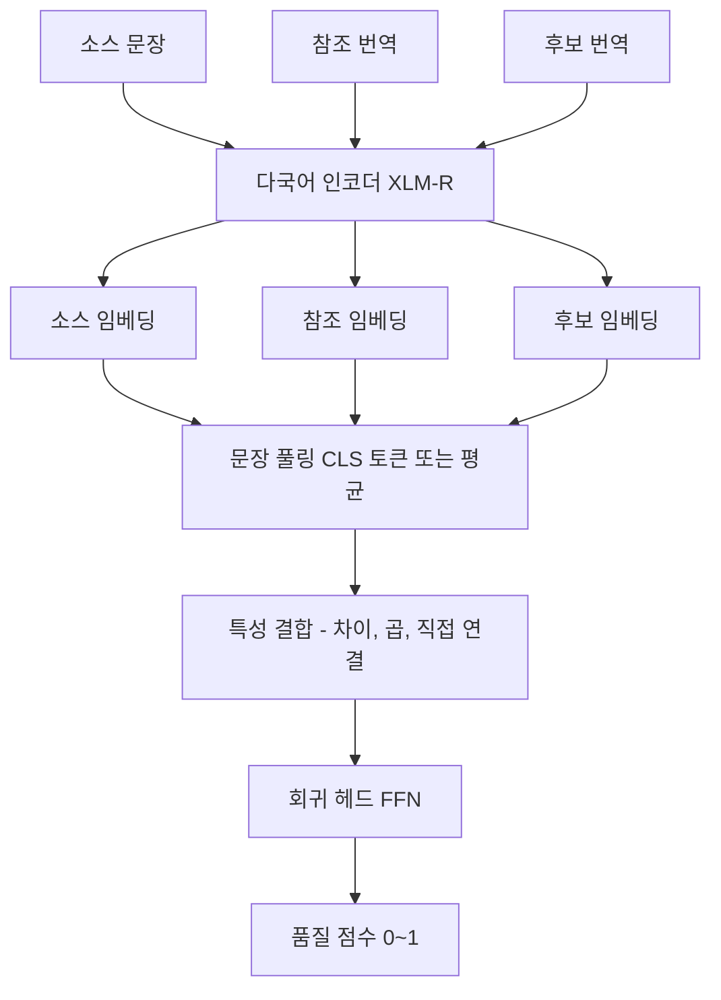
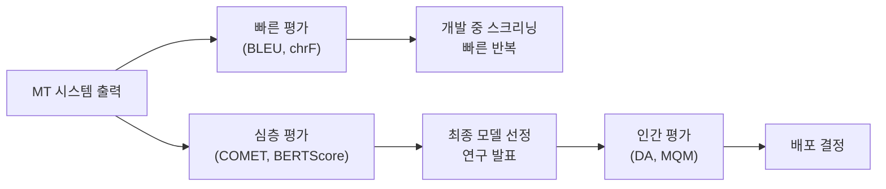

# COMET (Crosslingual Optimized Metric for Evaluation of Translation)

COMET는 2020년 Ricardo Rei et al.이 제안한 신경망 기반 기계 번역(Machine Translation) 평가 지표다. [[bleu-metric|BLEU]] 같은 어휘 기반 지표와 달리 **소스 문장, 참조 번역, 후보 번역 세 가지를 모두 입력**으로 받아 다국어 사전 훈련 모델(XLM-R 등)을 통해 품질 점수를 예측한다. WMT(Workshop on Machine Translation) 메트릭 공유 태스크에서 수년간 사람 판단과의 최고 상관관계를 기록하며 현재 MT 평가의 사실상 최고 기준으로 자리잡았다.

## 핵심 아이디어

### 기존 지표의 한계와 COMET의 접근

[[bleu-metric|BLEU]]와 같은 지표는 참조 번역과의 어휘 겹침만 측정한다. 이 방식은 두 가지 근본적 문제가 있다:

1. **소스 무시**: 원문이 무엇이었는지 모르므로 의미적 충실도를 측정할 수 없다
2. **어휘 기반 한계**: 동의어, 패러프레이즈를 인식하지 못한다

COMET는 다국어 인코더를 활용하여 소스-참조-후보 세 문장을 함께 분석함으로써 이 한계를 극복한다.

### 소스 활용의 중요성

```
소스 (스페인어): "El gato está sobre la alfombra."
참조 (영어): "The cat is on the rug."
후보 A: "The cat is on the carpet."  -> BLEU: 낮음, COMET: 높음 (의미 동일)
후보 B: "The dog is on the rug."    -> BLEU: 높음, COMET: 낮음 (의미 오역)
```

COMET는 소스를 보고 후보 B가 "개"를 "고양이" 대신 사용한 중대한 오역임을 포착한다.

## 아키텍처

### 모델 구조



COMET의 핵심은 다국어 인코더로 세 문장의 표현을 추출한 뒤 이들의 관계를 회귀 헤드로 점수화하는 구조다.

### 특성 결합 방식

소스($s$), 참조($r$), 후보($h$) 임베딩을 결합하는 일반적인 방식:

$$\text{features} = [h; r; s; |h - r|; |h - s|; h \odot r; h \odot s]$$

이 풍부한 특성 벡터가 회귀 헤드에 입력되어 최종 점수를 예측한다.

### 학습 방식

COMET는 사람이 평가한 MT 품질 점수(DA: Direct Assessment, MQM: Multidimensional Quality Metrics)로 지도 학습된다.

- **회귀 학습 (COMET-DA)**: 사람의 DA 점수를 예측하도록 학습
- **학습 기반 순위 매김 (COMET-MQM)**: MQM 오류 기반 점수로 학습
- **참조 없는 버전 (CometKiwi)**: QE(Quality Estimation) - 참조 없이 소스+후보만으로 평가

## COMET 모델 패밀리

| 모델 | 입력 | 특징 |
|------|------|------|
| `wmt22-comet-da` | src + ref + hyp | 표준 COMET, DA 훈련 |
| `wmt22-cometkiwi-da` | src + hyp | 참조 불필요 (QE 모드) |
| `wmt23-cometkiwi-da-xl` | src + hyp | 3.5B 파라미터 XL 버전 |
| `unbabel/wmt22-unite-mup` | src + ref + hyp | UniTE 기반 확장 |
| `eamt22-cometinho-da` | src + ref + hyp | 경량 버전 (속도 최적화) |

## 사용법

```python
from comet import download_model, load_from_checkpoint

# 모델 다운로드 및 로드
model_path = download_model("Unbabel/wmt22-comet-da")
model = load_from_checkpoint(model_path)

# 평가 데이터 준비
data = [
    {
        "src": "El gato está sobre la alfombra.",
        "ref": "The cat is on the rug.",
        "mt": "The cat is on the carpet."
    },
    {
        "src": "El gato está sobre la alfombra.",
        "ref": "The cat is on the rug.",
        "mt": "The dog is on the mat."
    }
]

model_output = model.predict(data, batch_size=8, gpus=1)
print(f"점수: {model_output.scores}")
print(f"시스템 수준 점수: {model_output.system_score}")
```

```python
# CometKiwi: 참조 없는 QE 모드
from comet import download_model, load_from_checkpoint

kiwi_path = download_model("Unbabel/wmt22-cometkiwi-da")
kiwi_model = load_from_checkpoint(kiwi_path)

# 참조 없이 소스와 후보만 필요
data = [
    {
        "src": "El gato está sobre la alfombra.",
        "mt": "The cat is on the carpet."
    }
]

output = kiwi_model.predict(data, batch_size=8)
print(f"QE 점수 (참조 없음): {output.scores}")
```

## 성능 비교

### WMT 메트릭 공유 태스크 결과

WMT 메트릭 공유 태스크에서 COMET 계열 모델은 지속적으로 최상위 성능을 기록했다.

| 지표 | WMT21 상관관계 | WMT22 상관관계 | 비고 |
|------|--------------|--------------|------|
| BLEU | 낮음 | 낮음 | 기준선 |
| chrF | 중간 | 중간 | - |
| BLEURT | 높음 | 높음 | Google 제안 |
| COMET-DA | **매우 높음** | **매우 높음** | WMT21 1위 |
| CometKiwi | 높음 | **매우 높음** | 참조 불필요 장점 |

### 동의어/패러프레이즈 처리 비교

```
원문: "The scientist made a discovery."
참조: "The researcher found something new."
후보: "The scientist discovered a new finding."

BLEU: ~0.15 (정확 일치 단어 적음)
ROUGE-1: ~0.35
BERTScore: ~0.87
COMET: ~0.85~0.92 (소스도 함께 분석하여 정확성 판단)
```

## 강점과 한계

### 강점

- **소스 활용**: 원문 참조로 의미적 충실도(faithfulness) 직접 측정
- **사람 판단 최고 상관관계**: WMT 벤치마크 기준 지속적 최고 성능
- **다국어 지원**: XLM-R 기반으로 100+ 언어 쌍 지원
- **참조 없는 모드 (QE)**: CometKiwi로 참조 번역 없이도 평가 가능
- **문장 수준 신뢰성**: [[bleu-metric|BLEU]]보다 개별 문장 평가가 더 신뢰적

### 한계

- **계산 비용**: GPU가 없으면 실용적 속도 달성 어려움
- **모델 편향**: 훈련 데이터(DA/MQM)의 편향을 반영
- **블랙박스**: 왜 낮은 점수가 나왔는지 설명이 어려움
- **도메인 의존성**: 훈련과 다른 도메인(의료, 법률)에서 성능 저하 가능
- **참조 품질 의존**: 표준 COMET는 여전히 참조 번역 품질에 영향을 받음

## 평가 파이프라인에서의 위치



실무에서 COMET는 최종 모델 선정 단계에서 주로 사용되며, 개발 사이클의 빠른 반복에는 속도가 빠른 [[bleu-metric|BLEU]]나 chrF를 병행한다.

## 실무 활용 지침

### 언제 COMET를 선택하는가

- 연구 논문에서 MT 시스템의 최종 평가 보고 시
- 여러 MT 시스템 중 최종 선정 시
- 사람 평가 전 사전 필터링 시
- 품질 보증(QA) 파이프라인에서 자동 오류 감지 시

### 비용 효율적 운영

```python
# 배치 크기와 GPU 활용 최적화
model_output = model.predict(
    data,
    batch_size=32,          # GPU 메모리에 맞게 조정
    gpus=1,                 # GPU 가용 시 반드시 활용
    num_workers=4,          # CPU 전처리 병렬화
    progress_bar=True
)

# 대규모 평가 시 Accelerate 활용 권장
# pip install accelerate
```

### CometKiwi의 실무 가치

참조 번역 없이 품질을 평가할 수 있는 CometKiwi는 다음 시나리오에서 특히 유용하다:

- **저자원 언어**: 참조 번역 구축 비용이 높은 언어 쌍
- **실시간 QA**: 번역 서비스의 실시간 품질 모니터링
- **능동 학습**: 저품질 번역 자동 감지 및 인간 검토 우선순위 지정

## WMT 챔피언으로서의 의미

COMET가 WMT 메트릭 공유 태스크에서 지속적으로 우수한 성능을 보인다는 것은, 단순히 벤치마크 점수가 높다는 의미를 넘어 **MT 연구 커뮤니티가 이 지표를 신뢰의 기준으로 채택하고 있다**는 의미다. Google의 BLEURT, Microsoft의 여러 지표들과 경쟁하면서도 Unbabel/IST의 COMET 계열이 지속적으로 상위에 랭크된 것은, 소스 문장 활용이라는 설계 원칙의 우수성을 입증한다.

## 관련 문서

- [[bleu-metric]] - 전통 MT 평가 지표, COMET와 상호 보완
- [[bert-score]] - 임베딩 기반 평가, COMET와 비교
- [[machine-translation-modern]] - 현대 기계 번역 시스템 개요
- [[ai-evaluation]] - AI 평가 방법론 전반
