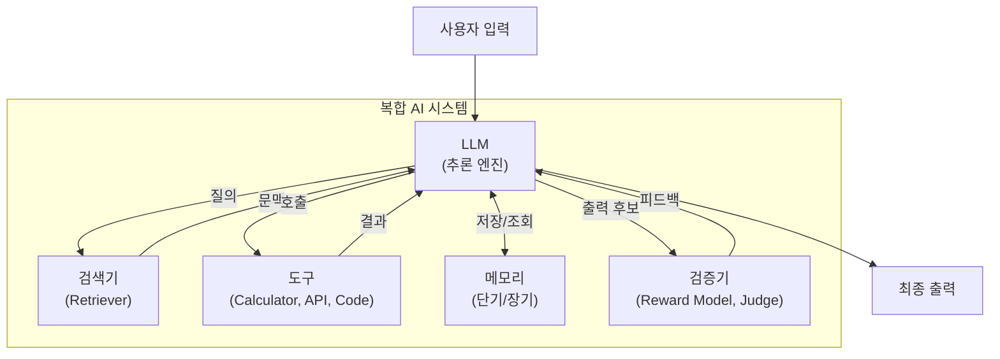

# 복합 AI 시스템 (Compound AI Systems)

## 정의

**복합 AI 시스템(Compound AI Systems)**은 단일 LLM 호출이 아닌, 다수의 모델/검색기/도구/코드 컴포넌트를 결합하여 AI 작업을 수행하는 시스템 설계 패러다임이다. 2024년 UC Berkeley의 Matei Zaharia 등이 "The Shift from Models to Compound AI Systems" 블로그 포스트에서 정의한 용어로, AI 발전의 축이 "더 좋은 모델 만들기"에서 "더 좋은 시스템 설계"로 이동하고 있다는 핵심 관찰을 담고 있다.

> "The highest-quality AI results are increasingly obtained not from a single model but by composing multiple components together."

단일 모델의 성능 향상만으로는 해결할 수 없는 문제들 -- 최신 정보 접근, 환각 감소, 복잡한 다단계 추론, 외부 시스템과의 상호작용 -- 이 복합 시스템 설계를 필연적으로 요구한다.

## 왜 복합 시스템인가

### 단일 모델의 한계

1. **지식 단절(Knowledge Cutoff)**: 학습 데이터 이후의 정보를 알 수 없음
2. **환각(Hallucination)**: 사실이 아닌 내용을 자신 있게 생성
3. **도구 부재**: 계산, API 호출, 파일 조작 등 실세계 행동 불가
4. **일관성 부족**: 긴 작업에서 문맥을 잃거나 모순된 출력 생성

### 복합 시스템의 이점

1. **최신성**: 검색 컴포넌트가 실시간 정보를 주입
2. **정확성**: 검증기/필터가 환각을 탐지하고 걸러냄
3. **행동 능력**: 도구 호출로 실세계에 영향을 미침
4. **모듈성**: 각 컴포넌트를 독립적으로 개선/교체 가능

## 아키텍처 패턴

복합 AI 시스템의 대표적인 구성 패턴을 구조화하면 다음과 같다.



이 다이어그램은 LLM을 중심으로 검색기, 도구, 메모리, 검증기가 상호작용하는 복합 시스템의 일반적 구조를 보여준다.

## 대표 사례

### RAG (Retrieval-Augmented Generation)

가장 널리 배포된 복합 AI 시스템이다. LLM + 검색기 + 벡터 DB를 결합하여 최신 정보 접근과 환각 감소를 동시에 달성한다. [[rag-architecture-evolution-2026]]에서 다루는 것처럼 RAG 아키텍처는 단순 검색-생성에서 Agentic RAG, Graph RAG 등으로 계속 진화하고 있다.


### LLM 에이전트 (Agent)

LLM + 도구 + 메모리 + 계획 능력을 결합한 시스템이다. [[agentic-engineering]]에서 정의한 것처럼, 에이전트는 "목표 달성을 위해 도구를 반복 실행하는 소프트웨어"이다. [[orchestrator-worker-pattern]]은 복수의 에이전트를 조율하는 패턴으로, 복합 시스템의 복잡도가 높아질 때 필수적이다.

### AlphaCode / AlphaGeometry

Google DeepMind의 수학/코딩 시스템들은 LLM + 형식 검증기 + 탐색 알고리즘을 결합한다. 모델이 후보를 생성하고, 검증기가 정확성을 판단하며, 탐색 알고리즘이 해 공간을 효율적으로 탐색한다.

### ChatGPT (2024+)

단순 챗봇에서 출발했지만, 2024년 이후 웹 검색 + 코드 인터프리터 + DALL-E + 플러그인을 통합한 복합 시스템으로 진화했다. 사용자 입력에 따라 적절한 컴포넌트를 동적으로 라우팅한다.

## 설계 원칙

### 1. 제어 흐름 설계 (Control Flow)

복합 시스템의 가장 중요한 설계 결정은 컴포넌트 간 제어 흐름이다.

| 패턴 | 설명 | 예시 |
|------|------|------|
| 순차(Sequential) | A -> B -> C 파이프라인 | RAG (검색 -> 생성) |
| 병렬(Parallel) | 여러 경로를 동시에 실행 후 집약 | 다중 검색 + 앙상블 |
| 조건부(Conditional) | 입력에 따라 경로 분기 | 라우터 에이전트 |
| 반복(Iterative) | 결과를 반복적으로 개선 | self-critique 루프 |

### 2. 모듈 간 인터페이스

각 컴포넌트의 입출력을 명확히 정의해야 한다. [[context-engineering]]이 강조하는 것처럼, LLM에 전달되는 컨텍스트의 품질이 전체 시스템 성능을 좌우한다. 검색기가 반환하는 문서의 포맷, 도구 호출의 스키마, 메모리의 저장/조회 프로토콜 등이 모두 인터페이스 설계 대상이다.

### 3. 최적화 단위

단일 모델 시스템에서는 모델 자체를 최적화하지만, 복합 시스템에서는 시스템 전체를 최적화 대상으로 봐야 한다. DSPy(Stanford)는 이 관점에서 프롬프트와 파이프라인 구성을 자동으로 최적화하는 프레임워크이다.

## 과제와 열린 문제

### 평가의 어려움

복합 시스템은 컴포넌트 간 상호작용이 결과에 영향을 미치므로, 개별 컴포넌트 평가만으로는 시스템 전체 성능을 예측하기 어렵다. end-to-end 평가와 컴포넌트별 평가를 병행해야 한다.

### 디버깅 복잡도

검색기가 잘못된 문서를 반환했는지, LLM이 좋은 문서를 무시했는지, 도구 호출이 실패했는지 -- 오류 원인을 추적하는 것이 단일 모델보다 훨씬 어렵다. 관찰 가능성(Observability) 도구가 필수적이다.

### 지연 시간과 비용

컴포넌트가 추가될수록 지연 시간과 비용이 증가한다. 검색 1회 + LLM 호출 2회 + 도구 호출 1회가 합쳐지면 단일 LLM 호출 대비 5-10배의 지연이 발생할 수 있다. 병렬화, 캐싱, 경량 모델 라우팅 등의 최적화가 필요하다.

### 보안

컴포넌트가 늘어날수록 공격 표면(attack surface)도 넓어진다. 검색기를 통한 간접 프롬프트 인젝션, 도구 호출을 악용한 권한 상승 등 새로운 위협 벡터가 생긴다.

## 실무 관점

복합 AI 시스템은 2024-2026년 AI 엔지니어링의 지배적 패러다임이 되었다. 실무자에게 중요한 시사점은 다음과 같다.

1. **모델 선택보다 시스템 설계가 중요**: 최신 모델로 교체하는 것보다 검색 품질 개선, 프롬프트 최적화, 도구 설계 개선이 더 큰 성능 향상을 가져올 수 있다
2. **점진적 복잡도 증가**: 단순한 시스템(단일 프롬프트)에서 시작하여 필요에 따라 컴포넌트를 추가하는 것이 권장된다
3. **표준화된 인터페이스**: [[model-context-protocol-mcp]] 같은 표준이 컴포넌트 간 상호운용성을 높인다
4. **관찰 가능성 우선**: 복잡한 시스템일수록 로깅, 트레이싱, 모니터링이 선행되어야 한다

## DSPy: 복합 시스템 프로그래밍 프레임워크 (추가)

Stanford의 Khattab et al.(2023)이 개발한 DSPy(Declarative Self-improving Python)는 복합 AI 시스템을 선언적으로 명세하고 자동 최적화하는 프레임워크다.

- **선언적 명세**: 각 단계의 입출력 시그니처만 정의, 프롬프트는 컴파일러가 자동 생성
- **end-to-end 최적화**: 개별 컴포넌트가 아닌 전체 파이프라인을 훈련 예시로 최적화
- **모듈 조합**: `dspy.Module` 상속으로 파이썬 클래스처럼 복합 시스템 조립

```python
class RAGPipeline(dspy.Module):
    def __init__(self):
        self.retrieve = dspy.Retrieve(k=3)
        self.generate = dspy.ChainOfThought("context, question -> answer")

    def forward(self, question):
        context = self.retrieve(question).passages
        return self.generate(context=context, question=question)
```

## 관련 문서

- [[agentic-engineering]] -- 복합 AI 시스템의 실천적 방법론
- [[rag-architecture-evolution-2026]] -- RAG의 진화: 대표적 복합 시스템 사례
- [[orchestrator-worker-pattern]] -- 다중 에이전트 조율 패턴
- [[context-engineering]] -- 복합 시스템에서 LLM 컨텍스트 설계
- [[model-context-protocol-mcp]] -- 도구/서비스 통합 표준 프로토콜
- [[tool-calling-optimization]] -- 복합 시스템의 도구 호출 최적화
- [[test-time-compute|추론 시점 계산 스케일링 (Test-Time Compute)]] -- 복합 시스템에서 추론 예산 활용
- [[langsmith|LangSmith - LLM 애플리케이션 관측 플랫폼]] -- 복합 시스템 관측 도구
