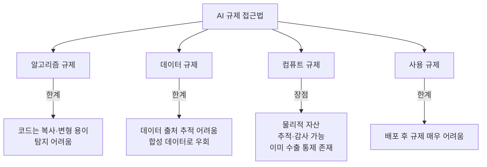
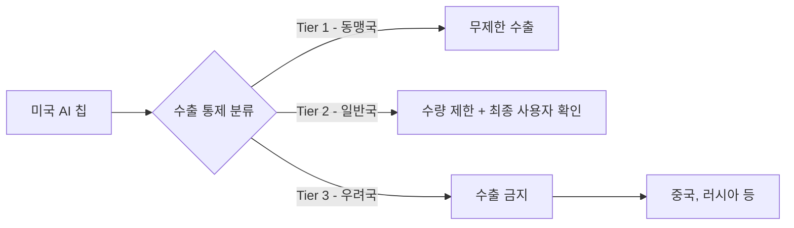
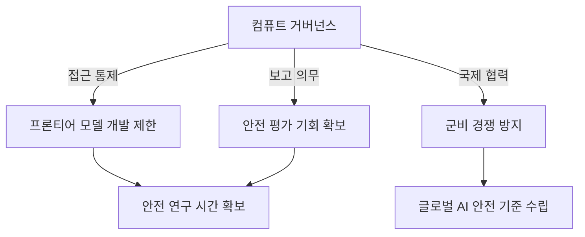

# 컴퓨트 거버넌스 (Compute Governance)

컴퓨트 거버넌스(Compute Governance)는 AI 시스템 훈련에 필요한 대규모 컴퓨트(GPU/TPU 클러스터, AI 반도체)의 **생산, 유통, 접근, 사용을 규제하는 정책·제도적 접근**이다. 핵심 논리는 다음과 같다: 가장 강력한 AI 시스템은 막대한 컴퓨트 없이는 존재할 수 없으므로, 컴퓨트를 규제하면 위험한 AI 개발을 통제할 수 있다.

[[scaling-hypothesis|스케일링 가설]]이 옳다면 컴퓨트 = 능력이다. 따라서 컴퓨트 거버넌스는 AI 안전의 핵심 레버(lever)가 된다.

## 왜 컴퓨트인가

AI 규제의 다른 접근과 비교하면 컴퓨트 거버넌스의 논리가 명확해진다.

컴퓨트(반도체)는 다음 특성으로 규제에 적합하다.

- **물리적 희소성**: NVIDIA H100, A100 같은 AI 칩은 TSMC 등 소수 파운드리에서만 제조 가능
- **추적 가능성**: 반도체 공급망은 이미 수출 통제 인프라 존재
- **중앙 집중성**: 대형 훈련 클러스터는 클라우드 3사(AWS, GCP, Azure) 또는 자체 데이터센터에 집중
- **컴퓨트 임계값**: 특정 FLOP 이상의 훈련만 규제 대상으로 설정 가능

## 주요 규제 수단

### 1. 수출 통제 (Export Controls)

미국은 NVIDIA A100/H100 등 첨단 AI 칩의 중국·러시아 수출을 제한한다.

**주요 조치 연혁**:
- 2022년 10월: BIS(Bureau of Industry and Security)의 첫 AI 칩 수출 통제
- 2023년 10월: 수출 통제 강화, 중간급 칩(A800, H800)도 포함
- 2024년: "AI 확산 규칙"으로 국가별 3단계 분류 도입

### 2. 훈련 컴퓨트 신고 제도

**미국 행정명령(EO 14110, 2023)**: $10^{26}$ FLOP 이상의 훈련 실행은 연방 정부에 보고 의무화. AI 안전 기관이 위험성을 평가할 수 있도록 사전 통지.

**[[eu-ai-act-enforcement|EU AI Act]]**: 고위험 AI 시스템의 컴퓨트 기반 임계값 설정을 논의. $10^{25}$ FLOP 기준이 유력한 임계값으로 거론.

### 3. KYC (Know Your Customer) 클라우드

클라우드 사업자가 대규모 GPU 임대 고객의 신원을 확인하고, 이상 사용 패턴을 모니터링하도록 의무화.

- AWS, Azure, GCP가 AI 훈련 워크로드에 대한 고객 확인 강화
- 국가 안보 우려 고객에 대한 서비스 제한 가능

### 4. 컴퓨트 클러스터 감사

대형 데이터센터(특히 AI 훈련용 클러스터)에 대한 주기적 감사 및 등록 의무.

## 기술적 접근: 컴퓨트 임계값 설정

어떤 훈련을 규제할지 결정하는 임계값 설정이 핵심 기술적 문제다.

| 임계값 | FLOP 규모 | 대략적 해당 모델 |
|--------|-----------|----------------|
| $10^{23}$ FLOP | 소규모 | LLaMA 7B급 |
| $10^{25}$ FLOP | 중규모 | GPT-3급 |
| $10^{26}$ FLOP | 대규모 | GPT-4급 |
| $10^{28}$ FLOP | 초대규모 | 미래 프론티어 모델 |

현재 규제들은 대부분 $10^{26}$을 기준으로 삼지만, 기술 발전에 따라 임계값 조정 필요.

## [[frontier-model-safety|프론티어 모델 안전성]]과의 관계

컴퓨트 거버넌스는 [[frontier-model-safety|프론티어 모델 안전]] 연구와 깊이 연결된다.

핵심 논거: 프론티어 모델이 가져올 위험(바이오 무기 설계 지원, 사이버 공격 자동화 등)은 개발 이후에는 통제가 불가능하다. 따라서 개발 전 컴퓨트 접근 단계에서 개입해야 한다.

## 비판과 한계

### 기술적 한계

- **소프트웨어 효율화**: 알고리즘 혁신으로 적은 컴퓨트로도 동등한 성능 달성 가능 (효율성의 역설)
- **분산 훈련 회피**: 여러 소형 클러스터로 나눠 규제 임계값 우회 가능성
- **사후 추적 어렵**: 이미 훈련된 모델 가중치는 이동·복제 용이

### 정책적 한계

- **국제 조율 어려움**: 미국이 제한해도 중국·다른 국가가 개발 지속
- **혁신 저해 우려**: 정당한 연구·교육용 고성능 컴퓨트도 제한 위험
- **정의 문제**: "AI 칩"의 범주, 임계값 기준이 자의적일 수 있음

### 지정학적 긴장

- 미국의 수출 통제 → 중국의 국산 AI 반도체 개발 가속 (화웨이 Ascend 등)
- "AI 칩 전쟁"이 첨단 반도체 공급망 전체의 지정학적 갈등으로 확대

## 국제 거버넌스 이니셔티브

| 이니셔티브 | 주도 | 주요 내용 |
|-----------|------|----------|
| AI Safety Summit (Bletchley) | 영국 | 프론티어 AI 위험 공동 인식 |
| G7 AI 원칙 | G7 | 자유민주주의 가치 기반 AI 개발 |
| UN AI 거버넌스 패널 | 유엔 | 글로벌 AI 거버넌스 프레임 논의 |
| 한-미-일 AI 협력 | 삼국 | 공급망 협력 및 표준 공조 |

## 실무적 시사점

컴퓨트 거버넌스는 AI 기업에 직접 영향을 미친다.

- **규정 준수 비용**: 대규모 훈련 시 정부 보고 의무 및 감사 대응
- **클라우드 선택**: KYC 의무를 충족하는 클라우드 제공자 선택
- **공급망 리스크**: AI 칩 조달 경로의 규정 준수 여부 확인
- **지정학 리스크**: 국가 간 규제 차이로 인한 운영 복잡성 증가

## 관련 문서

- [[eu-ai-act-enforcement]] - EU AI Act의 고위험 AI 시스템 규제 메커니즘
- [[frontier-model-safety]] - 프론티어 AI 모델의 안전성 평가와 통제
- [[scaling-hypothesis]] - 컴퓨트 = 능력이라는 스케일링 가설
- [[ai-regulation-us]] - 미국의 AI 규제 정책 전반
