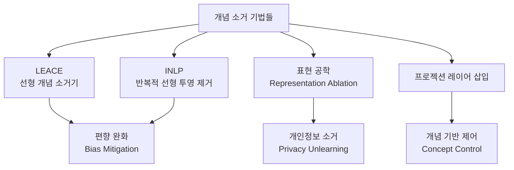

# 개념 소거 (Concept Erasure)

## 개요

개념 소거(Concept Erasure)는 언어 모델의 **가중치나 내부 표현에서 특정 개념의 흔적을 제거**하는 기법이다. 단순히 모델의 출력을 필터링하거나 프롬프트로 억제하는 것과 달리, 표현 공간(representation space) 수준에서 해당 개념 정보를 직접 지운다는 점이 핵심이다.

[[machine-unlearning]]의 세부 기법으로도 분류되며, [[model-editing]]과도 밀접하게 연결된다. 그러나 개념 소거는 "특정 사실을 잊히게 한다"는 언러닝보다 더 폭넓은 의미로, 특정 속성(예: 성별, 인종)에 대한 선형 표현 자체를 제거한다.

## 핵심 아이디어

모델 내부의 특정 레이어에서 활성화(activation) 벡터를 분석하면, 성별·인종·언어 등 특정 속성과 강하게 상관된 **선형 방향(linear direction)**을 찾을 수 있다. 개념 소거는 이 방향을 투영(projection)으로 제거한다.

$$h_\text{erased} = h - (h \cdot \hat{d}) \cdot \hat{d}$$

여기서 $h$는 원래 은닉 상태(hidden state), $\hat{d}$는 해당 개념과 대응하는 단위 방향 벡터다. 이 연산은 $h$에서 개념 $d$에 해당하는 성분을 제거한 채 나머지 정보는 보존한다.

## 주요 기법



### LEACE (Least-squares Concept Erasure)

LEACE는 2023년 Belrose et al.이 제안한 방법으로, 이진(binary) 또는 다중 클래스 개념에 대해 **최소제곱 기준으로 최적화된** 투영 행렬을 학습한다. 기존 INLP보다 계산 효율이 높고 단일 패스로 개념 방향을 추정한다.

### INLP (Iterative Nullspace Projection)

Ravfogel et al.의 방법으로, 반복적 선형 분류기 학습과 투영 제거를 교차 수행한다. 각 반복에서 분류기가 해당 개념을 탐지하지 못할 때까지 진행한다. 다양한 개념에 일반화되지만 반복 횟수에 따른 성능 저하 위험이 있다.

## 응용 분야

### 1. 편향 완화 (Bias Mitigation)

성별·인종 등 보호 속성(protected attribute)과 관련된 선형 표현을 제거해 공정성을 개선한다. 다만 이러한 속성이 완전히 선형적으로 분리되지 않는 경우 잔존 편향이 남을 수 있다.

```python
# 개념 소거 적용 예시 (의사 코드)
from concept_erasure import LeaceEraser

eraser = LeaceEraser.fit(
    X=hidden_states,        # (N, d_model) 형태의 활성화
    Z=gender_labels,        # (N,) 형태의 보호 속성 레이블
)
erased_states = eraser(hidden_states)  # 성별 정보 제거된 표현
```

### 2. 개인정보 소거 (Privacy Unlearning)

특정 개인의 정보가 모델 가중치에 인코딩된 경우, 해당 정보와 관련된 개념 방향을 제거해 [[machine-unlearning]]을 구현한다. GDPR의 "잊혀질 권리" 요구사항에 대응하는 기술적 수단으로 주목받고 있다.

### 3. 해석 가능성 연구

특정 개념의 내부 표현을 찾고 제거함으로써, 그 개념이 모델 행동에 미치는 인과적 역할을 검증하는 데 활용된다. "개념 X를 제거하면 행동 Y가 사라진다"는 인과 분석이 가능해진다.

## [[model-editing]]과의 비교

| 항목 | 개념 소거 | 모델 편집 |
|-----|---------|---------|
| 목표 | 개념/속성의 선형 표현 제거 | 특정 사실/지식 수정 |
| 단위 | 표현 공간의 방향 | 개별 사실/연관 |
| 범위 | 해당 속성 전반 | 특정 사실 하나 |
| 방법 | 투영, 선형 대수 | ROME, MEMIT 등 |
| 부작용 | 관련 개념 성능 저하 가능 | 편집 범위 외 무관 가능 |

## 한계와 주의사항

- **비선형 인코딩**: 개념이 여러 레이어에 비선형으로 분산 인코딩된 경우 선형 투영으로는 완전 제거 불가
- **기능 보존 vs 소거 트레이드오프**: 소거가 강할수록 관련 없는 성능도 저하될 수 있음
- **검증의 어려움**: 개념이 "진짜로" 소거되었는지 확인하는 방법이 제한적
- **표적 공격**: 소거 후에도 탐침(probe) 방식으로 일부 정보 복원이 가능하다는 보고 존재

## 관련 문서

- [[machine-unlearning]] - 개념 소거가 구현하는 학습 데이터 망각 기법
- [[model-editing]] - 특정 사실/지식을 수정하는 관련 기법
- [[task-arithmetic-concept]] - 태스크 벡터 뺄셈을 통한 기능 제거와의 비교
- [[alignment-faking]] - 표면적 소거와 실제 행동 변화 불일치 문제
