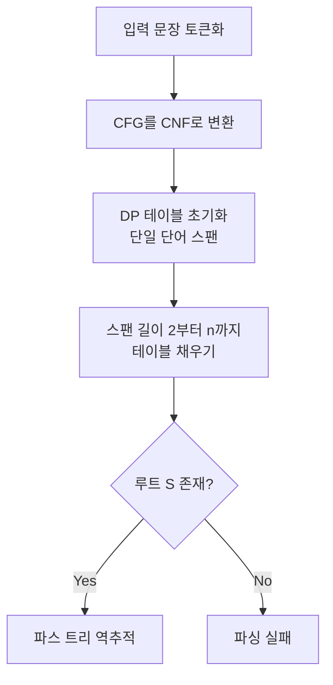

# 구 구조 분석 (Constituency Parsing)

구 구조 분석(constituency parsing)은 문장을 중첩된 **구(phrase)** 단위로 분해하여 계층적 트리 구조를 만드는 자연어 처리 태스크다. 문장 전체를 "어떻게 나눌 수 있는가"에 집중하며, 각 노드가 명사구(NP), 동사구(VP), 전치사구(PP) 등의 문법 범주를 나타낸다.

## 기본 개념

### 구(Constituency)란

문장 내 단어들의 집합이 하나의 문법 단위로 기능할 때 이를 구성소(constituent)라 부른다. 예를 들어 "the big dog" 전체가 명사구(NP)로서 한 단위로 이동하거나 치환될 수 있다.

구 구조 분석 결과는 **파스 트리(parse tree)**로 표현된다:

```
         S
       /   \
      NP    VP
      |    /  \
     She  V    NP
          |    |
         saw   him
```

이 트리에서 S(문장), NP(명사구), VP(동사구), V(동사)가 각 계층의 노드를 이룬다.

## 형식 문법: CFG

구 구조 분석의 이론적 토대는 **문맥 자유 문법(Context-Free Grammar, CFG)**이다. CFG는 다음 4요소로 구성된다:

- **비단말 기호(Non-terminals)**: S, NP, VP, ...
- **단말 기호(Terminals)**: 실제 단어들
- **생성 규칙(Production rules)**: NP -> Det N, VP -> V NP, ...
- **시작 기호**: S

CFG 규칙은 `A -> BC` 형태처럼 하나의 비단말 기호를 다른 기호들의 연쇄로 확장하는 방식이다.

## CYK 알고리즘

**CYK(Cocke-Younger-Kasami) 알고리즘**은 CFG 기반 파싱의 대표적 동적 프로그래밍(DP) 방법이다. 문장 길이 $n$에 대해 $O(n^3 \cdot |G|)$ 시간 복잡도를 가진다. 핵심은 촘스키 정규형(Chomsky Normal Form, CNF)으로 변환된 문법에서 부분 스팬에 대한 테이블을 채워나가는 방식이다.



위 다이어그램은 CYK 알고리즘의 전체 처리 흐름을 나타낸다. DP 테이블에 부분 파스 결과를 저장하고, 마지막에 S 기호가 전체 스팬을 커버하면 역추적으로 트리를 복원한다.

## Penn Treebank

**Penn Treebank(PTB)**는 구 구조 분석 연구의 표준 벤치마크 데이터셋이다. 월 스트리트 저널(WSJ) 기사 약 100만 단어를 수작업으로 주석 달아 파스 트리 형태로 제공한다.

주요 특징:
- 약 49,000개 문장, 100만 단어 규모
- 48개의 품사(POS) 태그 체계
- 파스 트리는 괄호 표기법으로 저장: `(S (NP (PRP She)) (VP (VBD saw) (NP (PRP him))))`
- 평가 지표로 **F1 스코어(bracketing F1)**가 표준적으로 사용됨

## 신경망 기반 파서

전통적인 CYK + PCFG(확률적 CFG) 방식에서 딥러닝 기반 파서로 진화가 일어났다.

| 접근 방식 | 특징 | 대표 모델 |
|-----------|------|-----------|
| PCFG | 규칙에 확률 부여, EM 학습 | 스탠퍼드 파서 |
| 전이 기반 | 스택+버퍼 상태 전이, 빠른 속도 | shift-reduce 파서 |
| 차트 기반 NN | 스팬 표현 학습, 정확도 높음 | Kitaev & Klein (2018) |
| [[transformer-architecture]] 기반 | 사전학습 언어모델로 스팬 점수 계산 | BERT + 차트 파서 |

[[transformer-architecture]]를 활용한 파서는 PTB에서 95+ F1을 달성하며 이전 방식을 크게 앞섰다. 사전학습 표현이 문장 내 구 경계를 자연스럽게 포착하기 때문이다.

## 구 구조 vs. 의존 구조

[[dependency-parsing]](의존 구조 분석)과의 핵심 차이:

- **구 구조**: 단어 집합 -> 구(phrase) -> 계층 트리. "무엇이 구를 이루나"에 집중
- **의존 구조**: 단어 -> 단어 간 직접 의존 관계. "어떤 단어가 어떤 단어를 수식하나"에 집중

영어에서는 두 표현이 서로 변환 가능하지만, 형태론이 풍부한 언어(한국어, 체코어)에서는 의존 구조가 더 자연스러운 경우가 많다.

## 실무 활용

구 구조 분석은 다음 다운스트림 태스크에서 활용된다:

- **관계 추출**: 구 경계가 엔티티 쌍을 특정하는 데 도움
- **기계 번역**: 구 단위 정렬(phrase-based MT)의 기반
- **질의응답**: 질문의 구 구조에서 기대 답변 타입 유추
- **텍스트 생성 평가**: 문법성 검증의 구조적 근거

## 관련 문서

- [[dependency-parsing]] - 의존 구조 분석, 단어 간 직접 관계 모델링
- [[transformer-architecture]] - 현대 신경망 파서의 핵심 사전학습 모델
- [[named-entity-recognition]] - 구 구조 분석과 함께 쓰이는 NLP 파이프라인 구성요소
