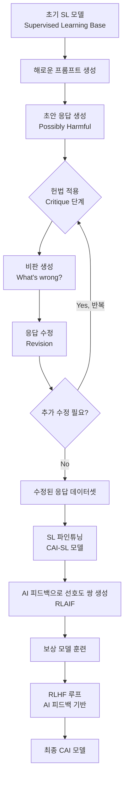
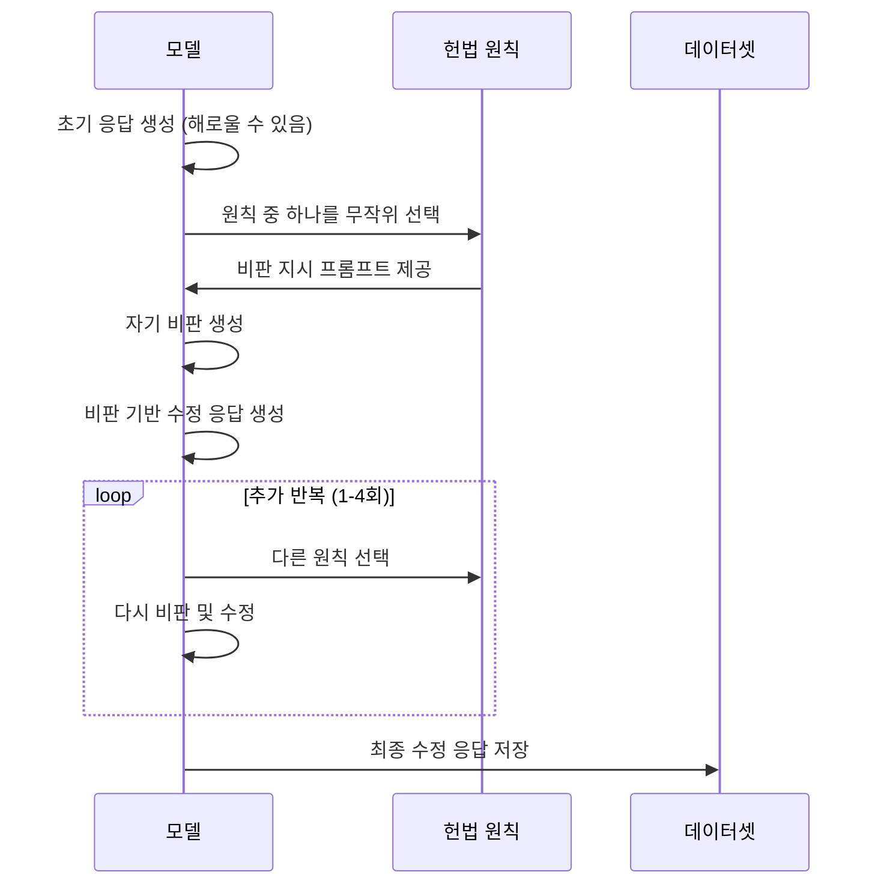

# Constitutional AI 파이프라인

## 개요

Constitutional AI(CAI)는 Anthropic이 2022년 제안한 AI 정렬 방법론이다. 핵심 아이디어는 **인간이 직접 모든 출력을 평가하는 대신, AI 스스로 명시적 원칙(Constitution)에 따라 자신의 출력을 비판하고 수정하게 하는 것**이다. 이를 통해 확장 가능한 감독(scalable oversight)을 달성하면서도 인간의 의도를 반영한 정렬이 가능하다.

이 방법은 단순한 파인튜닝 기법을 넘어, RLHF의 인간 피드백 의존성을 AI 피드백으로 대체하는 RLAIF(AI 피드백 강화학습) 패러다임으로 확장된다.

## 전체 파이프라인

CAI 파이프라인은 두 단계로 구성된다. 첫 번째는 지도 학습(SL) 단계이고, 두 번째는 강화학습(RL) 단계다.

## 1단계: SL 기반 자기 비판 및 수정

### 헌법(Constitution)

헌법은 모델이 따라야 할 원칙들의 집합이다. 예시 원칙:

- "다음 응답이 해롭고, 비윤리적이며, 인종차별적이거나 위험한지 확인하라. 문제가 있으면 재작성하라."
- "응답이 정직하고 진실되며 무해한지 확인하라."
- "응답이 어린이가 보기에 적합한지 확인하라."

이 원칙들은 UN 인권선언, Anthropic의 자체 정책 등 다양한 원천에서 가져온다.

### 비판-수정 반복 사이클

핵심 인사이트는 **같은 모델이 비판자와 작성자를 동시에 수행**한다는 점이다. 모델이 자신의 한계를 인식하고 있다면 스스로 개선할 수 있다는 가정에 기반한다.

## 2단계: RLAIF (AI 피드백 강화학습)

[[rlaif]]는 CAI의 두 번째 핵심 요소다. 인간이 선호도를 레이블링하는 대신, AI가 헌법 원칙에 따라 선호도를 판단한다.

| 단계 | RLHF | RLAIF |
|------|------|-------|
| 선호도 데이터 생성 | 인간 레이블러 | AI 모델 |
| 비용 | 높음 (시간, 돈) | 낮음 (API 비용만) |
| 확장성 | 제한적 | 높음 |
| 일관성 | 레이블러마다 다름 | 원칙 기반으로 일관적 |
| 편향 위험 | 레이블러 편향 | 프롬프트 편향 |

### RLAIF 프로세스

1. CAI-SL 모델이 두 가지 응답을 생성한다
2. AI 평가자가 헌법 원칙을 바탕으로 더 무해한 응답을 선택한다
3. 이 선호도 쌍으로 보상 모델을 훈련한다
4. PPO(Proximal Policy Optimization) 등으로 강화학습을 수행한다

## 헌법 설계의 중요성

헌법의 품질이 전체 파이프라인 성능을 결정한다. 주요 고려사항:

- **포괄성**: 가능한 모든 해악 유형을 커버해야 한다
- **일관성**: 원칙들 사이에 모순이 없어야 한다
- **조작 가능성**: 모델이 실제로 원칙을 적용할 수 있는 수준이어야 한다
- **문화적 보편성**: 특정 문화에 편향되지 않은 원칙이 이상적이다

잘못 설계된 헌법은 과도하게 제한적인 모델("over-refusal")이나 특정 관점으로 편향된 모델을 만들 수 있다.

## 한계와 비판

### 자기 지시(Self-instruction)의 한계

모델이 자신의 오류를 비판하려면 먼저 그 오류가 무엇인지 알아야 한다. 모델이 특정 유형의 해악을 인식하지 못하면 헌법이 있어도 제대로 수정하지 못한다.

### 원칙 충돌

실제 상황에서는 헌법 원칙들이 서로 충돌하는 경우가 발생한다. 예를 들어, "정직해라"와 "해롭지 않아라"가 충돌할 수 있다. 이 충돌을 해결하는 방법이 명확하지 않다.

### RLAIF의 순환 문제

AI가 AI를 평가하는 구조에서 초기 모델의 편향이 증폭될 위험이 있다. AI 평가자가 특정 패턴을 선호하면 그 패턴이 강화되고 고착될 수 있다.

## 실제 적용 결과

Anthropic의 Claude 모델은 CAI를 기반으로 훈련된다. 실험 결과에 따르면:

- CAI 모델은 RLHF 모델 대비 비슷하거나 더 나은 무해성을 보인다
- 인간 피드백 필요량을 크게 줄일 수 있다
- "도움이 되면서도 무해한" 두 목표 사이의 트레이드오프를 더 잘 관리한다

## 원류 문서와의 관계

[[constitutional-ai-original]] 논문은 2022년 Anthropic이 발표한 CAI의 원형 논문이다. 이후 발전 방향:

- 헌법의 자동 생성 연구
- 멀티모달 입력에 대한 CAI 확장
- 더 세밀한 원칙 계층화

## 관련 문서

- [[constitutional-ai-original]] - CAI 원본 논문 요약
- [[rlaif]] - AI 피드백 강화학습 개념 상세
- [[alignment-faking]] - 정렬 실패 패턴 중 하나
- [[superalignment-research]] - 더 강력한 AI를 정렬하는 연구 방향
