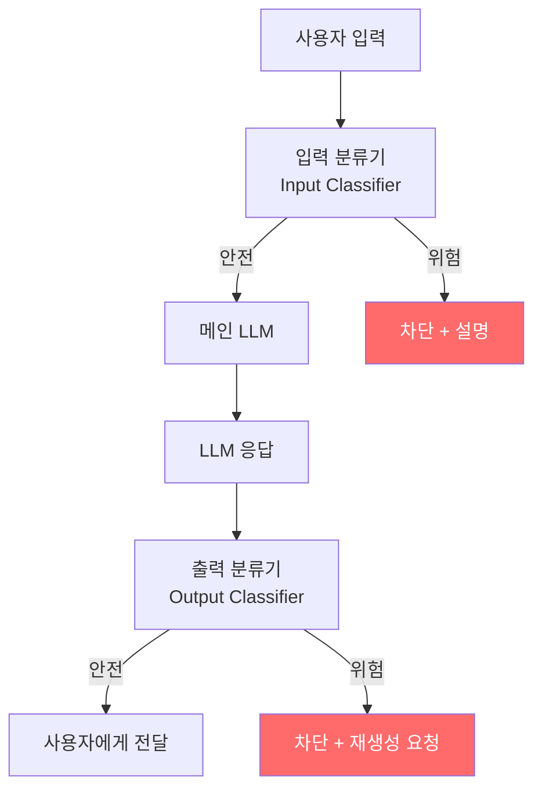
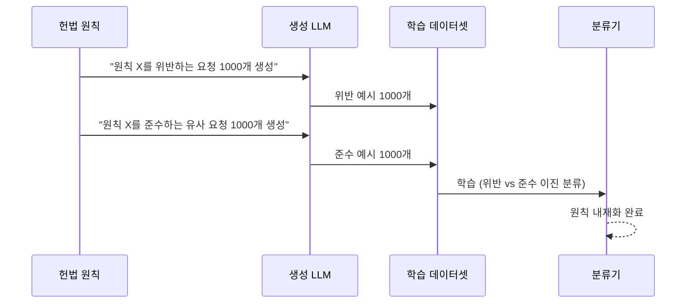

# Constitutional Classifiers++ (Jailbreak Defense)

헌법(constitution) 원칙에서 합성 학습 데이터를 생성해 훈련된 입출력 분류기로, 범용 탈옥(universal jailbreak) 시도를 차단하는 프로덕션 방어 레이어.

## 정의

**헌법 분류기(constitutional classifier)**는 두 단계로 구성된다:

1. **합성 데이터 생성**: 헌법 원칙(예: "CBRN 무기 정보를 제공하지 않는다")에서 수천 개의 해로운/안전한 요청 쌍을 자동 생성
2. **분류기 학습**: 생성된 데이터로 입력(요청)과 출력(응답)을 각각 독립적으로 분류하는 모델 훈련

이 접근은 특정 공격 패턴을 규칙으로 열거하는 대신, **원칙 자체를 분류기에 내재화**한다.

## 아키텍처

입력 분류기와 출력 분류기를 이중으로 두는 이유:
- 입력 분류기: "탈옥 의도"를 사전 차단
- 출력 분류기: 탈옥이 성공해 위험한 응답이 생성된 경우 최후 방어

## 성능 (2026년 1월 Anthropic)

**1,700시간 레드팀 결과**:
- 범용 탈옥(universal jailbreak) 차단율: **86.8%** (v1) -> **100%** (v2, 최후 평가 기준)
- 과거 버전 대비 컴퓨트 비용: **40배 절감**
- 허위 양성(false positive, 정상 요청 차단) 증가: 미미 (< 0.1%)

## 헌법에서 데이터로: 합성 생성 과정

이 과정으로 새로운 원칙 추가 시 수작업 데이터 수집 없이 자동으로 학습 데이터 생성 가능.

## 표현 재사용(Representation Re-use)으로 비용 절감

분류기는 메인 LLM과 **표현 레이어를 공유**할 수 있다. 메인 LLM의 중간 레이어 출력을 분류기의 입력으로 사용하면:
- 분류기 학습 데이터: 90% 감소
- 추론 비용: 중간 레이어만 추가 처리
- 성능: 완전 독립 분류기와 동등

## 범용 탈옥(Universal Jailbreak)이란

특정 모델에 국한되지 않고 다양한 모델에 통하는 탈옥 프롬프트. 예:
- 프롬프트 주입을 통한 시스템 프롬프트 무력화
- 역할극(roleplay)을 이용한 제약 우회
- 다국어 혼합으로 필터 회피
- 점진적 컨텍스트 조작

헌법 분류기는 특정 패턴이 아닌 **의도(intent)**를 분류하므로 이런 다양한 우회 시도에 강건하다.

## 한계

- **적응형 공격**: 분류기 자체를 공격 대상으로 삼는 화이트박스 공격에는 취약
- **허위 양성**: 완벽한 차단은 정상 요청 차단을 수반 (트레이드오프)
- **분류기 탈옥**: 분류기 자체에 대한 프롬프트 주입 공격 가능성

## 실전 배포 고려사항

- **배포 위치**: 프록시 레이어 또는 API 게이트웨이에 삽입
- **레이턴시**: 입력 분류 < 100ms, 출력 분류 < 200ms 목표
- **원칙 업데이트**: 새 위험 카테고리 발견 시 합성 데이터 재생성 -> 증분 파인튜닝
- **모니터링**: 차단 로그를 [[llm-observability-platforms|관찰 가능성 플랫폼]]에 연동

## 대표 레퍼런스

- [Next-generation Constitutional Classifiers (Anthropic)](https://www.anthropic.com/research/next-generation-constitutional-classifiers)
- [Constitutional Classifiers: Defending against universal jailbreaks](https://www.anthropic.com/research/constitutional-classifiers)
- [Constitutional Classifiers++: Efficient Production-Grade Defenses (arXiv 2601.04603)](https://arxiv.org/abs/2601.04603)
- [Constitutional Classifiers (arXiv 2501.18837)](https://arxiv.org/pdf/2501.18837)
- [Cost-Effective Constitutional Classifiers via Representation Re-use](https://alignment.anthropic.com/2025/cheap-monitors/)

## 관련 문서

- [[alignment-faking|Alignment Faking in LLMs]]
- [[agent-prompt-injection-defense|Agent Prompt Injection Defense]]
- [[deliberative-alignment|Deliberative Alignment]]
- [[responsible-scaling-policy-v3|Responsible Scaling Policy v3]]
