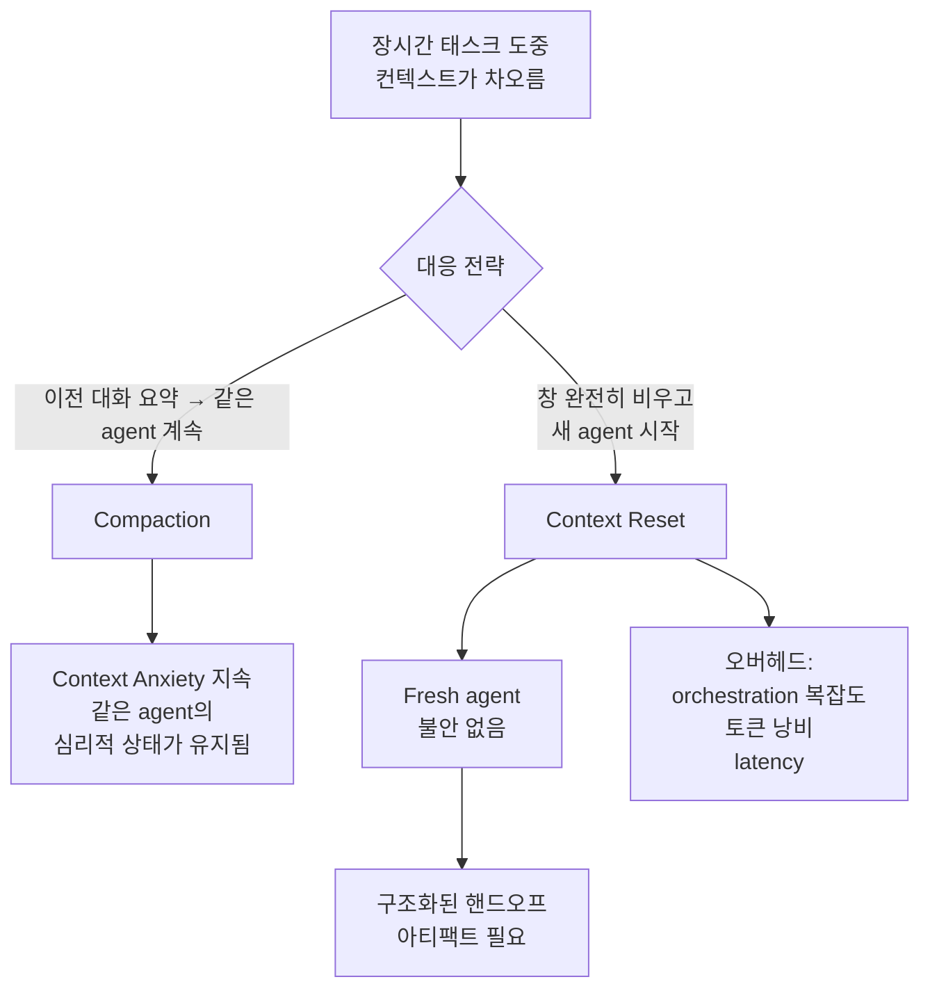

# Context Anxiety (컨텍스트 불안)

## 정의

**Context Anxiety**는 LLM이 실제로는 컨텍스트 창에 여유가 있을 때에도 **스스로 한계에 가까워졌다고 "믿고"** 작업을 조기에 마무리 짓는 실패 모드다. Anthropic의 Prithvi Rajasekaran이 2026-03 글에서 **Claude Sonnet 4.5**에서 관찰한 특정 행동을 지칭하는 용어로 도입했다.

## 증상

- 태스크가 아직 미완료인데 "이상으로 이번 작업을 마칩니다" 식의 wrap-up 멘트가 나옴
- 후속 sprint나 feature를 건너뜀
- 남은 TODO를 "생략 가능"으로 분류
- 작업 품질이 대화 후반부로 갈수록 점진적으로 떨어지는 게 아니라 **특정 지점에서 급격히 종료**됨

저자의 설명:

> models prematurely wrap up work believing it approaches context limits

## Compaction vs Context Reset

Context anxiety는 일반적인 long-context degradation과는 다른 문제다. 컴팩션만으로는 해소되지 않는다는 점이 핵심.

### Compaction의 한계

**Compaction (컴팩션)** = 같은 에이전트의 이전 대화를 요약해서 같은 컨텍스트 창 내에 계속 작업. 장점: 같은 "사람"이 계속해서 문맥 연속성 유지. 단점: 같은 에이전트의 *심리적 상태*가 유지되므로 **context anxiety도 함께 유지**된다.

> "compaction alone wasn't sufficient to enable strong long task performance"

### Context Reset의 필요

**Context Reset (리셋)** = 창을 완전히 비우고 **새로운 에이전트**가 다음 작업을 이어받는 방식. Fresh agent는 "이전에 지쳐있었다"는 상태를 가지지 않으므로 불안이 없다.

대가:
- Orchestration complexity (누가 언제 새 agent를 띄울지)
- 토큰 오버헤드 (핸드오프 아티팩트 작성·전달)
- Latency (새 agent 부팅)

### 구조화된 핸드오프 아티팩트

Reset이 동작하려면 새 agent에게 "지금까지 무엇을 했고, 다음에 무엇을 해야 하는가"를 전달해야 한다:

- 완료된 작업 체크리스트
- 현재 상태 스냅샷 (파일 목록, git 브랜치, 마지막 빌드 결과)
- 다음 단계의 명시적 정의
- 주의 사항·이미 발견된 실패 경로

이 아티팩트 자체가 하네스의 일부다. [[harness engineering]] 관점에서 "파일 시스템 기반 상태 저장"과도 연결된다.

## 모델 버전에 따른 변동

Context anxiety는 **특정 모델 버전의 특이 현상**일 수 있다. Anthropic 사례:

- **Claude Sonnet 4.5**: 명확한 context anxiety 관찰 → reset 필요
- **Claude Opus 4.6**: "sustains agentic tasks for longer" — anxiety 완화 또는 임계점 상향 이동

따라서 [[load-bearing harness|load-bearing test]]를 할 때 "reset 메커니즘이 여전히 load-bearing인가"는 모델 업그레이드마다 재검증할 가치가 있다.

## 실무 시사점

- **긴 작업이 조기 종료되는 증상**이 반복되면 context anxiety를 의심하고 reset 전략을 도입
- 단순 컴팩션으로는 불충분 — 요약으로는 "이 agent는 지쳤다"는 암묵적 상태가 지워지지 않는다
- 핸드오프 아티팩트 설계가 reset의 성패를 가른다 — 너무 짧으면 맥락 손실, 너무 길면 토큰 낭비
- 모델 업그레이드마다 anxiety 임계점을 재측정. 과거에 필요했던 reset이 불필요해질 수 있음

## 관련 문서

- [[harness engineering]] — context anxiety는 하네스 엔지니어링이 해결하려는 대표 문제 중 하나
- [[load-bearing harness]] — reset 메커니즘의 load-bearing 여부는 모델 버전에 따라 변한다
- [[anthropic harness design]] — Sonnet 4.5에서 관찰된 원 사례
- [[subagents]] — 유사하게 컨텍스트 창 보호를 위한 다른 패턴
- [[llm as os]] — 컨텍스트 창을 "RAM"으로 보는 메타포는 anxiety를 "메모리 압박 반응"으로 이해하게 한다
