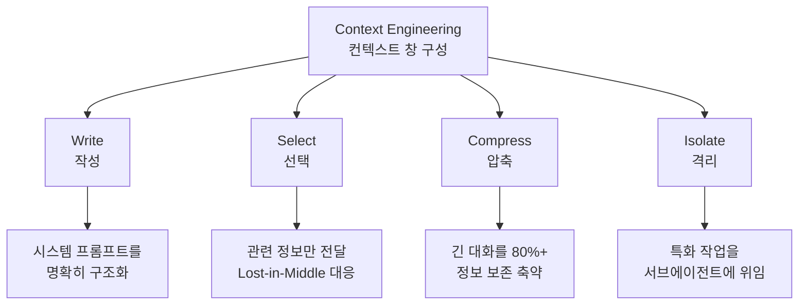

# Context Engineering (컨텍스트 엔지니어링)

## 정의

**Context Engineering**은 2025년 중반에 등장한 AI 개발 패러다임이다. 핵심 질문은 "**모델의 컨텍스트 창에 어떤 정보를 주입해야 작업이 해결될까?**"다. [[relocating rigor|엄밀함]]의 위치는 프롬프트 텍스트에서 **컨텍스트 창 구성**으로 이동했다.

## 기원: 2025년 6월 동시 발견

**2025년 6월 19일**, Shopify CEO Tobi Lütke가 "context engineering" 용어를 제안했다 — "모델이 작업을 풀 수 있도록 완전한 컨텍스트를 제공하는 것"으로 정의.

**Karpathy의 응답**: 컨텍스트 엔지니어링을 **"미묘한 기술과 과학(subtle technique and science)"** 이 요구되는 작업으로 규정. 컨텍스트 창을 정확히 필요한 정보로 채우는 일.

같은 주 안에 Andrew Ng이 동조하면서 이 용어는 업계 담론에서 "prompt engineering"을 빠르게 대체했다.

## 왜 컨텍스트로 이동했는가

[[prompt engineering]]이 벽에 부딪힌 이유는 결국 **컨텍스트 창에 관련 정보가 없으면 아무리 완벽한 프롬프트도 실패**한다는 것이었다. 프롬프트 텍스트를 다듬는 것은 문제의 표면만 만지는 것이었다.

## Anthropic의 4전략 프레임워크

컨텍스트 엔지니어링의 표준 분류:

### Write (작성)
시스템 프롬프트, 에이전트 정체성, 규칙을 명확하고 명시적으로 구조화. "무엇을 말할까"의 정제된 버전.

### Select (선택)
컨텍스트적으로 관련 있는 정보만 전달. [[lost in the middle]] 현상(Liu et al., 2023)에 대응 — 긴 컨텍스트 중간에 놓인 정보가 놓쳐지는 성능 저하.

### Compress (압축)
긴 대화나 문서를 **80% 이상의 정보를 보존**하면서 축약. 컨텍스트 창 한도 내에서 더 많은 유효 정보를 유지.

### Isolate (격리)
특화 작업을 범위가 제한된 컨텍스트를 가진 [[subagents|서브에이전트]]에 위임. 부모 컨텍스트 오염 방지.

## [[KV cache|KV 캐시]]: 프로덕션 메트릭

컨텍스트 엔지니어링의 측정 가능한 핵심 메트릭은 **KV-캐시 히트율**이다.

- 프롬프트 접두사가 이전 요청과 일치하면 재사용으로 **비용 90% 감소**
- 접두사의 **단 한 토큰이라도** 바뀌면 캐시 무효화
- 설계 규칙: **안정적 접두사** (시스템 프롬프트, 도구 정의, 장기 요약) → **가변 접미사** (사용자 입력, 새 도구 결과)

Google ADK 아키텍처가 이 원칙의 대표 구현.

## [[llm as os|LLM as OS]] 메타포

Karpathy가 제안한 멘탈 모델: LLM 시스템을 운영체제로 보는 관점.

| OS 컴포넌트 | 역할 | LLM OS 대응 |
|---|---|---|
| Kernel | 시스템 리소스 관리 | LLM 추론 엔진 |
| RAM | 작업 메모리 | **컨텍스트 창** |
| File system | 영구 저장소 | RAG / 벡터 DB |
| System calls | 하드웨어 제어 | Tool calls / APIs |
| Process management | 멀티태스킹 | 멀티 에이전트 오케스트레이션 |

**핵심 통찰**: 프롬프트는 단일 커맨드 라인 명령어에 불과하다. 실제 성능은 **RAM(컨텍스트 창)에 무엇을 채우는지**에 달렸다.

## 인프라 표준화

이 에라에서 등장한 핵심 인프라:

- **MCP (Model Context Protocol)** — Anthropic, 2024년 11월. 도구-에이전트 통신 표준화. 2025년 12월 월 9700만+ SDK 다운로드
- **Skills** — 재사용 가능한 능력 번들, lazy-load
- **Sub-agents** — 특화 에이전트가 위임 작업에 대해 범위가 제한된 컨텍스트 수신
- **Swarms** — OpenAI 패턴, 에이전트-에이전트 자율 핸드오프
- **Context Hub** — Andrew Ng, 68+ API에서 검증된 최신 문서를 에이전트 컨텍스트에 주입
- **Memory Systems** — 외부 상태(파일, git history, JSON)로 세션 간 지속성

## 여전히 불충분한 이유

컨텍스트 엔지니어링도 자기 벽에 부딪혔다. 이것이 [[harness engineering]] 에라의 기원이 된다.

1. **단일 턴 중심**: "이번 호출에 무엇을 주입할까"에 최적화되어 있어 **멀티턴 순차적 결정 체인**을 놓친다
2. **에러 복구 부재**: 비용 자각, 보상 감쇠 탐지, 서킷 브레이커 같은 메커니즘 부재
3. **보안 공백**: 완벽한 컨텍스트도 민감 데이터 시스템에 대한 **프롬프트 인젝션 공격**을 막지 못한다 (→ [[lethal trifecta]])

## 2026년 4월 핫토픽 업데이트

### Context Engineering for Long-Horizon Agents

- **정의**: 장기 실행 에이전트가 제한된 컨텍스트 윈도우에 어떤 토큰을 넣을지 의도적으로 큐레이션하는 기술.
- **왜 다시 중요해졌나**: 2025년 9월 Anthropic의 "Effective Context Engineering" 블로그 이후 프롬프트 엔지니어링을 대체하는 새로운 패러다임으로 자리잡았고, 2026년 4월 현재 ICLR 2026 ACE 논문, ACON, AgentFold 등 후속 연구가 쏟아지면서 컨텍스트 윈도우 크기 경쟁이 끝났다는 합의가 형성되고 있다.
- **대표 자료**:
- [Effective context engineering for AI agents (Anthropic)](https://www.anthropic.com/engineering/effective-context-engineering-for-ai-agents)
- [ACON: Optimizing Context Compression for Long-horizon LLM Agents](https://arxiv.org/abs/2510.00615)
- [Agentic Context Engineering: Evolving Contexts for Self-Improving Language Models (ICLR 2026)](https://arxiv.org/abs/2510.04618)

- [[ai-hot-topics-2026-04]]

## 2026년 4월 핫토픽 메모

### Context Engineering for Long-Horizon Agents

- **정의**: 장기 실행 에이전트가 제한된 컨텍스트 윈도우에 어떤 토큰을 넣을지 의도적으로 큐레이션하는 기술.
- **왜 중요한가**: 2025년 9월 Anthropic의 "Effective Context Engineering" 블로그 이후 프롬프트 엔지니어링을 대체하는 새로운 패러다임으로 자리잡았고, 2026년 4월 현재 ICLR 2026 ACE 논문, ACON, AgentFold 등 후속 연구가 쏟아지면서 컨텍스트 윈도우 크기 경쟁이 끝났다는 합의가 형성되고 있다.
- **대표 자료**:
  - [Effective context engineering for AI agents (Anthropic)](https://www.anthropic.com/engineering/effective-context-engineering-for-ai-agents)
  - [ACON: Optimizing Context Compression for Long-horizon LLM Agents](https://arxiv.org/abs/2510.00615)
  - [Agentic Context Engineering: Evolving Contexts for Self-Improving Language Models (ICLR 2026)](https://arxiv.org/abs/2510.04618)
  - [AgentFold: Long-Horizon Web Agents with Proactive Context Management](https://arxiv.org/abs/2510.24699)
  - [Context Rot: How Increasing Input Tokens Impacts LLM Performance (Chroma Research)](https://www.trychroma.com/research/context-rot)

## 2026년 4월 핫토픽 맥락

2025년 9월 Anthropic의 "Effective Context Engineering" 블로그 이후 프롬프트 엔지니어링을 대체하는 새로운 패러다임으로 자리잡았고, 2026년 4월 현재 ICLR 2026 ACE 논문, ACON, AgentFold 등 후속 연구가 쏟아지면서 컨텍스트 윈도우 크기 경쟁이 끝났다는 합의가 형성되고 있다.

### 추가 레퍼런스

- [Effective context engineering for AI agents (Anthropic)](https://www.anthropic.com/engineering/effective-context-engineering-for-ai-agents)
- [ACON: Optimizing Context Compression for Long-horizon LLM Agents](https://arxiv.org/abs/2510.00615)
- [Agentic Context Engineering: Evolving Contexts for Self-Improving Language Models (ICLR 2026)](https://arxiv.org/abs/2510.04618)
- [AgentFold: Long-Horizon Web Agents with Proactive Context Management](https://arxiv.org/abs/2510.24699)
- [Context Rot: How Increasing Input Tokens Impacts LLM Performance (Chroma Research)](https://www.trychroma.com/research/context-rot)

## 관련 문서

- [[evolution of agentic patterns]] — 3 에라 연대기에서 Era 2
- [[prompt engineering]] — 선행 에라
- [[harness engineering]] — 후속 에라
- [[llm as os]] — Karpathy OS 메타포
- [[KV cache]] — 프로덕션 최적화 메트릭
- [[subagents]] — Isolate 전략 구현
- [[lethal trifecta]] — 컨텍스트 엔지니어링이 풀지 못한 보안 문제
- [[relocating rigor]] — 엄밀함 이동 메타 원칙
