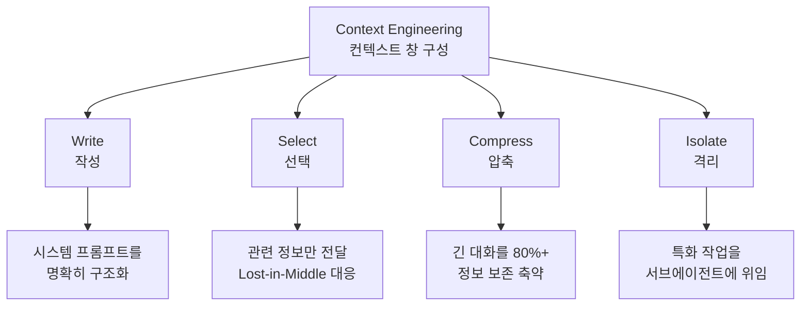
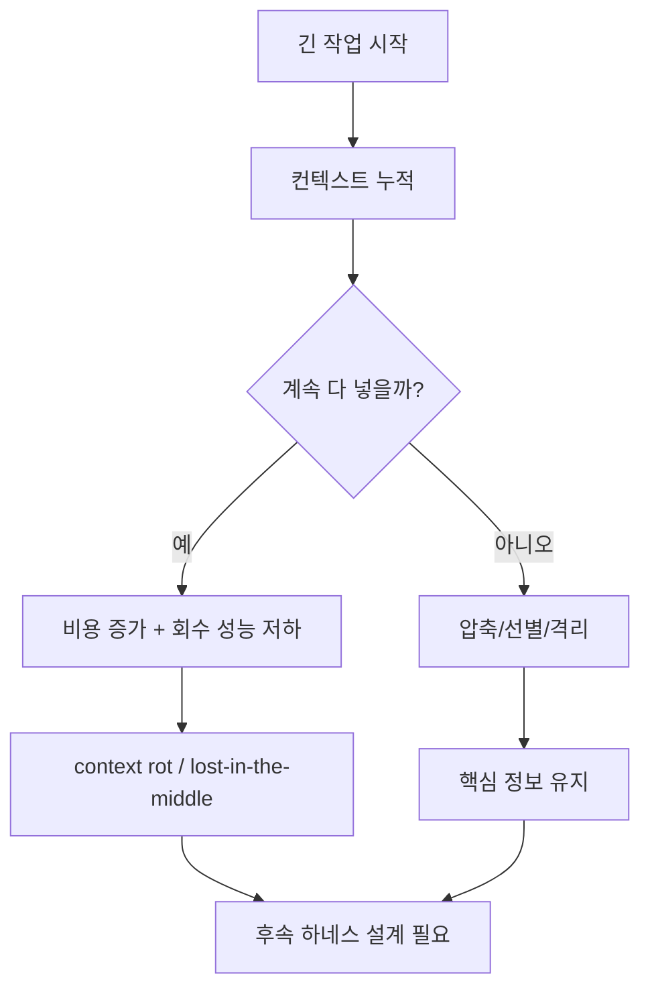

# Context Engineering (컨텍스트 엔지니어링)

## 정의

**Context Engineering**은 2025년 중반에 등장한 AI 개발 패러다임이다. 핵심 질문은 "**모델의 컨텍스트 창에 어떤 정보를 주입해야 작업이 해결될까?**"다. [[relocating rigor|엄밀함]]의 위치는 프롬프트 텍스트에서 **컨텍스트 창 구성**으로 이동했다.

## 기원: 2025년 6월 동시 발견

**2025년 6월 19일**, Shopify CEO Tobi Lütke가 "context engineering" 용어를 제안했다 — "모델이 작업을 풀 수 있도록 완전한 컨텍스트를 제공하는 것"으로 정의.

**Karpathy의 응답**: 컨텍스트 엔지니어링을 **"미묘한 기술과 과학(subtle technique and science)"** 이 요구되는 작업으로 규정. 컨텍스트 창을 정확히 필요한 정보로 채우는 일.

같은 주 안에 Andrew Ng이 동조하면서 이 용어는 업계 담론에서 "prompt engineering"을 빠르게 대체했다.

## 왜 컨텍스트로 이동했는가

[[prompt engineering]]이 벽에 부딪힌 이유는 결국 **컨텍스트 창에 관련 정보가 없으면 아무리 완벽한 프롬프트도 실패**한다는 것이었다. 프롬프트 텍스트를 다듬는 것은 문제의 표면만 만지는 것이었다.

## Anthropic의 4전략 프레임워크

컨텍스트 엔지니어링의 표준 분류:

### Write (작성)
시스템 프롬프트, 에이전트 정체성, 규칙을 명확하고 명시적으로 구조화. "무엇을 말할까"의 정제된 버전.

### Select (선택)
컨텍스트적으로 관련 있는 정보만 전달. [[lost in the middle]] 현상(Liu et al., 2023)에 대응 — 긴 컨텍스트 중간에 놓인 정보가 놓쳐지는 성능 저하.

### Compress (압축)
긴 대화나 문서를 **80% 이상의 정보를 보존**하면서 축약. 컨텍스트 창 한도 내에서 더 많은 유효 정보를 유지.

### Isolate (격리)
특화 작업을 범위가 제한된 컨텍스트를 가진 [[subagents|서브에이전트]]에 위임. 부모 컨텍스트 오염 방지.

## [[KV cache|KV 캐시]]: 프로덕션 메트릭

컨텍스트 엔지니어링의 측정 가능한 핵심 메트릭은 **KV-캐시 히트율**이다.

- 프롬프트 접두사가 이전 요청과 일치하면 재사용으로 **비용 90% 감소**
- 접두사의 **단 한 토큰이라도** 바뀌면 캐시 무효화
- 설계 규칙: **안정적 접두사** (시스템 프롬프트, 도구 정의, 장기 요약) → **가변 접미사** (사용자 입력, 새 도구 결과)

Google ADK 아키텍처가 이 원칙의 대표 구현.

## [[llm as os|LLM as OS]] 메타포

Karpathy가 제안한 멘탈 모델: LLM 시스템을 운영체제로 보는 관점.

| OS 컴포넌트 | 역할 | LLM OS 대응 |
|---|---|---|
| Kernel | 시스템 리소스 관리 | LLM 추론 엔진 |
| RAM | 작업 메모리 | **컨텍스트 창** |
| File system | 영구 저장소 | RAG / 벡터 DB |
| System calls | 하드웨어 제어 | Tool calls / APIs |
| Process management | 멀티태스킹 | 멀티 에이전트 오케스트레이션 |

**핵심 통찰**: 프롬프트는 단일 커맨드 라인 명령어에 불과하다. 실제 성능은 **RAM(컨텍스트 창)에 무엇을 채우는지**에 달렸다.

## 인프라 표준화

이 에라에서 등장한 핵심 인프라:

- **MCP (Model Context Protocol)** — Anthropic, 2024년 11월. 도구-에이전트 통신 표준화. 2025년 12월 월 9700만+ SDK 다운로드
- **Skills** — 재사용 가능한 능력 번들, lazy-load
- **Sub-agents** — 특화 에이전트가 위임 작업에 대해 범위가 제한된 컨텍스트 수신
- **Swarms** — OpenAI 패턴, 에이전트-에이전트 자율 핸드오프
- **Context Hub** — Andrew Ng, 68+ API에서 검증된 최신 문서를 에이전트 컨텍스트에 주입
- **Memory Systems** — 외부 상태(파일, git history, JSON)로 세션 간 지속성

## 무엇을 설계하는가

| 질문 | context engineering의 초점 |
|---|---|
| 무엇을 넣을까? | 현재 턴에서 정말 필요한 정보만 선택 |
| 어디에 둘까? | 접두사/접미사, 고정/가변 위치 설계 |
| 언제 줄일까? | 압축, 요약, 서브태스크 격리 시점 결정 |
| 무엇을 밖으로 뺄까? | 파일, RAG, 메모리, 도구 호출 결과로 외부화 |

이 표를 보면 context engineering은 단순 프롬프트 작성이 아니라 **정보 배치와 예산 관리**에 더 가깝다는 점이 드러난다.

## 여전히 불충분한 이유

컨텍스트 엔지니어링도 자기 벽에 부딪혔다. 이것이 [[harness engineering]] 에라의 기원이 된다.

1. **단일 턴 중심**: "이번 호출에 무엇을 주입할까"에 최적화되어 있어 **멀티턴 순차적 결정 체인**을 놓친다
2. **에러 복구 부재**: 비용 자각, 보상 감쇠 탐지, 서킷 브레이커 같은 메커니즘 부재
3. **보안 공백**: 완벽한 컨텍스트도 민감 데이터 시스템에 대한 **프롬프트 인젝션 공격**을 막지 못한다 (→ [[lethal trifecta]])

## 실패 패턴 요약

이 다이어그램은 context engineering의 목적이 “길이를 늘리는 것”이 아니라, **길어질 때 어떤 방식으로 실패를 관리할 것인가**에 있음을 보여준다.

## 해석 포인트

Context Engineering (컨텍스트 엔지니어링)은 **성능만이 아니라 운영 설계까지 함께 봐야 하는 축** 으로 이해할 때 가장 명확하다. 이번 source 묶음이 `arxiv.org×3, anthropic.com×1, trychroma.com×1`처럼 분산돼 있다는 것은, 이 주제가 단일 주장보다 여러 층위의 검증을 거치고 있다는 뜻이다.

실무적으로는 개념 정의 자체보다 **어떤 병목을 해결하고 어떤 비용을 새로 만들까**를 묻는 편이 유익하다. 그래서 이 토픽은 통합 난이도, 관측 가능성, 운영 비용, 교체 가능성를 기준으로 비교·실험하는 식으로 다루는 것이 좋다.

## 2026년 4월 큐레이션 요약

- 정의: 장기 실행 에이전트가 제한된 컨텍스트 윈도우에 어떤 토큰을 넣을지 의도적으로 큐레이션하는 기술.
- 왜 중요한가: 2025년 9월 Anthropic의 "Effective Context Engineering" 블로그 이후 프롬프트 엔지니어링을 대체하는 새로운 패러다임으로 자리잡았고, 2026년 4월 현재 ICLR 2026 ACE 논문, ACON, AgentFold 등 후속 연구가 쏟아지면서 컨텍스트 윈도우 크기 경쟁이 끝났다는 합의가 형성되고 있다.
- 직접 수집 원문: 5개
- 주요 도메인: arxiv.org×3, anthropic.com×1, trychroma.com×1

## 핵심 메커니즘

장기 실행 에이전트가 제한된 컨텍스트 윈도우에 어떤 토큰을 넣을지 의도적으로 큐레이션하는 기술. 이 개념은 단일 문장 정의보다 **어떤 failure mode를 설명하는지, 어떤 구조적 trade-off를 드러내는지**를 함께 볼 때 가치가 커진다.

## 핵심 포인트

Context Engineering (컨텍스트 엔지니어링)는 현재 시점의 핵심 개념을 정리한 페이지다. 출발점은 이며, 직접 수집한 source 5건은 이 개념이 연구·문서·구현으로 어떻게 확장되는지 보여준다.

## source로 보면

수집된 source는 arxiv.org×3, anthropic.com×1, trychroma.com×1로 분포한다. 연구 논문과 공식 문서가 함께 있어 원리와 제품화 흐름을 같이 읽을 수 있다.

## 실무 관점

개념 페이지는 용어 정의에서 끝나지 않고, 어떤 시스템 설계 문제를 해결하려고 등장했는지와 어디까지가 적용 범위인지까지 함께 봐야 한다.

## source 기반 참고

- topic packet: `raw/hot-topics-sources/2026-04-10/topics/context-engineering.md`

### source별 핵심 신호

- **Effective context engineering for AI agents \ Anthropic** (`anthropic.com`): https://www.anthropic.com/engineering/effective-context-engineering-for-ai-agents
  - 메모: Effective context engineering for AI agents
- **[2510.00615] ACON: Optimizing Context Compression for Long-horizon LLM Agents** (`arxiv.org`): https://arxiv.org/abs/2510.00615
  - 메모: Large language models (LLMs) are increasingly deployed as agents in dynamic, real-world environments, where success requires both reasoning and effective tool use.
- **[2510.04618] Agentic Context Engineering: Evolving Contexts for Self-Improving Language Models** (`arxiv.org`): https://arxiv.org/abs/2510.04618
  - 메모: Large language model (LLM) applications such as agents and domain-specific reasoning increasingly rely on context adaptation: modifying inputs with instructions, strategies, or evidence, rather than weight updates.
- **[2510.24699] AgentFold: Long-Horizon Web Agents with Proactive Context Management** (`arxiv.org`): https://arxiv.org/abs/2510.24699
  - 메모: LLM-based web agents show immense promise for information seeking, yet their effectiveness on long-horizon tasks is hindered by a fundamental trade-off in context management.
- **Context Rot: How Increasing Input Tokens Impacts LLM Performance·|·Chroma** (`trychroma.com`): https://www.trychroma.com/research/context-rot
  - 메모: Context Rot: How Increasing Input Tokens Impacts LLM Performance

## source 종합 해석

이 개념의 핵심은 `Context Engineering은 2025년 중반에 등장한 AI 개발 패러다임이다. 핵심 질문은 "모델의 컨텍스트 창에 어떤 정보를 주입해야 작업이 해결될까?"다. 엄밀함의 위치는 프롬프트 텍스트에서 컨텍스트 창 구성으로 이동했다.`에 있지만, 실제 의미는 원문 source들이 어떤 병목·trade-off를 반복적으로 강조하는지에서 더 또렷해진다.

예를 들어 source note는 Effective context engineering for AI agents

또 다른 source는 Large language models (LLMs) are increasingly deployed as agents in dynamic, real-world environments, where success requires both reasoning and effective tool use.

함께 읽을 문서로는 evolution of agentic patterns, prompt engineering, harness engineering가 유용하다. 이 페이지가 다루는 주제의 인접 개념·구현·평가 층위를 보강해 준다.

## 실무 체크리스트

- 이 문서를 읽을 때는 이름보다 **어떤 병목을 해결하고 어떤 비용을 새로 만드는지**를 먼저 본다.
- `Context Engineering은 2025년 중반에 등장한 AI 개발 패러다임이다. 핵심 질문은 "모델의 컨텍스트 창에 어떤 정보를 주입해야 작업이 해결될까?"다. 엄밀함의 위치는 프롬프트 텍스트에서 컨텍스트 창 구성으로 이동했다.`를 실제로 적용할 때는 정의 자체보다 측정 지표와 실패 모드가 무엇인지 같이 봐야 한다.
- source note가 추상 개념/실험 결과/운영 사례 중 어디에 치우쳐 있는지 보면, 이 토픽을 실무에서 어떻게 다뤄야 하는지가 드러난다.

## 관련 문서

- [[evolution of agentic patterns]] — 3 에라 연대기에서 Era 2
- [[prompt engineering]] — 선행 에라
- [[harness engineering]] — 후속 에라
- [[llm as os]] — Karpathy OS 메타포
- [[KV cache]] — 프로덕션 최적화 메트릭
- [[subagents]] — Isolate 전략 구현
- [[lethal trifecta]] — 컨텍스트 엔지니어링이 풀지 못한 보안 문제
- [[relocating rigor]] — 엄밀함 이동 메타 원칙
