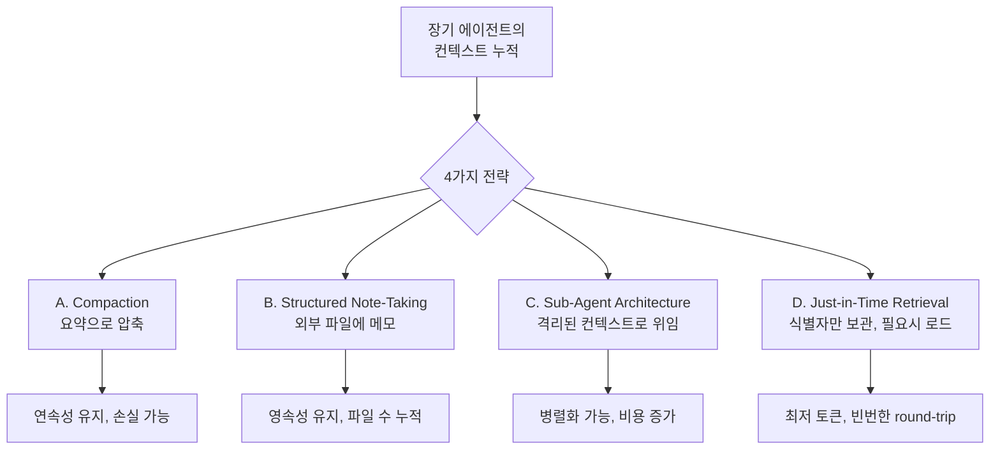
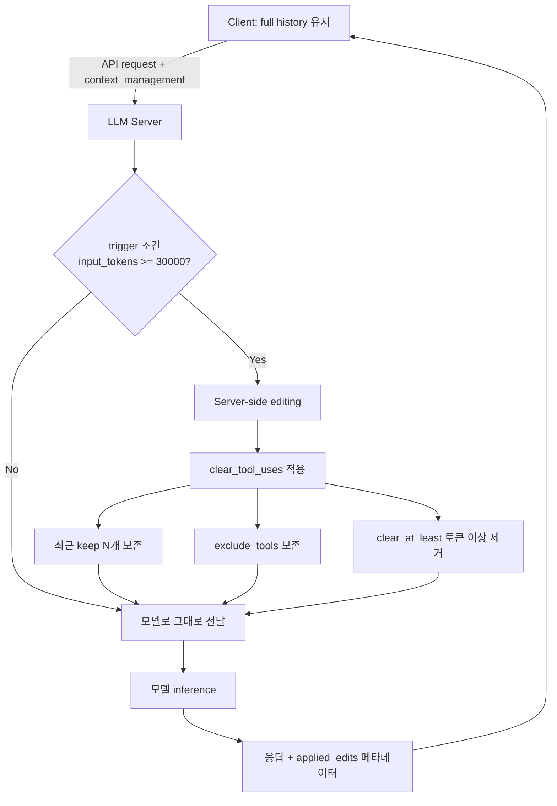
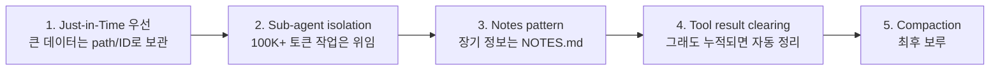

# Context Window Management

장시간 실행되는 LLM 에이전트에서 **컨텍스트 윈도우는 유한 자원**이다. 단순히 윈도우 크기 한도를 채우기 전까지만 사용하면 된다는 관점에서 출발했지만, 2025년 이후 **context rot** 현상과 attention budget 이론이 등장하면서 적극적인 컨텍스트 큐레이션이 표준이 됐다.

> 기존 [[agent-context-management]], [[context-folding]], [[long-context]] 와 차별화 — 이 페이지는 context rot 이론, server-side context editing API, 그리고 4가지 context engineering 전략(compaction / structured note-taking / sub-agent / just-in-time retrieval)에 초점을 맞춘다.

## 1. Context Rot 현상

### 정의

> "Context rot is the concept that as the number of tokens in the context window increases, the model's ability to accurately recall information from that context decreases."

컨텍스트 윈도우가 가득 차지 않더라도, 토큰이 많아질수록 정보 회상 정확도가 하락하는 현상.

### 근본 원인: Attention Budget

> "LLMs have an 'attention budget' that they draw on when parsing large volumes of context, and every new token introduced depletes this budget by some amount."

Transformer는 모든 토큰이 다른 모든 토큰을 attention하므로 n² pairwise relationship을 형성한다. 컨텍스트가 길어질수록 이 관계 포착 능력이 stretched thin해지며, 단순한 "lost in the middle" 보다 더 세밀한 정확도 저하가 발생한다.

### 처방 원칙

> "Context as a precious, finite resource with diminishing marginal returns."
> "Pursue the smallest possible set of high-signal tokens that maximize the likelihood of some desired outcome."

→ 컨텍스트는 capacity가 아니라 **signal-to-noise ratio**의 문제다.

## 2. Context Engineering 4축



### A. Compaction (요약 압축)

대화가 컨텍스트 한계에 가까워지면 이전 turn을 요약해 새 prefix로 대체. 동일 에이전트가 계속 진행 가능.

> "Maximizing recall to ensure your compaction prompt captures every relevant piece of information, then improving precision."

단점: [[context-anxiety|Context Anxiety]]가 잔존할 수 있다 (clean slate가 아님). 일부 모델은 자동 context compaction을 제공.

### B. Structured Note-Taking

NOTES.md, TODO 파일 등 외부 파일에 메모를 적어 working context를 절약.

> "Persistent external memory through regular note-writing (like NOTES.md files or to-do lists)."

장점: 세션을 넘어선 영속성. 단점: 파일 수가 누적되면 read 비용 증가, 일관성 관리 필요.

### C. Sub-Agent Architecture

서브 에이전트가 isolated context에서 작업 후 condensed summary만 반환.

> "Specialized sub-agents handle focused tasks, returning condensed summaries (typically 1,000-2,000 tokens) to the main coordinator."

→ [[subagent-spawning|서브에이전트 spawning]] 의 핵심 동기. [[orchestrator-worker-pattern|오케스트레이터-워커 패턴]]과 결합한다.

### D. Just-in-Time Retrieval

데이터 자체가 아니라 식별자(path/URL/ID)만 유지하고 필요할 때 tool로 로드.

> "Maintain lightweight identifiers (file paths, stored queries, web links, etc.) and use these references to dynamically load data into context at runtime using tools."

[[rag|RAG]]와 유사하지만 검색이 아닌 **인덱스 기반 정확 로드**가 핵심. 100K+ 문서 컬렉션을 다룰 때 필수.

## 3. Server-Side Context Editing API

### 두 가지 strategy

| Strategy | 대상 | 의미 |
|----------|------|------|
| `clear_tool_uses_*` | tool_use/tool_result 블록 | 오래된 도구 사용 자동 삭제 |
| `clear_thinking_*` | extended thinking 블록 | 추론 흔적 정리 |

### 동작 메커니즘

> "When activated, the API automatically clears the oldest tool results in chronological order. The API replaces each cleared result with placeholder text so Claude knows it was removed."

오래된 것부터 chronological 순서로 제거하며, placeholder로 대체. 클라이언트는 full conversation history를 그대로 유지하고, 서버 측에서 prompt가 모델에 도달하기 전 적용된다.

### 주요 파라미터

| 파라미터 | 타입 | 의미 |
|----------|------|------|
| `trigger` | `{type: "input_tokens", value: N}` | input token이 N을 넘으면 발동 |
| `keep` | `{type: "tool_uses", value: N}` | 가장 최근 N개 tool_use는 보존 |
| `clear_at_least` | `{type: "input_tokens", value: N}` | 발동 시 최소 N 토큰만큼 비움 |
| `exclude_tools` | `[string]` | 이 도구의 결과는 보존 |
| `clear_tool_inputs` | `bool` | true면 tool input(arguments)까지 함께 clear (기본 false) |

```python
context_management={
    "edits": [
        {
            "type": "clear_tool_uses_20250919",
            "trigger": {"type": "input_tokens", "value": 30000},
            "keep": {"type": "tool_uses", "value": 3},
            "clear_at_least": {"type": "input_tokens", "value": 5000},
            "exclude_tools": ["web_search"],
        }
    ]
}
```

## 4. Thinking Block 처리

`clear_thinking_20251015` strategy는 extended thinking이 활성화된 대화에서 thinking block 보존을 제어한다. 모델 세대별 default 동작 차이는 Anthropic 공식 문서(`platform.claude.com/docs/en/build-with-claude/extended-thinking`)에 다음과 같이 명시되어 있다.

| 세대 | 기본 보존 정책 |
|------|----------------|
| Opus 4.5 이상 | 이전 assistant turn의 모든 thinking block 보존 (4.5에서 도입된 새 기본 동작) |
| Opus 4.1 이하 | 마지막 assistant turn의 thinking만 보존 |
| Sonnet 4.6 이상 | 모든 thinking block 보존 |
| Sonnet 4.5 이하 | 마지막 turn만 보존 |
| 모든 Haiku (4.5 포함) | 마지막 turn만 보존 |

→ 멀티 모델 코드는 `keep` 파라미터를 명시 설정해 default 의존을 피해야 한다 (Anthropic 공식 권고). Context editing은 베타 헤더 `context-management-2025-06-27`로 활성화된다.

## 5. Prompt Caching과 상호작용

[[prompt-caching-strategies|프롬프트 캐싱]]과 함께 쓸 때 가장 중요한 트레이드오프:

> "Invalidates cached prompt prefixes when content is cleared. To account for this, clear enough tokens to make the cache invalidation worthwhile. Use the `clear_at_least` parameter."

clearing이 일어나면 cache prefix가 무효화되어 cache write cost가 발생. `clear_at_least`로 충분히 비워서 cache invalidation cost를 회수해야 한다.



## 6. 운영 워크플로우



## 7. 엔터프라이즈 운영 관점

### Cache + Edit 조합 비용 모델
- 매 clearing 시점에 cache write cost 1회 발생
- 이후 stable한 prefix는 cache hit으로 90% 비용 절감
- 따라서 `clear_at_least`를 충분히 크게 설정 (예: 5,000~10,000 tokens)해서 자주 invalidate되지 않도록 함

### 모니터링 지표
- `applied_edits` 메타데이터로 실제 trigger 빈도 추적
- cache hit rate (`cache_read_input_tokens / total_input`) 70-90% 유지가 목표
- input_tokens 증가율로 long-tail 작업 식별

## Anti-pattern

- `clear_at_least`를 너무 작게 설정 → 매 turn마다 cache invalidate 반복
- `keep`을 0으로 → 직전 도구 결과까지 사라져 모델이 직전 행동을 잊음
- Thinking block을 모두 clear → reasoning chain 단절, 정확도 하락
- Compaction만 사용하면서 long task 진행 → context anxiety 누적

## 관련 문서

- [[agent-context-management]] — 일반 컨텍스트 관리 전략
- [[context-folding]] — sub-trajectory 압축
- [[context-anxiety]] — compaction의 한계
- [[prompt-caching-strategies]] — 캐시와의 상호작용
- [[subagent-spawning]] — sub-agent isolation
- [[long-horizon-agent-loop]] — long-horizon 작업과 reset
- [[long-context]] — 긴 컨텍스트 일반론
- [[rag]] — just-in-time retrieval과의 관계
