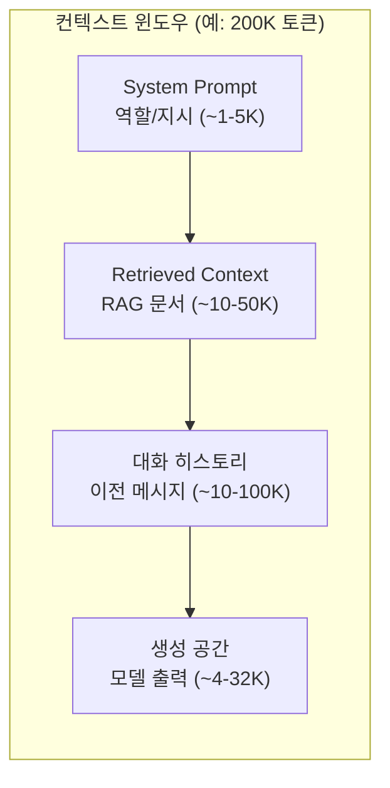

# 컨텍스트 윈도우 (Context Window)

## 개요

**컨텍스트 윈도우(context window)**는 LLM이 한 번의 추론(inference)에서 처리할 수 있는 최대 토큰(token) 수다. 입력 프롬프트와 모델이 생성하는 출력 토큰을 합산한 값이 이 한계를 초과하면 오류가 발생하거나 앞부분 내용이 잘린다.

컨텍스트 윈도우는 단순한 기술적 제약을 넘어, LLM 기반 시스템의 아키텍처 설계 전반을 규정하는 핵심 변수다.

## 컨텍스트 윈도우의 구성



실제 사용 가능한 토큰 수는 `max_context - max_output_tokens`다. 출력 토큰 예산을 넉넉히 확보하려면 입력을 그만큼 줄여야 한다.

## 진화: 컨텍스트 길이의 급성장

| 모델 | 출시 시점 | 컨텍스트 윈도우 |
|------|-----------|----------------|
| GPT-3 | 2020 | 4,096 tokens |
| GPT-3.5-turbo | 2023 초 | 4,096 tokens |
| GPT-4 | 2023 초 | 8,192 / 32K tokens |
| Claude 2 | 2023 | 100K tokens |
| GPT-4-turbo | 2023 말 | 128K tokens |
| Claude 3 | 2024 | 200K tokens |
| Gemini 1.5 Pro | 2024 | 1,000K (1M) tokens |
| Claude Opus 4.6 | 2025 | 1,000K (1M) tokens |

2년 사이 컨텍스트 길이가 250배 이상 확장됐다. 그러나 공칭(nominal) 수치와 실제 성능 사이에는 중요한 차이가 있다.

## 유효 컨텍스트 vs 공칭 컨텍스트

### Lost in the Middle 현상

128K 컨텍스트를 지원한다고 해서 128K 내의 모든 정보를 동등하게 활용하는 것은 아니다. **"Lost in the Middle"** 현상은 모델이 컨텍스트의 앞부분과 뒷부분 정보는 잘 회수하지만, **중간 정보는 회수 성능이 저하**된다는 실험적 관찰이다.

- 실무 영향: 중요한 정보는 컨텍스트의 처음 또는 끝에 배치
- RAG 파이프라인에서 가장 관련도 높은 문서를 앞/뒤에 배치하는 전략 채택

### Context Anxiety (컨텍스트 불안)

**Context Anxiety**는 모델이 컨텍스트 한계에 가까워졌다는 신호를 받으면 실제 한계에 도달하기 전에 조기 마무리, 불완전한 응답, 갑작스러운 종료 등을 보이는 현상이다.

- 원인: 학습 시 컨텍스트 길이 분포의 편향 또는 특정 토큰 위치에서의 성능 저하
- 대응: 작업 범위를 명시적으로 제한하거나 컨텍스트를 청크(chunk)로 분할

## 컨텍스트 관리 전략

### 1. RAG (Retrieval-Augmented Generation)

전체 지식 베이스를 컨텍스트에 넣는 대신, 쿼리와 관련된 청크만 검색해서 주입한다. 컨텍스트 소비를 수십~수백 배 줄이는 가장 범용적인 전략.

### 2. 요약 및 압축

긴 대화 히스토리나 문서를 LLM이 요약해 압축한다. 정보 손실 위험이 있으나 필수 맥락을 유지하면서 토큰을 절감한다. [[adaptive-context-compression]] 참고.

### 3. 슬라이딩 윈도우 (Sliding Window)

오래된 메시지를 순차적으로 제거하고 최근 N턴의 대화만 유지한다. 장기 대화 에이전트에서 흔히 사용된다.

### 4. Context Folding

구조화된 방식으로 대화 히스토리를 접어(fold) 요약 레이어를 만들어 계층적으로 관리한다. [[context-folding]] 참고.

### 5. Prompt Caching

반복되는 시스템 프롬프트나 문서 청크를 캐싱해 재계산 비용을 절감한다. Anthropic API의 `cache_control` 파라미터로 구현 가능. [[prompt-caching-agentic]] 참고.

## 비용 함의

컨텍스트 윈도우와 비용은 직결된다. 대부분의 LLM API는 **입력 토큰 수에 비례해 과금**한다.

- 입력 토큰 단가: 출력 토큰 대비 일반적으로 3-5배 저렴
- 그러나 긴 컨텍스트를 반복 사용하면 비용이 누적됨
- **Prompt Caching**: 반복되는 접두사(prefix)는 첫 요청에만 전체 처리, 이후는 캐시에서 읽어 비용 대폭 절감

```
# 예시: 100K 토큰 시스템 프롬프트를 1,000회 요청
# 캐싱 없음: 100K x 1,000 = 1억 토큰 과금
# 캐싱 있음: 첫 요청만 100K, 이후 캐시 토큰 단가로 과금 (~90% 절감)
```

## 설계 시 고려사항

- **공칭 한계를 맹신하지 말 것**: recall-at-position 벤치마크로 실제 유효 범위 확인
- **청크 크기 설계**: RAG 청크는 컨텍스트 예산의 10-20%를 넘지 않도록
- **우선순위 배치**: 가장 중요한 정보를 컨텍스트 앞이나 뒤에 배치
- **모니터링**: 프로덕션에서 평균 컨텍스트 사용률 추적, 95 percentile이 한계에 근접하면 압축 전략 도입

## 관련 문서

- [[context-engineering]]
- [[context-rot]]
- [[context-anxiety]]
- [[lost-in-the-middle]]
- [[adaptive-context-compression]]
- [[prompt-caching-agentic]]
- [[context-folding]]
