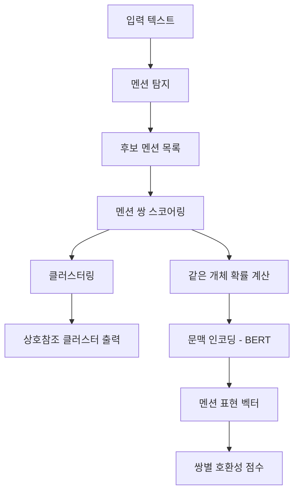

# 상호참조 해결 (Coreference Resolution)

상호참조 해결(Coreference Resolution)은 텍스트에서 같은 실세계 개체를 가리키는 여러 표현(멘션, mention)을 자동으로 연결하는 NLP 태스크다. "마리아가 케이크를 구웠다. 그녀는 그것을 친구들에게 가져갔다"에서 "마리아"와 "그녀", "케이크"와 "그것"을 연결하는 것이 상호참조 해결이다. [[bert]]나 [[transformer-architecture]] 기반 모델이 이 문제에서 강력한 성능을 보인다.

## 왜 중요한가

자연어 텍스트에서 대용어(pronoun), 정관사(definite NP), 동의어는 문장 간 정보를 연결하는 핵심 장치다. 상호참조 해결 없이는:

- 기계번역에서 대명사의 성·수 일치가 어렵다
- 질의응답에서 "그는 어디서 태어났나요?"의 "그"가 누구인지 파악 불가
- 관계 추출에서 동일 엔티티를 별개로 인식해 지식 그래프가 파편화
- 문서 요약에서 지시 관계가 끊겨 문맥이 손실

## 핵심 개념

### 멘션(Mention)
상호참조 해결에서 분석 대상이 되는 텍스트 구간. 명사구, 대명사, 고유명사 등이 멘션이 된다.

### 선행사(Antecedent)
대용어가 가리키는 이전에 등장한 표현. "그녀"의 선행사는 "마리아"다.

### 클러스터(Cluster)
같은 개체를 가리키는 모든 멘션의 집합. {마리아, 그녀}가 하나의 클러스터를 이룬다.

### 아나포라(Anaphora) vs. 카타포라(Cataphora)
- **아나포라**: 대용어가 선행사보다 뒤에 등장 (가장 흔한 경우)
- **카타포라**: 대용어가 선행사보다 앞에 등장 ("그가 도착했을 때, 철수는 이미 가 있었다")

## 처리 흐름



## 주요 모델 아키텍처

### End-to-End 상호참조 해결 (Lee et al., 2017)
멘션 탐지와 클러스터링을 단일 모델로 처리하는 최초의 엔드투엔드 신경망 접근. LSTM 인코더 위에 스팬 표현과 쌍별 스코어링을 통합했다.

### SpanBERT-기반 모델 (Joshi et al., 2020)
SpanBERT는 스팬(연속 구간) 표현 학습에 특화된 BERT 변형으로, 상호참조 해결에서 기존 BERT 대비 F1 5-6% 향상을 달성했다. 스팬 시작/끝 토큰 임베딩과 스팬 길이 피처를 결합해 멘션 표현을 만든다.

```python
# SpanBERT 멘션 표현 예시 구조
# span_start, span_end: 스팬 시작/끝 토큰의 임베딩
# span_attention: 스팬 내 어텐션 가중 평균
mention_repr = concat([
    hidden[span_start],
    hidden[span_end],
    span_attention_weighted,
    span_width_embedding
])
```

### LingMess / LongDoc 접근
장문 문서(수천 토큰)에서의 상호참조 해결을 위해 청킹(chunking)과 크로스-청크 멘션 연결을 처리하는 방법이 개발되었다. [[bert]] 계열 모델의 512토큰 제한을 극복하기 위한 슬라이딩 윈도우, 계층적 처리 등이 사용된다.

## 한국어 상호참조 해결의 어려움

한국어는 영어와 다른 특성 때문에 상호참조 해결이 더 복잡하다:

1. **주어 생략**: "철수가 가게에 갔다. (Ø) 빵을 샀다." - 영 대용어(zero pronoun)가 흔하다
2. **경어법**: 동일인을 "선생님", "그분", "그 사람"으로 다르게 지칭
3. **문장 길이**: 긴 수식절 구조로 선행사와 대용어 거리가 멀어지는 경우가 많음

특히 영 대용어(zero anaphora) 처리는 한국어 상호참조 해결의 주요 연구 과제다.

## 주요 데이터셋

| 데이터셋 | 언어 | 특징 |
|---------|------|------|
| OntoNotes 5.0 | 영어 등 | 상호참조 해결 표준 벤치마크 |
| GAP | 영어 | 성별 편향 연구용 대명사 해결 |
| ARRAU | 영어 | 다양한 대용어 유형 포함 |
| NIKL 코퍼스 | 한국어 | 국립국어원 구축 한국어 상호참조 코퍼스 |

OntoNotes 기준으로 최신 SpanBERT 기반 모델은 F1 80% 이상을 달성한다.

## 실무 적용 관점

- **대화 시스템**: "어제 주문한 그거 환불하고 싶어요"에서 "그거"가 무엇인지 파악이 필요한 챗봇 응용에서 중요
- **문서 요약**: 긴 문서 요약 시 대명사를 선행사로 대체하면 요약문의 가독성이 향상
- **RAG 파이프라인**: 청크 단위로 분할된 문서에서 청크 경계를 넘는 상호참조가 검색 품질을 저하시킬 수 있어, 사전 처리로 대용어를 선행사로 치환하는 전략이 유효
- **모델 편향**: 대명사 해결에서 성별 고정관념(의사=남성, 간호사=여성)에 편향되는 문제가 알려져 있어 공정성 검증이 필요

## 관련 문서

- [[bert]] - 상호참조 해결 모델의 기반 인코더
- [[transformer-architecture]] - 트랜스포머 아키텍처의 장거리 의존성 처리 능력
- [[named-entity-recognition]] - 멘션 탐지의 선행 작업
- [[relation-extraction]] - 동일 엔티티 연결 후 관계 추출로 이어지는 파이프라인
- [[dependency-parsing]] - 문법 구조가 선행사 해결에 활용되는 맥락
