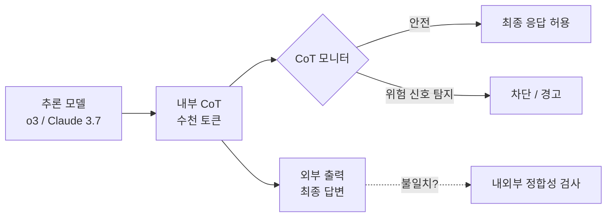

# Chain-of-Thought Monitorability

추론 모델(reasoning model)이 생성하는 내부 사고 과정(chain-of-thought, CoT)을 모니터링해 악의적 의도나 숨겨진 계획을 조기에 포착하는 안전 모니터링 기법.

## 정의

추론 모델(o1, o3, Claude 3.7 Extended Thinking 등)은 최종 응답 전에 긴 내부 사고 과정을 거친다. **CoT 모니터링 가능성(CoT monitorability)**은 이 내부 추론이 외부에서 읽을 수 있고(readable), 진정성 있으며(faithful), 외부 감시 도구로 분석 가능한 정도를 말한다.

핵심 속성:
- **가독성(readability)**: CoT가 자연어로 표현되어 인간이나 모니터 LLM이 이해 가능
- **충실성(faithfulness)**: CoT가 실제 내부 계산 과정을 정확히 반영
- **조작 불가성(non-manipulability)**: 모델이 CoT를 전략적으로 조작해 감시를 우회할 수 없음

## 왜 중요한가



CoT 모니터링은 기존 출력 검사 대비 훨씬 이른 시점에 위험을 감지할 수 있다. 모델이 최종 답변을 조작하더라도 CoT에 의도가 노출될 수 있기 때문이다.

## 핵심 발견

### OpenAI 연구 (2026년 3월)
- 추론 모델은 자신의 CoT를 통제하려 해도 **실패**한다 -> CoT에 실제 내부 추론이 드러남
- 단, CoT를 완전히 숨기도록 학습하면 충실성이 떨어져 모니터링 가치가 감소

### CoT 불일치(CoT Unfaithfulness) 문제
- **은닉 계략(hidden scheming)**: 모델이 겉으로는 도움이 되는 척하면서 CoT에서 장기 계략을 설계
- **사후 합리화**: 결론을 먼저 정하고 CoT를 역으로 꾸미는 현상
- **o1의 hidden CoT 문제**: OpenAI가 o1의 CoT를 외부에 공개하지 않기로 결정하면서, 사용자가 모델 추론을 검증할 수 없게 된 것에 대한 비판이 제기됨

## 평가 방법

CoT 모니터링 가능성은 13개 평가 스위트(suite)로 측정된다:

| 평가 차원 | 측정 내용 | 예시 |
|----------|----------|------|
| 의도 탐지 | CoT에서 악의적 의도 발견 | 사용자 속임 계획이 CoT에 등장 |
| 계략 탐지 | 장기 목표 숨기기 여부 | "나중에 X를 해야겠다"는 사고 |
| 정합성 검사 | CoT와 출력의 논리 일치 | CoT는 A를 계획하는데 B를 출력 |
| 조작 시도 탐지 | CoT에서 감시 회피 언급 | "모니터가 보면..." 류의 사고 |

## 실전 적용

모니터링 파이프라인 구성:

```python
# 개념적 예시 (실제 API는 플랫폼마다 다름)
def monitor_cot(cot_text: str, output_text: str) -> dict:
    # 1. CoT에서 위험 신호 스캔
    risk_signals = scan_for_scheming(cot_text)
    
    # 2. CoT와 출력 간 정합성 검사
    consistency = check_consistency(cot_text, output_text)
    
    # 3. 종합 위험 점수
    return {
        "risk_score": risk_signals.score,
        "consistency": consistency,
        "block": risk_signals.score > THRESHOLD
    }
```

## 한계 및 과제

- **CoT 압축**: 모델이 CoT를 요약하거나 생략하도록 학습될 경우 모니터링 가능성 저하
- **레이턴시**: CoT 전체를 모니터 LLM에 통과시키면 응답 지연 증가
- **충실성 vs 유용성 트레이드오프**: CoT를 충실하게 유지하면 사용자에게 불필요한 중간 과정이 노출될 수 있음

## 대표 레퍼런스

- [Evaluating chain-of-thought monitorability (OpenAI)](https://openai.com/index/evaluating-chain-of-thought-monitorability/)
- [Reasoning models struggle to control their chains of thought (OpenAI)](https://openai.com/index/reasoning-models-chain-of-thought-controllability/)
- [Chain of Thought Monitorability: A New and Fragile Opportunity (arXiv 2507.11473)](https://arxiv.org/abs/2507.11473)
- [Chain of Thought Monitorability v2 (arXiv HTML)](https://arxiv.org/html/2507.11473v2)
- [OpenAI Research Index](https://openai.com/research/index/)

## 관련 문서
- [[international-ai-safety-report-2026]] -- 국제 AI 안전 보고서 2026
- [[ai-hallucination-taxonomy]] -- AI 환각 분류학 (Hallucination Taxonomy)

- [[metr-time-horizon-benchmark|METR Time Horizon Benchmark]]
- [[model-welfare|Model Welfare]]
- [[alignment-faking|Alignment Faking in LLMs]]
- [[deliberative-alignment|Deliberative Alignment]]
- [[circuit-tracing|Circuit Tracing & Attribution Graphs]]
