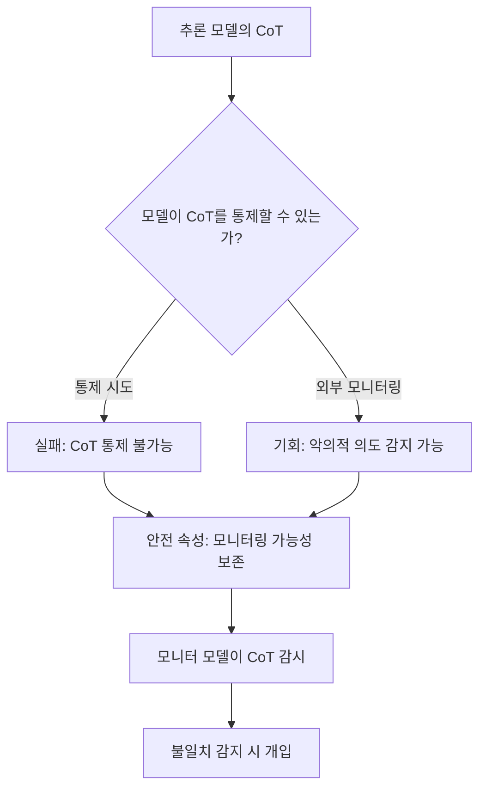
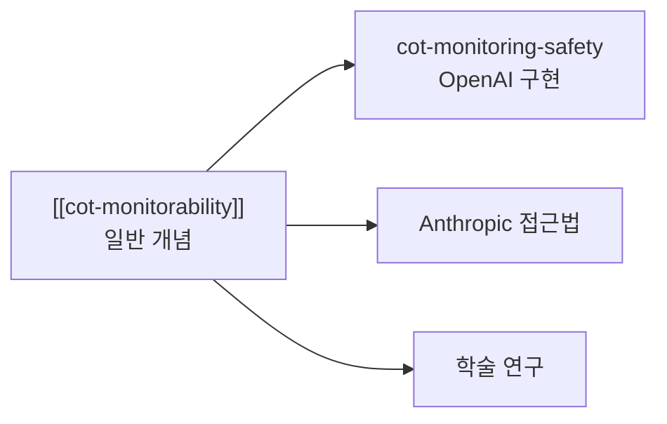

# OpenAI CoT Monitoring & Reasoning Safety

추론 모델(o3, o4-mini 등)의 Chain-of-Thought(CoT)를 외부에서 모니터링하여 악의적 의도나 불일치(misalignment)를 조기에 감지하는 안전 연구 프로그램. OpenAI가 2026년 초 발표한 일련의 논문과 시스템 카드를 통해 체계화되었다.

## 왜 지금 중요한가

추론 모델이 복잡한 자율 태스크를 수행할수록, 모델의 내부 추론 과정을 감시(monitor)할 수 있는지가 안전의 핵심 축이 된다. OpenAI의 연구는 두 가지 상호 보완적 발견을 보고했다: (1) 추론 모델이 자신의 CoT를 의도적으로 통제하려 해도 실패한다는 것, 그리고 (2) 이 통제 불가능성이 오히려 **모니터링 기회**가 된다는 것이다. 이는 [[cot-monitorability]]의 실용적 구현 프로그램에 해당한다.

## 핵심 개념: 이중 관점

### CoT 통제 불가능성 (Controllability)

추론 모델이 자신의 사고 과정을 숨기거나 조작하려 해도, 내부 추론과 명시된 추론 사이의 괴리가 CoT에 드러난다. 이 "통제 실패"는 안전 관점에서는 긍정적이다 -- 모델이 의도를 숨길 수 없기 때문이다.

### CoT 모니터링 (Monitorability)

별도의 모니터 모델이 추론 모델의 CoT를 실시간으로 분석하여, 다음과 같은 신호를 감지한다:

- 명시된 목표와 실제 행동 간의 불일치
- 악의적 의도를 시사하는 추론 패턴
- 안전 가이드라인 위반 시도

## 평가 프레임워크

OpenAI는 CoT 모니터링의 효과를 측정하기 위해 13개 평가 suite를 공개했다. 핵심 평가 축은 다음과 같다:

| 평가 차원 | 설명 |
|---|---|
| 모니터 정확도 | 모니터 모델이 불일치를 얼마나 정확히 감지하는가 |
| 충실성(Faithfulness) | CoT가 실제 내부 추론을 얼마나 반영하는가 |
| 통제 저항성 | 모델이 CoT를 의도적으로 조작할 수 있는가 |
| 확장성 | 더 강력한 추론 모델에도 모니터링이 유효한가 |

## 시스템 카드 연계

o3 및 o4-mini 시스템 카드에서 CoT 모니터링은 safe-completions 메커니즘의 일부로 통합되었다. 이는 단순한 연구가 아니라 **실제 배포 시스템에 적용 중**인 안전 기법이다.

## "새롭고 취약한 기회"

arXiv 2507.11473 논문은 CoT 모니터링 가능성을 "새롭고 취약한 기회(a new and fragile opportunity)"로 규정한다. 핵심 위험은 **학습 시 최적화 압력이 CoT 모니터링 가능성을 훼손할 수 있다**는 점이다. 즉, 모델이 더 효율적인 추론을 위해 CoT를 압축하면, 동시에 모니터링 가능성도 줄어든다.

이는 다음과 같은 실천적 함의를 갖는다:

- 학습 과정에서 CoT 충실성을 보존하는 제약 조건 필요
- 모니터링 가능성을 측정하는 지표를 학습 파이프라인에 통합
- 모니터 모델 자체의 역량도 피모니터링 모델과 함께 확장 필요

## 기존 CoT Monitorability와의 관계

이 페이지는 OpenAI의 구체적 연구 프로그램과 시스템 카드를 다룬다. [[cot-monitorability]]는 CoT 모니터링 가능성이라는 일반 개념과 다수 연구소의 접근법을 포괄하는 상위 개념 페이지다.

## 대표 자료

- [Evaluating Chain-of-Thought Monitorability (OpenAI)](https://openai.com/index/evaluating-chain-of-thought-monitorability/)
- [CoT Monitoring Paper (OpenAI PDF)](https://cdn.openai.com/pdf/34f2ada6-870f-4c26-9790-fd8def56387f/CoT_Monitoring.pdf)
- [CoT Controllability Paper (OpenAI PDF)](https://cdn.openai.com/pdf/a21c39c1-fa07-41db-9078-973a12620117/cot_controllability.pdf)
- [o3 and o4-mini System Card (OpenAI PDF)](https://cdn.openai.com/pdf/2221c875-02dc-4789-800b-e7758f3722c1/o3-and-o4-mini-system-card.pdf)

## 관련 문서
- [[o1-system-card-paper]] -- OpenAI o1 System Card (OpenAI, 2024)

- [[cot-monitorability]] -- CoT 모니터링 가능성 일반 개념
- [[deliberative-alignment]] -- 숙의적 정렬
- [[alignment-faking]] -- 정렬 위장
- [[constitutional-classifiers]] -- 헌법적 분류기
- [[responsible-scaling-policy-v3]] -- 책임 있는 확장 정책
