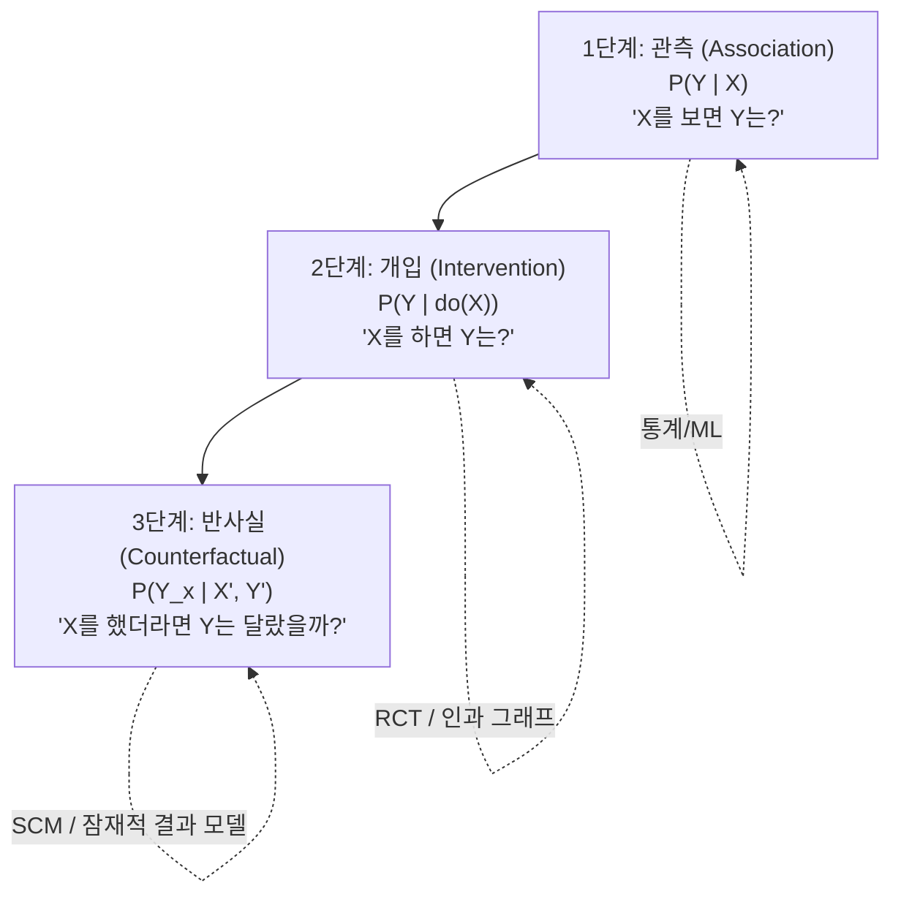
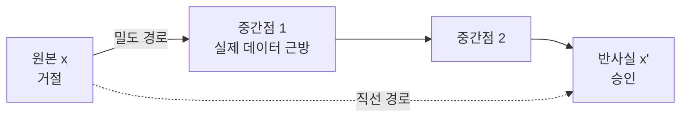

# 반사실 추론 (Counterfactual Reasoning)

## 개요

반사실 추론(Counterfactual Reasoning)은 "실제로 일어나지 않은 상황이 발생했다면 어떤 결과가 나왔을까?"를 추론하는 사고 방식이다. Pearl의 인과 계층구조(Ladder of Causation)에서 3단계 — 가장 강력한 인과적 질문 유형에 해당한다.

ML/AI 맥락에서 반사실은 두 가지 주요 의미를 가진다:

1. **반사실 설명(Counterfactual Explanation)**: "모델이 다른 결정을 내리려면 입력이 어떻게 달라졌어야 했는가?" — [[explainable-ai]]의 핵심 방법론
2. **반사실 추론(Counterfactual Reasoning)**: "관측된 결과의 원인이 무엇인가?" — [[causal-inference]]의 3단계

> "If I hadn't taken the medication, would I still be healthy?" — 반사실적 질문의 전형적 예시

## 인과 계층에서의 위치

Pearl이 제안한 인과 사다리(Ladder of Causation)에서 반사실은 최상위에 위치한다:



각 단계는 이전 단계보다 더 강한 가정을 요구하고, 더 풍부한 질문에 답할 수 있다. 현재 대부분의 ML 모델은 1단계에서 작동한다.

## 형식적 정의

Pearl의 구조적 인과 모델(SCM) $M = (U, V, F)$에서, 반사실 $Y_{x}(u)$는 다음과 같이 정의된다:

**"외생 변수 $U = u$가 관측된 세계에서, $X$를 $x$로 개입했을 때 $Y$의 값"**

$$Y_x(u) = Y_{M_x}(u)$$

여기서 $M_x$는 원래 모델 $M$에서 $X$로의 모든 엣지를 제거하고 $X = x$로 고정한 수정 모델이다.

### 반사실 계산 3단계 (Abduction-Action-Prediction)

1. **귀인(Abduction)**: 관측 증거 $X = x', Y = y'$에서 외생 변수 $U$의 사후 분포 $P(U \mid X=x', Y=y')$ 추론
2. **행동(Action)**: 모델을 $M_x$로 수정 (do-연산 적용)
3. **예측(Prediction)**: 수정된 모델에서 $Y_{M_x}(u)$ 계산

## 반사실 설명 (Counterfactual Explanations)

ML 예측 설명의 맥락에서 반사실 설명은 다음 질문에 답한다:

> "대출이 거절됐다. 어떤 조건이 달랐으면 승인됐을까?"

이는 [[lime]]이나 [[shap]]의 "각 특성이 현재 예측에 얼마나 기여했는가"와는 근본적으로 다른 질문이다:

| 방법 | 질문 유형 | 출력 예시 |
|------|-----------|-----------|
| SHAP | "왜 거절됐는가?" | 소득(-0.3), 부채(+0.2), 나이(-0.1) |
| LIME | "어떤 특성이 거절에 영향?" | "소득 < 3000만원, 부채 > 5000만원" |
| **반사실** | "어떻게 하면 승인되는가?" | "소득이 3500만원 이상이면 승인" |

### 반사실 설명 요건 (Wachter et al., 2017)

좋은 반사실 설명은 다음 속성을 만족해야 한다:

1. **근접성(Proximity)**: 원래 입력과 최소한의 변화만 적용 (최소 변경 원칙)
2. **실행 가능성(Actionability)**: 변경 가능한 특성만 수정 (나이, 성별은 변경 불가)
3. **희소성(Sparsity)**: 가능한 적은 수의 특성 변경
4. **현실성(Plausibility)**: 훈련 데이터 분포 내에 있는 현실적 인스턴스
5. **다양성(Diversity)**: 여러 가지 달성 경로 제공

## 반사실 생성 알고리즘

### 방법 1: 경사 하강법 기반 (Wachter et al.)

가장 단순한 접근. 원래 샘플에서 목표 예측 방향으로 최소한의 변화를 탐색:

$$\arg\min_{x'} \lambda \cdot d(x, x') + L(f(x'), y')$$

- $d(x, x')$: 원래 샘플과 반사실 거리 (L1/L2/Gower)
- $L(f(x'), y')$: 원하는 결과 $y'$와의 예측 손실
- $\lambda$: 두 항의 균형 파라미터

```python
import torch

def generate_counterfactual_gradient(model, x_orig, target_class, lambda_=0.5, lr=0.01, n_iter=500):
    x_cf = x_orig.clone().requires_grad_(True)
    optimizer = torch.optim.Adam([x_cf], lr=lr)

    for _ in range(n_iter):
        optimizer.zero_grad()
        pred = model(x_cf)
        # 목표 클래스 예측 손실
        loss_pred = torch.nn.CrossEntropyLoss()(pred.unsqueeze(0), torch.tensor([target_class]))
        # 원본과의 거리 손실 (L1 = 희소성 유도)
        loss_dist = torch.norm(x_cf - x_orig, p=1)
        loss = loss_pred + lambda_ * loss_dist
        loss.backward()
        optimizer.step()

    return x_cf.detach()
```

### 방법 2: DiCE (Diverse Counterfactual Explanations)

단일 반사실이 아닌 **다양한** 반사실 집합을 생성하여 여러 실행 경로를 제시한다:

```python
import dice_ml

# DiCE 설명기 초기화
d = dice_ml.Data(
    dataframe=df,
    continuous_features=['income', 'debt', 'age'],
    outcome_name='loan_approved'
)
m = dice_ml.Model(model=trained_model, backend='sklearn')
exp = dice_ml.Dice(d, m, method='random')

# 다양한 반사실 5개 생성
dice_exp = exp.generate_counterfactuals(
    query_instance=applicant_df,
    total_CFs=5,
    desired_class='opposite',  # 거절 -> 승인
    features_to_vary=['income', 'debt'],  # 변경 허용 특성
    permitted_range={'income': [2000, 10000]}
)
dice_exp.visualize_as_dataframe()
```

### 방법 3: FACE (Feasible and Actionable Counterfactual Explanations)

훈련 데이터의 고밀도 경로(high-density path)를 따라 반사실을 탐색. 중간 지점들이 모두 현실적이도록 보장:



직선 경로(단순 경사 하강)는 데이터 분포 밖을 통과할 수 있지만, FACE는 밀도 높은 영역만 통과하여 실행 가능성을 보장한다.

### 방법 4: CEM (Contrastive Explanation Method)

반사실과 함께 **대비 설명(contrastive explanation)**을 생성. "A가 존재해서 승인" + "B가 없어서 거절" 두 부분으로 설명:

- **PP (Pertinent Positives)**: 현재 예측을 유지하기 위해 반드시 있어야 하는 특성
- **PN (Pertinent Negatives)**: 다른 예측을 위해 추가해야 하는 특성

## 알고리즘적 재귀 (Algorithmic Recourse)

반사실 설명의 실용적 응용. 자동화된 의사결정에 의해 불이익을 받은 개인이 상황을 바꾸기 위해 취해야 할 **구체적 행동 지침**을 제공한다.

### 예시 시나리오

```
현재 상황: 대출 거절
- 나이: 28세
- 소득: 2,800만원
- 부채: 4,500만원
- 신용 점수: 580

반사실 설명 (알고리즘적 재귀):
경로 1: "소득을 3,200만원 이상으로 높이거나"
경로 2: "부채를 3,000만원 이하로 줄이면"
경로 3: "신용 점수를 650 이상으로 높이면"
-> 대출 승인 가능성 85% 이상
```

### 비용 고려 재귀 (Cost-sensitive Recourse)

각 특성 변경에 비용(노력, 시간, 금전)을 부여하여 최소 비용 경로를 찾는다:

$$\arg\min_{x'} \sum_i c_i |x'_i - x_i| \quad \text{s.t.} \quad f(x') = y'_{\text{target}}$$

```python
# 특성별 변경 비용 (실질적 의미)
feature_costs = {
    'income': 0.3,        # 소득 올리기 어려움
    'debt': 0.1,          # 부채 감소 비교적 용이
    'credit_score': 0.5,  # 신용 점수 개선 오래 걸림
    'age': float('inf'),  # 변경 불가
}
```

## 반사실 추론의 인과적 해석

단순 최적화 기반 반사실과 달리, **인과적 반사실**은 특성 간 인과 관계를 고려한다.

### 문제점: 나이브한 반사실의 오류

```
원본: 나이=25, 경력=3년, 소득=2500만원 -> 거절
나이브 반사실: 나이=30, 경력=3년, 소득=3200만원 -> 승인
```

위 반사실은 나이가 5년 늘었는데 경력은 그대로인 비현실적 상황이다. 나이와 경력은 인과적으로 연결되어 있기 때문이다.

### 인과적 반사실 (Causal Counterfactual)

SCM을 사용하면 특성 간 인과 관계를 반영한 현실적 반사실을 생성할 수 있다:

```python
# 인과 그래프: 나이 -> 경력 -> 소득
# do(나이=30)은 경력도 함께 조정
causal_cf = scm.compute_counterfactual(
    factual={'age': 25, 'experience': 3, 'income': 2500},
    intervention={'age': 30}  # 나이 개입 -> 경력도 SCM에 따라 업데이트
)
# 결과: 나이=30, 경력=8년(자동 조정), 소득=3800만원
```

## 반사실과 관련 개념 비교

| 개념 | 질문 | 방향 | 목적 |
|------|------|------|------|
| SHAP/LIME | 왜 이 결정이 났나? | 과거 설명 | 이해 |
| **반사실** | 뭐가 달랐으면 달랐을까? | 대안 탐색 | 행동 지침 |
| 민감도 분석 | 입력이 바뀌면 얼마나 바뀌나? | 미래 예측 | 강건성 |
| 개입(do-calculus) | X를 바꾸면 Y가 어떻게 되나? | 정책 평가 | 의사결정 |

## 응용 분야

### 1. 금융 (신용 평가)

EU GDPR 제22조 "자동화 의사결정에 대한 설명 권리"에 따라, 알고리즘 신용 거절 시 반사실 설명 제공이 법적으로 요구된다.

### 2. 의료 (임상 의사결정)

```
현재: 환자 A, 당뇨 위험 고위험군
반사실: BMI를 25 이하로 유지하고 주 3회 운동하면 저위험군으로 분류
```

### 3. 강화학습 (오프라인 평가)

다른 정책(policy)을 채택했을 때 누적 보상을 반사실적으로 추정:

$$V^{\pi'}(s) = \mathbb{E}_{a \sim \pi'} [r + \gamma V^{\pi'}(s')]$$

중요도 샘플링(importance sampling)으로 행동 정책 $\mu$에서 수집한 데이터로 목표 정책 $\pi'$ 평가.

### 4. 자연어처리 (반사실 데이터 증강)

모델의 단어 편향(spurious correlation)을 제거하기 위해 반사실 샘플을 생성하여 학습 데이터를 보강:

```python
# 원본: "여성 CEO가 회사를 파산시켰다" -> 부정적 레이블
# 반사실: "남성 CEO가 회사를 파산시켰다" -> 동일 부정적 레이블이어야 함
# 반사실을 학습 데이터에 추가하면 성별 편향 감소
```

### 5. 안전성 검증 (Safety Testing)

"만약 이 센서가 오작동했다면?" 형태의 반사실 시뮬레이션으로 AI 시스템의 취약점 사전 발견.

## 한계점

1. **인과 그래프 필요**: 진정한 인과적 반사실은 SCM이 필요하지만 현실에서 완전한 인과 그래프를 알기 어렵다
2. **다중 반사실 문제**: 목표를 달성하는 반사실이 무수히 많아 어떤 것을 선택할지 기준 필요
3. **고차원 문제**: 특성이 많아질수록 탐색 공간이 기하급수적으로 증가
4. **분포 외 반사실**: 생성된 반사실이 훈련 분포 밖에 있을 수 있어 실제로는 비현실적
5. **행동 실현 가능성**: 이론적으로 유효한 반사실이 현실에서 실행 불가능할 수 있음

## 왜 중요한가

1. **행동 가능한 설명**: SHAP/LIME이 "왜"를 답한다면, 반사실은 "어떻게 바꿀 수 있나"를 답한다 — 실용성이 높음
2. **법적 요구사항**: GDPR, EU AI Act에서 자동화 의사결정의 반사실 설명 의무화 추세
3. **공정성 검증**: 보호 속성(race, gender)을 반사실적으로 변경했을 때 결정이 바뀌는지 확인
4. **인과 이해 기반**: 단순 상관 기반 설명이 아닌, [[causal-inference]] 기반의 더 깊은 이해 제공

## 관련 문서

- [[causal-inference]] - 반사실 추론의 이론적 기반인 Pearl SCM과 잠재적 결과 모델
- [[explainable-ai]] - XAI의 한 갈래로서의 반사실 설명
- [[shap]] - 반사실과 보완적으로 사용되는 기여도 기반 설명
- [[lime]] - 로컬 근사 기반 설명, 반사실과 비교
