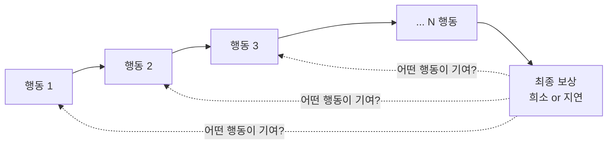
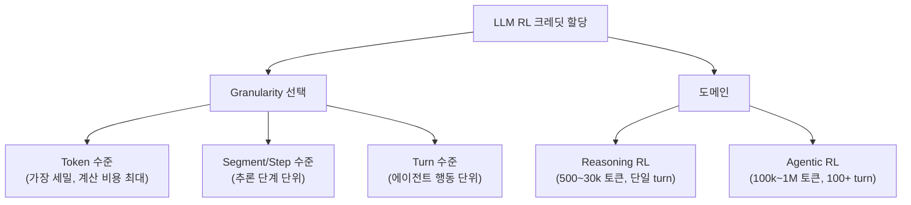
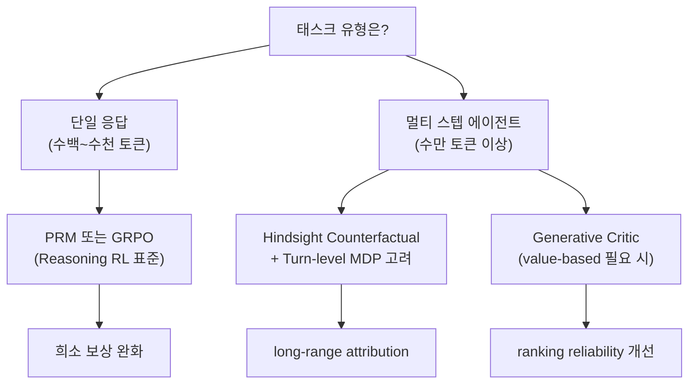

# 크레딧 할당 (Credit Assignment in RL)

강화학습(RL)에서 **크레딧 할당 문제(credit assignment problem)**란 최종 보상(reward)이 어느 행동(action)에 의해 발생했는지를 결정하는 문제다. Minsky(1961)가 처음 명명했으며, RL의 핵심 난제 중 하나다.

## 왜 어려운가

핵심 구조적 이유:
- **희소 보상 (sparse reward)**: 에피소드 종료 시 또는 드물게만 보상이 주어짐
- **지연 보상 (delayed reward)**: 실제로 가치 있는 행동이 보상 발생 훨씬 전에 일어남
- **시간 추상화**: 보상까지의 스텝 수가 많아질수록 기여도 판별이 기하급수적으로 어려워짐

## 고전 RL의 해법

| 방법 | 핵심 아이디어 | 한계 |
|------|------------|------|
| Monte Carlo | 에피소드 완료 후 보상을 역방향 합산 | 분산 높음, 긴 에피소드에서 비효율 |
| Temporal Difference (TD) | 부트스트래핑으로 현재 추정치 갱신 | 편향 존재, 함수 근사 시 불안정 |
| Eligibility Traces (TD(λ)) | MC와 TD를 λ로 보간. 중간 스텝에 감쇠 크레딧 | λ 튜닝 필요, 계산 비용 |
| Actor-Critic | Actor(정책)와 Critic(가치함수) 분리 | Critic 품질이 전체 성능 결정 |
| GAE (Generalized Advantage Estimation) | λ-가중 advantage 추정으로 편향-분산 균형 | PPO 등 현대 RL의 표준 구성 요소 |

## LLM RL에서의 크레딧 할당

LLM을 RL로 학습할 때 전통 RL보다 훨씬 어려운 두 가지 이유가 있다:

1. **극단적 시퀀스 길이**: 수백 토큰(reasoning)부터 수백만 토큰(agentic)까지
2. **토큰이 행동**: 각 토큰 선택이 "행동"인데, 문장/단락/단계 중 어느 단위로 크레딧을 나눌지 자체가 설계 선택

## Reasoning RL vs Agentic RL 크레딧 할당

Zhang (2026) 서베이는 LLM RL 크레딧 할당을 두 도메인으로 명확히 구분한다:

**Reasoning RL** (단일 turn 긴 chain-of-thought):
- Process Reward Model (PRM): 중간 추론 스텝을 독립 평가
- GRPO: critic 없이 그룹 내 상대 보상으로 어드밴티지 계산
- 성숙도: frontrunner 방법이 존재하는 성숙 단계

**Agentic RL** (멀티 turn 에이전트 루프):
- Hindsight counterfactual: 대안 trajectory 사후 분석
- Privileged asymmetric critic: 훈련 시에만 사용 가능한 oracle 정보 활용
- Turn-level MDP: 시간 추상화 재구조화
- 성숙도: fragmentation 단계 (방법마다 설정 이질적)

## Generative Critic의 등장

Shan et al. (2026)은 discriminative scalar critic이 **representation complexity** 병목으로 복잡한 LLM RL에서 근본 한계를 가진다고 주장한다. 이에 대한 대안으로 CoT reasoning 기반 generative critic이 제안됐다:

- Critic이 "왜 이 상태가 좋은/나쁜가"를 추론한 후 value를 판단
- In-context conditioning으로 actor 정책 진화를 실시간 추적
- [[genac-paper]] 참조

## 실무 설계 가이드

## 관련 문서

- [[credit-assignment-survey-paper]] -- 47개 방법 2차원 taxonomy 서베이
- [[genac-paper]] -- Generative Critic: CoT 기반 가치 추정
- [[grpo]] -- critic-free group comparison
- [[process-reward-models]] -- 중간 스텝 PRM
- [[ppo-for-llms]] -- PPO + GAE 기반 LLM RL
- [[long-horizon-rl-training-for-agents]] -- 멀티 턴 에이전트 RL 도전 과제
- [[markov-decision-process]] -- MDP 기초 이론
