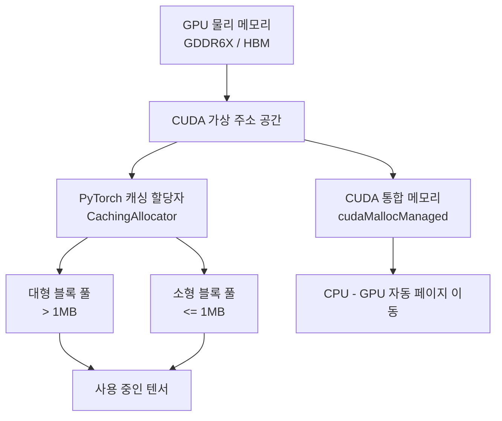
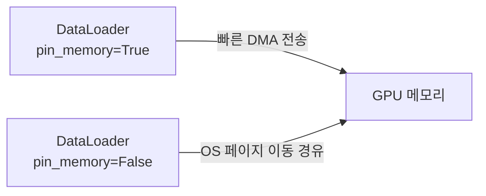
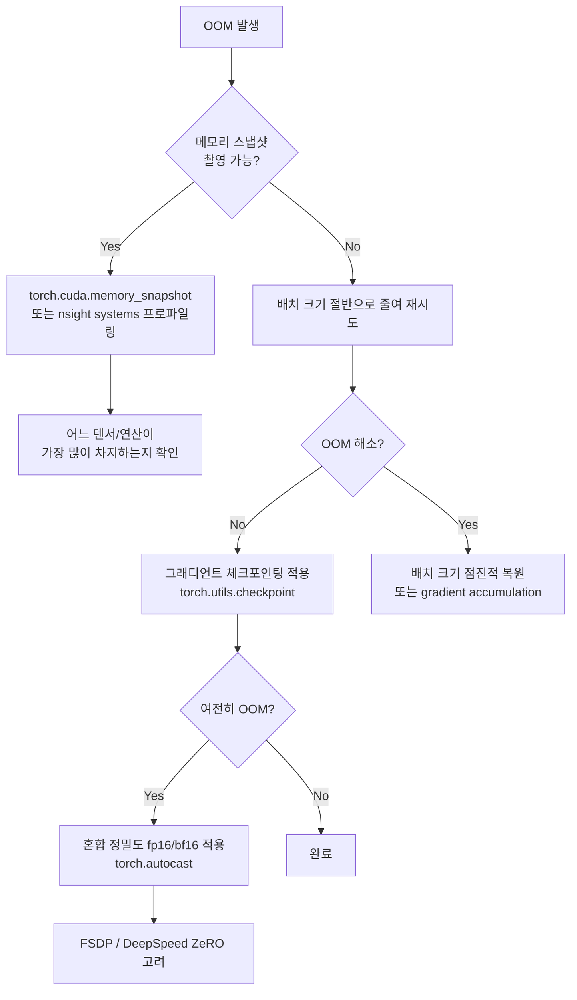

# CUDA 메모리 관리

GPU 학습에서 OOM(Out of Memory) 오류는 가장 빈번한 장애물이다. CUDA 메모리 관리 구조를 이해하면 메모리를 효율적으로 사용하고 OOM 원인을 체계적으로 진단할 수 있다.

## CUDA 메모리 계층



## PyTorch 캐싱 할당자 (CachingAllocator)

PyTorch는 `cudaMalloc` / `cudaFree`를 매번 호출하지 않는다. 대신 내부 캐싱 할당자가 GPU 메모리를 블록 단위로 미리 확보해두고 재사용한다. 이 방식은 CUDA 드라이버 호출 오버헤드를 크게 줄여 학습 속도를 높인다.

### 할당자 동작 원리

1. 텐서 생성 시 요청 크기에 맞는 여유 블록이 캐시에 있으면 즉시 반환
2. 없으면 `cudaMalloc`으로 새 블록 확보
3. 텐서 소멸 시 `cudaFree` 대신 블록을 캐시에 반환(free pool)
4. 캐시가 과도하게 쌓이면 `torch.cuda.empty_cache()`로 OS에 반환 가능

```python
# 메모리 현황 확인
print(torch.cuda.memory_allocated())    # 현재 텐서가 사용 중인 바이트
print(torch.cuda.memory_reserved())     # 할당자가 캐싱한 총 바이트
print(torch.cuda.max_memory_allocated()) # 현재 세션의 최고 사용량

# 캐시 해제 (실제 사용 중인 텐서 메모리는 유지됨)
torch.cuda.empty_cache()
```

### reserved vs allocated의 차이

`memory_reserved()`가 `memory_allocated()`보다 큰 것은 정상이다. 차이는 캐싱 할당자가 보유 중이지만 실제 텐서에 할당되지 않은 여유 블록이다.

## 통합 메모리 (Unified Memory / cudaMallocManaged)

CUDA 통합 메모리는 CPU와 GPU가 동일한 가상 주소를 공유하는 메모리 모델이다. 데이터가 어느 쪽에서 접근되느냐에 따라 페이지 마이그레이션(page migration)이 자동으로 발생한다.

| 항목 | 일반 디바이스 메모리 | 통합 메모리 |
|------|---------------------|------------|
| 할당 | `cudaMalloc` | `cudaMallocManaged` |
| CPU 접근 | 명시적 `cudaMemcpy` 필요 | 자동 페이지 이동 |
| 성능 | 빠름 | 첫 접근 시 지연 |
| 용도 | 고성능 학습 | 프로토타이핑, 메모리 초과 시 |

PyTorch에서 통합 메모리를 직접 쓰는 경우는 드물지만, `pin_memory=True`(페이지 고정 메모리)와의 차이를 구분하는 것이 중요하다. 핀 메모리(pinned memory)는 CPU 메모리지만 페이지 아웃이 불가하여 GPU로의 DMA 전송이 빠르다.

## 페이지 고정 메모리 (Pinned Memory)



`DataLoader(pin_memory=True)`와 `tensor.to(device, non_blocking=True)` 조합으로 CPU-GPU 데이터 전송을 비동기화하면 데이터 로딩과 GPU 연산을 겹칠 수 있다.

## OOM 디버깅 전략

OOM 오류 발생 시 체계적 진단 순서:



### 주요 OOM 원인 체크리스트

- 중간 활성값 과다 축적: 그래디언트 체크포인팅으로 해결
- `retain_graph=True` 불필요 사용: backward 후 그래프가 해제되지 않음
- 캐시 미해제: 루프에서 텐서를 리스트에 누적 (`loss_history.append(loss)` - loss는 연산 그래프 전체를 들고 있음, `.item()` 사용할 것)
- 학습 루프 외부에서 참조 유지: 전역 변수나 클로저에 텐서가 남아있는 경우

```python
# 잘못된 패턴 - 그래프 전체가 메모리에 쌓임
losses = []
for batch in dataloader:
    loss = model(batch)
    losses.append(loss)  # 텐서 참조 유지!

# 올바른 패턴
losses = []
for batch in dataloader:
    loss = model(batch)
    losses.append(loss.item())  # 스칼라 값만 추출
```

## CUDA 메모리 단편화

장기 학습 중 메모리 단편화(fragmentation)로 인해 실제 사용량은 적지만 새 블록을 할당할 수 없는 상황이 발생할 수 있다. PyTorch 2.1+의 `expandable_segments` 기능이 이 문제를 완화한다.

```python
# PyTorch 2.1+ 환경에서
import torch
torch.cuda.memory.set_per_process_memory_fraction(0.9)
# 또는 PYTORCH_CUDA_ALLOC_CONF 환경변수
# PYTORCH_CUDA_ALLOC_CONF=expandable_segments:True
```

## 왜 중요한가

CUDA 메모리 관리를 이해하면 [[gpu-architecture-ml]]에서 설명하는 물리적 GPU 구조와 [[pytorch-internals]] 수준의 소프트웨어 추상화를 연결할 수 있다. 대규모 모델 학습에서 OOM은 가장 흔한 장벽이며, 진단 능력이 곧 생산성이다.

## 관련 문서

- [[gpu-architecture-ml]] - GPU 물리 구조 (SM, HBM, NVLink 등)
- [[pytorch-internals]] - PyTorch 메모리 할당자 C++ 구현 상세
- [[pytorch-autograd-internals]] - autograd 그래프와 메모리 점유 관계
- [[model-parallelism-strategies]] - 메모리 분산을 위한 병렬화 전략
