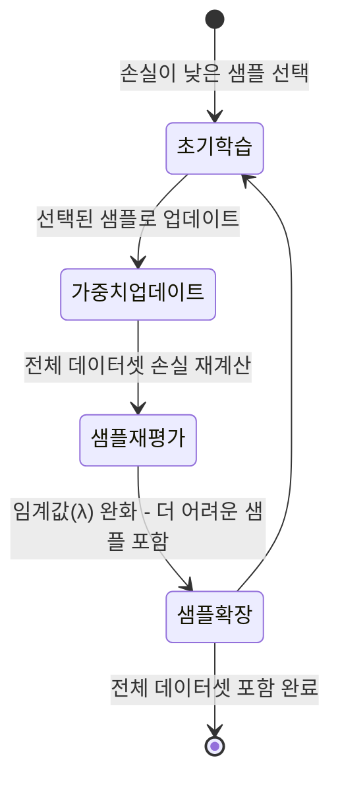
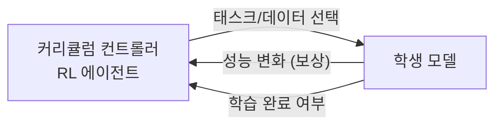
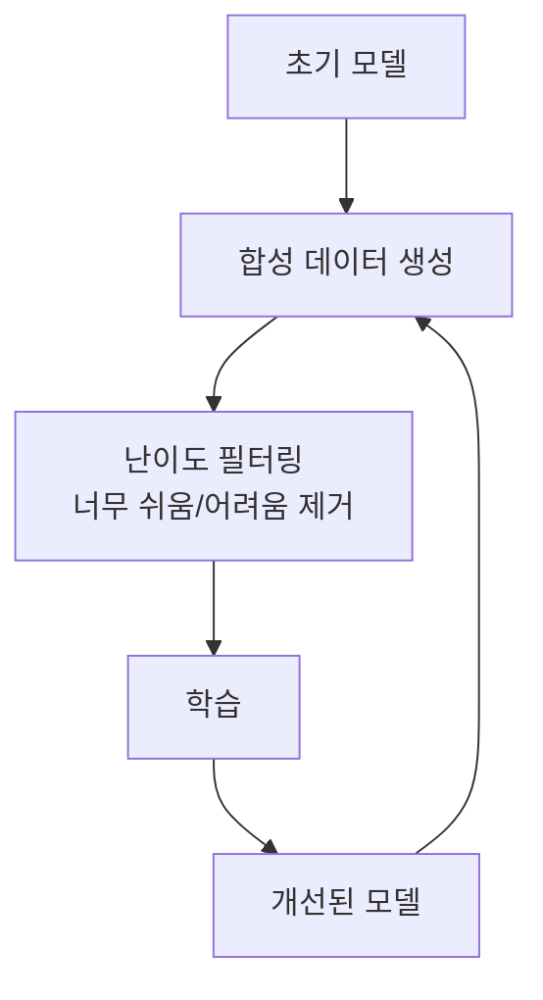

# 커리큘럼 학습 심화

[[curriculum-learning]]의 기본 아이디어(쉬운 것에서 어려운 것 순서로 학습)를 넘어, 심화 커리큘럼 학습은 난이도 스케줄을 **자동화하고 모델 자신의 학습 상태에 반응적으로 조정**하는 방법들을 다룬다. [[data-centric-ai]] 관점에서 학습 데이터의 제시 순서 자체가 하이퍼파라미터가 된다.

## 기존 커리큘럼의 한계

고전적 커리큘럼 학습은 인간 전문가가 사전에 난이도를 정의한다. 이 접근은 두 가지 문제를 갖는다:

1. **도메인 의존성**: "어려운" 데이터의 정의가 도메인마다 다르고, 자동화하기 어렵다
2. **정적 스케줄**: 모델의 현재 능력과 무관하게 난이도가 고정된다

심화 방법들은 이 두 문제를 각각 또는 동시에 해결한다.

## 자기 주도 학습 (Self-Paced Learning, SPL)

SPL은 **모델 자신의 손실(loss)을 난이도 지표로 사용**한다. 현재 모델이 쉽게 맞히는(낮은 손실) 샘플부터 학습하고, 점진적으로 어려운 샘플을 포함한다.



SPL의 목적 함수:

$$\min_{\theta, v} \sum_{i=1}^n v_i \mathcal{L}(f_\theta(x_i), y_i) - \lambda \sum_{i=1}^n v_i$$

여기서 $v_i \in [0,1]$는 샘플 $i$의 포함 가중치이며, $\lambda$는 점진적으로 완화되는 페이스 파라미터다.

## 자동 커리큘럼 생성

### 손실 기반 난이도 측정

가장 단순하고 널리 쓰이는 방법이다. 높은 손실 = 어려운 샘플이라는 가정을 따른다.

```python
# 예시: 손실 기반 커리큘럼 샘플러
def compute_difficulty(model, dataset):
    losses = []
    with torch.no_grad():
        for x, y in dataset:
            loss = criterion(model(x), y)
            losses.append(loss.item())
    return torch.tensor(losses)

# 쉬운 것부터 정렬
difficulty = compute_difficulty(model, train_set)
sorted_indices = difficulty.argsort()  # 오름차순 = 쉬운 것부터
```

### 교사 모델 기반 커리큘럼

사전 학습된 **교사 모델**이 각 샘플의 난이도를 평가한다. 교사가 낮은 신뢰도(uncertainty)를 보이는 샘플이 학생에게 어려운 샘플로 간주된다.

| 방법 | 난이도 지표 | 특징 |
|------|------------|------|
| 손실 기반 | 현재 모델 손실 | 가장 단순, 모델 의존적 |
| 교사 기반 | 교사 모델 불확실성 | 도메인 지식 활용 가능 |
| 앙상블 불일치 | 앙상블 예측 분산 | 더 신뢰할 수 있는 난이도 |
| 인간 평가 | 전문가 판단 | 가장 정확, 비용 높음 |

### 강화 학습 기반 자동 커리큘럼 (ACI)

**Automatic Curriculum induction** 접근에서는 메타-컨트롤러(RL 에이전트)가 어떤 학습 태스크/데이터를 제시할지 결정한다. 보상 신호는 학생 모델의 성능 향상률이다.



## LLM에서의 커리큘럼 학습

대규모 언어 모델 학습에서 커리큘럼 학습은 [[data-mixing-curriculum-learning]]과 결합되어 활용된다:

- **시퀀스 길이 커리큘럼**: 짧은 시퀀스로 시작해 점차 길이를 늘림 - 초기 학습 안정성과 컨텍스트 창 활용 효율 개선
- **도메인 믹싱 커리큘럼**: 초기에 고품질 데이터(책, 코드) 비중을 높이고, 이후 다양성 확대
- **난이도 기반 필터링**: perplexity 점수로 너무 쉽거나(반복 패턴) 너무 어려운(오염된) 데이터 제거

## 자기 개선(Self-Improvement) 루프

심화 커리큘럼 학습의 최신 변형은 모델이 자신의 학습 데이터를 생성하는 **자기 개선 루프**다:



이 패턴은 코드 생성(STaR), 수학 추론(ReST), RLHF 대체(Self-Play) 등에서 활발히 사용된다.

## 주의점

- **Catastrophic easy**: 너무 오래 쉬운 데이터만 보여주면 일반화 능력이 저하됨
- **순서 효과의 불안정성**: 데이터 제시 순서가 같아도 초기 가중치(시드)에 따라 결과가 달라짐
- **분포 편향**: 모델 손실 기반 커리큘럼은 이미 학습한 분포에 편향될 수 있음

## 관련 문서

- [[curriculum-learning]] - 커리큘럼 학습 기본 개념 및 역사
- [[data-centric-ai]] - 데이터 품질 중심 AI 개발 방법론
- [[self-play-training]] - 자기 플레이 기반 데이터 생성
- [[data-mixing-curriculum-learning]] - LLM 사전학습에서의 도메인 믹싱 커리큘럼
