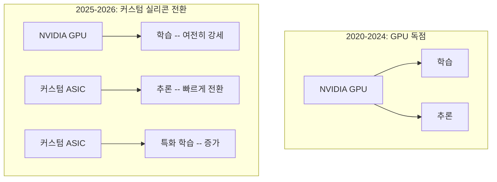

# 커스텀 AI 칩 & ASIC 경쟁

AWS Trainium3(3nm, 2배 성능), OpenAI 자체 ASIC(Broadcom 협력), Microsoft Braga 칩 등 주요 하이퍼스케일러와 AI 기업이 범용 GPU에서 커스텀 실리콘으로 전환하는 흐름. 2026년 AI 하드웨어 시장의 핵심 구조 변화다.

## 개요

2020년대 초반까지 AI 학습과 추론은 NVIDIA GPU에 거의 전적으로 의존했다. 그러나 AI 워크로드의 규모와 비용이 폭증하면서, 각 하이퍼스케일러(AWS, Google, Microsoft)와 AI 기업(OpenAI 등)은 자사 워크로드에 최적화된 커스텀 ASIC(Application-Specific Integrated Circuit)을 개발하기 시작했다. 대표 사례로 [[nvidia-vera-rubin|NVIDIA Vera Rubin]], [[google-tpu-ironwood|Google TPU Ironwood]], [[amd-mi400-helios|AMD MI400 Helios]]가 있다. 업계 벤치마크에 따르면 커스텀 가속기는 범용 GPU 대비 **추론 비용 40-60% 절감**, **연산당 전력 소비 30-50% 감소**를 달성한다. 2026년 현재 이 전환은 단순한 비용 절감을 넘어, AI 인프라의 구조적 재편을 이끄는 핵심 동력이 되었다.

## 핵심 개념

### 주요 커스텀 칩 현황

| 기업 | 칩 | 용도 | 핵심 사양 |
|------|-----|------|-----------|
| **AWS** | Trainium3 | 학습 | 3nm(N3P), 2.52 PFLOPS MXFP8, 144GB HBM3e |
| **AWS** | Inferentia | 추론 | 비용 효율적 추론 특화 |
| **Google** | TPU Ironwood (v7) | 학습 + 추론 | 칩당 4,614 TFLOPS, 클러스터 최대 9,216칩 |
| **Microsoft** | Maia / Braga | Azure AI | 에너지 효율 중심, Azure AI 워크로드 최적화 |
| **OpenAI** | 자체 ASIC (Broadcom) | 학습 + 추론 | Broadcom 협력 제조, 자체 소프트웨어 스택 |

### 범용 GPU에서 커스텀 실리콘으로의 전환 이유

1. **경제성**: 자사 워크로드에 불필요한 범용 기능을 제거하여 실리콘 면적과 전력을 절약
2. **전력 효율**: 연산당 전력 소비를 30-50% 절감 -- 데이터센터 전력 비용이 최대 운영비인 상황에서 핵심
3. **공급망 독립**: NVIDIA GPU 공급 부족과 가격 상승에 대한 리스크 분산
4. **워크로드 최적화**: 학습과 추론을 분리하여 각각에 최적화된 하드웨어 배치

### 시장 구도 변화

## 기술 상세

### 커스텀 vs 범용 트레이드오프

| 기준 | 범용 GPU (NVIDIA) | 커스텀 ASIC |
|------|-------------------|-------------|
| 유연성 | 높음 (다양한 워크로드) | 낮음 (특정 워크로드 최적화) |
| 추론 비용 | 기준선 | 40-60% 절감 |
| 전력 효율 | 기준선 | 30-50% 절감 |
| 소프트웨어 생태계 | CUDA -- 최대 생태계 | 자체 SDK (제한적) |
| 공급 안정성 | 수요 초과 시 부족 | 자체 생산 통제 |
| 개발 비용 | 없음 (구매) | 수십억 달러 R&D |

### AWS Trainium3 상세 아키텍처

TSMC 3nm N3P 공정으로 제조되는 Trainium3은 칩당 8개의 NeuronCore-v4 유닛을 탑재한다. 각 NeuronCore는 BF16 시스톨릭 어레이(128x128)와 MXFP8/MXFP4 시스톨릭 어레이(512x128), 32MiB 전용 SRAM을 포함한다.

| 항목 | Trainium2 | Trainium3 | 향상 |
|------|-----------|-----------|------|
| 공정 | 5nm (N5) | 3nm (N3P) | 세대 전환 |
| MXFP8 성능 | ~1.26 PFLOPS | 2.52 PFLOPS | 2x |
| HBM 메모리 | 96GB HBM3 | 144GB HBM3e | 1.5x |
| 메모리 대역폭 | ~1.26 TB/s | 4.9 TB/s | 3.9x |

Trn3 UltraServer는 최대 144개 Trainium3 칩을 단일 클러스터로 구성하여 362 MXFP8 PFLOPS를 제공한다. 희소 모델(Sparse Model)에서는 단일 칩이 10 PFLOPS 이상의 유효 처리량을 달성하며, 실제 서빙 환경에서 Trn2 대비 **메가와트당 출력 토큰 5배 이상** 향상을 보고했다.

### Google TPU Ironwood (v7)

TPU Ironwood는 칩당 4,614 TFLOPS를 제공하며, 단일 클러스터에서 최대 9,216개 TPU를 연결할 수 있다. NVIDIA Blackwell GPU와 직접 경쟁하는 포지션으로, 에이전틱 AI 네이티브 설계가 특징이다.

### NVIDIA의 대응

NVIDIA는 커스텀 실리콘 경쟁에 대응하여 자체적으로도 특화 가속기(Groq 3 LPU 인수)와 풀스택 소프트웨어(CUDA, Dynamo, TensorRT-LLM)로 생태계 장벽을 강화하고 있다. [[nvidia-vera-rubin]] 플랫폼의 6칩 통합 설계도 이 전략의 일환이다. CUDA 생태계의 막대한 소프트웨어 호환성은 여전히 NVIDIA의 가장 강력한 방어벽이며, 커스텀 ASIC 진영은 자체 SDK와 컴파일러 생태계 구축이라는 난제를 풀어야 한다.

## 커스텀 실리콘의 소프트웨어 생태계 과제

커스텀 ASIC의 가장 큰 진입 장벽은 소프트웨어 생태계다. NVIDIA의 CUDA는 15년 이상 축적된 라이브러리, 프레임워크, 개발자 도구를 보유하고 있으며, PyTorch/TensorFlow 등 주류 ML 프레임워크와 깊이 통합되어 있다. 커스텀 칩 진영은 각각 자체 컴파일러와 SDK를 개발해야 한다:

| 칩 | 소프트웨어 스택 | 성숙도 |
|----|-------------|-------|
| Trainium | Neuron SDK (PyTorch/JAX 호환) | 중간 (3세대 반복) |
| TPU | JAX/XLA (Google 내부 표준) | 높음 (장기 투자) |
| Maia | Azure AI SDK | 초기 |
| OpenAI ASIC | 자체 스택 (비공개) | 초기 |

이 소프트웨어 격차를 극복하기 위해, AWS는 Neuron SDK를 PyTorch와 JAX 호환으로 설계하여 기존 코드의 마이그레이션 비용을 최소화하고 있다. Google은 JAX/XLA 생태계를 TPU와 함께 10년 이상 발전시켜 가장 성숙한 대안 스택을 구축했다.

## 관련 문서

- [[google-tpu-ironwood]] -- Google의 커스텀 AI 칩
- [[nvidia-vera-rubin]] -- NVIDIA의 차세대 통합 플랫폼
- [[nvidia-groq-3-lpu]] -- NVIDIA가 인수한 추론 전용 칩
- [[amd-mi400-helios]] -- AMD의 AI 가속기
- [[on-device-llm]] -- 엣지 디바이스 커스텀 칩 활용
- [AI Ireland: Silicon Revolution 2026](https://aiireland.ie/2026/01/12/the-silicon-revolution-why-custom-ai-chips-and-on-device-ai-are-transforming-2026/)
