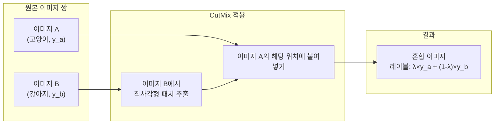
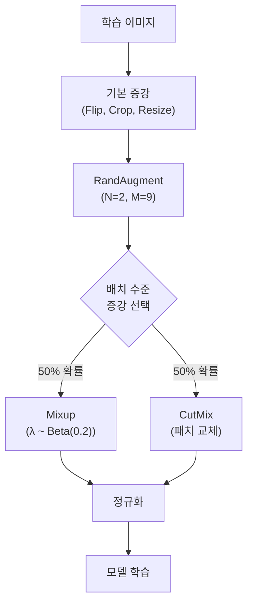

# 고급 데이터 증강 - Mixup, CutMix, RandAugment

## 개요

기본적인 반전(flip), 자르기(crop), 색상 변환을 넘어선 **고급 데이터 증강(advanced data augmentation)** 기법들은 현대 이미지 분류 모델의 필수 학습 레시피가 되었다. 이 페이지는 [[data-augmentation-nlp]]의 이미지 도메인 대응물로서, Mixup, CutMix, RandAugment 세 가지 핵심 기법을 다룬다. 이 기법들은 [[self-supervised-learning]]에서도 프리텍스트(pretext) 태스크나 대조 학습 증강 전략으로 활용된다.

## Mixup

### 아이디어

두 개의 학습 샘플을 **선형 보간(linear interpolation)**하여 새로운 학습 예제를 생성한다.

$$\tilde{x} = \lambda x_i + (1 - \lambda) x_j$$
$$\tilde{y} = \lambda y_i + (1 - \lambda) y_j$$

$\lambda \sim \text{Beta}(\alpha, \alpha)$로 샘플링되며, $\alpha$는 혼합 강도를 제어한다 ($\alpha=0.2$가 일반적).

```python
def mixup_data(x, y, alpha=0.2):
    lam = np.random.beta(alpha, alpha)
    batch_size = x.size(0)
    index = torch.randperm(batch_size)
    mixed_x = lam * x + (1 - lam) * x[index]
    y_a, y_b = y, y[index]
    return mixed_x, y_a, y_b, lam

# 손실 계산
def mixup_criterion(criterion, pred, y_a, y_b, lam):
    return lam * criterion(pred, y_a) + (1 - lam) * criterion(pred, y_b)
```

### 효과

- 레이블 스무딩(label smoothing) 효과로 과적합 억제
- 결정 경계(decision boundary)를 선형으로 만들어 일반화 향상
- **소프트 레이블** 학습으로 캘리브레이션(calibration) 개선

## CutMix

### 아이디어

Mixup의 변형으로, 이미지를 픽셀 수준에서 보간하는 대신 **직사각형 영역을 잘라 붙이는(cut-and-paste)** 방식을 사용한다.

$$\tilde{x} = M \odot x_i + (1 - M) \odot x_j$$

$M$은 바이너리 마스크(직사각형 패치 위치 1, 나머지 0), 레이블은 패치 면적 비율 $\lambda$에 따라 혼합.



### Mixup vs CutMix

| 특성 | Mixup | CutMix |
|------|-------|--------|
| 혼합 방식 | 픽셀 전체 선형 보간 | 직사각형 영역 교체 |
| 지역 특징 보존 | 약함 (블러 효과) | 강함 |
| 객체 탐지 적용 | 부적합 | 적합 (바운딩박스 조정 가능) |
| 성능 (ImageNet) | +0.5~1.0% Top-1 | +1.0~1.5% Top-1 |

## RandAugment

### 아이디어

AutoAugment(강화학습 기반 증강 정책 탐색)의 **단순화 버전**으로, 탐색 없이 두 개의 하이퍼파라미터만으로 강한 증강 효과를 낸다:

- `N`: 연속으로 적용할 변환 수 (보통 2)
- `M`: 변환 강도 (크기 1-30, 보통 9)

```python
import torchvision.transforms as T

transform = T.Compose([
    T.RandomHorizontalFlip(),
    T.RandAugment(num_ops=2, magnitude=9),  # PyTorch 기본 내장
    T.ToTensor(),
    T.Normalize(mean, std)
])
```

### 적용 변환 목록

RandAugment는 약 14개의 변환 풀(pool)에서 무작위 N개를 선택한다:

| 변환 종류 | 설명 |
|---------|------|
| AutoContrast | 히스토그램 기반 대비 자동 조정 |
| Equalize | 히스토그램 평탄화 |
| Rotate | 이미지 회전 (-30° ~ +30°) |
| Solarize | 픽셀 임계값 이상 반전 |
| Color | 채도 조정 |
| Posterize | 비트 깊이 감소 |
| Contrast | 대비 조정 |
| Brightness | 밝기 조정 |
| Sharpness | 선명도 조정 |
| ShearX/Y | 전단 변환 |
| TranslateX/Y | 평행 이동 |

## 증강 기법 비교 및 조합 전략



**레시피 조합 (ResNet, ViT 계열 공통)**
1. 기본: RandomHorizontalFlip + RandomCrop
2. 중급: + RandAugment(N=2, M=9) + Label Smoothing(0.1)
3. 고급: + CutMix or Mixup (랜덤 선택) + Repeated Augmentation

## TrivialAugment

RandAugment의 추가 단순화 버전. 강도 `M`도 무작위 샘플링하여 하이퍼파라미터를 사실상 0으로 만든다.

```python
# PyTorch에서 TrivialAugment
transform = T.TrivialAugmentWide()  # 추가 파라미터 불필요
```

성능은 RandAugment와 유사하거나 약간 우위에 있으면서 튜닝 부담이 없어 실용적이다.

## AugMix

여러 증강 체인의 결과를 혼합하는 방식. 분포 외(out-of-distribution) 강건성 향상에 특화되어 있다.

$$\tilde{x} = w_1 \cdot \text{aug}_1(x) + w_2 \cdot \text{aug}_2(x) + w_3 \cdot \text{aug}_3(x)$$

ImageNet-C(부패 데이터셋) 벤치마크에서 특히 효과적이다. [[adversarial-patch-physical]] 방어에도 AugMix의 일관성 손실(JSD Consistency Loss)이 활용된다.

## 실무 적용 가이드

| 데이터 크기 | 권장 전략 |
|-----------|----------|
| 소규모 (<10K) | 적극적 Mixup/CutMix + 강한 RandAugment |
| 중간 (10K-100K) | CutMix + RandAugment + Label Smoothing |
| 대규모 (>1M) | 기본 + 가벼운 RandAugment (M=5-7) |
| 사전학습 후 파인튜닝 | 기본 증강만으로도 충분한 경우 많음 |

## 왜 중요한가

고급 데이터 증강은 추가 데이터 없이 **모델 일반화 성능을 무료로 높이는** 방법이다. 특히 데이터가 제한된 의료 영상, 산업 검사, 위성 이미지 분야에서 효과가 크다. [[self-supervised-learning]]의 대조 학습 프레임워크(SimCLR, BYOL 등)에서는 이 증강 기법들이 양성(positive) 쌍 생성의 핵심 구성 요소가 된다.

## 관련 문서
- [[convmixer-patchify]] -- ConvMixer - 패치 임베딩과 분리 합성곱

- [[data-augmentation-nlp]] - 텍스트 도메인의 대응 증강 기법들
- [[self-supervised-learning]] - CutMix/Mixup이 대조 학습에서 활용되는 맥락
- [[adversarial-patch-physical]] - 패치 기반 증강의 보안 적용 (AugMix 방어)
