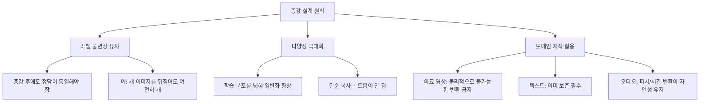
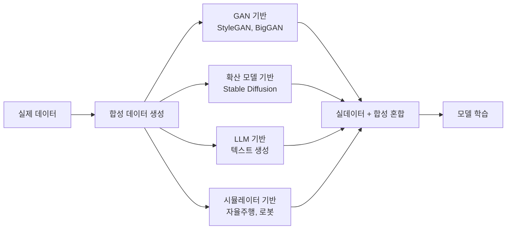
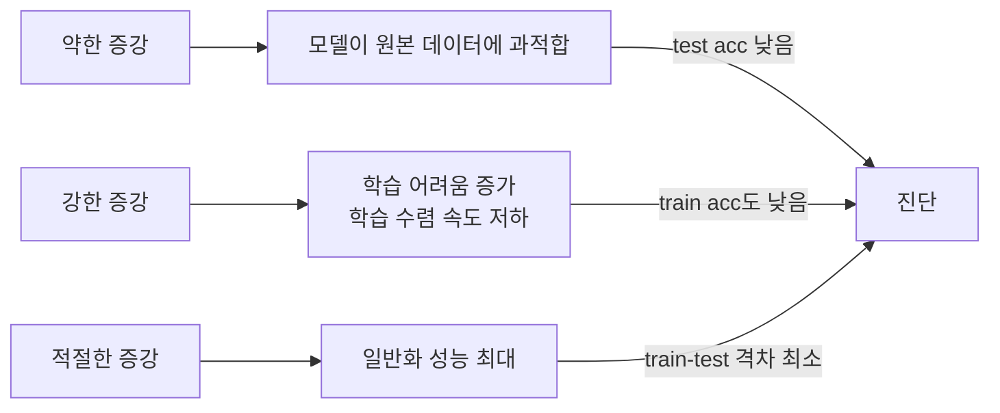

# 데이터 증강 (Data Augmentation)

## 개요

데이터 증강(data augmentation)은 원본 학습 데이터를 변형하거나 합성하여 학습 세트를 인위적으로 확장하는 기법이다. 모델이 데이터의 본질적인 패턴(불변성)을 학습하도록 유도하고, 과적합(overfitting)을 줄이며, 한정된 데이터로 더 나은 일반화 성능을 달성하는 것이 목표다.

데이터 증강의 효과는 특히 학습 데이터가 부족하거나 불균형한 상황에서 두드러진다. 현대 딥러닝에서는 정규화(regularization) 기법의 하나로 취급하며, 거의 모든 컴퓨터 비전(CV) 학습 파이프라인에 기본 포함된다.

## 증강의 설계 원칙



## 비전(Vision) 데이터 증강

### 기본 기하학적 변환

가장 널리 사용되는 증강 기법이다. 라벨은 변하지 않으면서 이미지의 외형을 바꾼다.

```python
import torchvision.transforms as T
from PIL import Image

basic_transform = T.Compose([
    T.RandomHorizontalFlip(p=0.5),          # 좌우 반전
    T.RandomVerticalFlip(p=0.1),             # 상하 반전 (태스크에 따라)
    T.RandomRotation(degrees=15),            # 회전
    T.RandomResizedCrop(size=224, scale=(0.7, 1.0)),  # 랜덤 크롭
    T.ColorJitter(brightness=0.4, contrast=0.4,       # 색상 변환
                  saturation=0.4, hue=0.1),
    T.ToTensor(),
    T.Normalize(mean=[0.485, 0.456, 0.406],
                std=[0.229, 0.224, 0.225]),
])
```

| 변환 | 설명 | 라벨 영향 |
|------|------|----------|
| 수평 반전(Horizontal Flip) | 좌우 대칭 | 없음 (대부분) |
| 랜덤 크롭(Random Crop) | 일부 영역 추출 | 없음 |
| 색상 지터(Color Jitter) | 밝기/대비/채도 변화 | 없음 |
| 회전(Rotation) | 각도 회전 | 보통 없음 |
| 가우시안 블러(Gaussian Blur) | 흐림 효과 | 없음 |

### Mixup

Zhang et al. (2018)이 제안한 기법으로, 두 샘플을 선형 보간하여 새로운 가상 학습 예제를 생성한다.

$$\tilde{x} = \lambda x_i + (1-\lambda) x_j, \quad \tilde{y} = \lambda y_i + (1-\lambda) y_j$$

$\lambda \sim \text{Beta}(\alpha, \alpha)$로 샘플링 ($\alpha = 0.2$ 일반적).

```python
import numpy as np
import torch

def mixup_data(x: torch.Tensor, y: torch.Tensor, alpha: float = 0.2):
    """Mixup 데이터 증강 - 두 샘플을 선형 보간"""
    if alpha > 0:
        lam = np.random.beta(alpha, alpha)
    else:
        lam = 1.0

    batch_size = x.size(0)
    index = torch.randperm(batch_size)

    mixed_x = lam * x + (1 - lam) * x[index]
    y_a, y_b = y, y[index]
    return mixed_x, y_a, y_b, lam

def mixup_criterion(criterion, pred, y_a, y_b, lam):
    """Mixup 손실 계산"""
    return lam * criterion(pred, y_a) + (1 - lam) * criterion(pred, y_b)
```

**특성:**
- 소프트 라벨 생성으로 모델 신뢰도 보정 효과
- 경계 영역(decision boundary) 평탄화
- ImageNet 분류에서 약 0.5~1.0% Top-1 정확도 향상

### CutMix

Yun et al. (2019)이 제안한 Mixup의 변형이다. 픽셀을 선형 혼합하는 대신, 한 이미지에서 직사각형 영역을 잘라 다른 이미지에 붙여넣는다.

```python
def cutmix_data(x: torch.Tensor, y: torch.Tensor, alpha: float = 1.0):
    """CutMix 증강 - 이미지 영역 교체"""
    lam = np.random.beta(alpha, alpha)
    rand_index = torch.randperm(x.size(0))

    y_a = y
    y_b = y[rand_index]

    # 박스 좌표 계산
    _, _, H, W = x.shape
    cut_ratio = np.sqrt(1.0 - lam)
    cut_h = int(H * cut_ratio)
    cut_w = int(W * cut_ratio)

    cx = np.random.randint(W)
    cy = np.random.randint(H)

    x1 = np.clip(cx - cut_w // 2, 0, W)
    y1 = np.clip(cy - cut_h // 2, 0, H)
    x2 = np.clip(cx + cut_w // 2, 0, W)
    y2 = np.clip(cy + cut_h // 2, 0, H)

    x[:, :, y1:y2, x1:x2] = x[rand_index, :, y1:y2, x1:x2]
    lam = 1 - (x2 - x1) * (y2 - y1) / (W * H)

    return x, y_a, y_b, lam
```

Mixup 대비 물체의 지역적 특징을 더 잘 보존하며, 분류뿐 아니라 객체 탐지(object detection)에도 효과적이다.

### RandAugment

Cubuk et al. (2020)이 제안한 탐색 없는(search-free) 자동 증강 정책이다. N개 증강 연산을 무작위로 선택하고 크기 M을 단일 하이퍼파라미터로 제어한다.

```python
import torchvision.transforms as T

# RandAugment는 torchvision 0.11+ 내장
rand_augment = T.RandAugment(num_ops=2, magnitude=9)
# num_ops: 적용할 변환 수 (보통 2)
# magnitude: 변환 강도 (1~30, 클수록 강함)
```

증강 연산 풀: 자동 대비(AutoContrast), 등화(Equalize), 회전, 솔라라이즈(Solarize), 색조(Color), 포스터화(Posterize), 대비(Contrast), 밝기(Brightness), 선명도(Sharpness), 전단(Shear X/Y), 이동(Translate X/Y)

AutoAugment([[autoaugment-search]])와 달리 정책 탐색 비용 없이 유사한 성능을 달성한다.

### AutoAugment

Cubuk et al. (2019, Google)이 개발한 강화 학습 기반 증강 정책 탐색 방법이다. 컨트롤러 네트워크가 데이터셋에 최적인 증강 정책을 학습한다. [[autoaugment-search]] 참조.

### AugMix

Hendrycks et al. (2020)이 제안한 분포 이동(distribution shift) 강건성 향상 기법이다. 여러 증강 연산의 혼합으로 다양하고 일관된 증강을 생성한다.

## 텍스트(NLP) 데이터 증강

### EDA (Easy Data Augmentation)

Wei & Zou (2019)가 제안한 4가지 간단한 텍스트 증강 연산이다.

```python
import random
import nltk
from nltk.corpus import wordnet

def synonym_replacement(words: list[str], n: int) -> list[str]:
    """임의 단어 n개를 동의어로 교체"""
    new_words = words.copy()
    random_words = list(set([w for w in words if wordnet.synsets(w)]))
    random.shuffle(random_words)
    replaced = 0
    for word in random_words:
        synonyms = wordnet.synsets(word)
        if synonyms:
            synonym = synonyms[0].lemmas()[0].name()
            if synonym != word:
                new_words = [synonym if w == word else w for w in new_words]
                replaced += 1
                if replaced >= n:
                    break
    return new_words

def random_insertion(words: list[str], n: int) -> list[str]:
    """임의 위치에 동의어 삽입"""
    new_words = words.copy()
    for _ in range(n):
        synsets = []
        for w in new_words:
            synsets.extend(wordnet.synsets(w))
        if synsets:
            synonym = random.choice(synsets).lemmas()[0].name()
            new_words.insert(random.randint(0, len(new_words)), synonym)
    return new_words

def random_swap(words: list[str], n: int) -> list[str]:
    """임의 두 단어 위치 교환 (n회)"""
    new_words = words.copy()
    for _ in range(n):
        if len(new_words) >= 2:
            i, j = random.sample(range(len(new_words)), 2)
            new_words[i], new_words[j] = new_words[j], new_words[i]
    return new_words

def random_deletion(words: list[str], p: float) -> list[str]:
    """각 단어를 확률 p로 삭제"""
    if len(words) == 1:
        return words
    return [w for w in words if random.random() > p]
```

EDA는 구현이 단순하고 소규모 데이터셋에 효과적이다. 단, 언어 모델을 사용하는 더 정교한 방법에 비해 품질이 낮을 수 있다.

### 역번역 (Back-Translation)

원본 텍스트를 다른 언어로 번역한 뒤 다시 원래 언어로 역번역하여 의미는 같지만 표현이 다른 문장을 생성한다.

```python
from transformers import MarianMTModel, MarianTokenizer

def back_translate(text: str, src_lang: str = "en", pivot_lang: str = "fr") -> str:
    """역번역을 통한 텍스트 증강"""
    # 영어 -> 프랑스어
    model_name_fwd = f"Helsinki-NLP/opus-mt-{src_lang}-{pivot_lang}"
    tokenizer_fwd = MarianTokenizer.from_pretrained(model_name_fwd)
    model_fwd = MarianMTModel.from_pretrained(model_name_fwd)

    inputs = tokenizer_fwd([text], return_tensors="pt", padding=True)
    translated = model_fwd.generate(**inputs)
    pivot_text = tokenizer_fwd.decode(translated[0], skip_special_tokens=True)

    # 프랑스어 -> 영어 (역번역)
    model_name_bwd = f"Helsinki-NLP/opus-mt-{pivot_lang}-{src_lang}"
    tokenizer_bwd = MarianTokenizer.from_pretrained(model_name_bwd)
    model_bwd = MarianMTModel.from_pretrained(model_name_bwd)

    inputs = tokenizer_bwd([pivot_text], return_tensors="pt", padding=True)
    back = model_bwd.generate(**inputs)
    return tokenizer_bwd.decode(back[0], skip_special_tokens=True)
```

Google Translate API나 DeepL을 사용하면 더 자연스러운 역번역이 가능하다. 감정 분석, 텍스트 분류 등의 태스크에서 효과적이다.

### LLM 기반 패러프레이즈

GPT-4나 Claude 같은 LLM에게 문장을 다양한 방식으로 표현하도록 요청하는 방법이다. 품질이 높지만 비용이 든다.

```python
# Claude API를 활용한 패러프레이즈 증강 예시 (의사코드)
def augment_with_llm(text: str, n_variants: int = 3) -> list[str]:
    prompt = f"""다음 문장을 의미는 유지하면서 {n_variants}가지 다른 표현으로 써주세요:
    원문: {text}
    각 변형은 번호를 붙여 나열해주세요."""
    # API 호출 및 결과 파싱
    ...
```

### Contextual Word Substitution

BERT나 RoBERTa의 마스킹 예측(MLM)을 활용하여 문맥에 맞는 동의어를 생성한다.

```python
from transformers import pipeline

fill_mask = pipeline("fill-mask", model="bert-base-uncased")

def contextual_substitute(text: str, word_to_mask: str) -> list[str]:
    """BERT로 특정 단어를 문맥에 맞는 단어로 교체"""
    masked_text = text.replace(word_to_mask, "[MASK]", 1)
    suggestions = fill_mask(masked_text)
    return [s["sequence"] for s in suggestions[:3]]
```

## 오디오 데이터 증강

오디오 증강은 음성 인식(ASR), 감정 분석, 화자 인식 등에서 중요하다.

```python
import librosa
import numpy as np

def audio_augment(audio: np.ndarray, sr: int = 16000) -> dict[str, np.ndarray]:
    """오디오 증강 기법 모음"""
    augmented = {}

    # 시간 스트레칭 (Time Stretching)
    augmented["time_stretch"] = librosa.effects.time_stretch(audio, rate=1.2)

    # 피치 이동 (Pitch Shifting)
    augmented["pitch_shift"] = librosa.effects.pitch_shift(audio, sr=sr, n_steps=2)

    # 배경 노이즈 추가
    noise = np.random.randn(len(audio)) * 0.005
    augmented["add_noise"] = audio + noise

    # 볼륨 조정
    augmented["volume"] = audio * np.random.uniform(0.7, 1.3)

    return augmented
```

**SpecAugment** (Park et al., 2019): 멜 스펙트로그램에서 시간 또는 주파수 축을 마스킹하는 기법으로, ASR 모델의 표준 증강법이 되었다.

## 합성 데이터 (Synthetic Data)

실제 데이터 수집이 어렵거나 비용이 높을 때 모델로 생성한 데이터를 활용한다.



**비전:**
- StyleGAN, BigGAN으로 고화질 이미지 생성
- Stable Diffusion으로 텍스트 기반 이미지 생성 후 분류기 학습
- DALL-E 3, Midjourney 생성 이미지 (저작권 주의)

**텍스트:**
- GPT-4로 질문-답변 쌍 생성 (instruction tuning용)
- 특정 도메인 문서 합성 (의료, 법률)
- Alpaca 방식: LLM이 생성한 52K 지시 데이터로 파인튜닝

**주의사항:**
- 합성 데이터 품질이 낮으면 모델 성능이 오히려 저하 (garbage in, garbage out)
- 실제 분포와 합성 분포 간 도메인 갭 존재
- LLM 생성 데이터로만 학습하면 모델 붕괴(model collapse) 위험 [교차검증 필요]

## 증강 정책 자동화

### AugMix / TrivialAugment

TrivialAugment(Muller & Hutter, 2021)는 RandAugment를 더 단순화한 형태로, 단 하나의 증강 연산을 최대 강도로 적용한다. 탐색 없이도 강력한 정규화 효과를 낸다.

### AutoAugment vs RandAugment vs TrivialAugment 비교

| 방법 | 탐색 비용 | 하이퍼파라미터 | 성능 | 권장 상황 |
|------|----------|--------------|------|----------|
| AutoAugment | 매우 높음 | 없음 (데이터별) | 높음 | 컴퓨팅 자원 충분 |
| RandAugment | 없음 | N, M (2개) | 유사 | 일반 학습 |
| TrivialAugment | 없음 | 없음 | 유사 | 빠른 적용 |

## 도메인별 권장 증강 전략

| 도메인 | 권장 기법 | 주의사항 |
|--------|----------|---------|
| 이미지 분류 | RandomCrop, Flip, ColorJitter, Mixup, CutMix, RandAugment | 수직 반전은 데이터에 따라 |
| 객체 탐지 | RandomCrop, Flip, Mosaic(YOLO) | 바운딩 박스 좌표도 변환 필요 |
| 의료 영상 | 회전, 탄성 변형 | 물리적으로 불가능한 변환 금지 |
| 텍스트 분류 | EDA, 역번역, LLM 패러프레이즈 | 감정/의도 보존 확인 |
| 음성 인식 | SpecAugment, 노이즈 추가, 피치 이동 | 발화 내용 보존 |
| 시계열 | 슬라이딩 윈도우, 노이즈, 시간 와핑 | 라벨 경계 주의 |

## 과학적 선택 - 증강 강도와 과소/과다 증강



최적 증강 강도는 데이터셋 크기, 모델 용량, 학습 에폭에 따라 달라진다. 교차 검증([[cross-validation]])으로 탐색하는 것이 권장된다.

## 관련 문서

- [[mixup-data-augmentation]] - Mixup 상세 분석
- [[cutmix-augmentation]] - CutMix 상세 분석
- [[randaugment-policy]] - RandAugment 정책 자동화
- [[autoaugment-search]] - AutoAugment 강화 학습 기반 탐색
- [[data-augmentation-advanced]] - 고급 데이터 증강 (기존 페이지)
- [[cross-validation]] - 증강 전략 평가를 위한 교차 검증
- [[regularization]] - 증강의 정규화 관점
- [[self-supervised-learning]] - 합성 데이터와 자기지도 학습의 연계
