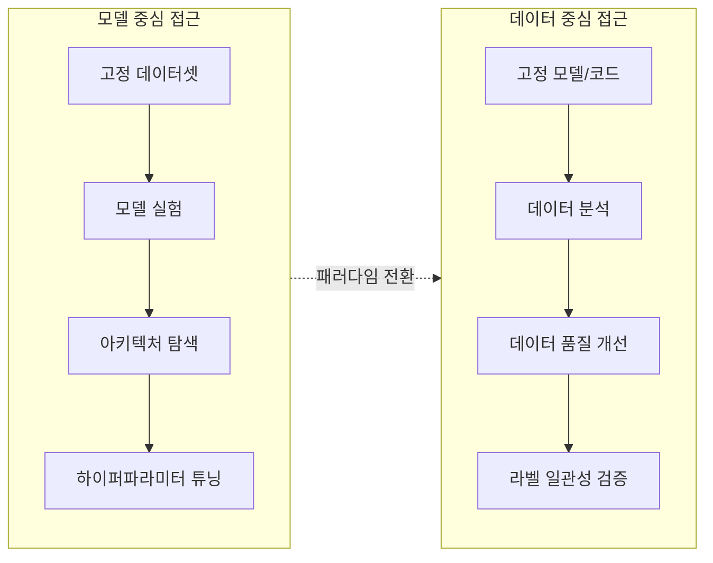
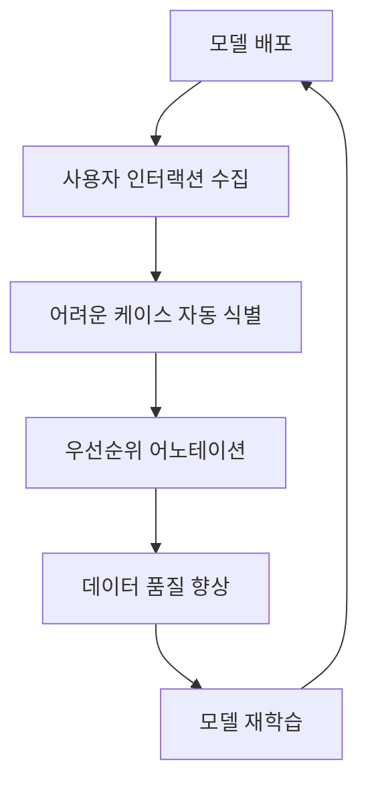

# 데이터 중심 AI 패러다임

## 개요

데이터 중심 AI(Data-Centric AI)는 모델 아키텍처를 고정하고 데이터의 품질을 체계적으로 개선하는 데 집중하는 패러다임이다. Andrew Ng이 2021년부터 적극 주창하면서 업계의 주목을 받았다. 기존의 모델 중심(model-centric) 접근과 정반대의 우선순위를 갖는다.

## 모델 중심 vs 데이터 중심

| 축 | 모델 중심 | 데이터 중심 |
|----|----------|------------|
| 고정 요소 | 데이터 | 모델 코드 |
| 개선 대상 | 아키텍처, 파라미터 | 데이터 품질, 라벨 |
| 성과 한계 | 데이터 노이즈에 취약 | 모델 선택 유연성 제한 |
| 적합 상황 | 충분한 고품질 데이터 | 데이터 품질이 병목 |

## 핵심 활동

### 1. 라벨 일관성 감사 (Label Consistency Audit)

동일한 입력에 대해 다른 레이블이 붙어 있는 경우를 체계적으로 탐지하고 수정한다. 단순히 오류 데이터를 제거하는 것이 아니라, 레이블 기준 자체를 명확히 정의하는 작업이 포함된다.

- 인터-어노테이터 일치도(inter-annotator agreement) 측정
- 레이블 가이드라인 작성 및 어노테이터 재교육
- 모호한 경계 케이스(edge case) 명시적 처리

### 2. 데이터 증강 (Data Augmentation)

기존 데이터를 변환해 다양성과 양을 늘린다. 이미지의 회전/크롭, 텍스트의 역번역(back-translation), 오디오의 피치 변환 등이 대표적이다.

### 3. 합성 데이터 (Synthetic Data)

실제 데이터를 수집하기 어려운 상황에서 시뮬레이터나 생성 모델로 데이터를 만든다. LLM 시대에 GPT-4 같은 모델로 고품질 지시 데이터를 합성하는 사례가 급증했다.

### 4. 데이터 정제 (Data Cleaning)

중복 제거, 노이즈 필터링, 분포 편향 수정 등이 포함된다. 단순 규칙 기반 정제부터 모델 기반 이상치 탐지까지 다양한 기법이 활용된다.

## 데이터 플라이휠 (Data Flywheel)

데이터 플라이휠은 모델 배포 후 실제 사용 데이터를 수집하고, 이를 다시 훈련에 활용하는 자기강화 루프다. 초기 모델의 약점이 드러난 케이스를 집중적으로 레이블링함으로써 효율적으로 모델을 개선할 수 있다.

## Data-Centric AI 벤치마크

Stanford의 DataPerf 벤치마크는 데이터 선택, 레이블링, 정제 알고리즘을 평가하는 표준 플랫폼이다. 기존 벤치마크가 고정 데이터셋에서 모델 성능만 비교했다면, DataPerf는 데이터 준비 과정 자체를 평가한다.

주요 평가 태스크:
- 코어셋 선택(coreset selection): 성능 손실 없이 훈련 세트 최소화
- 레이블 에러 탐지
- 데이터 증강 전략 비교

## LLM 시대의 데이터 중심 AI

파운데이션 모델 시대에 데이터 중심 원칙은 더욱 중요해졌다.

**고품질 지시 데이터 (Instruction Data)**: InstructGPT, Alpaca, FLAN 등에서 보듯 파인튜닝 품질은 지시 데이터의 다양성과 품질에 극도로 의존한다. 10만 개의 저품질 데이터보다 1천 개의 고품질 데이터가 더 효과적일 수 있다(Lima, 2023).

**RLHF 선호 데이터**: 인간 피드백 기반 강화학습에서 선호 쌍(preference pair)의 품질이 모델 정렬(alignment)을 결정한다. 어노테이터 일관성, 지침 명확성이 핵심 변수다.

**합성 데이터 대규모화**: GPT-4를 교사 모델로 사용해 소형 모델 학습 데이터를 합성하는 패턴(Phi-1, Phi-2)이 등장했다. 데이터 중심 AI의 논리를 LLM 생태계에 적용한 사례다.

## 실무 적용 가이드

1. **데이터 품질 대시보드 구축**: 레이블 분포, 중복률, 이상치 비율을 지속 모니터링
2. **어노테이션 가이드라인 버전 관리**: 기준 변경 시 이전 레이블과 충돌 방지
3. **능동 학습(active learning) 연동**: 불확실성 높은 샘플 우선 레이블링으로 효율화
4. **데이터 슬라이싱**: 전체 지표가 좋아도 서브그룹별 성능 격차 확인

## 한계와 비판

- 모델 고정이라는 가정 자체가 제약: 더 나은 아키텍처가 있다면 데이터만으로 한계 존재
- 데이터 품질 정의의 주관성: "좋은 데이터"의 기준이 태스크/도메인마다 다름
- 대규모 파운데이션 모델에서는 데이터 큐레이션보다 스케일이 더 지배적인 경우도 있음

## 관련 문서

- [[data-shapley-valuation]] - 개별 데이터 포인트의 기여도 정량화
- [[influence-functions-ml]] - 훈련 데이터 영향도 분석
- [[label-noise-learning]] - 노이즈 레이블 학습 기법
- [[data-augmentation-advanced]] - 데이터 증강 심화
- [[emergent-abilities-llm]] - 데이터 스케일과 모델 능력의 관계
