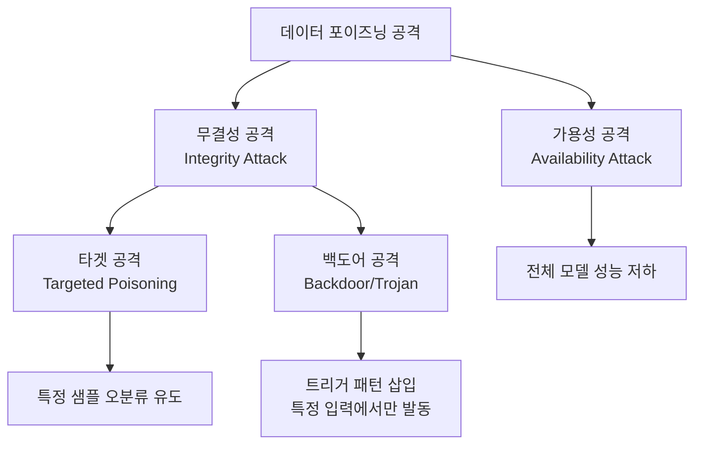
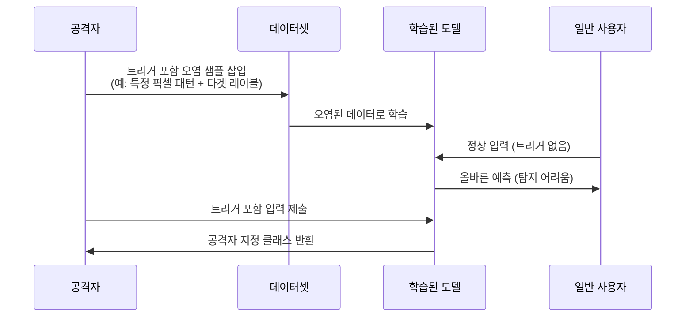
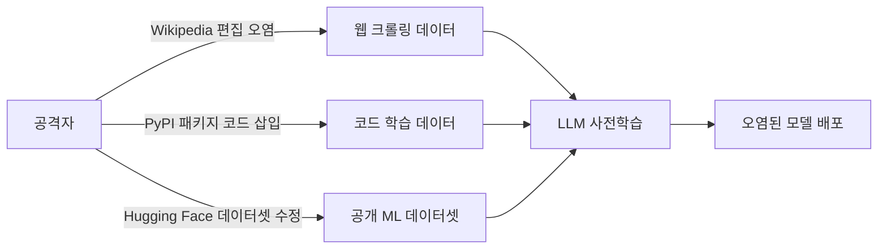

# 데이터 포이즈닝 공격 (Data Poisoning Attacks)

데이터 포이즈닝 공격(data poisoning attack)은 **모델 학습 전 단계에서 학습 데이터를 오염시켜 모델의 예측 행동을 공격자가 원하는 방향으로 조작**하는 기법이다. [[adversarial-attacks-robustness]]의 인퍼런스 시간 공격(FGSM, PGD 등)과 달리, 포이즈닝은 학습 파이프라인 자체를 공격 표면으로 삼는다.

## 왜 중요한가

현대 ML 시스템은 대규모 인터넷 크롤링 데이터, 서드파티 데이터셋, 사용자 피드백 데이터 등 다양한 출처로부터 학습 데이터를 수집한다. 이 과정에서 공격자가 데이터 일부를 제어할 수 있다면 모델 전체를 손상시킬 수 있다. [[pretraining-data-curation]] 단계의 취약성이 직접 연결된다.

## 공격 유형 분류

### 1. 가용성 공격 (Availability Attack)

학습 데이터를 다량 오염시켜 모델 전체 성능을 떨어뜨린다. 서비스 거부(DoS) 유사 효과. 예시: 레이블 뒤집기(label flipping) - 전체 학습셋의 10-30%를 잘못된 레이블로 교체.

### 2. 타겟 공격 (Targeted Poisoning)

특정 테스트 샘플이 오분류되도록 학습 데이터를 정밀 조작한다. 클린-레이블 공격(clean-label attack)이 특히 교묘한데, **레이블은 올바르지만 입력에 적대적 섭동을 추가**해 모델이 잘못된 특성을 학습하게 만든다.

### 3. 백도어/트로이 공격 (Backdoor Attack)

학습 데이터에 **트리거 패턴(trigger pattern)**이 포함된 샘플을 삽입한다. 트리거가 없는 정상 입력에서는 모델이 올바르게 동작하지만, 특정 패턴이 붙으면 공격자가 원하는 클래스로 오분류한다.

## LLM에서의 데이터 포이즈닝

대규모 언어 모델(LLM)에서 포이즈닝은 더 넓은 의미를 갖는다:

- **지식 오염**: 특정 사실을 잘못 학습시켜 편향된 정보 제공
- **인스트럭션 백도어**: 특정 프롬프트 패턴에 반응하는 숨겨진 행동 삽입
- **아이디어 도용 방지**: 학습 데이터 포이즈닝으로 자신의 데이터를 무단 크롤링하는 모델을 방해 (Nightshade, Glaze 등)

## [[pretraining-data-curation]] 과의 연결

포이즈닝 방어의 핵심은 [[pretraining-data-curation]] 단계에서의 데이터 품질 관리다:

| 방어 방법 | 설명 |
|-----------|------|
| 데이터 정제(data sanitization) | 이상치 탐지로 의심 샘플 필터링 |
| 강건 학습(robust training) | 잠재적 포이즈닝에 강한 손실 함수 사용 |
| 인증된 방어 | 포이즈닝 비율 $p$ 이하에서 예측 불변 수학적 보장 |
| 데이터 출처 추적 | 공급망 감사(supply chain audit)로 오염 가능 경로 관리 |

## 공격 성능 지표

- **공격 성공률(Attack Success Rate, ASR)**: 트리거 입력 중 공격자 지정 레이블로 분류되는 비율
- **클린 정확도 유지율**: 정상 입력에 대한 성능 저하 없이 공격 유지
- **포이즈닝 비율**: 전체 학습 데이터 중 오염 샘플 비율 (현실적으로 0.1~5%)

## 현실 위협 시나리오

실제 2023년 연구에서 위키피디아의 0.1%만 수정해도 GPT급 LLM의 특정 사실 지식을 조작할 수 있음이 시연됐다.

## 탐지 및 방어 기법

**학습 시 방어**:
- Spectral Signatures: 오염 샘플이 활성화 공간에서 보이는 이상 스펙트럼 탐지
- Activation Clustering: 중간 레이어 표현을 클러스터링해 이상 그룹 식별
- STRIP: 추론 시 무작위 변환을 적용해 백도어 반응 탐지

**모델 배포 후 방어**:
- Fine-Pruning: 백도어 관련 뉴런을 가지치기 후 미세 조정
- Neural Cleanse: 최소 트리거 역공학으로 백도어 트리거 역추적

## 실무 관점

- 오픈소스 학습 데이터를 무조건 신뢰하지 말 것 - 공급망 감사 필수
- 파인튜닝 단계에서 소량 오염 데이터로도 큰 효과 발생 가능
- LLM 안전성(alignment) 연구와 포이즈닝 방어가 점점 교차 중
- [[adversarial-attacks-robustness]] 평가 시 인퍼런스 공격뿐 아니라 포이즈닝 저항성도 검토 필요

## 관련 문서

- [[adversarial-attacks-robustness]] - 적대적 공격의 전체 분류 체계
- [[pretraining-data-curation]] - 포이즈닝 방어의 첫 번째 방어선인 데이터 수집/정제
- [[fgsm-fast-gradient-sign]] - 인퍼런스 시간 적대적 공격과의 차이점 비교
- [[pgd-adversarial-training]] - 포이즈닝과 다른 학습 시 강건화 기법
