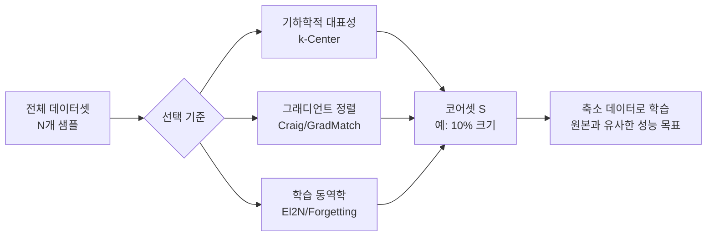
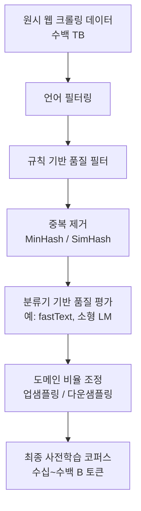

# 최적 데이터 선택

## 개요

최적 데이터 선택(Optimal Data Selection)은 전체 학습 데이터 중에서 모델 성능을 최대화하는 부분집합을 찾는 방법론이다. 모든 데이터를 동등하게 사용하는 대신, 적은 양의 고품질 데이터로 더 나은 모델을 학습시키는 것을 목표로 한다. [[data-centric-ai]]의 핵심 연구 주제이며, 대규모 사전학습([[pretraining-data-curation]])에서 실용적 중요성이 특히 크다.

## 주요 접근 방식

### 1. 코어셋(Coreset) 선택

코어셋은 전체 데이터 분포를 최대한 대표하는 소규모 부분집합이다. 목표는 코어셋으로 학습한 모델이 전체 데이터로 학습한 모델과 성능 차이를 최소화하는 것이다.

**대표적 방법들:**

- **k-Center Greedy**: 이미 선택된 샘플들과 가장 먼 샘플을 반복 추가. 기하학적 커버리지 보장
- **Herding**: 선택된 샘플들의 평균 특성 벡터가 전체 데이터 평균에 수렴하도록 탐욕적 선택
- **Facility Location**: 서브모듈(submodular) 최적화로 커버리지를 최대화

### 2. 그래디언트 매칭(Gradient Matching)

코어셋 선택의 이론적으로 가장 잘 정당화된 접근이다. 선택된 부분집합으로 계산한 그래디언트가 전체 데이터의 그래디언트와 최대한 일치하도록 최적화한다.

**핵심 수식:**

$$S^* = \arg\min_{S \subset D, |S| \leq k} \left\| \nabla_\theta L(D) - \nabla_\theta L(S) \right\|$$

**대표 알고리즘:**

| 방법 | 특징 | 확장성 |
|------|------|--------|
| CRAIG | 서브모듈 그래디언트 매칭 | 중간 규모 |
| GradMatch | 직교 매칭 추적(OMP) 기반 | 대규모 |
| GLISTER | 검증 세트 기준 온라인 선택 | 동적 업데이트 |

### 3. 학습 동역학 기반 선택

모델이 학습되는 과정에서 각 샘플이 어떤 특성을 보이는지를 분석하여 선택 기준으로 활용한다.

- **EL2N(Error L2-Norm)**: 초기 에포크에서 샘플별 예측 오차의 크기로 중요도 평가. 오차가 큰 샘플은 도전적이지만 유익할 가능성이 높음
- **Forgetting Events**: 학습 중 특정 샘플이 정확히 분류되었다가 틀리는 횟수 추적. 자주 망각되는 샘플은 경계 샘플(boundary examples)로 중요
- **Data Maps**: 학습 과정 전반의 확신도(confidence)와 변동성(variability)으로 샘플을 "쉬움/어려움/모호함"으로 분류

### 4. 중요도 가중치 기반 필터링

전체 데이터를 사용하되 샘플마다 다른 가중치를 부여하는 방식으로, 선택이 아닌 가중치 조정이라는 점에서 엄밀히는 다르지만 같은 목적을 공유한다.

- **Self-Paced Learning**: 초기엔 쉬운 샘플만, 점차 어려운 샘플 포함
- **Curriculum Learning**: 미리 정의된 순서나 난이도 스케줄에 따라 데이터를 제시
- **Influence-based Reweighting**: [[trak-attribution]] 같은 귀인 점수를 가중치로 직접 사용

## 사전학습 스케일에서의 데이터 선택

대규모 언어 모델과 비전 모델의 사전학습에서 데이터 선택은 질적으로 다른 문제가 된다.

[[pretraining-data-curation]]에서 핵심 과제는:

1. **중복 제거(Deduplication)**: 웹 크롤링 데이터에는 동일하거나 유사한 텍스트가 대량 포함됨. MinHash, Bloom Filter 기반 근사 중복 제거
2. **품질 필터링**: 휴리스틱(언어 감지, 퍼플렉서티 필터, 규칙 기반 필터)과 분류기 기반 필터링 혼용
3. **도메인 혼합 비율**: 코드, 웹 텍스트, 책, 학술 논문 등 도메인 간 비율을 실험적으로 최적화 (예: Pile, SlimPajama의 도메인 구성 연구)

## 평가 방식

데이터 선택 방법의 품질은 일반적으로 다음으로 평가한다:

- **프루닝 비율별 성능 곡선**: 전체 데이터의 10%, 30%, 50%만 쓸 때 원본 대비 성능 하락 폭
- **전이 가능성**: 특정 아키텍처/태스크용 선택 방법이 다른 설정에서도 유효한지
- **계산 비용 효율**: 선택 과정에 소요된 FLOPs 대비 다운스트림 학습 절감 FLOPs

## 실무 적용 팁

- 코어셋 크기가 10% 미만이면 그래디언트 매칭 방법도 성능 하락이 커짐. 적어도 20~30% 이상에서 신뢰할 수 있는 결과
- 학습 동역학 기반 방법(EL2N, Forgetting)은 초기 학습 비용이 추가되지만 선택 품질이 높아 전체적으로 효율적인 경우가 많음
- 초대형 모델에서는 완전한 코어셋 선택보다 데이터 필터링 + 도메인 혼합 비율 조정이 더 현실적

## 관련 문서

- [[data-centric-ai]] - 데이터 중심 AI의 철학적 배경
- [[pretraining-data-curation]] - 사전학습 단계의 대규모 데이터 큐레이션
- [[trak-attribution]] - 데이터 귀인 점수를 선택 기준으로 활용
- [[annotation-efficiency]] - 선택된 데이터에 대한 효율적 레이블링 전략
