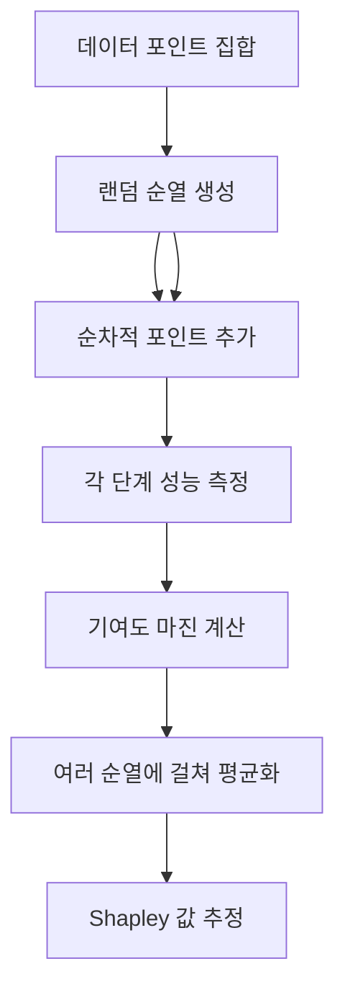

# 데이터 Shapley 가치 평가

## 개요

데이터 Shapley(Data Shapley)는 게임 이론의 Shapley 값(Shapley value)을 머신러닝 데이터에 적용하여, 개별 훈련 데이터 포인트가 모델 성능에 기여하는 정도를 정량화하는 방법론이다. Ghorbani & Zou(2019)가 ICML에서 제안했다.

## 이론적 배경

### Shapley 값 기초

게임 이론에서 Shapley 값은 협력 게임(cooperative game)의 각 참여자가 연합(coalition)에 기여한 공정한 몫을 계산한다. 데이터 Shapley에서는:

- **참여자(player)**: 개별 훈련 데이터 포인트
- **연합(coalition)**: 특정 데이터 부분집합
- **페이오프(payoff)**: 해당 부분집합으로 학습한 모델의 검증 성능

데이터 포인트 $i$의 Shapley 값은 다음으로 정의된다:

$$\phi_i = \sum_{S \subseteq D \setminus \{i\}} \frac{|S|!(|D|-|S|-1)!}{|D|!} [V(S \cup \{i\}) - V(S)]$$

이는 포인트 $i$를 추가했을 때 성능 향상의 가중 평균이다.

## 계산 복잡도와 근사

### 정확 계산의 비실용성

데이터셋 크기 $n$에 대해 정확한 Shapley 계산은 $O(2^n)$ 부분집합을 평가해야 한다. $n=1000$이어도 우주의 원자 수보다 많은 경우의 수가 생긴다.

### Monte Carlo 근사 (TMC-Shapley)

Truncated Monte Carlo Shapley(TMC-Shapley)는 임의의 순열을 반복 샘플링하여 계산 비용을 크게 줄인다. 성능 수렴을 확인하면 조기에 순열 추가를 중단(truncation)하여 효율을 높인다.

### KNN-Shapley

k-최근접 이웃(KNN) 분류기의 경우 닫힌 형태의 근사식이 존재한다. 모델 재학습 없이 데이터 포인트의 Shapley 값을 효율적으로 계산할 수 있어, 대규모 데이터셋에서도 실용적으로 사용된다.

## 주요 활용 사례

### 1. 코어셋 선택 (Coreset Selection)

Shapley 값이 높은 포인트를 선별해 소규모 대표 데이터셋을 구성한다. 훈련 비용을 줄이면서 성능을 최대한 유지하는 데 효과적이다.

### 2. 중독 데이터 탐지 (Poisoned Data Detection)

악의적으로 삽입된 훈련 데이터는 음수(-) Shapley 값을 가지는 경향이 있다. 이를 활용해 데이터 중독 공격(data poisoning attack)으로 오염된 샘플을 탐지할 수 있다.

### 3. 데이터 마켓 가격 책정

데이터 소유자 간에 데이터 기여도에 따라 보상을 공정하게 분배하는 데 활용된다. 연합 학습(federated learning) 환경에서 참여자별 공정 보상 계산에도 적용된다.

### 4. 학습 커리큘럼 설계

Shapley 값이 낮은 포인트(모델에 거의 도움이 안 되거나 해로운 포인트)를 제거하거나 학습 후반부에 배치하는 커리큘럼 전략에 활용된다.

## SHAP(Feature Attribution)과의 구분

| 항목 | Data Shapley | SHAP |
|------|-------------|------|
| 기여도 대상 | 훈련 데이터 포인트 | 입력 특성(feature) |
| 게임 참여자 | 데이터 인덱스 | 특성 인덱스 |
| 사용 목적 | 데이터 가치 평가 | 예측 해석 |
| 계산 시점 | 훈련 데이터 기준 | 추론 시 |

SHAP는 특정 예측에 각 입력 특성이 얼마나 기여했는지를 측정하고, Data Shapley는 특정 훈련 샘플이 모델 전체 성능에 얼마나 기여했는지를 측정한다.

## 한계

- **스케일 문제**: 대규모 딥러닝 모델에서 TMC-Shapley도 수천 번의 재학습이 필요해 비현실적
- **모델 의존성**: 검증 성능을 평가 기준으로 삼으므로, 기준 모델과 평가 세트 선택에 민감
- **분포 가정**: 데이터 포인트가 독립적이라고 가정하지만, 실제 데이터에는 상관관계가 존재
- **계산 비용**: 정확한 계산은 여전히 지수적 복잡도

## 최신 발전

- **Beta Shapley**: 균일 분포 대신 Beta 분포로 가중치를 조정해 더 안정적인 추정 제공
- **DVRL(Data Valuation using Reinforcement Learning)**: 강화학습으로 데이터 가치 함수 학습
- **OpenDataVal**: 다양한 데이터 가치 평가 알고리즘을 통합 비교하는 벤치마크 라이브러리

## 관련 문서

- [[influence-functions-ml]] - 재학습 없이 훈련 데이터 영향도 추정
- [[data-centric-ai]] - 데이터 품질 중심 AI 패러다임
- [[data-poisoning-attacks]] - 중독 데이터 공격 기법
- [[data-selection-optimal]] - 최적 데이터 선택 전략
