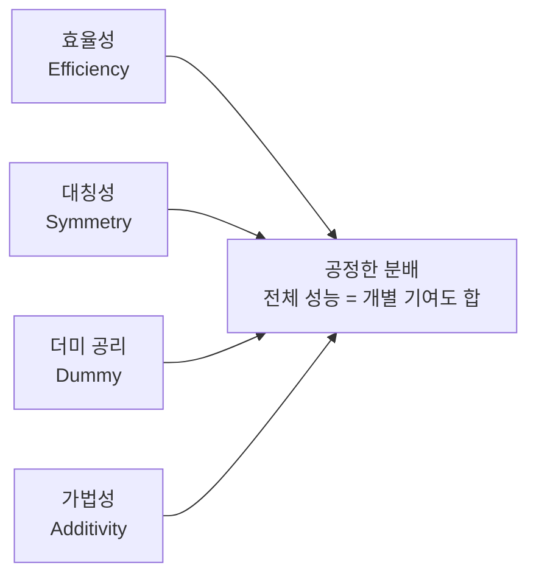

# Data Shapley

Data Shapley는 협력 게임 이론(cooperative game theory)의 샤플리 값(Shapley value)을 머신러닝에 적용해, **개별 학습 데이터 포인트가 모델 성능에 기여하는 정도를 정량화**하는 프레임워크다. [[data-centric-ai]]의 핵심 도구로, "어떤 데이터가 가장 중요한가"에 대한 수학적으로 공정한 답을 제공한다.

## 직관적 배경

100개의 학습 데이터가 있다고 하자. 어떤 데이터 포인트가 "좋은" 데이터이고, 어떤 것이 노이즈나 레이블 오류를 포함한 "나쁜" 데이터인가? 단순히 특정 데이터를 제거했을 때 성능이 변하는지 보는 것은 직관적이지만, 데이터 간 **상호작용 효과**를 무시한다.

샤플리 값은 이 문제를 게임 이론적으로 해결한다: 각 플레이어(데이터 포인트)의 기여도는 **모든 가능한 연합(subset)에서 해당 플레이어가 추가될 때의 한계 기여도 평균**으로 정의된다.

## 공식 정의

학습 데이터셋 $D = \{z_1, z_2, \ldots, z_n\}$이 주어졌을 때, 데이터 포인트 $z_i$의 Data Shapley 값은:

$$\phi_i = \frac{1}{n} \sum_{S \subseteq D \setminus \{z_i\}} \binom{n-1}{|S|}^{-1} [V(S \cup \{z_i\}) - V(S)]$$

여기서 $V(S)$는 부분집합 $S$로 학습한 모델의 검증 성능(예: 정확도)이다.

## 샤플리 값의 핵심 공리



- **효율성**: 모든 데이터의 샤플리 값 합 = 전체 데이터셋의 성능 기여
- **대칭성**: 동일하게 기여하는 두 데이터는 동일한 값
- **더미 공리**: 어느 연합에도 기여하지 않으면 값 = 0
- **가법성**: 두 게임의 합산 게임에서 값 = 개별 게임 값의 합

이 네 공리를 동시에 만족하는 분배는 **샤플리 값이 유일**하다.

## 계산 과제와 근사 방법

정확한 샤플리 값 계산은 $O(2^n)$ 번의 모델 재학습이 필요하므로, 실용적으로는 근사 방법을 사용한다.

| 방법 | 아이디어 | 복잡도 |
|------|----------|--------|
| Monte Carlo 샘플링 | 무작위 순열 샘플링 | $O(k \cdot n)$, $k$는 샘플 수 |
| KNN-Shapley | KNN 모델에서 해석적 계산 | $O(n \log n)$ |
| Data-OOB | Out-of-bag 추정 | 배깅 기반, 빠름 |
| TMC-Shapley | Truncated Monte Carlo | 조기 종료로 가속 |

KNN-Shapley는 딥러닝 모델에서도 유효한 대리(proxy) 값을 제공한다는 실험 결과가 있다.

## 실무 활용

### 1. 노이즈 데이터 탐지

샤플리 값이 **음수**인 데이터 포인트는 모델 성능을 오히려 저하시키는 경향이 있다. 레이블 오류, 분포 외(out-of-distribution) 샘플, 적대적 예시 등을 자동으로 검출하는 데 사용할 수 있다.

```python
# 의사 코드: 낮은 Shapley 값 데이터 제거
shapley_values = compute_data_shapley(train_data, val_data, model)
clean_data = train_data[shapley_values > threshold]
model.retrain(clean_data)
```

### 2. 데이터 구매/판매 가격 책정

연합 학습 또는 데이터 마켓플레이스에서, 각 참여자가 제공한 데이터의 가치를 공정하게 평가해 보상을 분배할 수 있다.

### 3. 코어셋(Coreset) 구성

높은 샤플리 값을 가진 데이터 포인트만 선별하면 원본 데이터셋과 유사한 성능을 훨씬 적은 데이터로 달성할 수 있다.

## [[influence-functions]]와의 비교

[[influence-functions]]도 개별 학습 데이터의 영향을 측정하는 도구지만 접근 방식이 다르다:

| 특성 | Data Shapley | Influence Functions |
|------|-------------|---------------------|
| 이론적 기반 | 협력 게임 이론 | 1차 테일러 근사 |
| 상호작용 고려 | 명시적으로 고려 | 고려하지 않음 |
| 계산 복잡도 | $O(2^n)$ (근사 필요) | $O(n \cdot p)$, p=파라미터 수 |
| 비선형 모델 | 적용 가능 | 근사 오차 커짐 |

Shapley는 공리적으로 더 공정하지만, 계산 비용이 높다.

## 관련 문서

- [[data-centric-ai]] - 데이터 품질 중심 AI 개발 방법론 전반
- [[influence-functions]] - 1차 근사 기반 데이터 영향도 측정
- [[data-annotation]] - 레이블링 품질이 샤플리 값에 미치는 영향
- [[data-attribution-influence]] - 데이터 귀인(attribution) 방법 비교
