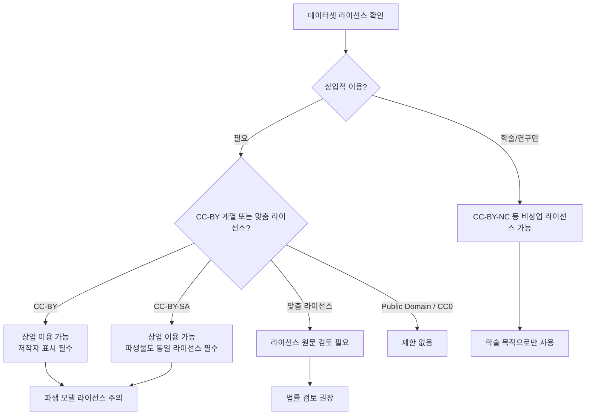
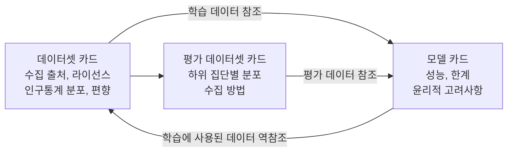

# 데이터셋 카드 (Dataset Cards)

데이터셋 카드(Dataset Card)는 머신러닝 학습·평가에 사용되는 데이터셋을 표준화된 형식으로 문서화한 메타데이터 문서다. Gebru et al.의 "Datasheets for Datasets"(2018, NeurIPS 워크샵 → 2021, Communications of the ACM) 논문이 원형을 제시했고, Hugging Face Hub에서 사실상의 산업 표준으로 구현되었다. [[model-cards]]가 모델을 문서화한다면, 데이터셋 카드는 그 모델을 만드는 데 사용된 데이터를 문서화한다.

## 왜 데이터셋 카드가 필요한가

ML 파이프라인의 품질과 공정성은 대부분 데이터에서 결정된다. 그러나 오랫동안 데이터셋은 "주어진 것"으로 취급되어 체계적 문서화가 부족했다. 데이터셋 카드가 해결하는 문제:

1. **데이터 출처 불명**: 어디서, 언제, 어떻게 수집됐는지 모르면 편향 원인을 추적할 수 없다
2. **라이선스 불분명**: 상업 이용 가능 여부, 파생 데이터셋 허용 여부가 불명확하면 법적 위험 발생
3. **데이터 분포 미공개**: 학습 데이터의 인구통계 분포를 모르면 성능 편향을 예측할 수 없다
4. **재현성 부재**: 같은 데이터셋을 재현하거나 비교하기 위한 정보가 없으면 과학적 재현성이 낮아진다
5. **윤리적 수집 과정 미확인**: 동의(consent), 개인정보, 취약 집단 데이터 수집 과정이 불투명

## Datasheets for Datasets (Gebru et al.)

Timnit Gebru 등이 2018년 제안한 원형 프레임워크. 전자 부품의 데이터시트(datasheet)에서 영감을 받아 데이터셋에도 동일한 수준의 기술 문서가 필요하다고 주장했다.

논문이 제안한 7개 섹션:

| 섹션 | 핵심 질문 |
|------|----------|
| 동기(Motivation) | 왜 이 데이터셋을 만들었는가? 누가 만들었는가? |
| 구성(Composition) | 무엇으로 이루어져 있는가? 각 인스턴스는 무엇을 나타내는가? |
| 수집 과정(Collection Process) | 어떻게 수집됐는가? 누가 수집에 참여했는가? 보상이 있었는가? |
| 전처리/정제(Preprocessing/Cleaning) | 어떤 전처리가 수행됐는가? 원본 데이터에 접근 가능한가? |
| 활용(Uses) | 어떤 용도로 이미 사용됐는가? 적합하지 않은 용도는? |
| 배포(Distribution) | 어떻게 배포되는가? 라이선스는? |
| 유지관리(Maintenance) | 누가 유지관리하는가? 오류 보고 채널은? |

## Hugging Face Dataset Card 표준

Hugging Face Hub에서 사실상의 산업 표준으로 구현된 형식. 저장소의 `README.md` 상단에 YAML 메타데이터를 삽입하고, 그 아래에 자유 형식 마크다운 문서를 작성한다.

### YAML 메타데이터 구조

```yaml
---
language:
  - ko
  - en
license: cc-by-4.0
task_categories:
  - text-classification
  - question-answering
task_ids:
  - multi-class-classification
pretty_name: "한국어 감성 분석 코퍼스"
size_categories:
  - 10K<n<100K
source_datasets:
  - original
tags:
  - korean
  - sentiment
  - nlp
dataset_info:
  features:
    - name: text
      dtype: string
    - name: label
      dtype:
        class_label:
          names:
            '0': 부정
            '1': 중립
            '2': 긍정
  splits:
    - name: train
      num_bytes: 12345678
      num_examples: 80000
    - name: validation
      num_bytes: 1500000
      num_examples: 10000
    - name: test
      num_bytes: 1500000
      num_examples: 10000
---
```

### 본문 권장 섹션

Hugging Face가 권장하는 Dataset Card 본문 구조:

```markdown
# 데이터셋 이름

## 데이터셋 설명
### 데이터셋 요약
### 지원 태스크 및 언어

## 데이터셋 구조
### 데이터 인스턴스
### 데이터 필드
### 데이터 분할

## 데이터셋 생성
### 수집 출처
### 수집 방법 및 처리
### 어노테이션 (해당되는 경우)
### 인적 저작

## 고려사항
### 사회적 영향
### 편향 및 위험
### 다른 알려진 제한사항

## 추가 정보
### 데이터셋 큐레이터
### 라이선스
### 인용 정보
```

## 데이터 수집 윤리

데이터셋 카드의 핵심 역할 중 하나는 **윤리적 수집 과정**을 문서화하고 점검하는 것이다.

### 동의(Consent)와 개인정보

```
점검 항목:
- 데이터 주체의 명시적 동의를 받았는가?
- 공개 데이터라도 수집 목적이 원래 게시 맥락과 다르지 않은가?
- 개인 식별 정보(PII)가 적절히 익명화됐는가?
- GDPR, CCPA 등 관련 규제를 준수했는가?
```

### 취약 집단 데이터

- 아동, 환자, 이민자 등 취약 집단의 데이터를 포함하는 경우 별도 보호 조치 명시
- 수집 시점의 권력 불균형(연구자-피험자) 고려
- 재식별(re-identification) 위험 평가

### 크라우드소싱 어노테이션

Amazon Mechanical Turk, Scale AI 등 크라우드소싱 플랫폼을 사용한 경우:
- 어노테이터의 인구통계 정보 (가능한 범위에서)
- 작업당 보수 및 산정 근거
- 품질 관리 방법

## 라이선스 체계

데이터셋 라이선스는 모델 학습에 직접적 법적 영향을 미친다.



주요 데이터셋 라이선스 비교:

| 라이선스 | 상업 이용 | 수정/파생 | 저작자 표시 | 동일 라이선스 |
|---------|---------|---------|-----------|-------------|
| CC0 / Public Domain | 가능 | 가능 | 불필요 | 불필요 |
| CC-BY | 가능 | 가능 | 필수 | 불필요 |
| CC-BY-SA | 가능 | 가능 | 필수 | 필수 |
| CC-BY-NC | 불가 | 가능 | 필수 | 불필요 |
| Apache 2.0 | 가능 | 가능 | 필수 | 불필요 |
| 맞춤(Custom) | 라이선스마다 다름 | 라이선스마다 다름 | 라이선스마다 다름 | 라이선스마다 다름 |

**LLM 사전학습 데이터 라이선스 이슈**: 웹 크롤 데이터(Common Crawl 등)를 사용한 모델은 원본 웹페이지의 저작권 상태가 불명확해 소송 위험이 있다. 데이터셋 카드에 이 불확실성을 명시하는 것이 책임 있는 관행이다.

## 편향 문서화

데이터셋의 편향(bias)을 사전에 문서화하는 것이 [[ai-evaluation]]에서 모델 공정성 평가의 선행 조건이다.

### 표현 편향 (Representation Bias)

```python
# 데이터셋 인구통계 분포 분석 예시
import pandas as pd

df = pd.read_csv("dataset.csv")

# 언어 분포
lang_dist = df['language'].value_counts(normalize=True)

# 성별 분포 (어노테이션이 있는 경우)
gender_dist = df['gender'].value_counts(normalize=True)

# 지역 분포
region_dist = df['region'].value_counts(normalize=True)

print("언어 분포:")
print(lang_dist)
# 영어 97%, 기타 3% 같은 불균형 발견 시 카드에 명시
```

### 측정 편향 (Measurement Bias)

어노테이션 과정에서 발생하는 편향:
- 어노테이터 합의 점수(inter-annotator agreement) 공개
- 어노테이터 집단이 특정 인구통계에 편중된 경우 명시
- 어노테이션 가이드라인의 문화적 가정 기록

### 역사적 편향 (Historical Bias)

과거 불평등을 반영하는 데이터 (예: 채용 이력에 남성이 더 많은 경우)는 모델이 그 불평등을 학습할 위험이 있다. 이를 데이터셋 카드에 명시하고 하류(downstream) 모델 팀에 경고해야 한다.

## 데이터 카드 자동화 도구

### Hugging Face `datasets` 라이브러리

```python
from datasets import load_dataset, DatasetInfo

# 데이터셋 메타데이터 접근
dataset = load_dataset("klue/klue", "sts")
print(dataset["train"].info.description)
print(dataset["train"].info.license)
print(dataset["train"].features)
```

### Google Data Cards Playbook

Google이 공개한 데이터 카드 작성 프레임워크. 특히 고위험 AI 시스템에 사용되는 데이터셋에 적용을 권장한다. 사용 제한(use limitation), 민감도 수준(sensitivity level), 라이선스를 구조화된 형식으로 기록한다.

## 데이터셋 카드와 모델 카드의 관계



완전한 투명성을 위해서는 모델 카드가 학습 데이터셋의 Dataset Card를 참조하고, Dataset Card는 해당 데이터로 학습된 모델의 [[model-cards]]를 역참조하는 쌍방향 구조가 이상적이다.

## 대형 LLM 학습 데이터셋 카드 사례

| 데이터셋 | 카드 품질 | 주요 공개 정보 |
|---------|---------|-------------|
| The Pile (EleutherAI) | 상세 | 구성 비율, 라이선스별 분류, 편향 분석 |
| RedPajama | 상세 | 데이터 출처별 비중, 필터링 과정 |
| Dolma (AI2) | 매우 상세 | 각 하위 코퍼스별 별도 카드 |
| 사전학습 데이터 (GPT-4) | 미공개 | 학습 데이터 세부사항 비공개 |
| 학습 데이터 (Llama 3) | 부분 공개 | 고수준 구성 비율만 공개 |

## 실무 체크리스트

데이터셋 배포 전 최소한 다음 항목을 Dataset Card에 포함해야 한다:

```
필수 항목:
- [ ] 데이터셋 목적 및 생성 동기
- [ ] 인스턴스 수 및 분할(train/val/test) 크기
- [ ] 라이선스 명시 (링크 포함)
- [ ] 수집 방법 (크롤링, 설문, 실험 등)
- [ ] 언어 및 도메인 분포
- [ ] 개인정보/PII 처리 방법

권장 항목:
- [ ] 어노테이션 방법 및 어노테이터 정보
- [ ] 알려진 편향 및 한계
- [ ] 학습/평가 사용 이력
- [ ] 데이터 업데이트 이력
- [ ] 유지관리 담당자 및 오류 보고 방법
```

## 관련 문서

- [[model-cards]] - 모델 카드: 데이터셋 카드의 쌍이 되는 모델 문서화
- [[ai-evaluation]] - 평가 데이터셋 선정 및 하위 집단별 평가
- [[data-augmentation]] - 데이터 증강 기법과 원본 데이터와의 관계
- [[responsible-scaling]] - 책임 있는 스케일링에서 데이터 품질의 역할
- [[fairness-metrics-bias-auditing]] - 공정성 감사에서 데이터셋 편향 분석
