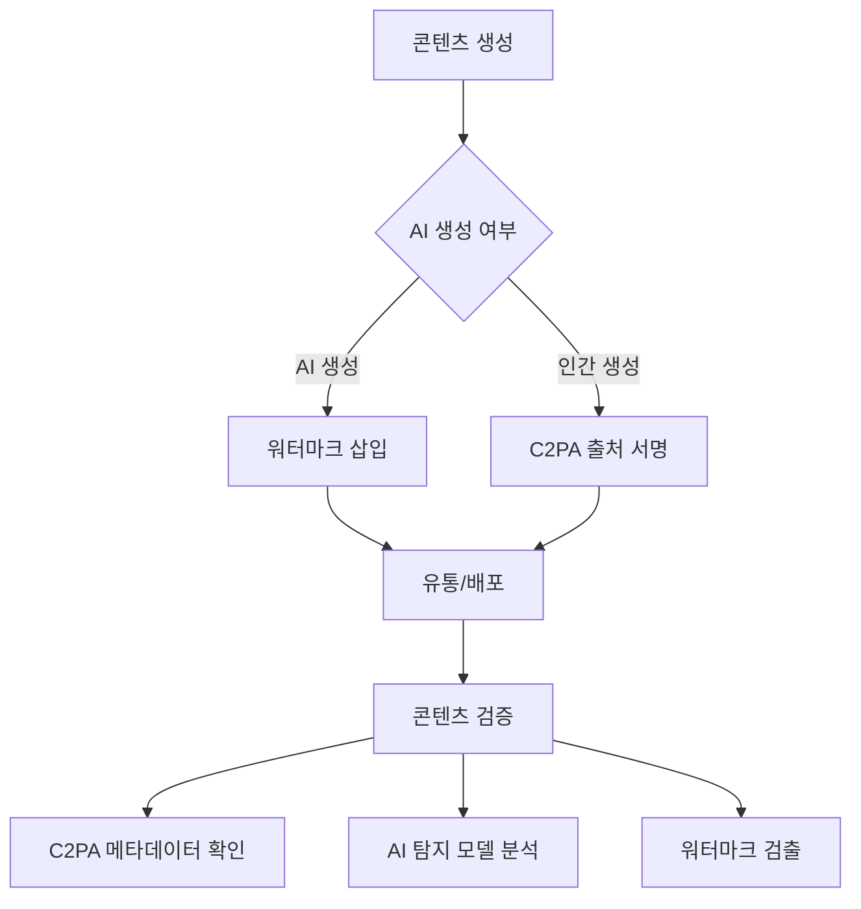
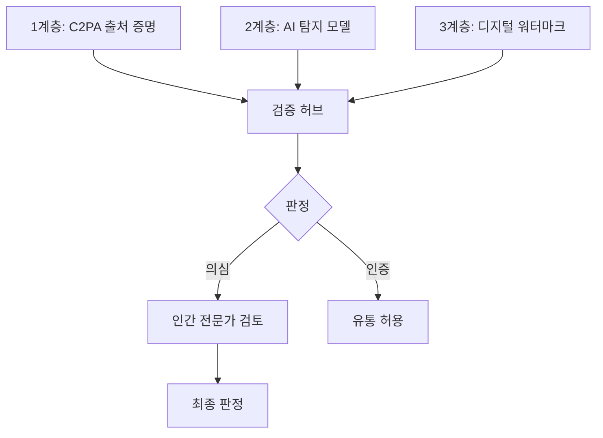

## 개요

딥페이크 기술의 급속한 발전으로 합성 미디어 탐지와 콘텐츠 인증이 AI 안전의 핵심 과제로 부상했다. 특히 [[ai-voice-cloning-scams|AI 음성 복제 사기]]와 결합할 때 사회적 피해가 크다. C2PA(Coalition for Content Provenance and Authenticity)는 디지털 콘텐츠에 "영양 성분표"와 같은 출처 정보를 부착하는 개방형 표준으로, 140개 이상의 기관이 참여하고 있다. 이에 대한 법적 규제는 [[ai-regulation-us|미국 AI 규제]] 프레임워크를 통해 구체화되고 있다. 한편, 인간의 딥페이크 식별 정확도가 54%에 불과하다는 연구 결과는 기술적 탐지 솔루션의 필요성을 더욱 강조한다.

## 핵심 개념

**C2PA(Coalition for Content Provenance and Authenticity)**: 콘텐츠의 생성/편집 이력을 암호학적으로 서명하여 추적 가능하게 하는 개방형 표준. 디지털 콘텐츠의 "출처 증명서" 역할을 한다.

**적대적 세탁(Adversarial Laundering)**: 최신 생성 모델이 알려진 탐지 시그니처를 의도적으로 우회하도록 설계되는 현상. 탐지 기술과 생성 기술 간의 지속적인 군비 경쟁을 야기한다.

**AI 워터마킹**: 생성된 콘텐츠에 인간에게는 보이지 않지만 기계가 감지할 수 있는 디지털 서명을 삽입하는 기술.

## 현황 (2026)

**위협 규모**:
- 2026년 Q1 글로벌 딥페이크 관련 사기 사건 **420만 건** (2024년 Q1 대비 217% 증가)
- 2025년 금융기관 딥페이크 피해 **118억 달러**
- MIT 연구: 소비자용 도구로 방송 품질 딥페이크 6분 이내 제작 가능

**탐지 기술**:
- Intel FakeCatcher 3세대: 얼굴의 픽셀 수준 색상 변화에서 혈류 패턴을 분석하는 생체 신호 기반 접근. 통제된 데이터셋에서 98.3% 탐지 정확도 주장
- Microsoft Video Authenticator: 2024년 이후 생성된 9억 건 이상의 합성 미디어 샘플로 재학습
- Nature Human Behaviour (2026.02): 훈련받은 참가자도 딥페이크 식별 정확도 **54%** -- 무작위 추측 수준
- 탐지 기술의 구조적 한계: UC Berkeley의 Hany Farid 교수에 따르면 "지난달 생성 모델로 훈련된 탐지기가 이번 달 출력에 대해 치명적으로 실패할 수 있다"

**규제 및 표준**:
- DEEPFAKES Accountability Act: 2026.03 미 상원 통과, AI 생성 콘텐츠 워터마킹 표준 의무화 (준수 기한 2027년 Q1)
- [[eu-ai-act-enforcement]]: 월 50만+ 사용자 플랫폼에 인증된 탐지 시스템 배포 의무 (미준수 시 글로벌 매출 6% 벌금)
- C2PA 연합 **140개 이상** 기관 참여, Reuters/AP 등 조기 도입으로 합성 미디어 편집 도달률 **34% 감소**

**기업 시장**:
- Cloudflare Media Trust Layer 2026.02 출시
- Reality Defender: 2026.03 기준 기업 계약 가치 전년 대비 **300% 증가**

## 기술 상세

### C2PA 기술 아키텍처

C2PA 표준은 콘텐츠 촬영 시점부터 디지털 서명을 삽입하는 출처 증명(provenance) 방식이다. Canon, Nikon, Leica가 2025-2026 펌웨어 업데이트를 통해 카메라 수준에서 C2PA 서명을 지원하기 시작했다. Adobe, Google, Sony를 포함한 140개 이상의 기관이 연합에 참여하고 있으며, 각 콘텐츠에 생성/편집 이력이 암호학적으로 기록된다.

### 다층 방어 아키텍처

단일 탐지 기술에 의존하는 것은 불충분하다. C2PA 출처 증명(생성 이력 추적), AI 탐지 모델(생체 신호/압축 아티팩트 분석), 디지털 워터마크(기계 판독 서명)를 결합한 다층 접근이 2026년의 업계 표준으로 자리잡고 있다.

### 엔터프라이즈 플랫폼

Reality Defender와 Sensity AI는 자동 탐지 도구가 의심 콘텐츠를 플래그하면 전문 훈련을 받은 인간 리뷰어가 최종 검증하는 인간-AI 협업 플랫폼을 구축했다. 이 접근법은 인간의 54% 정확도 한계와 AI 탐지기의 적대적 세탁 취약성을 동시에 보완한다.

## 전망/과제

**군비 경쟁**: 탐지 기술이 발전할수록 생성 모델도 이를 우회하도록 진화하는 구조적 한계가 있다. 적대적 세탁(adversarial laundering) -- 알려진 탐지 시그니처를 의도적으로 우회하도록 생성 모델을 미세조정하는 기법 -- 이 탐지-생성 간 군비 경쟁을 가속화한다.

**표준 채택**: C2PA가 표준으로 자리잡으려면 소셜 미디어 플랫폼, 카메라 제조사, 편집 소프트웨어 전반의 생태계 참여가 필수적이다. Reuters/AP의 조기 도입이 합성 미디어 편집 도달률을 34% 감소시킨 성과는 표준 채택의 실효성을 입증한다.

**인간-AI 협업 탐지**: 인간의 한계(54% 정확도)를 감안할 때, AI 기반 자동 탐지와 인간 전문가 검증을 결합한 하이브리드 접근이 현실적 대안이다.

### 카메라 수준 C2PA 지원

C2PA 표준 채택의 전환점은 카메라 제조사의 참여다. Canon, Nikon, Leica가 2025-2026 펌웨어 업데이트를 통해 촬영 시점부터 C2PA 서명을 삽입하기 시작했다. 이는 콘텐츠 생성의 최상류에서 출처를 보증하는 것으로, 이후 편집/배포 과정에서 서명 체인이 유지된다. 소셜 미디어 플랫폼이 이 서명을 검증하는 인프라를 갖추면, 콘텐츠 유통 전 과정의 진위 확인이 가능해진다.

## 관련 문서

- [[ai-video-generation]] - AI 비디오 생성과 합성 미디어
- [[ai-audio-voice-cloning]] - 음성 복제와 합성 음성 탐지
- [[ai-voice-cloning-scams]] -- AI 음성 복제를 이용한 사기 수법과 대응
- [[ai-regulation-us]] - 미국 DEEPFAKES Accountability Act
- [[eu-ai-act-enforcement]] - EU AI Act의 합성 콘텐츠 규제
