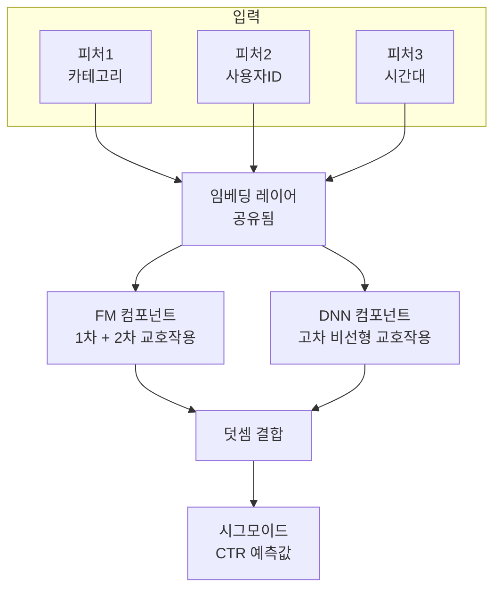
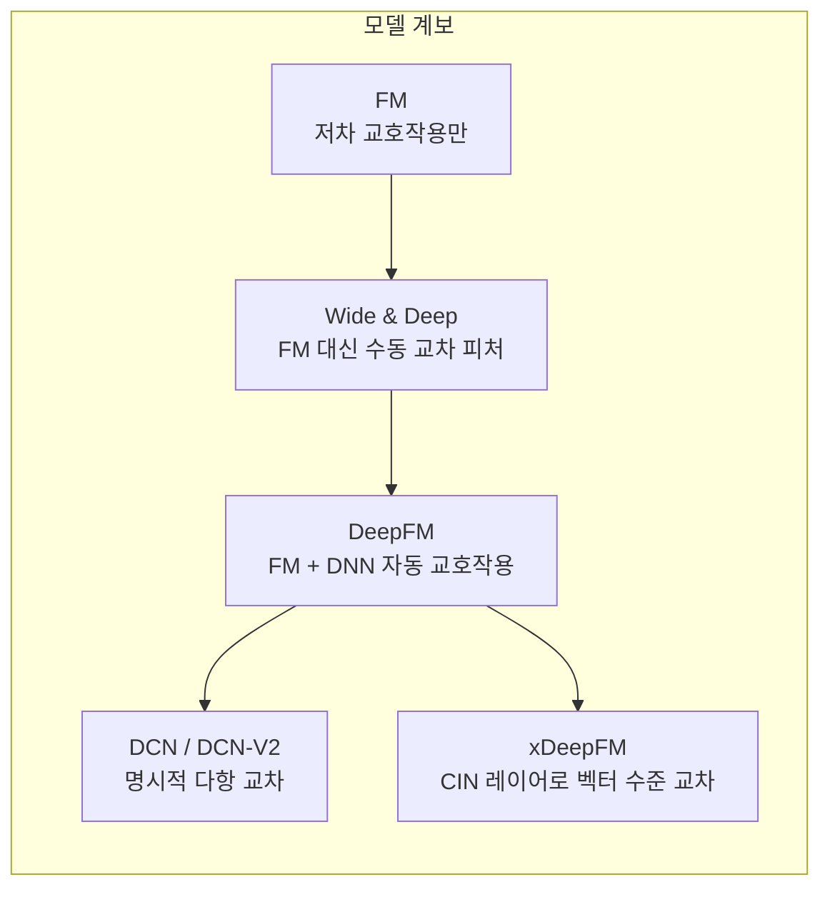

# DeepFM - FM과 DNN의 병렬 결합

DeepFM(Guo et al., 2017)은 **Factorization Machine(FM)**과 **Deep Neural Network(DNN)**을 병렬로 결합한 CTR(Click-Through Rate) 예측 모델이다. FM이 저차 특성 교호작용(low-order feature interaction)을 효율적으로 포착하고, DNN이 고차 비선형 교호작용(high-order interaction)을 학습하여 두 관점을 동시에 활용한다.

## 배경: 왜 DeepFM인가

광고 클릭률 예측(CTR Prediction)에서 특성 교호작용은 매우 중요하다:

- **저차 교호작용**: "맥주 + 기저귀" 같은 2차 교호작용 (FM이 잘 포착)
- **고차 교호작용**: "여름 + 주말 + 스포츠 용품" 같은 3차 이상 (DNN이 필요)

기존 Wide & Deep 모델(Google, 2016)은 Wide 부분에서 수동 피처 엔지니어링이 필요했다. DeepFM은 이 수작업 없이 FM으로 자동으로 저차 교호작용을 학습한다.

## 모델 구조

핵심은 **임베딩 레이어를 FM과 DNN이 공유**한다는 점이다. 같은 임베딩에서 두 경로가 각자의 교호작용을 학습하므로, 표현을 일관되게 유지하면서 연산도 효율적이다.

## FM 컴포넌트 상세

FM(Factorization Machine)은 다음과 같이 출력값을 계산한다:

$$y_{FM} = w_0 + \sum_{i=1}^n w_i x_i + \sum_{i=1}^n \sum_{j=i+1}^n \langle \mathbf{v}_i, \mathbf{v}_j \rangle x_i x_j$$

- $w_i x_i$: 1차 항 (각 피처의 선형 기여)
- $\langle \mathbf{v}_i, \mathbf{v}_j \rangle x_i x_j$: 2차 교호작용 항

특히 2차 항을 전개하면 $\mathcal{O}(kn)$으로 계산할 수 있어 피처 수 $n$에 대해 선형 시간이다:

$$\sum_{i=1}^n \sum_{j>i} \langle \mathbf{v}_i, \mathbf{v}_j \rangle x_i x_j = \frac{1}{2}\left[\left\|\sum_i \mathbf{v}_i x_i\right\|^2 - \sum_i \|\mathbf{v}_i x_i\|^2\right]$$

## DNN 컴포넌트 상세

FM의 임베딩 벡터 $\mathbf{v}_i$를 이어붙여(flatten) DNN의 입력으로 사용한다:

$$\mathbf{a}^{(0)} = [\mathbf{v}_1, \mathbf{v}_2, \ldots, \mathbf{v}_n]$$
$$\mathbf{a}^{(l+1)} = \sigma(\mathbf{W}^{(l)} \mathbf{a}^{(l)} + \mathbf{b}^{(l)})$$

ReLU 활성화 함수와 드롭아웃(Dropout)을 주로 사용하며, 보통 3개 이상의 은닉층을 쌓는다.

## 최종 출력

$$\hat{y} = \sigma(y_{FM} + y_{DNN})$$

두 컴포넌트의 출력을 단순히 더한 후 시그모이드를 적용한다. 별도의 가중치 결합 없이 덧셈만으로도 좋은 성능이 나온다.

## 타 모델과의 비교

| 모델 | 저차 교호작용 | 고차 교호작용 | 수동 피처 엔지니어링 |
|------|-------------|-------------|-------------------|
| FM | FM (자동) | 없음 | 불필요 |
| Wide & Deep | Linear (수동) | DNN | Wide 부분 필요 |
| **DeepFM** | **FM (자동)** | **DNN** | **불필요** |
| xDeepFM | CIN (자동) | DNN | 불필요 |

## 실무 적용 포인트

### 카테고리형 피처 처리

광고/추천 데이터는 대부분 고차원 희소 원-핫(one-hot) 피처다. DeepFM은 이를 저차원 밀집 임베딩으로 압축한 후 처리하므로 차원의 저주 문제를 회피한다.

### 임베딩 차원 선택

FM과 DNN이 임베딩을 공유하므로 차원은 단일하게 설정된다. 보통 피처별 카디널리티에 따라 4~64 사이에서 선택하며, 경험적으로 $\lceil 6 \times (\text{카디널리티})^{0.25} \rceil$ 규칙을 활용하기도 한다.

### 산업 사례

- **华为 (Huawei)**: 앱스토어 CTR 예측에 DeepFM 적용, Wide & Deep 대비 AUC 향상 보고
- **Criteo, Avazu** 공개 데이터셋에서 Wide & Deep 및 Neural FM 대비 일관된 우위

## 한계

- 2차 이상의 명시적 고차 교호작용을 제어하기 어려움 (DCN-V2, xDeepFM이 이를 개선)
- 연속형 수치 피처 처리 시 별도 정규화/버킷팅 필요
- 실시간 CTR 예측 환경에서는 임베딩 테이블 크기가 메모리 병목이 될 수 있음

## 관련 문서

- [[tabular-feature-interaction]] - 테이블 형 데이터에서의 특성 교호작용 모델링 기법
- [[recommendation-systems-dl]] - 딥러닝 기반 추천 시스템 전반
- [[ncf-neural-collaborative]] - 협업 필터링 관점에서의 신경망 모델 NCF
- [[embedding-layers]] - 희소 피처를 위한 임베딩 레이어 원리
