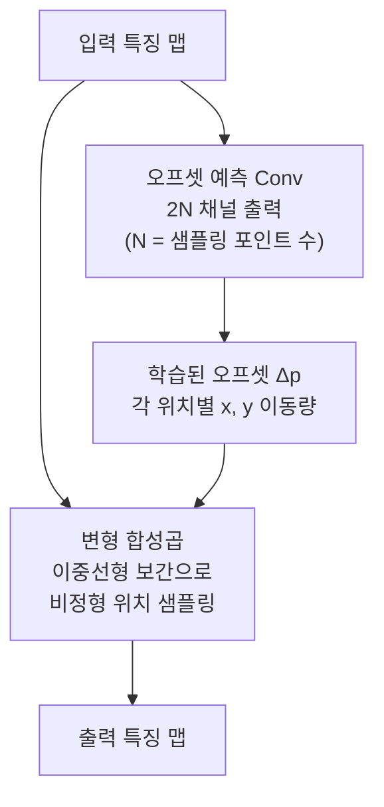
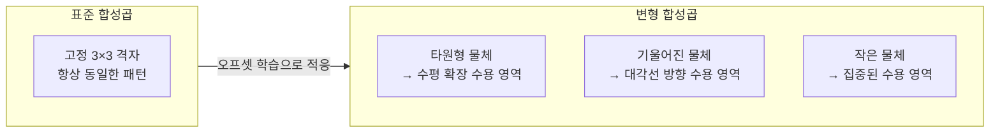

# 변형 합성곱 (Deformable Convolution)

## 개요

변형 합성곱(Deformable Convolution)은 2017년 Dai 등이 제안한 기법으로, 표준 합성곱의 고정된 격자(grid) 샘플링 위치를 학습 가능한 오프셋(offset)으로 대체한다. 네트워크가 입력 데이터의 기하학적 변환(회전, 크기 변화, 비선형 왜곡 등)에 맞게 수용 영역(receptive field)을 자동으로 조정할 수 있게 한다.

[[cnn]]의 표준 합성곱 필터는 항상 동일한 격자 패턴(예: 3×3)으로 샘플링한다. 이는 회전·변형된 객체를 처리할 때 제약이 된다. 변형 합성곱은 [[detr-detection-transformer]] 등 고성능 탐지 모델에서 핵심 구성 요소로 채택됐다.

## 표준 합성곱 vs 변형 합성곱

### 표준 합성곱의 샘플링

3×3 표준 합성곱의 샘플링 위치는 고정된 오프셋 집합 $\mathcal{R}$로 정의된다.

$$\mathcal{R} = \{(-1,-1), (-1,0), \ldots, (1,0), (1,1)\}$$

출력 위치 $p_0$에서의 합성곱:
$$y(p_0) = \sum_{p_n \in \mathcal{R}} w(p_n) \cdot x(p_0 + p_n)$$

### 변형 합성곱의 샘플링

각 샘플링 위치에 학습된 오프셋 $\Delta p_n$을 더한다.

$$y(p_0) = \sum_{p_n \in \mathcal{R}} w(p_n) \cdot x(p_0 + p_n + \Delta p_n)$$

$\Delta p_n$은 일반적으로 소수점(fractional) 값이므로, $x(p_0 + p_n + \Delta p_n)$은 이중선형 보간(bilinear interpolation)으로 계산한다.



오프셋 예측 Conv는 메인 합성곱과 동일한 입력을 받아 학습되는 별도 레이어다.

## DCNv2 (Deformable ConvNets v2)

2019년 Zhu 등이 제안한 개선 버전으로, 오프셋뿐 아니라 **변조 가중치(modulation scalar)**도 학습한다.

$$y(p_0) = \sum_{p_n \in \mathcal{R}} w(p_n) \cdot x(p_0 + p_n + \Delta p_n) \cdot \Delta m_n$$

$\Delta m_n \in [0, 1]$은 각 샘플링 포인트의 중요도를 나타낸다. 이를 통해 관련 없는 위치의 기여를 억제할 수 있다.

| 특징 | DCNv1 | DCNv2 |
|------|-------|-------|
| 오프셋 학습 | O | O |
| 변조 가중치 | X | O |
| 표현력 | 중간 | 높음 |
| 연산 비용 | 낮음 | 약간 높음 |

## 시각화: 수용 영역의 적응



객체의 형태에 따라 수용 영역이 자동으로 변형된다.

## 구현 예시 (PyTorch)

```python
import torchvision.ops as ops

# DCNv2 스타일 변형 합성곱
# offset: (N, 2*kernel_h*kernel_w, H, W)
# mask: (N, kernel_h*kernel_w, H, W)
output = ops.deform_conv2d(
    input=feature_map,
    offset=predicted_offset,
    weight=conv_weight,
    mask=predicted_mask,  # DCNv2의 변조 가중치
    bias=None,
    stride=1,
    padding=1,
)
```

## 적용 분야

**객체 탐지**: Faster R-CNN, [[detr-detection-transformer]] 등에서 백본 또는 디코더에 적용. 다양한 크기·종횡비의 객체를 더 잘 포착한다.

**시맨틱 세그멘테이션**: DeepLab 계열에서 ASPP(Atrous Spatial Pyramid Pooling) 대신 또는 병렬로 사용.

**3D 포인트 클라우드**: 공간적으로 불규칙한 포인트에 대해 유연한 집계를 구현할 때 영감을 제공.

**의료 영상**: CT·MRI에서 기관 모양이 환자마다 달라 고정 필터의 한계가 크므로 효과적이다.

## 한계와 주의사항

- **연산 비용**: 오프셋 예측 Conv가 추가 파라미터와 FLOPs를 요구한다.
- **훈련 안정성**: 오프셋이 과도하게 커지면 이미지 경계 밖을 참조해 학습이 불안정해질 수 있다 (zero-padding 또는 clipping으로 완화).
- **추론 속도**: TensorRT 등 최적화 도구에서 deformable conv 지원이 표준 conv보다 덜 최적화돼 있어 속도 손실이 있을 수 있다.

## 관련 문서

- [[cnn]] - 합성곱 신경망 기초 구조 및 표준 합성곱
- [[detr-detection-transformer]] - 변형 합성곱을 활용하는 대표적 탐지 아키텍처
- [[squeeze-excitation-networks]] - 채널 어텐션 기반 특징 재조정
