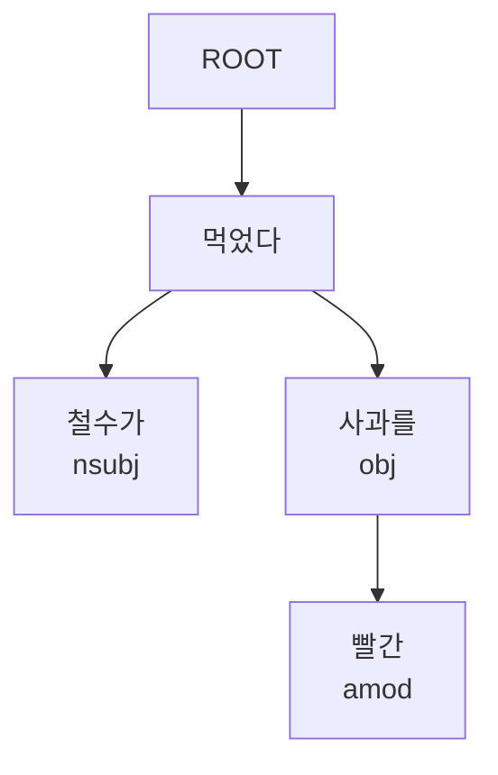

# 의존 구문 분석 (Dependency Parsing)

의존 구문 분석(Dependency Parsing)은 문장 내 단어들 사이의 문법적 의존 관계를 트리 구조로 표현하는 NLP 태스크다. 각 단어(의존소, dependent)는 정확히 하나의 다른 단어(핵어, head)에 의존하며, 전체 문장은 하나의 루트(ROOT)를 가진 방향성 그래프를 형성한다. [[transformer-architecture]]와 [[bert]] 기반 모델이 이 태스크에서 현재 SOTA를 달성하고 있다.

## 왜 중요한가

의존 구문 분석이 제공하는 문법 구조는:

- **정보 추출**: "A가 B를 매입했다"에서 주어-동사-목적어 관계를 파악해 사건 참여자를 정확히 추출
- **관계 추출 보조**: 두 엔티티 사이의 의존 경로(dependency path)가 관계 유형의 강력한 피처
- **기계번역**: 소스 언어의 문법 구조를 활용한 번역 품질 향상
- **질의응답**: 질문의 핵어 파악으로 핵심 정보 요구사항 식별
- **텍스트 단순화**: 복문을 단문으로 분할할 때 의존 트리 기반 분할점 탐색

## 의존 관계 기본 개념

### Universal Dependencies (UD)
전 세계 100개 이상 언어에 공통으로 적용되는 의존 구문 태그셋. 주요 의존 관계:

| 태그 | 의미 | 예시 |
|------|------|------|
| nsubj | 명사 주어 | "철수가" → "먹다" |
| obj | 목적어 | "밥을" → "먹다" |
| amod | 형용사 수식어 | "빨간" → "사과" |
| advmod | 부사 수식어 | "빨리" → "달리다" |
| conj | 등위 접속 | "사과" → "배" (사과와 배) |
| root | 문장의 핵어 | 주동사 |

### 의존 트리 예시

"철수가 빨간 사과를 먹었다"의 의존 트리:



## 파싱 알고리즘의 분류

```mermaid
flowchart LR
    DP[의존 구문 분석] --> TRANS[전이 기반\n Transition-based]
    DP --> GRAPH[그래프 기반\n Graph-based]

    TRANS --> ARC[Arc-standard\nArc-eager]
    TRANS --> O1[O(n) 속도\n선형 시간]

    GRAPH --> MST[최대 신장 트리\nEisner 알고리즘]
    GRAPH --> ON2[O(n²) ~ O(n³)\n전역 최적화]
```

### 전이 기반 파싱 (Transition-based)
스택과 버퍼를 유지하면서 SHIFT, LEFT-ARC, RIGHT-ARC 등의 전이 동작을 순차적으로 결정한다. 대표 시스템: MaltParser, ArcEager. 선형 시간 복잡도라 속도가 빠르나, 지역 결정(greedy)으로 인한 오류 전파가 단점이다.

### 그래프 기반 파싱 (Graph-based)
단어 쌍 사이의 의존 점수를 모두 계산한 후 최대 신장 트리(MST)를 구해 전역 최적해를 찾는다. 대표 시스템: MSTParser, Biaffine Parser. 전역 최적화로 정확도가 높지만 속도가 느리다.

## 트랜스포머 기반 의존 구문 분석

Biaffine Dependency Parser(Dozat & Manning, 2017)는 현대 의존 구문 분석의 표준 아키텍처다. BERT 인코더 위에 biaffine attention을 사용해 각 단어 쌍에 대한 의존 점수와 관계 레이블을 동시에 예측한다.

```python
# Biaffine 파서 핵심 구조
# BERT 인코딩 후 head/dependent 표현을 별도 MLP로 투영
# biaffine 점수로 의존 방향과 레이블을 동시 예측

head_repr = MLP_head(bert_output)        # [batch, seq, d]
dep_repr = MLP_dep(bert_output)          # [batch, seq, d]
arc_score = biaffine(head_repr, dep_repr) # [batch, seq, seq]
rel_score = biaffine_rel(head_repr, dep_repr) # [batch, seq, seq, n_rels]
```

최신 BERT 기반 Biaffine 파서는 Penn Treebank(영어) 기준 UAS(Unlabeled Attachment Score) 96% 이상, LAS(Labeled Attachment Score) 94% 이상을 달성한다.

## 주요 데이터셋 및 벤치마크

| 데이터셋 | 언어 | 특징 |
|---------|------|------|
| Penn Treebank (PTB) | 영어 | 의존 구문의 영어 표준 벤치마크 |
| Universal Dependencies (UD) | 100+ 언어 | 다국어 공통 태그셋 |
| KLUE-DP | 한국어 | 한국어 의존 구문 분석 표준 |
| SynTagRus | 러시아어 | 굴절어 의존 구문의 대표 벤치마크 |

## 한국어 의존 구문 분석의 특성

한국어는 교착어(agglutinative language)로 어간에 다양한 접사가 붙는다. 의존 구문 분석 전에 형태소 분석이 필수적이며, 어절 단위 vs. 형태소 단위 파싱 방식 간 선택이 중요하다.

또한 한국어는 **SOV(주어-목적어-서술어)** 어순을 기본으로 하나 어순이 비교적 자유롭고, 주어 생략이 빈번해 의존 관계 파악이 영어보다 복잡하다.

## SpaCy에서의 의존 구문 분석

```python
import spacy

nlp = spacy.load("en_core_web_trf")
doc = nlp("Apple is buying a UK startup for $1 billion.")

for token in doc:
    print(f"{token.text:10} {token.dep_:10} {token.head.text}")
# Apple      nsubj      buying
# is         aux        buying
# buying     ROOT       buying
# startup    dobj       buying
```

## 실무 적용 관점

- **의존 경로(Dependency Path)**: 두 엔티티 사이의 최단 의존 경로는 관계 추출의 강력한 피처다. "A - nsubj - 매입하다 - dobj - B"라는 경로는 "A가 B를 매입했다"는 관계의 강한 신호
- **서브트리 추출**: 특정 핵어의 하위 트리만 추출해 텍스트를 구조적으로 분절하는 데 활용
- **의존 구문 + LLM**: 최근에는 LLM이 명시적 파서 없이도 구문 정보를 내재적으로 학습한다는 것이 밝혀졌으나, 명시적 파싱 결과가 여전히 해석 가능성(interpretability) 측면에서 유리

## 관련 문서
- [[constituency-parsing]] -- 구 구조 분석 (Constituency Parsing)

- [[transformer-architecture]] - Biaffine 파서의 인코더 기반 아키텍처
- [[bert]] - 현대 의존 구문 분석기의 핵심 인코더
- [[semantic-role-labeling]] - 의존 구조를 활용하는 의미역 결정
- [[relation-extraction]] - 의존 경로를 피처로 활용하는 관계 추출
- [[coreference-resolution]] - 문법 구조가 상호참조 해결에 활용되는 맥락
