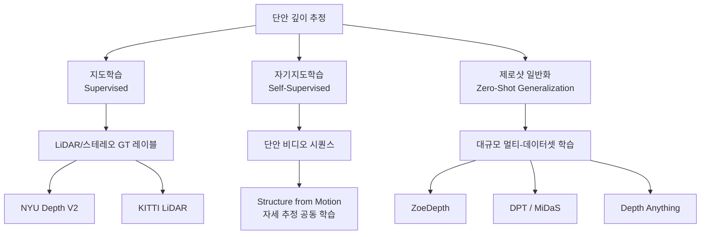

# 단안 깊이 추정

## 개요

단안 깊이 추정(monocular depth estimation)은 **단일 RGB 이미지만으로 각 픽셀의 깊이(depth) 값을 예측**하는 컴퓨터 비전 태스크다. 스테레오 카메라나 LiDAR 없이 깊이 정보를 얻을 수 있어 자율주행, AR/VR, 3D 재구성 등 다양한 응용에서 핵심 기술로 활용된다. [[vision-transformer]] 기반 모델이 이 분야를 급속도로 발전시켰으며, [[3d-gaussian-splatting]] 등 3D 재구성 기법의 초기화에도 자주 사용된다.

## 문제의 난이도: 고유 모호성

단일 이미지에서의 깊이 추정은 **기하학적으로 비결정 문제(ill-posed problem)**다. 동일한 2D 이미지를 생성할 수 있는 3D 장면이 무한히 많다. 인간은 다음 단서(cue)들로 깊이를 지각한다:

- **크기 단서**: 알려진 물체의 크기와 이미지 내 크기 비교
- **질감 기울기**: 멀수록 질감이 촘촘해짐
- **음영/그림자**: 빛의 방향과 그림자 형태
- **대기 원근법**: 멀수록 채도 감소, 청색 편향
- **모션 패럴랙스**: 이동 시 가까운 물체가 빠르게 움직임 (단일 이미지에서는 없음)

딥러닝 모델은 이런 단서들을 데이터에서 암묵적으로 학습한다.

## 접근법 분류

## 주요 아키텍처 발전

### 1. CNN 기반 초기 모델 (2014-2020)

Eigen et al. (2014)의 선구적 작업 이후 CNN 기반 인코더-디코더 아키텍처가 주류였다. U-Net 스타일의 스킵 커넥션으로 고주파 디테일을 보존하면서 깊이를 예측한다.

### 2. ViT 기반 모델 (2021~)

[[vision-transformer]] 기반의 DPT(Dense Prediction Transformer)가 등장하며 판도를 바꿨다. ViT 인코더의 전역 어텐션이 원근법적 일관성을 훨씬 잘 포착한다.

**MiDaS v3.1 / DPT**: 다수의 데이터셋을 혼합 학습하여 제로샷 일반화 달성

**Depth Anything(2024)**: 레이블 없는 6200만 장 이미지를 자기지도 학습에 활용하여 이전 모델 대비 대폭 성능 향상

### 3. 자기지도 학습 (SfM 기반)

Monodepth2, PackNet-SfM 등은 연속 비디오 프레임에서 카메라 자세 변화와 깊이를 공동으로 학습한다. 레이블 없이도 경쟁력 있는 깊이 추정이 가능하다.

## 평가 지표

| 지표 | 수식 | 의미 |
|------|------|------|
| AbsRel | $\frac{1}{N}\sum \frac{\|d_i - \hat{d}_i\|}{d_i}$ | 상대 절대 오차 (낮을수록 좋음) |
| SqRel | $\frac{1}{N}\sum \frac{(d_i - \hat{d}_i)^2}{d_i}$ | 상대 제곱 오차 |
| $\delta < 1.25$ | $\%$ pixels with $\max(d/\hat{d}, \hat{d}/d) < 1.25$ | 임계값 내 정확도 (높을수록 좋음) |
| RMSE | $\sqrt{\frac{1}{N}\sum(d_i - \hat{d}_i)^2}$ | 절대 오차 (스케일 의존적) |

스케일 모호성 때문에 많은 방법이 예측 깊이와 GT를 중앙값 비율로 맞추는 전처리 후 평가한다.

## 3D 재구성과의 연동

단안 깊이 추정 결과는 [[3d-gaussian-splatting]] 및 NeRF([[volume-rendering-differentiable]])의 초기화에 활용된다:

1. **3DGS 초기화**: 깊이 맵을 포인트 클라우드로 변환 → Gaussian의 초기 위치로 사용
2. **NeRF 가속화**: 깊이 사전 정보로 광선 샘플링 범위를 좁혀 학습 가속
3. **정규화 항**: 추정 깊이와 렌더링 깊이의 일관성을 손실 항으로 추가

## 스케일-모호성 문제

단안 깊이 추정은 절대 스케일(metric scale)을 복원할 수 없다. 예측 깊이는 상대적인 깊이 순서는 맞지만 실제 미터 단위 깊이와 임의의 스케일 오프셋이 있다. 이를 해결하는 방법:

- **스케일+시프트 정렬**: GT 깊이 일부를 활용해 두 파라미터 정렬
- **카메라 고유 행렬 정보 추가**: ZoeDepth는 카메라 intrinsic을 함께 입력받아 metric depth 예측
- **IMU/LiDAR 퓨전**: 센서 융합으로 절대 스케일 복원

## 실무 적용

- **자율주행**: 저비용 단일 카메라로 근거리 장애물 감지 보조
- **스마트폰 포트레이트 모드**: 배경 분리를 위한 깊이 추정
- **로봇 항법**: 실내 환경에서 깊이 기반 장애물 회피
- **콘텐츠 창작**: 2D 영상의 2.5D 인페인팅, 가상 카메라 무빙

## 관련 문서
- [[depth-estimation-stereo]] -- 스테레오 깊이 추정 (Stereo Depth Estimation)

- [[vision-transformer]] - DPT/Depth Anything의 기반 인코더
- [[3d-gaussian-splatting]] - 깊이 추정 결과를 초기화로 활용
- [[volume-rendering-differentiable]] - NeRF에서 깊이와 렌더링의 결합
- [[optical-flow-deep-learning]] - 비디오의 움직임 추정 (깊이와 상보적)
