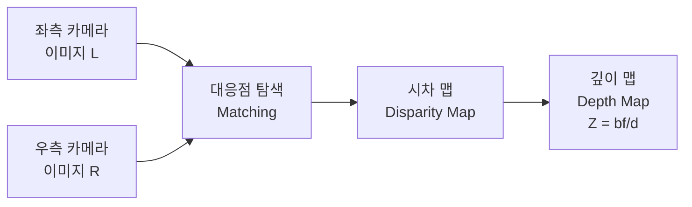
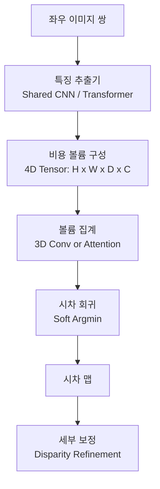

# 스테레오 깊이 추정 (Stereo Depth Estimation)

## 개념 요약

스테레오 깊이 추정(Stereo Depth Estimation)은 수평으로 일정 거리(기준선, baseline) 떨어진 두 카메라(좌·우)로 촬영한 이미지 쌍에서 각 픽셀의 깊이(depth)를 추정하는 컴퓨터 비전 기술이다. 인간의 양안 시각(binocular vision)과 동일한 원리로, 좌우 이미지에서 같은 물체가 나타나는 위치 차이(시차, disparity)로부터 거리를 계산한다.

[[depth-estimation-monocular]]가 단일 이미지에서 단서를 추론하는 것과 달리, 스테레오는 물리적 기하학에 기반한 절대 깊이 계산이 가능하다.

## 핵심 원리: 시차와 깊이

두 카메라의 기준선 길이 $b$, 초점 거리 $f$, 시차(disparity) $d$ 사이의 관계:

$$Z = \frac{b \cdot f}{d}$$

- $Z$: 해당 점까지의 깊이
- $d = x_L - x_R$: 좌우 이미지에서 대응점의 수평 위치 차

시차가 클수록(가까운 물체) 깊이가 작고, 시차가 작을수록(먼 물체) 깊이가 크다.

## 전통적 방법 vs 딥러닝 방법

### 전통적 접근 (Block Matching, SGM)

Semi-Global Matching(SGM, Hirschmuller 2008)이 오랜 기간 표준이었다:
1. 비용 볼륨(cost volume) 구성: 각 픽셀과 시차 후보에 대한 매칭 비용
2. 전역 최적화: 8방향 동적 프로그래밍으로 에너지 최소화
3. 시차 맵 추출 및 후처리

실시간 구동 가능, 하지만 반복 텍스처, 반사면, 가려진 영역(occlusion)에 취약하다.

### 딥러닝 기반 접근

**주요 딥러닝 모델:**

| 모델 | 연도 | 특징 |
|------|------|------|
| DispNet | 2016 | 최초 엔드투엔드 스테레오 CNN |
| GC-Net | 2017 | 4D 비용 볼륨 + 3D Conv |
| PSMNet | 2018 | 피라미드 풀링 + 3D CNN |
| RAFT-Stereo | 2021 | 반복적 정제, [[optical-flow-deep-learning]]에서 착안 |
| CREStereo | 2022 | 계층적 반복 정제 |
| IGEV-Stereo | 2023 | 결합 기하 임베딩 볼륨 |

## 비용 볼륨 (Cost Volume)

딥러닝 스테레오 모델의 핵심은 4차원 비용 볼륨이다. 좌측 특징 맵의 각 위치와 우측 특징 맵의 각 시차 후보에 대한 매칭 비용을 저장한다.

- 차원: $H \times W \times D_{max} \times C$
- $D_{max}$: 최대 탐색 시차 (보통 192 픽셀)
- $C$: 채널(특징 차원)

비용 볼륨을 3D 컨볼루션으로 집계하면 공간·시차 차원을 동시에 처리하며 매끄러운 시차 추정이 가능하다.

## RAFT-Stereo의 반복 정제

[[optical-flow-deep-learning]]의 RAFT에서 영감을 받은 RAFT-Stereo는 비용 볼륨을 고정하지 않고, 현재 시차 추정값을 기반으로 반복적으로 볼륨을 조회하며 정제한다:

1. 초기 시차 맵 $d_0$ 설정
2. 현재 $d_t$ 주변 상관관계 볼륨 조회
3. GRU 셀로 업데이트 $\Delta d$ 예측
4. $d_{t+1} = d_t + \Delta d$
5. 충분한 반복 후 최종 시차 출력

## 응용 분야

- **자율주행**: LiDAR 대안 또는 보완 센서로 거리 측정
- **로봇 탐색**: 장애물 감지 및 환경 지도 구성
- **산업 검사**: 3D 형상 측정, 불량 탐지
- **AR/VR**: 실공간의 3D 재구성

## 한계

- **가려짐(Occlusion)**: 한 카메라에만 보이는 영역은 시차 계산 불가
- **반복 텍스처**: 주기적 패턴에서 매칭 모호성 증가
- **큰 시차**: 멀리 있는 물체의 작은 시차는 정밀 측정 어려움
- **기준선 고정**: 카메라 간격이 정해져 있어 너무 가깝거나 먼 물체 측정 범위 제한

단안 깊이 추정([[depth-estimation-monocular]])은 이러한 물리적 제약이 없지만, 스케일 모호성이 존재한다. 두 방법을 결합한 **스테레오-단안 하이브리드** 접근도 활발히 연구된다.

## 관련 문서

- [[depth-estimation-monocular]] - 단일 이미지 깊이 추정과 비교
- [[optical-flow-deep-learning]] - RAFT-Stereo의 기반이 된 광학 흐름 추정
- [[3d-reconstruction]] - 스테레오 깊이를 활용한 3D 장면 복원
- [[autonomous-driving-perception]] - 자율주행 인식 시스템에서의 스테레오 활용
