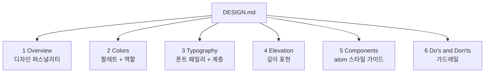

# DESIGN.md 포맷

AI 디자인 에이전트가 읽을 수 있는 **평문 디자인 시스템 문서 포맷**. Google Stitch가 정의했지만 포맷 자체는 portable하며 다른 AI 에이전트(예: [[claude-code]])도 읽고 활용할 수 있다.

## 포맷의 철학

DESIGN.md는 다음 원칙을 따른다:

1. **평문 마크다운** — 특수 schema, build tool, proprietary 문법 없음. 표준 마크다운만 사용
2. **사람과 에이전트 공용** — 사람이 읽고 편집하기 쉽고, AI 에이전트도 그대로 파싱 가능
3. **섹션 고정 순서** — 6개 섹션이 정해진 순서대로 등장 (관련 없는 섹션은 생략 가능)
4. **근사와 정확의 공존** — "warm colors, rounded feel" 같은 근사 기술과 `#2665fd`, `8px radius` 같은 정확 값이 같은 문서에 섞여도 OK
5. **Portable** — Stitch나 다른 특정 도구에 의존하지 않음. 어떤 AI 에이전트에게든 그대로 넘길 수 있음

## 6개 핵심 섹션



순서는 **고정**이고, 프로젝트와 무관한 섹션은 생략 가능.

### 1. Overview
디자인의 look and feel에 대한 전체적 설명. 퍼스널리티, 분위기, 하이레벨 결정 기준. 에이전트가 구체적 토큰이 없을 때 참조하는 fallback 가이드라인.

예: "A calm, professional interface for a healthcare scheduling platform. Accessibility-first design with high contrast and generous touch targets."

### 2. Colors
primary / secondary / tertiary / neutral 네 팔레트. 각 색상은 **hex 값** + **역할(role)** 을 반드시 포함한다. 역할은 "이 색상을 *무엇에* 써야 하는가"를 지정한다.

```markdown
- **Primary** (#2665fd): CTAs, active states, key interactive elements
- **Secondary** (#6074b9): Supporting actions, chips, toggle states
- **Tertiary** (#bd3800): Accent highlights, badges, decorative elements
- **Neutral** (#757681): Backgrounds, surfaces, non-chromatic UI
```

AI 에이전트는 이 base 값에서 **named colors**를 자동 파생한다 (Material color role 관례 기반):
- `surface`, `on-primary`, `on-surface`, `surface-container`, `surface-bright`
- `error`, `on-error`, `outline`, `outline-variant`
- 수십 개 더

### 3. Typography
폰트 패밀리와 타이포그래피 계층. display / headline / title / body / label 5단계가 표준.

```markdown
- **Headline Font**: Inter
- **Body Font**: Inter
- **Label Font**: Inter

Headlines use semi-bold weight. Body text uses regular weight at 14–16px.
Labels use medium weight at 12px with uppercase for section headers.
```

**같은 패밀리** (예: Inter 단일)는 균일함을 전달. **다른 패밀리 혼용** (예: serif headline + sans-serif body)은 의도적 시각 대비.

### 4. Elevation
깊이·계층을 표현하는 방식. 두 가지 접근:
- **Shadow 기반**: spread, blur, color 명시 + 어떤 컴포넌트가 elevated인지
- **Flat 기반**: border 대비와 surface 색상 변화만으로 표현 (surface, surface-container, surface-bright)

### 5. Components
atom 컴포넌트의 스타일 가이드. 프로젝트에 가장 관련 있는 컴포넌트에 집중.

| 컴포넌트 | 명시할 내용 |
|----------|-------------|
| Buttons | Variants (primary/secondary/tertiary), sizing, padding, corner radius, states |
| Chips | Selection, filter, action variants |
| Lists | Item styling, dividers, leading/trailing elements |
| Inputs | Text fields, labels, helper text, error states |
| Checkboxes | Checked, unchecked, indeterminate states |
| Radio buttons | Selected, unselected states |
| Tooltips | Positioning, colors, timing |

### 6. Do's and Don'ts
실천 가이드라인과 함정 경고. AI 에이전트의 **가드레일** 역할. 구체적이고 시행 가능한 규칙으로 표현.

```markdown
- Do use the primary color only for the single most important action per screen
- Don't mix rounded and sharp corners in the same view
- Do maintain WCAG AA contrast ratios (4.5:1 for normal text)
- Don't use more than two font weights on a single screen
```

이 섹션은 [[better-code-with-agents|선택으로서의 품질]] 원칙과 맞닿아 있다 — 구체적 규칙이 있어야 에이전트가 생성한 결과물의 품질이 흔들리지 않는다.

## 생성·편집 방식

사용자가 DESIGN.md를 얻는 경로:

1. **AI가 생성** — "playful coffee shop app with warm colors" 같은 분위기 프롬프트에서 에이전트가 완성
2. **브랜딩에서 파생** — 기존 브랜드 URL 또는 이미지를 분석해 토큰 추출
3. **수동 작성** — 고급 사용자가 마크다운을 직접 작성. 특수 문법·도구 필요 없음

세 경로 모두 같은 최종 포맷으로 수렴한다.

## Portability

DESIGN.md의 가장 큰 가치는 **portable한 standalone 문서**라는 점. 특정 도구나 에이전트에 락인되지 않는다:

- git에 커밋 → 팀 소스오브트루스
- 한 에이전트에서 생성 → 다른 에이전트에 그대로 제공
- 프로젝트 export zip에 포함 → downstream 개발자/도구가 그대로 읽음

이 때문에 Figma 같은 closed 생태계 대신 DESIGN.md를 채택하는 흐름이 만들어진다.

## DESIGN.md의 위치 (세 파일 체계)

DESIGN.md는 AI 에이전트 시대의 **"세 번째 file convention"**이다. 다른 두 개와 함께 프로젝트의 모든 축을 커버한다:

| 파일 | 읽는 주체 | 정의하는 것 |
|------|-----------|-------------|
| README.md | 사람 | 프로젝트가 무엇인지 |
| AGENTS.md | 코딩 에이전트 | 프로젝트를 어떻게 빌드하는지 |
| DESIGN.md | 디자인 에이전트 | 프로젝트가 어떻게 보이고 느껴져야 하는지 |

상세 논의는 [[ai-readable-design-system]] 참조.

## 언제 이 포맷을 쓰는가

- **AI 에이전트로 UI를 생성하는 프로젝트** — 화면 간 일관성을 강제하려면 필수
- **브랜드 가이드라인을 machine-readable하게 만들고 싶을 때** — Figma, PDF 대안
- **팀이 에이전트와 협업** — 사람은 마크다운으로 편집, 에이전트는 같은 파일을 읽음
- **여러 도구 간 디자인 시스템 이식** — portable하므로 vendor lock-in 회피

## 언제 쓰지 않는가

- 정적 웹사이트 한두 개 — 오버킬
- 이미 완성된 Figma 디자인 시스템이 충분하고 AI 생성이 필요 없을 때
- 극도로 복잡한 디자인 시스템 (이 경우 Design Token JSON 같은 더 엄격한 표준이 나을 수 있음)

## 관련 문서

- [[stitch-design-md-guide]]
- [[google-stitch]]
- [[ai-readable-design-system]]
- [[design-tokens]]
- [[better-code-with-agents]]
- [[agentic-engineering]]
