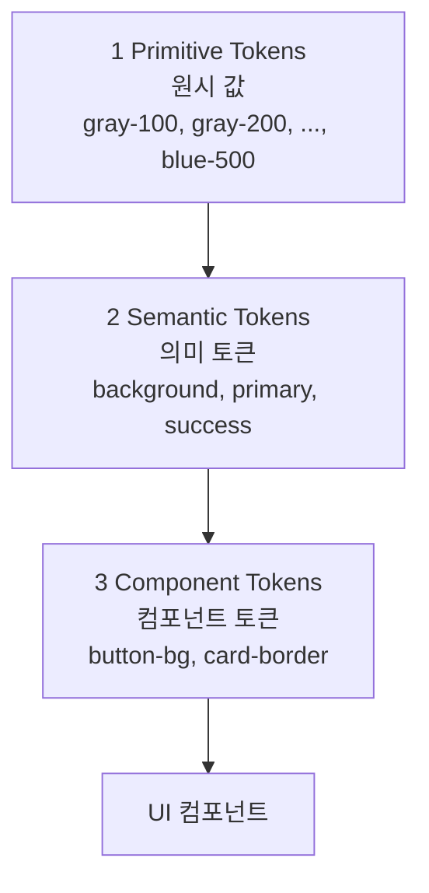

# 디자인 토큰 (Design Tokens)

디자인 시스템의 **원자적 값**을 이름이 붙은 토큰으로 관리하는 패턴. 색상 hex, 폰트 패밀리, spacing 단위, corner radius 등을 직접 하드코딩하지 않고 의미 있는 이름으로 추상화해 참조한다.

## 기본 아이디어

CSS로 예를 들면:

```css
/* 하드코딩 (나쁨) */
.button-primary {
  background: #2665fd;
  padding: 12px 16px;
  border-radius: 8px;
}

/* 토큰 사용 (좋음) */
.button-primary {
  background: var(--color-primary);
  padding: var(--space-3) var(--space-4);
  border-radius: var(--radius-md);
}
```

토큰을 쓰면:
- **일관성**: 같은 색이 모든 곳에서 같은 hex를 가리킴
- **변경 용이성**: 팔레트 변경 시 한 곳만 바꾸면 전체 반영
- **다크/라이트 모드**: 시맨틱 토큰이 모드에 따라 다른 값으로 resolve됨
- **기계 가독성**: 에이전트가 "primary" 같은 이름으로 참조 가능

## 3-Tier 토큰 모델

업계 표준으로 자리 잡은 3계층 모델:



### 1. Primitive Tokens (원시 토큰)
- **역할**: 색상 팔레트, 간격 스케일 같은 raw 값
- **이름 예시**: `gray-100`, `gray-900`, `blue-500`, `space-4`, `radius-md`
- **변경**: 거의 바뀌지 않음. 팔레트 전체 교체 시에만 변경
- **참조 금지**: 컴포넌트가 primitive를 직접 참조하지 않음 — 반드시 semantic을 통해

### 2. Semantic Tokens (시맨틱 토큰)
- **역할**: 프리미티브에 의미 부여. "이 색을 어디에 쓰는가"
- **이름 예시**: `bg-primary`, `text-body`, `border-subtle`, `color-success`
- **Material 스타일**: `surface`, `on-surface`, `on-primary`, `outline`, `error` 등 — [[DESIGN.md 포맷]]의 Colors 섹션이 명시하는 named colors
- **변경**: 브랜드 리뉴얼 시 변경
- **다크 모드**: 모드별로 다른 primitive를 가리킴 (`bg-primary` → 라이트 모드는 `gray-50`, 다크 모드는 `gray-900`)

### 3. Component Tokens (컴포넌트 토큰)
- **역할**: 특정 컴포넌트의 특정 속성
- **이름 예시**: `button-bg-primary`, `card-border`, `input-border-focus`
- **변경**: 컴포넌트 디자인 조정 시
- **semantic 참조**: `button-bg-primary` → `color-primary` → `blue-500`

## AI 에이전트 관점

AI 디자인/UI 생성 에이전트에게 디자인 토큰은 **"정확한 값"의 강제 수단**이다. [[DESIGN.md 포맷]]에서 토큰이 어떻게 다뤄지는지 보면:

- 마크다운에 `**Primary** (#2665fd): CTAs, ...` 형태로 씀
- 에이전트가 이걸 읽어 "primary" 토큰으로 등록
- 새 화면을 생성할 때 "브랜드 primary 색" 같은 표현이 있으면 `#2665fd`를 씀
- "warm color, rounded feel" 같은 **근사 기술**도 토큰화 가능 — 에이전트가 적절한 hex/radius를 선택해 토큰으로 고정

이 과정이 [[google-stitch|Stitch]]의 **이중 표현(dual representation)** 의 이유다:
- **마크다운**: 사람이 쓰는 근사 설명 (`"warm colors"`)
- **Structured tokens**: 에이전트가 쓰는 정확 값 (`{"primary": "#e67e22"}`)
- 두 표현이 동기화되어야 한국어로 "primary 따뜻하게"라고 말해도 같은 결과가 나옴

## 왜 기계 가독성이 중요해졌나

디자인 토큰 개념 자체는 새롭지 않다 (Salesforce Lightning Design System이 2014년부터 체계화). 하지만 AI 에이전트 시대에 다음 이유로 중요도가 급상승:

1. **에이전트가 매 화면마다 스타일을 재발명하면** 전체 UI 일관성이 무너짐
2. **토큰이 있으면 에이전트가 참조할 수 있는 소스오브트루스** 가 생김
3. **[[DESIGN.md 포맷]]처럼 평문 포맷**이면 git diff, 협업, 이식이 모두 가능

## 토큰 명명 규칙 (권장)

- **케밥 케이스**: `color-primary`, `space-sm` — CSS 변수 문법과 호환
- **계층 prefix**: `color-*`, `space-*`, `radius-*`, `shadow-*`, `font-*`
- **의미 기반**: `color-text-body` > `color-dark-gray` (의미로 명명, 외형으로 명명하지 않음)
- **모드 중립**: 이름 자체에 `light`/`dark` 넣지 말 것. 모드별 resolve는 토큰 시스템이 처리

## 일반적 안티패턴

1. **컴포넌트가 primitive 직접 참조**: `button { background: blue-500; }` — semantic을 거쳐야 함
2. **하드코딩된 값 섞기**: 토큰 일부만 쓰고 나머지는 하드코딩
3. **의미 없는 이름**: `color-1`, `color-2` — 용도를 알 수 없음
4. **과도한 토큰 수**: 3000개 토큰 — 유지 불가능, 사용자도 어떤 걸 써야 할지 모름
5. **다크 모드를 primitive로 해결**: `gray-dark-100`, `gray-light-100` — semantic 토큰에서 처리해야 함

## 관련 도구·표준

- **Design Tokens Community Group (W3C)** — 공식 Design Tokens JSON 표준화 작업
- **Style Dictionary (Amazon)** — 토큰 → 플랫폼별 CSS/iOS/Android 코드 생성
- **Tokens Studio (Figma 플러그인)** — Figma에서 토큰 정의·관리
- **[[DESIGN.md 포맷]]** — 평문 마크다운으로 토큰 기술 (AI 에이전트 친화)

## 관련 문서

- [[DESIGN.md 포맷]]
- [[ai-readable design system]]
- [[stitch design-md guide]]
- [[Google Stitch]]
- [[better code with agents]]
