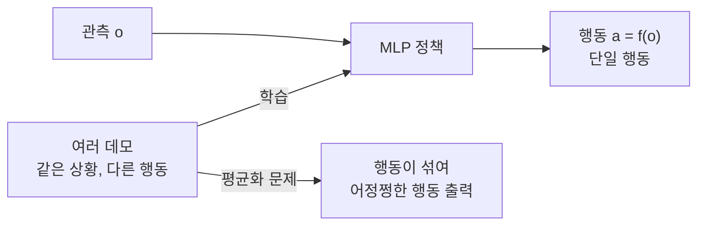
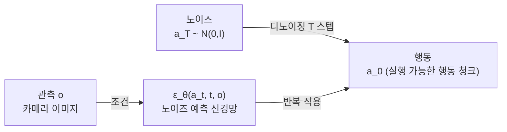
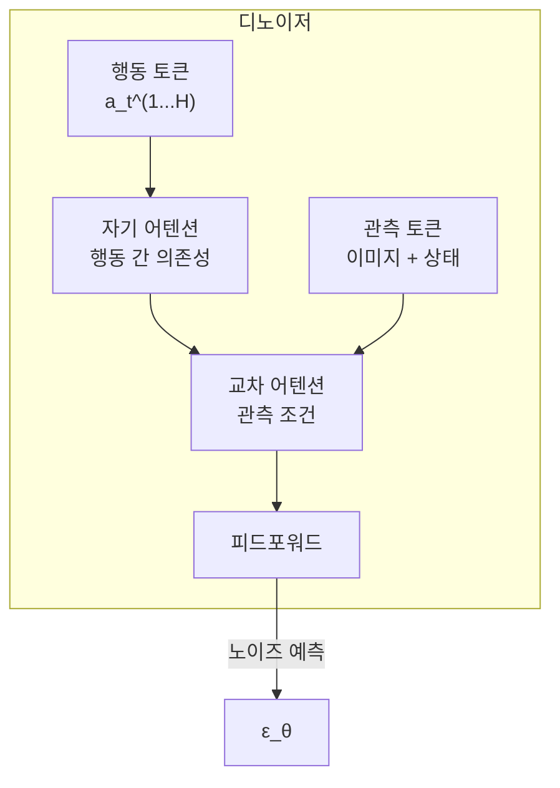

# 확산 정책 로봇 조작 (Diffusion Policy)

확산 정책(Diffusion Policy)은 Chi et al. (2023, Columbia)이 제안한 로봇 모방 학습 기법으로, 이미지 생성에서 사용되는 DDPM(Denoising Diffusion Probabilistic Model)을 로봇 행동 분포 학습에 적용한다. 이전의 결정론적 행동 복제(behavior cloning)와 달리, 동일한 관측에서 여러 실행 가능한 행동을 멀티모달 분포로 표현할 수 있다.

## 기존 방법의 한계

### 결정론적 행동 복제 (BC)의 문제

전통적인 BC는 관측 $o$에서 행동 $a$로의 결정론적 매핑을 학습한다: $\pi(o) = a$.

멀티모달 행동 분포(컵을 왼쪽으로 집을 수도, 오른쪽으로 집을 수도 있음)에서 평균을 내면 실제로는 불가능한 중간 행동이 출력된다.

### [[action-chunking-transformer]] (ACT)와의 비교

[[action-chunking-transformer]](ACT, Zhao et al. 2023)는 VAE로 행동의 잠재 표현을 학습하고 행동 청크를 회귀 예측한다.

| 항목 | Diffusion Policy | ACT |
|------|-----------------|-----|
| 기반 | DDPM 확산 | Transformer VAE |
| 행동 표현 | 확률 분포 직접 모델링 | 잠재 코드 회귀 |
| 멀티모달 | 자연스럽게 처리 | 제한적 |
| 추론 속도 | 느림 (다수 디노이징 스텝) | 빠름 |
| 데이터 효율 | 낮음 (더 많은 데모 필요) | 높음 |
| 정밀 조작 | 우수 | 우수 |

## DDPM 기반 행동 생성 원리

DDPM은 데이터에 점진적으로 노이즈를 추가하는 전방 과정과, 노이즈에서 데이터를 복원하는 역방향 과정으로 구성된다.

### 전방 과정 (Forward Process)

$$
q(a_t | a_{t-1}) = \mathcal{N}(a_t; \sqrt{1-\beta_t} a_{t-1}, \beta_t I)
$$

- 행동 $a_0$에서 시작해 단계적으로 가우시안 노이즈 추가
- $T$ 스텝 후 $a_T \sim \mathcal{N}(0, I)$ (순수 노이즈)

### 역방향 과정 (Reverse Process)

$$
p_\theta(a_{t-1} | a_t, o) = \mathcal{N}(a_{t-1}; \mu_\theta(a_t, t, o), \Sigma_t)
$$

- 관측 $o$를 조건으로 노이즈 $a_T$에서 행동 $a_0$ 복원
- 신경망 $\epsilon_\theta$가 각 스텝의 노이즈를 예측

## 아키텍처 선택

### U-Net 기반 Diffusion Policy

원논문(Chi et al. 2023)의 기본 구현. 1D 시간 합성곱 U-Net으로 행동 시퀀스를 디노이징.

- 행동 차원을 시간 시퀀스로 다룸
- 관측 (이미지 특징 + 상태) → FiLM 레이어로 조건 주입
- 추론: 100 DDIM 스텝 또는 5-10 DDIM 스텝

### Transformer 기반 Diffusion Policy

행동 청크를 토큰 시퀀스로 다루는 Transformer 디노이저.

- Cross-Attention으로 관측 조건 주입
- 더 긴 행동 시퀀스와 복잡한 의존성에 유리
- [[rdt-1b-bimanual]] 등 대형 모델의 기반

## 행동 청킹 (Action Chunking)

단일 행동이 아닌 미래 H 스텝의 행동 시퀀스를 한 번에 예측하여 추론 지연을 줄이고 일관성을 높인다.

- **청크 길이 H**: 실험적으로 결정 (일반적으로 16-100 스텝)
- **실행 방식**: 전체 청크 실행 또는 최신 관측으로 재계획
- **시간적 앙상블**: 여러 청크의 행동을 가중 평균으로 부드러운 실행

$$
a_t^{\text{exec}} = \sum_{k} w_k \cdot a_t^{(k)}
$$

여기서 $a_t^{(k)}$는 k번째 재계획에서의 시각 t 행동, $w_k$는 시간 가중치.

## 빠른 추론: DDIM, 일관성 증류

기본 DDPM의 100+ 스텝 추론은 로봇 제어 루프(10-50 Hz)에 너무 느리다. 가속화 방법:

- **DDIM**: 결정론적 샘플링으로 10-20 스텝으로 축소
- **Consistency Policy**: 일관성 모델로 1-3 스텝 추론 (Prasad et al. 2024)
- **Flow Matching**: 직선 경로 ODE로 더 빠른 수렴

## 실제 조작 결과

Chi et al. 2023 원논문 기준:

| 작업 | 성공률 (Diffusion Policy) | 성공률 (BC-RNN) |
|------|--------------------------|----------------|
| 정사각형 밀기 | 95% | 82% |
| 컵 쌓기 | 88% | 62% |
| 천 접기 | 63% | 32% |
| 컵 뒤집기 | 92% | 77% |

## 한계와 개선 방향

- **추론 속도**: 제어 주파수 향상 위해 일관성 증류 필요
- **데이터 효율**: ACT 대비 더 많은 데모 필요
- **분포 외 일반화**: 새로운 객체/환경에 취약
- **언어 조건**: 기본 Diffusion Policy는 언어 조건 없음 → RDT-1B 등으로 확장

## 관련 문서

- [[diffusion-policy]] - 개념 허브 페이지 (확산 정책의 원리 요약)
- [[action-chunking-transformer]] - 비교 대상: VAE 기반 행동 청킹 정책
- [[rdt-1b-bimanual]] - Diffusion Policy를 대규모 파운데이션 모델로 확장한 사례
- [[robot-learning-sim2real]] - 확산 정책 학습에서 Sim2Real 전이 전략
