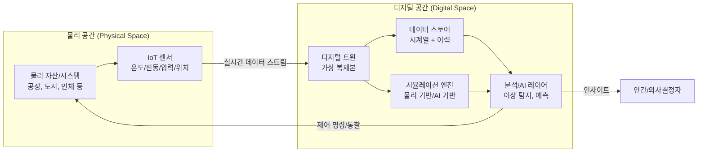
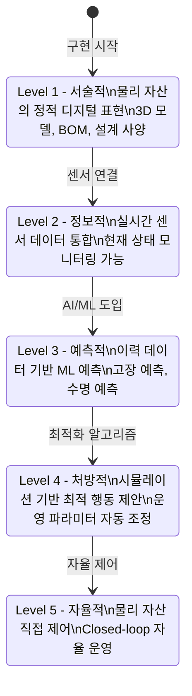
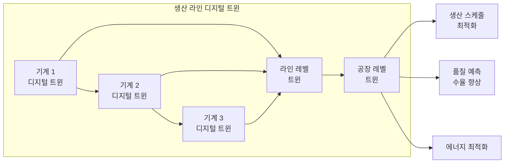

# 디지털 트윈 (Digital Twin)

디지털 트윈(Digital Twin)은 물리 자산, 프로세스, 시스템 또는 환경의 가상 복제본(digital replica)으로, 실시간 데이터와 시뮬레이션을 통해 물리 세계와 동기화된 디지털 표현을 유지한다. 2002년 Michael Grieves가 제품 수명주기 관리 맥락에서 처음 제안했으며, IoT와 AI의 발전으로 산업 전반에 적용이 확산되었다.

## 개념 구조



위 다이어그램은 물리 자산의 센서 데이터가 디지털 트윈에 지속적으로 흐르고, 디지털 트윈의 분석 결과가 다시 물리 자산 제어에 활용되는 양방향 루프를 보여준다.

## 디지털 트윈의 3요소

| 요소 | 설명 | 예시 |
|------|------|------|
| **물리 엔티티** | 실제 자산, 프로세스, 시스템 | 풍력 터빈, 생산 라인, 도시 교통망 |
| **디지털 복제본** | 물리 엔티티의 가상 모델 | 3D CAD 모델 + 물리 특성 + 동작 이력 |
| **데이터 연결** | 물리-디지털 실시간 동기화 | IoT 센서, SCADA, ERP 피드 |

## 성숙도 단계



## 핵심 기술 스택

### 데이터 수집 및 연결
- **IoT 플랫폼**: AWS IoT Core, Azure IoT Hub, GCP IoT Core
- **통신 프로토콜**: MQTT, OPC-UA, Modbus, AMQP
- **엣지 컴퓨팅**: 현장 전처리로 대역폭 절감, 지연 시간 감소
- **디지털 쓰레드(Digital Thread)**: 제품 수명주기 전반 데이터 연결 개념

### 모델링 및 시뮬레이션

```python
# 간단한 디지털 트윈 상태 관리 예시
from dataclasses import dataclass, field
from datetime import datetime
import numpy as np

@dataclass
class TurbineDigitalTwin:
    """풍력 터빈 디지털 트윈."""
    asset_id: str
    rated_power_kw: float
    rotor_diameter_m: float

    # 실시간 상태 (센서에서 업데이트)
    current_rpm: float = 0.0
    current_temperature_c: float = 20.0
    current_vibration_mm_s: float = 0.0
    cumulative_runtime_hours: float = 0.0

    # 예측 상태 (AI 모델에서 업데이트)
    predicted_remaining_life_days: float = 365.0
    anomaly_score: float = 0.0
    maintenance_urgency: str = "normal"

    state_history: list = field(default_factory=list)

    def update_from_sensor(self, sensor_data: dict) -> None:
        """IoT 센서 데이터로 트윈 상태 업데이트."""
        self.current_rpm = sensor_data.get("rpm", self.current_rpm)
        self.current_temperature_c = sensor_data.get("temperature", self.current_temperature_c)
        self.current_vibration_mm_s = sensor_data.get("vibration", self.current_vibration_mm_s)
        self.cumulative_runtime_hours += sensor_data.get("delta_hours", 0)

        self.state_history.append({
            "timestamp": datetime.now().isoformat(),
            **sensor_data,
        })

    def run_anomaly_detection(self, model) -> float:
        """AI 이상 탐지 모델 실행."""
        features = np.array([[
            self.current_rpm,
            self.current_temperature_c,
            self.current_vibration_mm_s,
            self.cumulative_runtime_hours,
        ]])
        self.anomaly_score = float(model.predict_proba(features)[0][1])
        if self.anomaly_score > 0.8:
            self.maintenance_urgency = "critical"
        elif self.anomaly_score > 0.5:
            self.maintenance_urgency = "soon"
        return self.anomaly_score

    def simulate_degradation(self, days_ahead: int = 30) -> list[float]:
        """물리 기반 모델로 향후 열화 시뮬레이션."""
        # 간단한 지수 열화 모델 (실제는 더 복잡한 물리 기반 모델 사용)
        degradation_rate = 0.001 * (1 + self.anomaly_score * 5)
        forecast = []
        current_health = 1.0 - (self.anomaly_score * 0.3)
        for day in range(days_ahead):
            current_health *= (1 - degradation_rate)
            forecast.append(current_health)
        return forecast
```

### AI/ML 레이어

| AI 기법 | 디지털 트윈 역할 | 예시 |
|---------|----------------|------|
| [[time-series-forecasting\|시계열 예측]] | 센서 값 미래 예측 | 온도 상승 예측 |
| 이상 탐지 | 비정상 동작 식별 | 진동 패턴 이상 |
| [[ai-predictive-maintenance\|예측 유지보수]] | 고장 예측 및 일정 최적화 | 베어링 교체 시기 |
| 시뮬레이션 대리 모델 | 빠른 What-if 분석 | 물리 시뮬레이터 대체 |
| 강화학습 | 운영 파라미터 자동 최적화 | 에너지 효율 최대화 |
| 컴퓨터 비전 | 시각적 품질 검사 | [[ai-quality-inspection]] |

## 산업별 응용

### 제조 / 스마트 팩토리



**응용 사례**:
- BMW: 공장 전체 디지털 트윈으로 생산 계획 최적화
- Siemens: 반도체 공장 디지털 트윈으로 수율 20% 향상
- 관련: [[ai-quality-inspection]], [[ai-predictive-maintenance]]

### 스마트 도시

도시 레벨 디지털 트윈은 교통, 에너지, 상하수도, 건물을 통합 모델링한다. [[ai-urban-planning]] 참조.

**대표 사례**:
- 싱가포르 Virtual Singapore: 국가 전체 3D GIS 기반 트윈
- 헬싱키 Digital Twin: 도심 탄소 중립 시뮬레이션
- NEOM (사우디): 스마트 도시 설계부터 디지털 트윈 적용

```python
# 도시 교통 디지털 트윈 개념
class CityTrafficTwin:
    """도시 교통 디지털 트윈."""

    def __init__(self, road_network_graph):
        self.network = road_network_graph
        self.current_flow = {}  # 링크별 현재 교통량
        self.signal_states = {}  # 신호등 상태

    def update_from_sensors(self, loop_detector_data: dict) -> None:
        """루프 감지기/카메라 데이터로 실시간 교통량 업데이트."""
        for link_id, flow in loop_detector_data.items():
            self.current_flow[link_id] = flow

    def simulate_incident(self, blocked_links: list[str]) -> dict:
        """사고 발생 시 대안 경로 시뮬레이션."""
        # Dijkstra + 현재 교통 상황 반영
        alternative_routes = {}
        for origin, dest in self.key_od_pairs:
            route = self._find_alternative_route(origin, dest, blocked_links)
            alternative_routes[(origin, dest)] = route
        return alternative_routes

    def optimize_signals(self) -> dict:
        """현재 교통 상황 기반 신호 타이밍 최적화."""
        # 강화학습 또는 MILP로 최적 신호 타이밍 계산
        return self._run_signal_optimization(self.current_flow)
```

### 에너지 인프라

[[ai-energy-grid]] 참조. 전력망 디지털 트윈은 실시간 수요 예측과 신재생 에너지 변동에 대응하는 그리드 안정화에 활용된다.

**응용**:
- 발전소 터빈 디지털 트윈 (GE Digital의 Predix 플랫폼)
- 풍력 단지: 개별 터빈 트윈 + 단지 레벨 트윈으로 발전량 최적화
- 배전망: 고장 위험 구간 사전 식별, 수리 우선순위 결정

### 헬스케어 / 인체 디지털 트윈

환자 개인의 생리 데이터로 가상 모델을 만들어 치료 효과를 시뮬레이션한다.

**응용**:
- Siemens Healthineers: 심장 디지털 트윈으로 수술 계획
- Living Heart Project: FDA 승인 심장 디지털 트윈
- 임상 시험 최적화: 가상 환자 집단(Virtual Patient Population)

### 물류 및 공급망

[[ai-supply-chain-optimization]] 참조. 창고, 운송, 재고 시스템의 디지털 트윈으로 공급망 전체 가시성을 확보한다.

**응용**:
- 창고 레이아웃 최적화: [[ai-warehouse-robotics]] 연계
- 선박/항공 운항 최적화: 연료 소비와 지연 예측
- 항만 운영: 크레인, 야드 자동화 최적화

## 디지털 트윈 vs 유사 개념 비교

| 개념 | 정의 | 실시간 동기화 | 양방향 | 예측/최적화 |
|------|------|-------------|--------|------------|
| 디지털 트윈 | 물리 자산의 살아있는 디지털 복제 | O (지속) | O | O |
| 시뮬레이션 | 특정 시나리오 모델링 | X (정적) | X | 제한적 |
| 섀도 모델 | ML 예측 모델 | 간헐적 | X | O |
| BIM | 건물 정보 모델 | 선택적 | X | 설계 단계 |
| SCADA | 산업 모니터링/제어 | O | O (제어) | 제한적 |

## 표준화 동향

- **ISO 23247**: 제조 디지털 트윈 표준 프레임워크
- **IEC 63278**: 자산 관리 디지털 트윈 (Asset Administration Shell, AAS)
- **IEEE P2806**: 물리-사이버 통합 IoT 표준
- **Industrial Digital Twin Association (IDTA)**: 독일 중심 AAS 표준화 컨소시엄
- **W3C WoT (Web of Things)**: 사물 인터넷 시맨틱 표준

## 구현 플랫폼

| 플랫폼 | 벤더 | 특징 |
|--------|------|------|
| Azure Digital Twins | Microsoft | DTDL 온톨로지, 그래프 모델 |
| AWS IoT TwinMaker | Amazon | 실제 데이터 연결, 3D 시각화 |
| Siemens Xcelerator | Siemens | 제조 특화, Teamcenter 통합 |
| GE Predix | GE Digital | 산업 장비 특화 |
| NVIDIA Omniverse | NVIDIA | 물리 시뮬레이션, GPU 가속 |
| Unity/Unreal Engine | 게임 엔진 | 시각화 특화 디지털 트윈 |

```python
# Azure Digital Twins SDK 예시
from azure.digitaltwins.core import DigitalTwinsClient
from azure.identity import DefaultAzureCredential

credential = DefaultAzureCredential()
client = DigitalTwinsClient(
    endpoint="https://myinstance.digitaltwins.azure.net",
    credential=credential,
)

# 트윈 조회
twin = client.get_digital_twin("turbine-001")

# 상태 업데이트 (센서 데이터)
patch = [
    {"op": "replace", "path": "/temperature", "value": 72.5},
    {"op": "replace", "path": "/rpm", "value": 1450},
    {"op": "replace", "path": "/vibration", "value": 2.3},
]
client.update_digital_twin("turbine-001", patch)

# 관계 조회 (트윈 그래프 탐색)
relationships = client.list_relationships("turbine-001")
```

## 도전 과제

### 1. 데이터 품질과 지연
물리-디지털 동기화의 시간 지연(latency)과 센서 노이즈가 트윈 정확도를 저하시킨다. 엣지 컴퓨팅과 데이터 퓨전으로 완화한다.

### 2. 모델 유효성 검증 (Validation & Verification)
디지털 모델이 물리 자산을 얼마나 정확히 표현하는지 지속적으로 검증해야 한다. 물리 자산이 노화/변형되면 트윈도 업데이트 필요.

### 3. 사이버보안
디지털 트윈은 물리 자산 제어와 연결되어 있어 공격 시 물리적 피해로 이어질 수 있다. [[ai-agent-security]] 참조.

### 4. 계산 비용
고해상도 물리 시뮬레이션은 막대한 계산 자원을 요구한다. AI 대리 모델(surrogate model)로 시뮬레이션 비용 절감.

### 5. 레거시 통합
기존 OT(운영 기술) 시스템과 신규 IoT/클라우드 통합의 복잡성.

## 관련 문서

- [[ai-urban-planning]] - 스마트 도시 디지털 트윈 응용
- [[ai-predictive-maintenance]] - 설비 예지 보전
- [[ai-quality-inspection]] - 제조 품질 검사
- [[ai-warehouse-robotics]] - 물류 자동화
- [[ai-supply-chain-optimization]] - 공급망 최적화
- [[ai-energy-grid]] - 에너지 그리드 디지털 트윈
- [[time-series-forecasting]] - 센서 데이터 예측 기법
- [[ai-agent-security]] - 사이버-물리 시스템 보안
