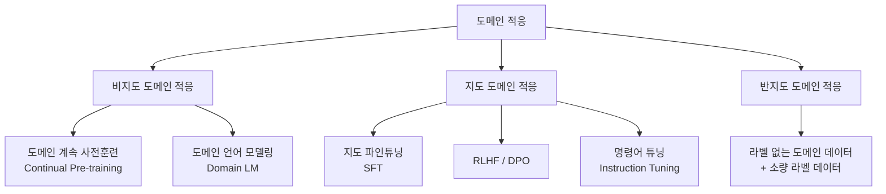
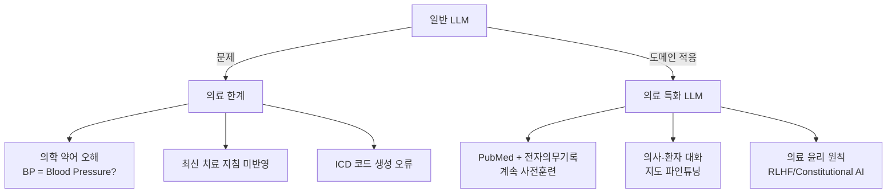

# 도메인 적응 (Domain Adaptation)

도메인 적응(Domain Adaptation)은 **일반적인 데이터로 사전훈련(pre-training)된 모델**을 특정 전문 도메인(의료, 법률, 코드, 금융 등)에 맞게 조정하는 기법의 총칭이다. 모델이 소스 도메인(일반 웹 텍스트)에서 배운 지식을 타깃 도메인에 효과적으로 이전하는 것을 목표로 한다.

도메인 적응은 [[transfer-learning|전이 학습(transfer learning)]]의 특수 사례이며, [[supervised-fine-tuning|지도 파인튜닝(SFT)]]을 포함하지만 이보다 더 넓은 개념이다.

## 왜 도메인 적응이 필요한가

일반 사전훈련 모델은 다음과 같은 한계를 갖는다.

- **어휘 불일치**: 의학 용어, 법률 용어, 코드 특화 문법 등에 취약
- **지식 갭**: 전문 지식이 훈련 데이터에 충분히 포함되지 않음
- **언어 패턴 차이**: 의료 문서의 문체는 일반 텍스트와 다름
- **최신성 문제**: 특정 도메인의 최신 정보가 사전훈련 데이터에 없음

## 도메인 적응의 분류 체계

## 주요 기법

### 1. 도메인 계속 사전훈련 (Domain-Adaptive Pre-training, DAPT)

기존 체크포인트에서 시작하여 도메인 특화 코퍼스로 언어 모델링 목표(next-token prediction)를 계속 학습한다.

- **PubMedBERT**: PubMed 논문으로만 사전훈련한 의료 특화 모델
- **CodeLlama**: 일반 LLaMA에서 코드 데이터로 추가 사전훈련
- **LexLM**: 유럽 법률 문서로 계속 사전훈련

### 2. 지도 파인튜닝 (Supervised Fine-Tuning, SFT)

[[supervised-fine-tuning|지도 파인튜닝]]은 도메인 특화 레이블 데이터 (입력-출력 쌍)로 모델을 조정한다.

- **전체 파인튜닝(Full Fine-tuning)**: 모든 파라미터 업데이트, 높은 비용
- **PEFT (Parameter-Efficient Fine-Tuning)**: 소수의 파라미터만 업데이트

### 3. PEFT 기법들

| 기법 | 원리 | 특징 |
|------|------|------|
| LoRA | 저랭크 행렬 분해로 가중치 업데이트 | 파라미터 효율적 |
| QLoRA | LoRA + 4-bit 양자화 | 메모리 효율적 |
| Prefix Tuning | 학습 가능한 prefix 토큰 추가 | 가볍고 빠름 |
| Adapter | 트랜스포머 레이어 사이 소형 모듈 삽입 | 모듈화 유연성 |
| Prompt Tuning | 입력 임베딩에 학습 가능한 벡터 | 가장 경량 |

## 도메인 이동 (Domain Shift)

도메인 이동은 소스 도메인 분포 $p_S(x)$와 타깃 도메인 분포 $p_T(x)$가 다를 때 발생한다.

$$p_S(x) \neq p_T(x)$$

이를 측정하는 방법:

- **퍼플렉시티 차이**: 도메인 코퍼스에 대한 모델 perplexity
- **토큰 분포 KL-divergence**: 어휘 사용 분포 비교
- **임베딩 공간 분리**: TSNE로 도메인별 표현 시각화

## 의료 도메인 사례 연구

의료 도메인은 도메인 적응의 필요성이 가장 명확한 사례다.

## 도메인 적응 vs 전이 학습 vs RAG

| 기법 | 지식 통합 방식 | 비용 | 최신성 |
|------|--------------|------|--------|
| 도메인 적응 | 파라미터에 내재화 | 높음 (재훈련) | 낮음 (재훈련 필요) |
| RAG | 추론 시 검색 | 낮음 (검색 인프라) | 높음 (실시간 업데이트) |
| Few-shot Prompting | 컨텍스트로 주입 | 없음 | 높음 |
| 전이 학습(일반) | 파라미터 전이 | 중간 | 낮음 |

도메인 적응과 RAG는 상호 배타적이지 않다. 도메인 적응으로 기본 언어 능력을 향상시킨 후, RAG로 최신 지식을 주입하는 하이브리드 접근이 실무에서 효과적이다.

## 데이터 효율성

도메인 데이터 양이 충분하지 않을 때의 전략:

1. **데이터 증강(Data Augmentation)**: 기존 LLM으로 도메인 합성 데이터 생성
2. **쿠리큘럼 학습(Curriculum Learning)**: 일반 → 도메인 순으로 점진적 학습
3. **Few-shot 도메인 적응**: 소수의 예시로 프롬프트 기반 적응
4. **지식 증류(Knowledge Distillation)**: 큰 도메인 모델에서 소형 모델로 전이

## 평가 방법

도메인 적응의 성공을 측정하는 지표:

- **도메인 특화 벤치마크**: MedQA, LegalBench, HumanEval (코드)
- **도메인 퍼플렉시티**: 타깃 도메인 텍스트에 대한 perplexity 감소
- **하류 태스크 성능**: 실제 업무 적용 태스크 정확도
- **일반 능력 유지율**: 도메인 적응 후 MMLU 등 일반 벤치마크 성능

## 실무 적용 체크리스트

도메인 적응 프로젝트를 시작할 때 고려할 사항:

- [ ] 도메인 코퍼스 규모 및 품질 평가 (최소 수백만 토큰 권장)
- [ ] 파인튜닝 vs 계속 사전훈련 선택 (레이블 데이터 유무)
- [ ] PEFT 기법 선택 (GPU 메모리 제약 고려)
- [ ] 기반 모델 선택 (도메인 친화적 사전훈련 여부)
- [ ] 재앙적 망각(catastrophic forgetting) 모니터링 전략
- [ ] 도메인 특화 평가셋 구축

## 관련 문서
- [[raft-retrieval-fine-tuning]] -- RAFT (검색 인식 파인튜닝)

- [[transfer-learning]] - 사전훈련 지식을 새 태스크로 이전하는 일반 패러다임
- [[supervised-fine-tuning]] - 레이블 데이터로 모델을 특정 태스크에 맞추는 기법
- [[scaling-laws]] - 도메인 데이터 규모와 성능의 관계
- [[ai-benchmarks-overview]] - 도메인별 평가 벤치마크 현황
