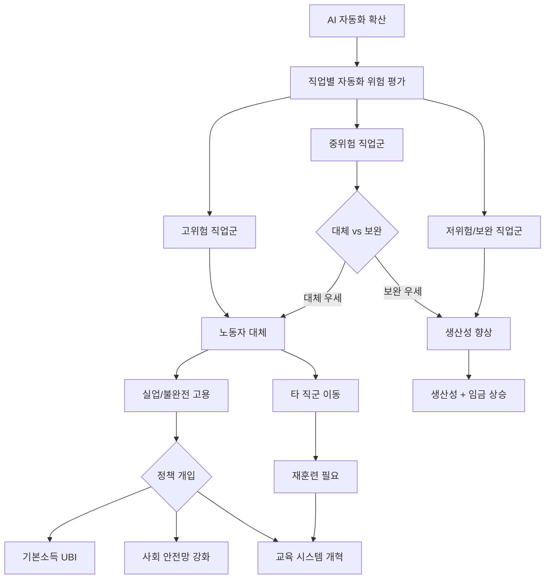
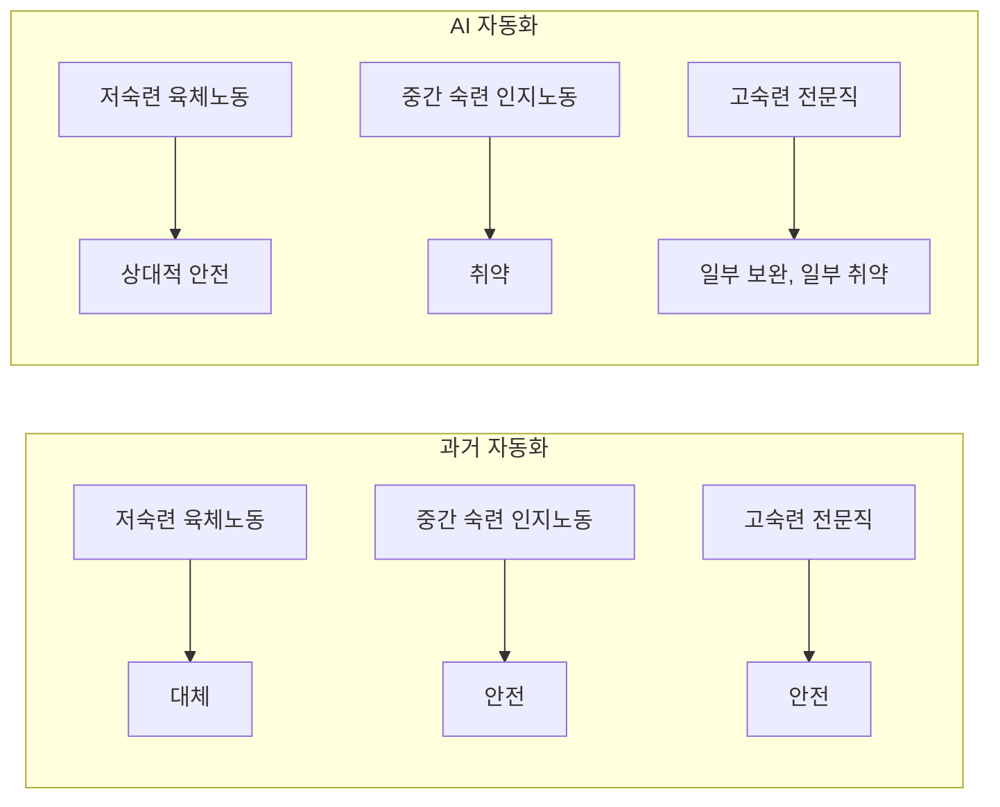

# AI 경제 이동 / 대체 (Economic Displacement by AI)

## 정의 / 본질

AI 경제 이동(Economic Displacement by AI)은 AI 자동화로 인해 특정 직업군이 소멸하거나 대폭 축소되고, 노동자들이 새로운 역할로 이동(또는 실업 상태에 머무는)하는 현상이다. 단순한 "기계가 인간을 대체"가 아니라, **어떤 직업이, 어떤 속도로, 어떤 메커니즘으로 변화하는가**를 분석하는 복잡한 경제적 현상이다.

AI 경제 이동은 두 가지 대립되는 관점의 긴장 위에 있다:

- **대체(displacement) 관점**: AI가 인간 노동자를 대규모로 영구적으로 대체한다
- **보완(augmentation) 관점**: AI는 인간 생산성을 향상시켜 새로운 일자리를 창출한다

역사적으로 기술 혁명은 장기적으로 일자리를 증가시켰다는 주장이 있지만, 변환 속도가 빠를수록 이행기(transition period)의 피해가 크다.

---

## 핵심 아이디어

---

## 자동화 위험 직업 분석

### Frey & Osborne 모델 (2013)

Carl Benedikt Frey와 Michael Osborne의 옥스퍼드 연구는 미국 702개 직업의 자동화 위험을 평가했다. 주요 발견:

- 미국 직업의 약 47%가 10-20년 내 자동화 위험에 노출
- 반복적이고 예측 가능한 업무가 집중된 직업이 가장 취약
- 창의성, 사회적 지능, 비정형 문제 해결이 필요한 직업은 저위험

이 연구는 이후 많은 비판을 받았지만, 자동화 위험 분석 방법론의 기준점이 됐다.

### 직업별 자동화 위험 스펙트럼

| 위험 수준 | 대표 직업 | 이유 |
|-----------|-----------|------|
| 매우 높음 | 데이터 입력 직원, 텔레마케터, 조립 라인 작업자 | 반복적, 구조화된 업무 |
| 높음 | 회계사/감사자, 법률 보조원, 방사선과 의사 | AI가 특정 인지 업무 우월 |
| 중간 | 교사, 간호사, 영업 직원 | 기술 + 사회적 상호작용 혼재 |
| 낮음 | 소방관, 사회복지사, 심리치료사 | 비정형 상황 판단 + 신뢰 필수 |
| 매우 낮음 | 예술가, 연구자, 기업가 | 창의성, 의미 생성, 불확실 환경 |

### OECD 수정 모델

OECD는 Frey-Osborne 모델이 직업 전체를 단위로 분석한다는 한계를 지적하고, **업무(task) 수준**으로 분석을 세분화했다. 이 접근에 따르면:

- 자동화되는 것은 직업이 아니라 특정 **업무(task)**
- 같은 직업 내에서 일부 업무는 자동화되고 나머지는 인간이 담당
- 직업의 소멸보다 직업의 **변형**이 더 일반적

이 시각에서는 자동화 위험이 Frey-Osborne보다 낮게 나타난다 - 미국 직업의 9% 정도만 "대부분의 업무가 자동화 위험"에 해당.

---

## 보완 vs 대체: 실증적 증거

### 보완 증거

- **ATM 도입 후 은행 텔러**: ATM 도입으로 텔러 수가 감소할 것으로 예상됐으나, 오히려 지점당 비용 하락이 지점 증가로 이어져 전체 텔러 수는 증가했다. [교차검증 필요: 데이터 출처 확인 권장]
- **전기 도입**: 전기가 많은 직업을 없앴지만 더 많은 새 직업을 창출
- **현재 AI 보조 도구**: GitHub Copilot 사용 소프트웨어 개발자들이 더 많은 코드를 생산하고 급여도 상승하는 경향

### 대체 증거

- **제조업 자동화**: 미국 중서부 제조업 지역에서 로봇 도입과 실업률 상관관계 확인
- **콜센터 축소**: AI 챗봇 도입으로 콜센터 고용 감소 추세
- **법률 보조 업무**: 계약서 검토, 법률 리서치 등 보조 업무 AI 자동화로 법률 보조원 수요 감소 신호 [교차검증 필요]

### 핵심 변수: 전환 속도

보완 vs 대체의 결과는 기술 전환 속도와 노동 시장 적응 속도의 비율에 달려 있다:

$$\text{순 일자리 효과} = \text{창출 속도} - \text{소멸 속도}$$

단기(3-5년)에는 소멸이 창출을 앞지를 수 있고, 장기(10-20년)에는 역전될 수 있다. 문제는 **단기 이행기의 피해를 어떻게 처리하는가**다.

---

## 재훈련 정책 (Reskilling Policy)

### 재훈련의 구조적 도전

재훈련 정책은 다음 세 가지 근본적 난관에 직면한다:

1. **미래 수요 불확실성**: 어떤 스킬이 5-10년 후에도 가치 있을지 예측하기 어렵다
2. **전환 비용**: 50대 제조업 노동자를 소프트웨어 개발자로 재훈련하는 것은 현실적으로 어렵다
3. **지역적 집중**: 자동화 피해는 특정 지역과 인구 집단에 집중되는 경향

### 성공/실패 사례

| 사례 | 국가 | 접근 | 결과 |
|------|------|------|------|
| 싱가포르 SkillsFuture | 싱가포르 | 전 국민 학습 크레딧 지원 | 긍정적 평가, 소규모 국가 특성 | 
| TAA (무역조정지원) | 미국 | 무역 피해 노동자 재훈련 지원 | 재취업률 기대 이하, 임금 하락 지속적 |
| 독일 Kurzarbeit | 독일 | 단축 근무 + 정부 임금 보전 | 기존 직장 유지에 효과적, 전환에는 미흡 |

재훈련 정책의 한계는 **직업 소멸이 아닌 업무 변화**에는 잘 맞지 않는다는 점이다. AI 시대의 재훈련은 완전히 다른 직업으로 이동하는 것이 아니라, 같은 직업 내에서 AI와 협업하는 능력을 키우는 방향이 더 현실적일 수 있다.

---

## 기본소득 (UBI) 논쟁

AI 경제 이동의 규모가 크다면 UBI(Universal Basic Income, 보편 기본소득)가 대안으로 논의된다:

### UBI 찬성 논거

1. **자동화 이익의 분배**: AI가 생산하는 가치를 사회 전체가 공유
2. **노동 시장 완충재**: 대규모 실업 시 최저 생활 보장
3. **인간 자본 전환 지원**: 재훈련 기간 동안 생활 안정
4. **창의성 해방**: 경제적 불안에서 벗어나 창의적 직업으로의 이동 가능

### UBI 반대 논거

1. **재원 문제**: 전 국민에게 의미 있는 금액을 지급할 재원 확보 어려움
2. **노동 의욕 저하**: 일하지 않아도 소득이 있으면 노동 공급 감소 우려
3. **기존 복지 대체 위험**: UBI가 특화된 복지 프로그램을 대체하면 취약 계층이 더 불리
4. **인플레이션 위험**: 구매력 증가가 가격 상승으로 이어질 가능성

### 파일럿 실험 결과

핀란드(2017-2018), 캐나다 매니토바(1970년대), 미국 스탁턴(2019-2021) 등의 UBI 파일럿에서 공통적으로:
- 수급자의 정신 건강과 웰빙 개선
- 노동 참여율은 소폭 감소하거나 변화 없음
- 비정형 일(돌봄, 자원봉사, 교육)은 오히려 증가

다만 소규모 파일럿의 결과를 전국 규모로 일반화하기 어렵다는 방법론적 한계가 있다. [교차검증 필요: 최신 연구 결과 확인 권장]

---

## AI 특화 경제 이동 패턴

기존 자동화와 달리 AI 기반 자동화는 독특한 패턴을 보인다:

### 중간 숙련 공동화 (Middle-Skill Hollowing)

과거 자동화(공장 로봇 등)는 주로 저숙련 반복 노동을 대체했다. AI는 **중간 숙련 인지 노동**을 타깃으로 한다:

이 패턴이 맞다면 중간 소득층의 임금 압박과 소득 불평등 심화가 예상된다.

### 지리적 집중

AI 경제 이동은 지역적으로 불균등하게 분포한다:
- AI 개발 허브 (실리콘밸리, 런던, 베이징 등): 일자리와 임금 상승
- 사무직/콜센터 집중 지역: 이동 집중
- 제조업/물류 집중 지역: 로봇화 + AI 결합 이동

---

## AI 리터러시와 경제 대체

[[ai-fluency-literacy|AI 리터러시(AI Fluency/Literacy)]]는 AI 경제 이동에 대응하는 개인 수준의 핵심 역량이다. AI를 능숙하게 사용하는 노동자와 그렇지 않은 노동자 사이의 생산성 격차가 커질수록, 개인 수준의 AI 리터러시가 고용 안정의 핵심 변수가 된다.

---

## 비판 / 한계

1. **비관론의 반복적 틀림**: 역사적으로 기술 자동화에 의한 대규모 영구 실업은 실현되지 않았다
2. **수요 측면 무시**: AI가 새로운 제품과 서비스를 만들어 새 직업 수요 창출
3. **불평등의 원인 복합성**: AI 경제 이동이 불평등의 주요 원인인지, 정책 실패나 세계화가 더 중요한지 불명확
4. **단기 과대 추정**: 현재 AI가 실제 업무 현장에서 자율적으로 대체하는 능력은 아직 제한적
5. **보완 경로의 창의성**: 인간은 AI와 함께 일하는 새로운 방법을 지속적으로 발견

---

## 관련 문서

- [[transformative-ai-impact]] - 경제 이동의 거시적 맥락, 변혁적 AI 영향
- [[ai-economic-impact]] - AI가 경제에 미치는 더 넓은 영향 분석
- [[ai-fluency-literacy]] - AI 시대 개인 대응: AI 리터러시 개발
- [[ai-governance-regulation]] - 경제 이동에 대한 정책/규제 접근
- [[ai-existential-risk]] - 대체를 넘어선 극단적 위험 시나리오
