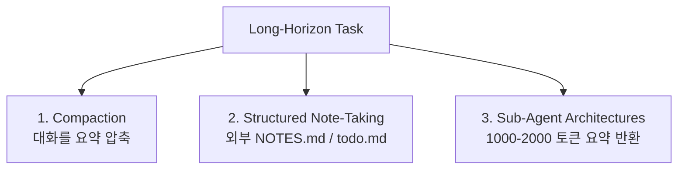

# Effective Context Engineering for AI Agents (Anthropic Engineering 2025-09)

Anthropic Applied AI 4인(Prithvi Rajasekaran, Ethan Dixon, Carly Ryan, Jeremy Hadfield)이 정리한 컨텍스트 엔지니어링 가이드. 이 글은 "context window가 풍부해지면 prompt engineering의 중요성이 줄어든다"는 잘못된 직관을 정정한다.

## 핵심 정의

> "Context engineering = the set of strategies for curating and maintaining the optimal set of tokens (information) during LLM inference."

기존 prompt engineering의 진화. Prompt engineering이 단발성 작업이라면, context engineering은 **반복적**이며 추론 매 사이클마다 모델에 전달할 정보를 다시 큐레이션함.

> "Building with language models is becoming less about finding the right words and phrases for your prompts, and more about answering the broader question of 'what configuration of context is most likely to generate our model's desired behavior?'"

## Context Rot 개념

**Context rot**: 컨텍스트 윈도우의 토큰 수가 증가할수록 모델이 그 안의 정보를 정확히 회상하는 능력이 저하되는 현상.

원인: 트랜스포머의 **n² pairwise 토큰 관계**로 인한 어텐션 분산. 이론적 컨텍스트 길이와 실효 컨텍스트 길이 사이에 갭 존재.

- 즉, "긴 컨텍스트 윈도우 = 모든 토큰이 동일 신호" 가정은 깨졌다
- **신호 대 잡음 비율(signal-to-noise ratio)** 관점에서 설계 필요

## 핵심 원칙

> "to be **thoughtful and keep your context informative, yet tight**." (정보가 있되 압축적으로)

## 컨텍스트 구성 컴포넌트별 권고

### 시스템 프롬프트
- "**Goldilocks zone**" — 너무 모호하지도 너무 brittle하지도 않게
- XML 태그나 Markdown 헤더로 명확히 섹션 구분 (예: `<background_information>`, `<instructions>`)
- 가능한 한 가장 작은 high-signal 토큰 집합

### 도구
- 도구 자체가 토큰을 소모하므로 신중히 선별
- 중복되는 기능 제거
- 도구 설명은 명확하고 비모호하게

### 예시 (Few-shot)
- "diverse, canonical" 예시 사용
- 모든 엣지 케이스를 우겨넣지 말 것 — 다양한 표준 케이스로 충분

### 메시지 히스토리
- 동적으로 검색·관리

## 장기 작업을 위한 3가지 전략

### 1. Compaction (압축)

컨텍스트 한계에 가까워질 때 대화 내용을 요약, 압축된 요약으로 재초기화.

> "overly aggressive compaction can result in the loss of subtle but critical context."

핵심: 무엇을 보존하고 무엇을 버릴지의 명확한 기준 필요.

### 2. Structured Note-Taking (구조화된 노트)

에이전트가 컨텍스트 윈도우 외부에 메모리를 유지 (NOTES.md, todo.md 등).

대표 사례: **Claude playing Pokémon over multi-hour sessions** — 게임 진행 상황, 학습된 전략, 시도해본 경로를 외부 파일에 유지.

이점: 컨텍스트 윈도우는 휘발성, 노트는 영구적.

### 3. Sub-Agent Architectures (서브에이전트)

특화된 에이전트가 집중된 작업을 처리하고, **1,000-2,000 토큰의 압축 요약**만 메인 에이전트로 반환.

이점: 컨텍스트 분리(separation of concerns), 메인 컨텍스트가 깨끗하게 유지됨.

## 실무 적용

> "context engineering is the art and science of curating what will go into the limited context window from a constantly evolving universe of possible information."

- 새 컨텍스트가 들어올 때마다 "**이 토큰이 모델 행동에 어떻게 기여할까?**" 자문
- 가장 작은 high-signal 토큰 셋 추구
- 시스템 프롬프트, 도구, 예시, 메시지 히스토리 — 모두에 적용

## 메모

- 게시일: 2025-09-29
- 이 글은 prompt engineering이 사라지는 게 아니라 **컨텍스트 큐레이션이 더 중요해진다**는 점을 강조한 표준 레퍼런스

## 관련 문서

- [[context-engineering]] — Context Engineering 핵심 개념 페이지
- [[effective-context-engineering-anthropic]] — 기존 글 가이드 페이지 (읽기 순서 중심)
- [[agent-context-management]] — 에이전트 컨텍스트 관리 일반
- [[context-folding]] — 서브 궤적 압축 패턴
- [[subagents]] — 서브에이전트 패턴
- [[anthropic-harness-design]] — 후속 하네스 디자인 (compaction vs reset 깊이 다룸)
- [[effective-agents-patterns]] — Anthropic 7가지 빌딩 블록
