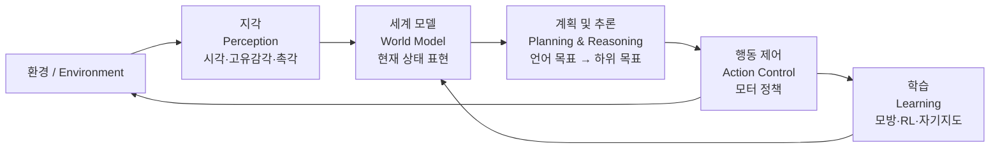

# Embodied AI (체화 인공지능)

## 정의

Embodied AI는 **AI 시스템이 물리적 또는 시뮬레이션 신체(로봇, 아바타, 가상 에이전트)를 통해 환경과 직접 상호작용하며 학습·추론·행동하는 패러다임**이다.

데이터셋을 수동적으로 소비하는 "Data-centric" 접근(NLP, CV)과 달리, Embodied AI는 에이전트가 환경 내에서 능동적으로 행동하고 그 결과로부터 학습한다. 지능은 신체적 상호작용을 통해서만 완전히 발현된다는 관점을 취한다.

> "Intelligence without representation" -- Rodney Brooks (1991)

브룩스는 기호 표현(symbolic representation) 없이도 환경과의 직접 반응(reactive behavior)으로 지능적 행동이 가능하다고 주장했다. 이 계보는 현대 엔드투엔드 로봇 학습의 철학적 기반이 된다.

## 왜 중요한가

- **현실 세계 배치**: LLM 기반 AI가 텍스트·이미지를 넘어 물리 세계에서 실제 작업을 수행해야 하는 수요 급증
- **데이터 패러다임 전환**: 인터넷 텍스트 데이터로는 "물건을 집는 법"을 학습할 수 없다. 물리 상호작용 데이터가 새로운 병목
- **파운데이션 모델 확장**: GPT/Claude 수준의 언어 능력을 로봇 제어로 전이하는 방향이 로보틱스 연구의 주축
- **산업 적용**: 제조, 물류, 의료, 서비스 로봇 시장에서 범용 로봇에 대한 수요가 확대되고 있음

## 핵심 구성 요소

Embodied AI 시스템은 네 가지 모듈의 반복 루프로 작동한다:

위 다이어그램은 Embodied AI의 닫힌 루프(closed-loop)를 보여준다. 에이전트는 환경을 지각하고, 세계 모델로 상태를 표현하며, 계획을 수립한 뒤 행동을 실행하고, 그 결과를 학습에 반영한다.

### 1. 지각 (Perception)

- **시각(Vision)**: RGB 카메라, 깊이 센서(RGBD), 포인트 클라우드 기반 장면 이해
- **고유감각(Proprioception)**: 관절 각도, 토크, 가속도계 등 신체 상태 인식
- **촉각(Tactile)**: 접촉 압력, 미끄러짐 감지. 정밀 조작에 필수

### 2. 계획 및 추론 (Planning & Reasoning)

- 자연어 지시를 행동 시퀀스로 변환하는 고수준 계획
- 물체 인식, 공간 관계, 인과 추론 포함
- LLM의 상식적 추론 능력을 로봇 태스크 분해에 재활용하는 방향이 주류화됨

### 3. 행동 제어 (Action Control)

- 저수준 모터 정책: 관절 토크, 위치, 속도 제어
- 행동 공간(action space)은 연속(continuous) 또는 이산(discrete)
- 행동 청킹(action chunking): 여러 스텝을 한 번에 예측해 딜레이와 누적 오류 감소

### 4. 학습 (Learning)

| 방식 | 설명 | 대표 기법 |
|------|------|---------|
| 모방 학습 | 전문가 데모 데이터 복제 | Behavior Cloning, DAgger |
| 강화 학습 | 환경 보상으로 정책 최적화 | PPO, SAC, Dreamer |
| 자기지도 학습 | 레이블 없이 예측 태스크로 표현 학습 | 마스크 비디오 모델링 |
| 대규모 사전학습 | 다양한 로봇/태스크 데이터 통합 | RT-X, Open X-Embodiment |

## 대표 연구 방향

### Vision-Language-Action (VLA) 모델

VLA(Vision-Language-Action) 모델은 시각 입력, 언어 지시, 물리 행동을 단일 모델로 통합한다. 사전학습된 VLM(Vision-Language Model)의 의미 이해 능력을 로봇 제어에 전이하는 접근이다.

- **RT-2** (Google DeepMind): VLM을 직접 로봇 정책으로 파인튜닝. 웹 데이터로 사전학습된 언어-시각 표현을 행동 공간에 연결
- **Octo**: 오픈소스 범용 로봇 트랜스포머. 다양한 플랫폼에서 파인튜닝 가능한 제너럴리스트 정책
- **OpenVLA**: 오픈소스 VLA, LLaVA 기반 아키텍처 활용
- **pi0** (Physical Intelligence): 비디오 데이터로 사전학습한 플로우 매칭 기반 확산 정책

자세한 내용은 [[vla-models]] 참고.

### Sim-to-Real 전이 (Sim2Real)

시뮬레이션에서 학습한 정책을 실제 로봇에 배포하는 기법. 물리 환경 위험과 데이터 수집 비용을 줄이는 핵심 전략이다.

- **도메인 랜덤화(Domain Randomization)**: 시뮬레이션 물리 파라미터를 무작위화해 실제 환경 변동에 강건한 정책 학습
- **도메인 적응(Domain Adaptation)**: 시뮬레이션-실제 이미지 간 시각 갭 최소화
- **현실 세계 파인튜닝**: 시뮬레이션 사전학습 후 소량의 실제 데이터로 적응

자세한 내용은 [[sim2real-transfer]] 참고.

### 비디오 기반 세계 모델 (Video World Models)

비디오 생성 모델을 로봇의 세계 모델(world model)로 활용하는 방향이 빠르게 부상하고 있다. Photorealistic 시뮬레이션을 데이터 기반으로 생성함으로써 전통 물리 시뮬레이터의 한계(Rigid body 중심, 변형체 미지원)를 극복한다.

- **합성 데모 생성**: 실제 수집 비용이 높은 조작 데모를 비디오 모델로 보완
- **가상 환경 RL**: 비디오 프레임 시퀀스를 환경으로 삼아 정책 학습
- **시각적 계획**: 미래 관측 예측으로 행동 시퀀스 평가 후 최적 선택
- **정책 평가**: 배포 전 저비용 closed-loop 시뮬레이션으로 안전성 검증

자세한 내용은 [[video-gen-robotics-survey-paper]] 및 [[world-model]] 참고.

### 로봇 파운데이션 모델 및 대규모 데이터셋

언어 모델의 스케일링 법칙을 로봇 학습에 적용하려는 시도다. 다양한 로봇 플랫폼과 태스크에 걸친 이종(heterogeneous) 데이터를 통합해 단일 범용 정책을 학습한다.

- **RT-X / Open X-Embodiment**: 22개 기관, 수십 종 로봇, 수백 개 태스크 데이터 통합. 자세한 내용은 [[open-x-embodiment]] 참고
- **DROID**: 76개 장소, 50개 장면에서 수집한 다양성 높은 조작 데이터셋
- **NVIDIA Cosmos**: Physical AI 파운데이션 모델. 비디오 생성을 통한 로봇 사전학습 플랫폼. 자세한 내용은 [[nvidia-cosmos]] 참고

### 벤치마크 환경

| 벤치마크 | 유형 | 주요 태스크 |
|---------|------|-----------|
| BEHAVIOR-1K | 가정 서비스 | 1,000개 가정 활동 |
| Habitat 3.0 | 탐색·조작 | 인간-로봇 협업 포함 |
| AI2-THOR | 실내 탐색 | 오브젝트 상호작용 |
| MetaWorld | 테이블 조작 | 50개 조작 태스크 |
| RLBench | 조작 | 100개 데모 기반 태스크 |

## 현재 과제

| 과제 | 구체적 문제 |
|------|-----------|
| **데이터 희소성** | 언어 데이터는 수조 토큰이지만 로봇 조작 데모는 수백만 샘플 수준 |
| **일반화 한계** | 특정 환경·물체에서만 동작, 새로운 상황에서 성능 급락 |
| **물리 안정성** | 파지 실패, 접촉 불안정, 변형체(deformable object) 조작 어려움 |
| **안전성** | 산업·의료 환경에서 충돌·오조작에 대한 검증 프레임워크 미비 |
| **실시간 제어** | 대형 모델의 추론 지연이 고속 모터 제어와 충돌 |
| **비용** | 데이터 수집을 위한 실제 로봇 하드웨어·인력 비용 |

## 왜 LLM 시대에 Embodied AI가 다시 주목받는가

1. **언어-행동 브릿지**: LLM의 상식 추론과 계획 능력이 고수준 로봇 태스크 분해에 직접 활용 가능해졌다
2. **대규모 비전 사전학습**: 수십억 이미지로 학습된 시각 인코더가 로봇 지각 품질을 극적으로 향상시켰다
3. **스케일링 가설 검증**: OpenVLA, RT-2 등이 데이터·파라미터 스케일이 로봇 일반화에도 유효함을 실증했다
4. **비디오 월드 모델**: 비디오 생성 모델이 저비용 로봇 학습 인프라로 부상하고 있다

## 관련 문서

- [[vla-models]] -- Vision-Language-Action 모델 상세
- [[sim2real-transfer]] -- Sim2Real 전이 기법 전반
- [[open-x-embodiment]] -- 다중 로봇 통합 데이터셋
- [[video-gen-robotics-survey-paper]] -- 비디오 생성 모델의 로봇 응용 서베이
- [[diffusion-policy-robot]] -- 확산 모델 기반 로봇 정책
- [[manipulation-dexterity]] -- 손재주 조작 태스크 전반
- [[robot-learning-sim2real]] -- 시뮬레이션 기반 로봇 학습
- [[nvidia-cosmos]] -- Physical AI 파운데이션 모델 플랫폼
- [[world-model]] -- 세계 모델 개념 전반
- [[imitation-learning]] -- 모방 학습 기법
