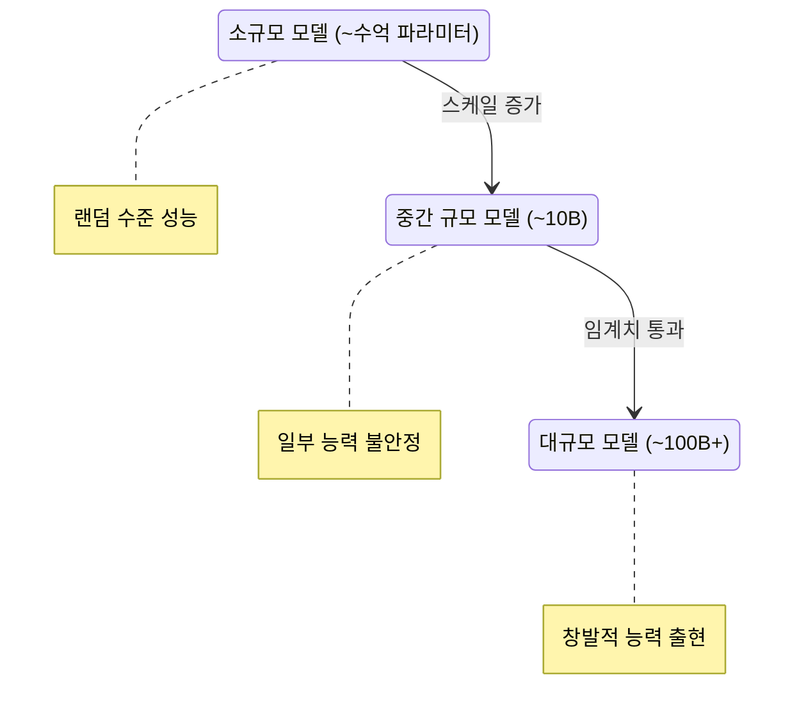
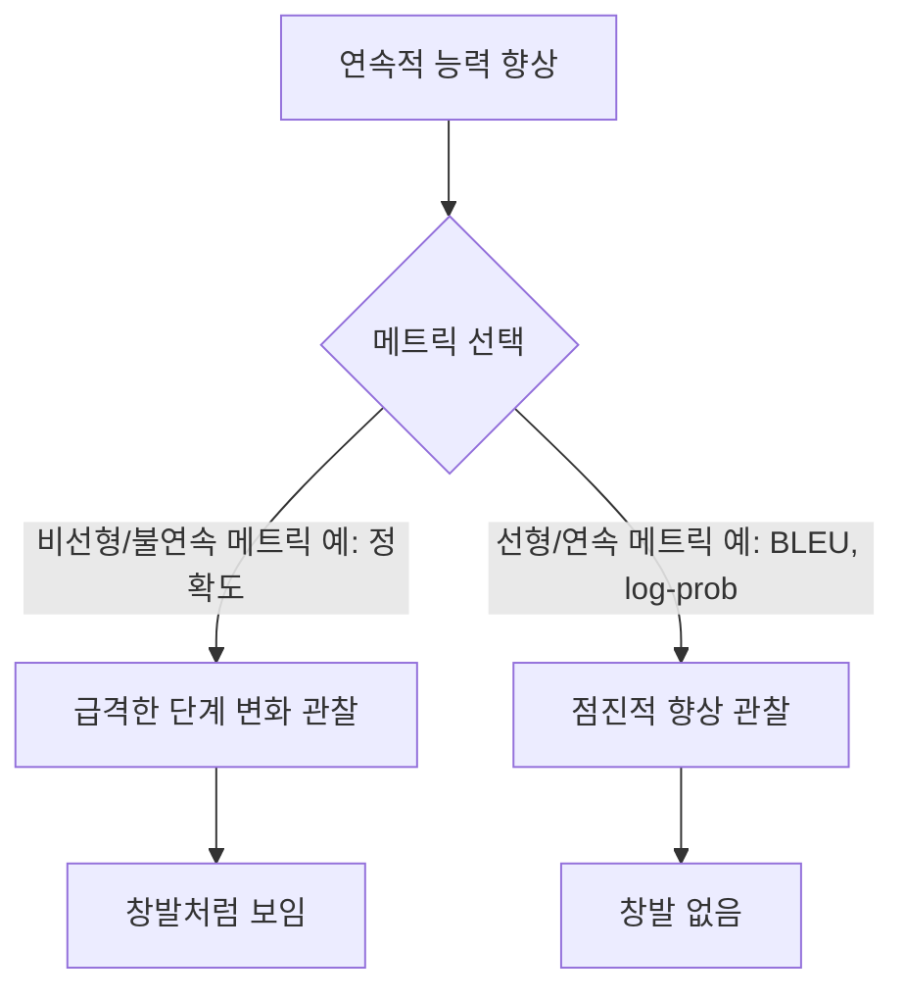

# 창발적 능력 (Emergent Abilities)

## 개요

창발적 능력(Emergent Abilities)은 소규모 모델에서는 관찰되지 않다가 모델 규모가 특정 임계치를 넘으면 갑자기 나타나는 능력을 뜻한다. Wei et al.(2022)이 BIG-Bench 데이터를 분석하며 체계적으로 문서화했으며, 스케일링 법칙(scaling laws) 연구의 핵심 화두가 되었다.

## 정의와 관찰

Wei et al.은 창발적 능력을 다음과 같이 정의했다:

> "작은 모델에서는 랜덤 수준의 성능을 보이다가, 스케일이 충분히 커지면 현저히 향상되는 능력"

## 주요 창발 능력 예시

BIG-Bench 평가에서 관찰된 대표적인 창발 능력들:

| 능력 | 임계 규모 | 설명 |
|------|----------|------|
| 산술 추론 (3자리 수 덧셈) | ~100B | 이전 모델은 거의 랜덤 수준 |
| 연쇄 사고 추론 (CoT) | ~60B | 중간 추론 단계를 거친 정답 도출 |
| 단어 해석 (Word Unscrambling) | ~130B | 스크램블된 단어 원형 복원 |
| 유추 추론 (Analogical Reasoning) | ~100B | A:B::C:? 형태의 유추 |
| 다국어 번역 | ~모델 의존 | 언어쌍에 따라 다른 임계치 |

## BIG-Bench에서의 관찰

BIG-Bench(Beyond the Imitation Game Benchmark)는 200개 이상의 다양한 태스크로 구성된 평가 프레임워크다. Wei et al.은 여기서 수십 개의 태스크가 비선형적 성능 향상 패턴을 보임을 확인했다.

특히 단계적 함수(step function)처럼 특정 스케일에서 급격히 성능이 향상되는 패턴이 여러 태스크에서 관찰되었다.

## "창발은 환상이다" - 반론 (Schaeffer et al., 2023)

Schaeffer, Miranda, Koyejo의 연구는 창발적 능력이 실제 현상이 아닐 수 있다는 도발적 주장을 제기했다:

핵심 주장: 정확도(accuracy)처럼 임계치를 두는 메트릭은 연속적인 성능 향상을 불연속적인 점프로 변환한다. BLEU 점수나 로그 확률 같은 연속적 메트릭을 쓰면 동일한 현상이 점진적 곡선으로 나타난다는 것이다.

## 현재 학계의 합의

논쟁 이후 형성된 대체적 합의:

1. **메트릭 효과는 실재한다**: Schaeffer 등의 지적처럼, 평가 방식이 창발 인상을 과장하는 것은 사실
2. **그러나 실질적 전환도 존재한다**: 특정 스케일에서 질적으로 다른 능력(예: CoT 추론)이 나타나는 것은 부정하기 어려움
3. **선형 메트릭과 비선형 메트릭 모두 사용 권장**: 단일 임계값 메트릭에만 의존하지 않는 평가 설계

## 스케일링의 실질적 의미

창발이 "진짜"인지 여부를 떠나, 스케일 증가에 따른 실질적 품질 전환은 여러 방면에서 확인된다:

- **인컨텍스트 학습(In-Context Learning)**: 예제 몇 개만으로 새로운 태스크를 수행하는 능력, 소형 모델에서는 미미
- **지시 따르기(Instruction Following)**: 자연어 지시를 일관성 있게 따르는 능력
- **자기 수정(Self-Correction)**: 자신의 출력을 검토하고 오류를 발견하는 메타인지적 능력

## 실무적 시사점

1. **모델 선택**: 특정 태스크에 필요한 능력이 어느 스케일에서 창발하는지를 알면 모델 크기 선택에 도움
2. **파인튜닝 가설**: 소형 모델에서 파인튜닝으로는 창발 능력을 끌어내기 어려울 수 있음
3. **평가 설계**: 창발 논쟁은 벤치마크 메트릭 설계의 중요성을 상기시킴 - [[benchmark-saturation-goodharts-law]] 참조

## 관련 문서

- [[scaling-hypothesis]] - 스케일 증가와 능력 향상의 관계
- [[chain-of-thought]] - 창발 능력 중 하나인 CoT 추론
- [[in-context-learning]] - 창발적 in-context 학습 능력
- [[benchmark-saturation-goodharts-law]] - 벤치마크 메트릭의 함정
- [[data-centric-ai]] - 데이터 스케일과 능력 창발의 상관관계
