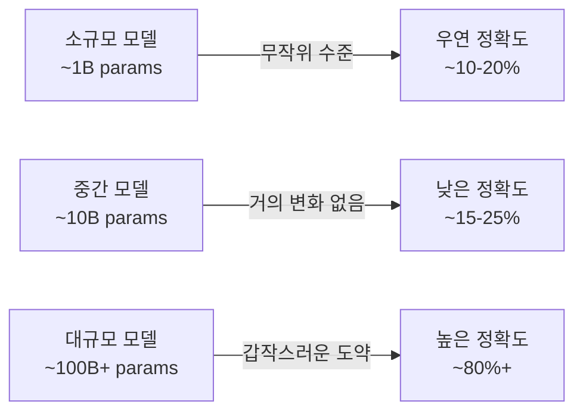

# 창발적 능력 (Emergent Abilities)

## 정의

창발적 능력(emergent abilities)이란 소규모 모델에서는 존재하지 않다가 모델 규모가 특정 임계점(threshold)을 넘어서면 갑자기 출현하는 능력을 말한다. Wei et al. (2022) "Emergent Abilities of Large Language Models"에서 체계적으로 정의된 개념으로, 스케일링(scaling)이 단순한 선형 개선이 아닌 질적 도약을 만들어낸다는 주장의 핵심 근거다.

## 대표 사례

| 능력 | 임계 규모 (근사치) | 설명 |
|------|-------------------|------|
| 산술 추론 (Arithmetic) | ~100B 파라미터 | 덧셈·뺄셈 등 다단계 계산 |
| Chain-of-Thought (CoT) | ~100B 파라미터 | 중간 추론 단계를 명시 |
| 지시 따르기 (Instruction Following) | ~10B 파라미터 | 자연어 지시에 일관되게 반응 |
| 번역 (Translation) | 모델/언어쌍 의존 | 저자원 언어 방향으로 갑자기 개선 |
| 모달 산술 (Modular Arithmetic) | ~100B 파라미터 | 나머지 연산 |

## 스케일 도약 메커니즘

이 그림이 보여주는 "갑작스러운 도약"이 창발 현상의 핵심이다.

## Schaeffer et al. 2023 반론: Metric Mirage

Schaeffer et al. (2023) "Are Emergent Abilities of Large Language Models a Mirage?"는 창발 현상의 상당 부분이 **측정 지표의 비선형성** 때문에 나타나는 환상(mirage)일 수 있다고 주장한다.

- **비선형 메트릭 문제**: 정확도(accuracy)처럼 0 또는 1만 허용하는 이분형 지표는 연속적 개선을 불연속 도약처럼 보이게 만든다.
- **연속 메트릭 대체 시**: BPB(bits-per-byte)나 토큰 수준 확률 같은 연속 지표를 사용하면 도약이 사라지고 부드러운 곡선이 나타나는 사례가 존재한다.
- **결론**: 능력 자체는 연속적으로 성장하지만 특정 메트릭이 임계 구간에서 급격히 반응하는 것일 수 있다.

## 논쟁의 핵심

| 관점 | 주장 | 근거 |
|------|------|------|
| 창발 지지 (Wei et al.) | 질적으로 새로운 능력이 임계점에서 출현 | 여러 벤치마크에서 반복 관찰 |
| 창발 회의 (Schaeffer et al.) | 연속적 개선 + 비선형 메트릭 = 창발 환상 | 대안 메트릭으로 재측정 시 도약 사라짐 |

두 관점 모두 중요한 실증 근거를 갖고 있으며 학계에서 아직 합의가 이뤄지지 않은 열린 질문이다.

## 실무적 함의

1. **모델 크기 결정**: "원하는 능력이 창발 구간 이후에 있다면 임계 규모 이상 학습해야 한다"는 논리를 적용할 수 있으나, 정확한 임계점 예측은 어렵다.
2. **평가 설계**: 창발을 탐지하려면 다양한 규모의 체크포인트를 여러 메트릭으로 평가해야 한다. 단일 이분형 지표에 의존하면 메트릭 미라지에 빠질 수 있다.
3. **투자 판단**: 창발 주장을 그대로 믿고 무조건 규모를 늘리는 전략은 Schaeffer 반론을 감안해 신중하게 재검토해야 한다.
4. **예측 불가능성**: 창발이 실재한다면 새로운 규모에서 어떤 능력이 나타날지 사전에 예측하기 어려워 안전 평가(safety evaluation)가 더 중요해진다.

## 관련 문서

- [[scaling-laws]] - 규모와 성능의 예측 가능한 관계
- [[in-context-learning]] - 창발적 능력의 대표 사례
- [[chain-of-thought]] - 대규모에서 창발하는 추론 기법
- [[test-time-compute]] - 학습 규모 외 추론 컴퓨트로 성능 향상
