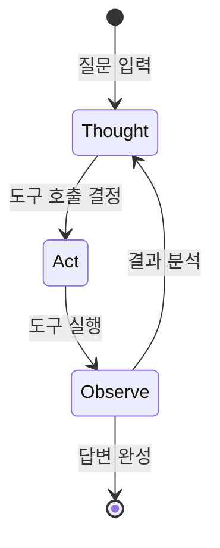

# 신생 도구 사용 능력 (Emergent Tool Use)

## 정의 / 본질

**신생 도구 사용 능력(emergent tool use)**은 LLM이 충분한 규모(scale)에 도달했을 때, 도구 사용(tool use)이나 함수 호출(function calling)을 명시적으로 학습하지 않아도 갑작스럽게 수행할 수 있게 되는 현상이다.

더 넓은 **창발적 능력(emergent abilities)** 개념의 한 사례로, 특정 파라미터/토큰 규모 임계점 아래에서는 능력이 거의 0에 가깝다가 임계점을 넘으면 급격히 향상되는 비선형 성능 곡선을 보인다.

도구 사용 맥락에서의 "창발"은 구체적으로 다음을 포함한다.

- 적절한 도구를 선택하는 판단 능력
- 도구에 맞는 인자(argument)를 정확히 구성하는 능력
- 도구 결과를 해석하고 다음 행동을 결정하는 능력
- 도구 연쇄(tool chaining) -- 여러 도구를 순서대로 사용하는 계획 능력

## 핵심 아이디어

### 도구 사용 능력의 창발 스케일

```mermaid
flowchart LR
    subgraph 소규모 모델
        S1[도구 존재 인식 X]
        S2[인자 구성 실패]
        S3[결과 해석 불안정]
    end
    subgraph 중규모 모델
        M1[단순 도구 호출 가능]
        M2[인자 구성 불완전]
        M3[연쇄 호출 실패]
    end
    subgraph 대규모 모델
        L1[도구 선택 정확]
        L2[인자 완전 구성]
        L3[다단계 연쇄 계획]
    end
    소규모 모델 -->|규모 증가| 중규모 모델
    중규모 모델 -->|임계점 돌파| 대규모 모델
```

창발은 모든 하위 능력이 동시에 등장하지 않는다. 단순 도구 호출 → 인자 구성 → 연쇄 계획 순서로 점진적으로 나타나는 계층 구조를 보인다.

### 명시적 학습 없는 함수 호출

초기 LLM(GPT-3 수준)은 도구 호출 데이터로 명시적으로 파인튜닝하지 않으면 JSON 형식의 함수 호출을 신뢰성 있게 수행하지 못했다. 그런데 충분한 규모에서 언어 모델링 목표만으로 사전학습된 모델이 적절한 프롬프트만으로 함수 호출 구조를 스스로 생성하기 시작했다.

이는 모델이 훈련 데이터에서 "코드", "API 문서", "함수 정의" 패턴을 학습하면서 도구 사용의 구조적 원리를 내재화한 것으로 해석된다.

```python
# 파인튜닝 없이도 대형 모델은 아래와 같은 프롬프트에 올바르게 반응
SYSTEM = """
당신은 다음 도구를 사용할 수 있습니다:
- search(query: str) -> list[str]: 웹 검색 수행
- calculator(expression: str) -> float: 수식 계산
도구를 사용할 때는 <tool>도구명</tool><args>{"arg": "value"}</args> 형식으로 호출하세요.
"""
# 이 프롬프트로 작은 모델은 랜덤한 텍스트를 출력하지만,
# 충분히 큰 모델은 올바른 형식으로 도구를 호출한다
```

### ReAct 패턴과 창발의 연결

**ReAct (Reason + Act)** 패턴은 창발적 도구 사용 능력을 구조화한 프레임워크다. "생각(Thought) → 행동(Act) → 관찰(Observe)" 사이클을 반복하는데, 이 패턴 자체가 "소규모 모델에서는 작동하지 않다가 대형 모델에서 안정적으로 작동하는" 창발적 특성을 보인다.



## 창발적 도구 사용의 세부 능력

| 능력 | 설명 | 창발 임계점 |
|------|------|-------------|
| 도구 인식 | 사용 가능한 도구 목록 파악 | 비교적 낮음 |
| 도구 선택 | 작업에 적합한 도구 선택 | 중간 |
| 인자 구성 | 올바른 형식의 인자 생성 | 중간~높음 |
| 오류 복구 | 도구 실패 시 대안 시도 | 높음 |
| 도구 연쇄 | 여러 도구를 순서대로 조합 | 높음 |
| 메타 도구 사용 | 도구를 만드는 도구 사용 | 매우 높음 |

## 실제 사례 / 응용

### GPT 시리즈의 Function Calling 진화

OpenAI는 GPT-4에서 공식 Function Calling API를 출시했지만, 그 이전에 이미 적절히 프롬프팅된 GPT-3.5가 비공식적으로 함수 호출 유사 동작을 수행한다는 것이 관찰됐다. Function Calling API는 이 창발적 능력을 신뢰성 있게 구조화한 것으로 볼 수 있다. 자세한 진화 과정은 [[function-call-evolution]] 참조.

### 멀티모달 도구 사용

텍스트 도구 사용에서 시작한 창발이 이미지 분석 도구, 코드 실행 도구로 확장되는 과정도 창발의 연속으로 해석된다. GPT-4V의 시각 입력 기반 도구 선택, Claude의 Computer Use 기능 등이 사례.

### 자기 개선 도구 사용 (Self-Referential)

대형 모델이 "도구를 정의하는 메타 도구"를 스스로 호출하거나, 자신의 능력을 테스트하는 도구를 생성하는 현상. 관련: [[tool-creator-meta-agent]].

## 창발적 능력 측정의 논쟁

창발 자체에 대한 학계 논쟁이 있다. Schaeffer et al. (2023)은 "창발은 불연속적 메트릭 선택의 결과"라는 반론을 제기했다 -- 연속적 메트릭으로 측정하면 성능이 선형적으로 증가한다는 것. 이 논쟁은 도구 사용 창발에도 그대로 적용된다.

관련 개념 상세: [[emergent-abilities-llm]].

## 한계 / 비판

### 신뢰성 불안정

창발적 도구 사용은 소규모 모델에서 작동하지 않다가 갑자기 등장하는 것처럼 보이지만, 실제로는 대형 모델도 컨텍스트에 따라 도구를 잘못 선택하거나 인자를 오구성하는 실패가 빈번하다. 창발이 곧 안정성을 의미하지 않는다.

### 오버피팅 위험

도구 사용 벤치마크 데이터셋으로 파인튜닝된 모델이 새로운 도구 스키마에서는 성능이 급격히 저하되는 경우가 있다. 진정한 일반화인지 패턴 암기인지 구분이 어렵다.

### 측정 기준 불일치

"도구 사용 능력이 창발했다"는 기준이 연구마다 다르다 -- JSON 유효성, 인자 정확성, 작업 완료율 등 다양한 지표 중 어느 것을 쓰느냐에 따라 창발 임계점이 달라진다.

### 환경 의존성

동일한 모델이라도 도구 스키마 설명 방식, 예시 포함 여부, 컨텍스트 길이에 따라 도구 사용 능력이 크게 달라진다. 창발이 모델의 내재 능력인지 프롬프트 엔지니어링의 결과인지 분리하기 어렵다.

## 관련 문서

- [[emergent-abilities-llm]] -- 창발적 능력 전반 개요 (Schaeffer 반론 포함)
- [[function-call-evolution]] -- 함수 호출 API의 역사적 진화
- [[function-calling-tool-use]] -- 함수 호출과 도구 사용 실용 패턴
- [[tool-creator-meta-agent]] -- 도구를 만드는 메타 에이전트
- [[emergent-deception]] -- 창발적 기만 행동 (창발의 부정적 사례)
- [[agentic-engineering]] -- 에이전트 엔지니어링에서 도구 사용 설계
