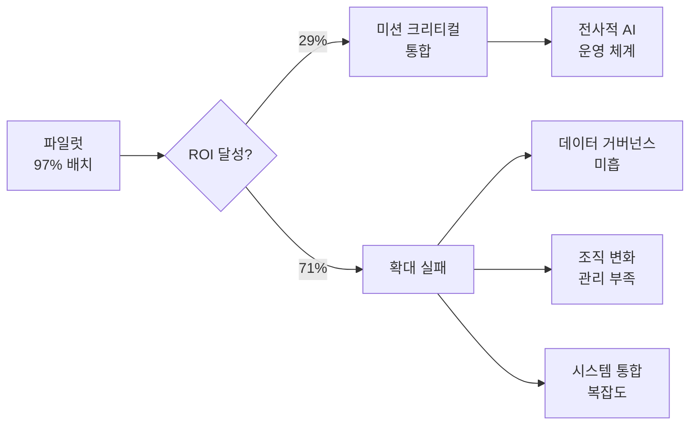

## 개요

2026년 기업의 AI 도입은 파일럿 단계를 넘어 미션 크리티컬 시스템 통합으로 전환되는 변곡점에 있다. 기업의 97%가 AI 에이전트를 배치했으나, 의미 있는 ROI를 달성한 비율은 29%에 불과하다. 이 격차는 기술 자체의 한계보다 조직 구조, 데이터 거버넌스, 변화 관리 역량의 부족에서 비롯된다. 79%의 기업 경영진이 AI 도입 과정에서 도전에 직면하고 있다는 점이 이를 뒷받침한다.

## 핵심 개념

**에이전틱 배치(Agentic Deployment)**: 단순 추론 API 호출을 넘어, [[agentic-ai-production|AI 에이전트]]가 자율적으로 태스크를 계획하고 실행하는 방식으로 기업 워크플로에 통합하는 것. 단일 프롬프트-응답이 아닌 다단계 의사결정과 도구 활용이 핵심이다.

**파일럿-프로덕션 격차(Pilot-to-Production Gap)**: 소규모 실험에서는 성공하지만 전사적 확대 배포에서 실패하는 현상. 데이터 품질, 시스템 통합, 거버넌스, 변화 관리 등 비기술적 요인이 주요 원인이다.

**AI ROI 측정**: 비용 절감, 생산성 향상, 매출 증대 등 정량적 지표와 의사결정 품질 개선, 직원 만족도 등 정성적 지표를 종합하여 AI 투자 효과를 평가하는 체계.

## 현황 (2026)

- 기업의 **97%** AI 에이전트 배치, 의미 있는 ROI 달성 **29%** (Deloitte State of AI 2026)
- **79%** 기업 경영진이 AI 도입 과정에서 도전 직면 (Writer 2026 서베이, 글로벌 리더 2,400명 대상)
- 추론 워크로드가 AI 인프라 지출의 **55% 이상** 차지 -- 학습에서 추론으로 비용 구조 전환
- AI 에이전트의 적용 영역: 고객 서비스, 코드 생성, 문서 처리, 공급망 최적화, 재무 분석
- 성공 기업의 공통점: C-레벨 스폰서십, 전담 AI CoE(Center of Excellence), 명확한 KPI 체계

**성공과 실패의 분기점**:
- 성공: 명확한 비즈니스 문제 정의 -> 데이터 파이프라인 정비 -> 점진적 확대 -> 지속적 모니터링
- 실패: 기술 우선 접근 -> 불명확한 목표 -> 데이터 사일로 -> 파일럿 정체

### 성숙도 모델

기업의 AI 도입 단계를 체계화하면:

| 단계 | 특징 | 기업 비율 (추정) |
|------|------|---------------|
| **실험** | 단발성 PoC, 개인 생산성 도구 수준 | ~30% |
| **파일럿** | 부서 단위 배포, 제한된 비즈니스 영향 | ~40% |
| **확대** | 다부서 연계, 데이터 파이프라인 정비 진행 | ~20% |
| **미션 크리티컬** | 핵심 비즈니스 프로세스 통합, 측정 가능한 ROI | ~10% |

## 전망/과제

**조직 역량**: 기술 도입 자체보다 AI 활용 역량을 갖춘 인력 확보와 조직 문화 전환이 성공의 핵심 결정 요소이다. 성공 기업의 공통점은 C-레벨 스폰서십, 전담 AI CoE(Center of Excellence), 명확한 KPI 체계를 모두 갖추고 있다는 것이다.

**보안과 신뢰**: AI 에이전트에 미션 크리티컬 업무를 위임할 때의 신뢰성 검증, 환각(hallucination) 방지, 접근 권한 관리가 필수적이다. [[human-in-the-loop-patterns]]과 [[ai-agent-guardrails]]의 체계적 적용이 요구된다.

**규제 준수**: [[ai-regulation-us]]와 [[eu-ai-act-enforcement]]에 따른 AI 시스템 투명성, 감사 가능성, 설명 가능성 요건이 기업 배포의 복잡도를 높이고 있다.

**비용 최적화**: 추론 비용이 AI 인프라 지출의 과반을 차지하면서, [[mlops-llmops-2026]]의 효율적 운영 체계 구축이 ROI 달성의 핵심 레버로 부상했다. 모델 양자화, 캐싱, 배치 추론, 모델 라우팅 등의 기법으로 와트당/달러당 추론 효율을 극대화하는 것이 핵심이다.

**에이전틱 배포의 실무 도전**:
- **도구 호출 안정성**: 에이전트가 외부 API/DB를 호출할 때의 오류 처리와 재시도 전략
- **멀티에이전트 조율**: 복수 에이전트 간 작업 분배, 충돌 방지, 결과 통합
- **관찰 가능성**: [[langfuse]]와 같은 LLM 옵저버빌리티 도구를 통한 에이전트 행동 추적 및 비용 모니터링
- **점진적 자율성 확대**: 초기에는 엄격한 인간 감독 하에 시작하여, 신뢰도가 축적됨에 따라 자율 범위를 단계적으로 확장

## 관련 문서

- [[mlops-llmops-2026]] - AI 프로덕션 시스템과 운영 인프라
- [[ai-agent-marketplaces]] - 기업이 에이전트를 조달·배포하는 마켓플레이스 생태계
- [[ai-education]] - AI가 교육 분야에 미치는 영향
- [[ai-finance]] - AI 금융 서비스 적용 현황
- [[ai-legal]] - AI 법률 서비스 활용
- [[ai-manufacturing]] - AI 제조업 혁신 사례
- [[ai-regulation-us]] - 미국 AI 규제 환경
- [[eu-ai-act-enforcement]] - EU AI Act 기업 준수 요건
- [[ai-robotics-physical-ai]] - Physical AI의 기업 현장 배치
